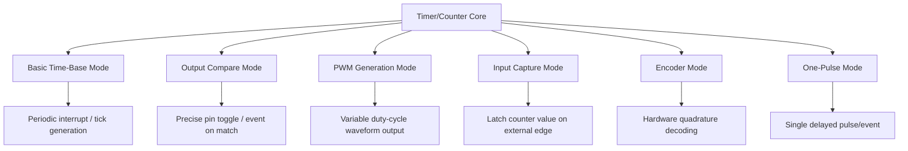

## Timer and Counter Peripherals


### Overview

Timer/counter peripherals are among the most versatile hardware blocks in a microcontroller, built around a register that increments (or decrements) on each clock pulse or external event. Despite this simple core mechanism, timers underpin an enormous range of embedded functionality: generating precise delays, measuring elapsed time, producing PWM signals, capturing the timing of external events, generating periodic interrupts, and driving communication peripheral baud rates — often all from the same physical timer block configured differently.

### The Basic Timer/Counter Model

At its core, a hardware timer consists of:

- **A counter register**: a register (commonly 8, 16, or 32 bits wide depending on the specific timer and MCU) that increments (or decrements) automatically.
- **A clock source**: the signal driving the counter's increments — typically derived from the system clock through a prescaler, but sometimes an external pin signal instead.
- **A prescaler**: a configurable clock divider placed before the counter, reducing the effective counting rate so the timer can measure longer intervals than the raw clock speed would otherwise allow within the counter's bit width.
- **An auto-reload/period register**: defines the value at which the counter resets back to zero (or its starting value), setting the overall period of the timer's counting cycle.
- **Compare/capture registers**: additional registers used to compare against the current counter value (for generating events or PWM edges) or to latch the counter's value when an external event occurs (input capture).

### Timer Block Diagram (SVG)

<svg xmlns="http://www.w3.org/2000/svg" viewBox="0 0 700 260">
  <text x="20" y="20" font-family="monospace" font-size="14" fill="#333">Timer/Counter Block (svg_diagram)</text>
  <rect x="40" y="60" width="90" height="40" fill="none" stroke="#333" />
  <text x="50" y="85" font-family="monospace" font-size="11">System Clock</text>
  <line x1="130" y1="80" x2="180" y2="80" stroke="#333" stroke-width="2" />
  <polygon points="175,75 185,80 175,85" fill="#333" />
  <rect x="180" y="60" width="90" height="40" fill="none" stroke="#333" />
  <text x="195" y="85" font-family="monospace" font-size="11">Prescaler</text>
  <line x1="270" y1="80" x2="320" y2="80" stroke="#333" stroke-width="2" />
  <polygon points="315,75 325,80 315,85" fill="#333" />
  <rect x="320" y="60" width="110" height="40" fill="#eef" stroke="#333" />
  <text x="335" y="85" font-family="monospace" font-size="11">Counter (CNT)</text>
  <line x1="430" y1="80" x2="480" y2="80" stroke="#333" stroke-width="2" />
  <polygon points="475,75 485,80 475,85" fill="#333" />
  <rect x="480" y="60" width="140" height="40" fill="#efe" stroke="#333" />
  <text x="490" y="85" font-family="monospace" font-size="10">Auto-reload (ARR)</text>
  <line x1="375" y1="100" x2="375" y2="150" stroke="#333" stroke-width="2" />
  <rect x="320" y="150" width="110" height="40" fill="#fee" stroke="#333" />
  <text x="325" y="175" font-family="monospace" font-size="10">Compare/Capture</text>
  <line x1="430" y1="170" x2="480" y2="170" stroke="#a00" stroke-width="2" />
  <text x="485" y="175" font-family="monospace" font-size="11" fill="#a00">Output/IRQ</text>
</svg>

### Prescaler and Overflow Timing

The relationship between input clock, prescaler, and timer period is a fundamental calculation for any timer configuration:

$$f_{timer} = \frac{f_{clock}}{(Prescaler + 1)}$$

$$T_{overflow} = \frac{(ARR + 1)}{f_{timer}}$$

Where $f_{clock}$ is the input clock frequency feeding the timer, $Prescaler$ is the configured prescaler divisor value, $ARR$ is the auto-reload register value, and $T_{overflow}$ is the resulting time period between counter overflow/reset events. [Inference — the exact register naming (ARR, prescaler indexing conventions such as divide-by-N vs. divide-by-(N+1)) varies by vendor; always confirm against the specific timer's reference manual]

### Timer Operating Modes

**Basic/Time-Base Mode**

The timer simply counts and generates a periodic interrupt (or sets a flag) on overflow, commonly used to generate a fixed-rate "tick" for scheduling, delays, or as an RTOS time base.

```c
// Conceptual example: configure timer for periodic interrupt every 1ms
Timer_SetPrescaler(TIM2, prescalerValueFor1kHz);
Timer_SetAutoReload(TIM2, autoReloadValueFor1msPeriod);
Timer_EnableInterrupt(TIM2, TIMER_IT_UPDATE);
Timer_Start(TIM2);
```

**Output Compare Mode**

The timer's counter value is continuously compared against a value in a compare register; when they match, an event occurs — commonly toggling, setting, or clearing an output pin, or generating an interrupt. Used for generating precisely-timed pulses or signal edges without CPU intervention at the exact moment of the edge.

**PWM Generation Mode**

A specific configuration of output compare mode where the output pin is driven high (or low) for a portion of each timer period determined by the compare register value relative to the auto-reload value, producing a Pulse Width Modulation waveform. Duty cycle is calculated as:

$$Duty\ Cycle = \frac{CCR}{ARR + 1} \times 100\%$$

where $CCR$ is the compare register value. [Inference — exact formula variant depends on the PWM mode selected, e.g., edge-aligned vs. center-aligned PWM, which differ across timer architectures]

**Input Capture Mode**

The timer's current counter value is automatically latched into a capture register when a configured edge (rising, falling, or both) occurs on an associated input pin, without CPU intervention at the moment of the edge itself. Used for precisely measuring the timing of external signals — pulse width measurement, frequency measurement of an incoming signal, or measuring the time between two edges (e.g., for ultrasonic distance sensors that return a pulse whose width represents distance).

**Encoder Mode**

Some timer peripherals include a dedicated hardware mode specifically for decoding quadrature rotary encoder signals directly, automatically incrementing/decrementing the counter based on the two-channel input pattern without requiring software-based quadrature decoding logic.

**One-Pulse Mode**

The timer generates a single pulse (or single compare/capture event) and then automatically stops, rather than continuously repeating — useful for generating a one-shot delayed action.

### Timer Modes Overview (Mermaid Diagram)



### Counting Directions and Modes

- **Up-counting**: counter increments from zero to the auto-reload value, then resets to zero (or generates overflow) and repeats.
- **Down-counting**: counter decrements from the auto-reload value to zero, then reloads and repeats.
- **Center-aligned (up/down) counting**: counter alternates counting up then down between zero and the auto-reload value, commonly used for center-aligned PWM generation, which some motor control applications prefer over edge-aligned PWM due to more symmetric switching behavior. [Inference — the specific benefit realized depends on the downstream application, e.g., reduced current ripple in certain motor drive topologies]

### External Clock and Gated/Triggered Counting

Beyond counting an internal prescaled clock, many timers can be configured to:

- **Count external pulses**: increment the counter based on pulses arriving on an external pin rather than an internal clock, useful for pulse counting applications (e.g., counting rotations of a mechanical encoder wheel, counting Geiger counter pulses).
- **Gated counting**: only count while an external gate signal is in a specific state, useful for measuring the duration of an external event directly in counter ticks.
- **Triggered start/reset**: start, stop, or reset the counter based on an external trigger signal or another timer's output, enabling synchronized multi-timer configurations.

### Timer Chaining and Synchronization

Many MCU families allow one timer to serve as a trigger source for another (often described as master/slave timer configuration), enabling:

- Synchronized start of multiple timers simultaneously.
- Cascading timers to effectively extend counting range beyond a single timer's bit width (e.g., using a second timer's clock input driven by the first timer's overflow event).
- Coordinated multi-channel PWM generation across timers for applications like multi-phase motor control.

### Common Timer-Based Application Patterns

- **Software delay replacement**: using a hardware timer interrupt instead of a blocking `delay()` loop, allowing other code to run during the "wait."
- **Debounce timing**: as covered in input debouncing techniques, a timer can provide the interval measurement for software debounce algorithms.
- **PWM-based motor/LED control**: varying duty cycle to control motor speed or LED brightness.
- **Servo control**: generating a specific pulse width (commonly in the 1–2 ms range, repeated roughly every 20 ms) required by standard hobby servo motors, typically implemented via PWM or output compare mode.
- **Frequency/period measurement**: using input capture mode to measure the time between edges of an incoming signal, from which frequency can be derived as its reciprocal.
- **Watchdog-adjacent periodic health checks**: a timer interrupt used to periodically verify system health or feed a separate watchdog peripheral.
- **RTOS time base**: providing the periodic tick interrupt (e.g., via SysTick on Cortex-M, though dedicated general-purpose timers can serve this role too) that drives task scheduling.

### PWM Duty Cycle Illustration (SVG)

<svg xmlns="http://www.w3.org/2000/svg" viewBox="0 0 700 220">
  <text x="20" y="20" font-family="monospace" font-size="14" fill="#333">PWM Duty Cycle Comparison (svg_diagram)</text>
  <text x="30" y="50" font-family="monospace" font-size="11">25% duty</text>
  <polyline points="100,60 100,40 140,40 140,60 500,60" fill="none" stroke="#0066cc" stroke-width="2" />
  <text x="30" y="110" font-family="monospace" font-size="11">50% duty</text>
  <polyline points="100,120 100,100 300,100 300,120 500,120" fill="none" stroke="#0066cc" stroke-width="2" />
  <text x="30" y="170" font-family="monospace" font-size="11">75% duty</text>
  <polyline points="100,180 100,160 400,160 400,180 500,180" fill="none" stroke="#0066cc" stroke-width="2" />
  <line x1="100" y1="200" x2="500" y2="200" stroke="#666" stroke-dasharray="3,2" />
  <text x="480" y="215" font-family="monospace" font-size="10" fill="#666">one period</text>
</svg>

### Timer Resolution and Range Trade-offs

- **Higher prescaler value**: extends the maximum measurable/generatable period at the cost of reduced timing resolution (the smallest time increment the timer can represent grows larger).
- **Lower prescaler value**: provides finer timing resolution but limits the maximum period before counter overflow, given the counter's fixed bit width.
- **32-bit vs. 16-bit timers**: MCUs offering both typically reserve 32-bit timers for applications needing either very fine resolution over long periods or very large count ranges without needing to handle software-managed overflow counting, while 16-bit timers remain adequate (and often more numerous/cheaper in silicon area) for shorter-period general-purpose use. [Inference — specific allocation of 16-bit vs. 32-bit timers per MCU is a vendor design choice and varies by part]

### Common Pitfalls

- Miscalculating prescaler/auto-reload values, resulting in a timer period or PWM frequency that is off from the intended value — often due to off-by-one errors in whether the prescaler divides by $N$ or $N+1$, which varies by vendor.
- Assuming all timers on a given MCU are functionally identical — many MCU families have a mix of "basic," "general-purpose," and "advanced" timers with different capability sets (e.g., only advanced timers may support complementary PWM outputs with dead-time insertion for motor control).
- Not accounting for counter overflow/wraparound when using free-running timers for elapsed-time calculations, particularly relevant for 8/16-bit timers with relatively short overflow periods at higher clock rates.
- Configuring PWM output without correctly setting the associated GPIO pin's alternate function mode, resulting in no output appearing on the physical pin despite correct timer configuration.
- Sharing a single timer's channels across conflicting use cases (e.g., needing simultaneous independent PWM frequencies on the same timer, when all channels of a single timer instance necessarily share the same base period/frequency defined by that timer's auto-reload register).
- Overlooking that input capture and encoder modes require correct edge-sensitivity and filtering configuration, or noise/bounce on the input signal can produce spurious captured values.

**Related Topics**
- Interrupt-driven I/O concepts
- Direct memory access fundamentals
- PWM-based motor and LED control techniques
- Input debouncing techniques
- Quadrature rotary encoder decoding algorithms
- RTOS task scheduling and time-base configuration