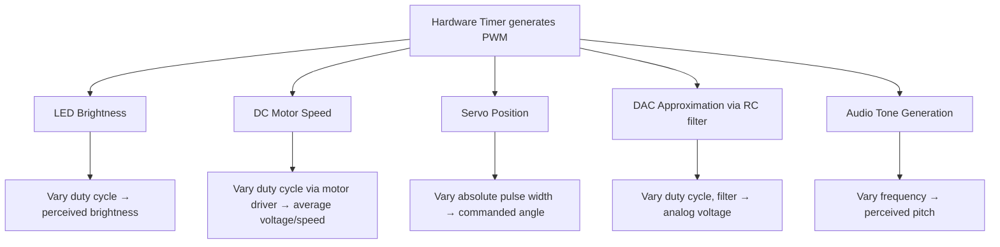

## PWM Generation and Applications

### Overview

Pulse Width Modulation (PWM) is a technique for encoding an analog-like average value using a digital signal that switches between fully on and fully off, varying the proportion of time spent in each state (the duty cycle) rather than varying voltage continuously. Because PWM only requires a digital output toggling at defined intervals, it can be generated cheaply and precisely by timer hardware, making it one of the most widely used techniques in embedded systems for controlling motor speed, LED brightness, generating analog-equivalent voltages, and producing control signals for servos and other actuators.

### Core PWM Parameters

- **Period ($T$)**: the total duration of one complete on/off cycle, the reciprocal of frequency: $T = \frac{1}{f}$.
- **Frequency ($f$)**: how many complete PWM cycles occur per second, typically expressed in Hz or kHz.
- **Duty Cycle**: the percentage of the period during which the signal is HIGH (in an active-high convention), calculated as:

$$Duty\ Cycle\ (\%) = \frac{t_{ON}}{T} \times 100$$

where $t_{ON}$ is the time the signal spends HIGH within one period.

- **Average (equivalent DC) voltage**: for a signal switching between 0 V and $V_{max}$, the effective average voltage seen by a sufficiently slow-responding load (such as an LED perceived by the human eye, or a motor's mechanical inertia) approximates:

$$V_{avg} = V_{max} \times \frac{Duty\ Cycle}{100}$$

### PWM Waveform at Different Duty Cycles (SVG)

<svg xmlns="http://www.w3.org/2000/svg" viewBox="0 0 700 260">
  <text x="20" y="20" font-family="monospace" font-size="14" fill="#333">PWM Waveforms at Different Duty Cycles (svg_diagram)</text>
  <text x="30" y="55" font-family="monospace" font-size="11">10%</text>
  <polyline points="90,65 90,45 130,45 130,65 500,65" fill="none" stroke="#0066cc" stroke-width="2" />
  <text x="30" y="105" font-family="monospace" font-size="11">50%</text>
  <polyline points="90,115 90,95 290,95 290,115 500,115" fill="none" stroke="#0066cc" stroke-width="2" />
  <text x="30" y="155" font-family="monospace" font-size="11">90%</text>
  <polyline points="90,165 90,145 460,145 460,165 500,165" fill="none" stroke="#0066cc" stroke-width="2" />
  <line x1="90" y1="190" x2="500" y2="190" stroke="#666" stroke-dasharray="3,2" />
  <text x="450" y="205" font-family="monospace" font-size="10" fill="#666">time →</text>
  <text x="30" y="230" font-family="monospace" font-size="10" fill="#333">Higher duty cycle → higher average voltage delivered to load</text>
</svg>

### Generating PWM: Hardware Timer Method

Most microcontrollers generate PWM using dedicated timer hardware operating in output compare/PWM mode (see timer and counter peripherals), where the timer's auto-reload register sets the period and a separate compare register sets the point within that period where the output switches state.

```c
// Conceptual example: configure timer channel for PWM at a given duty cycle
Timer_SetAutoReload(TIM3, periodValue);       // sets PWM period/frequency
Timer_SetCompare(TIM3, CHANNEL_1, compareValueForDutyCycle);
Timer_SetPWMMode(TIM3, CHANNEL_1, PWM_MODE_1);
Timer_EnableOutput(TIM3, CHANNEL_1);
Timer_Start(TIM3);
```

- **Hardware PWM advantage**: once configured, the timer generates the waveform entirely autonomously — no CPU involvement is required to maintain the output after setup, and duty cycle can be updated at any time simply by writing a new value to the compare register.
- **Number of channels**: a single timer instance often provides multiple independent PWM channels (commonly 2–4), all sharing the same base period/frequency but each with an independently adjustable duty cycle.

### Generating PWM: Software (Bit-Banged) Method

In the absence of available hardware timer channels, PWM can be approximated in software by toggling a GPIO pin on a timed schedule, typically driven by a timer interrupt or a tightly-timed delay loop.

```c
// Conceptual bit-banged PWM (simplified, illustrative only)
void softPWM_Tick() {
    static uint8_t counter = 0;
    counter = (counter + 1) % 100;
    digitalWrite(PWM_PIN, counter < dutyCyclePercent ? HIGH : LOW);
}
```

- **Disadvantages relative to hardware PWM**: consumes CPU cycles continuously to maintain the waveform, introduces jitter tied to interrupt/loop timing consistency, and generally cannot achieve the same frequency precision or ceiling as dedicated timer hardware.
- **When it's used anyway**: when all hardware PWM-capable timer channels on a given MCU are already allocated to other uses, or when only a small number of low-precision PWM-like outputs are needed and dedicating a full timer peripheral isn't justified.

### PWM Edge Alignment Modes

- **Edge-aligned PWM**: the output pulse always starts at the beginning of the timer period and switches off partway through, based on the compare value — the simplest and most common PWM mode.
- **Center-aligned PWM**: the timer counts up then down (see center-aligned counting in timer and counter peripherals), causing the pulse to be centered within the period rather than starting at its edge. Commonly preferred in motor control applications for reasons including reduced current ripple and improved harmonic characteristics in certain drive topologies. [Inference — the specific benefit magnitude is application- and motor-topology-dependent]

### Key PWM Applications

**LED Brightness Control**

Varying duty cycle changes the LED's average forward current over time, which the human eye perceives as a change in brightness due to persistence of vision, provided the PWM frequency is high enough (commonly cited guidance suggests above roughly 100 Hz–few kHz to avoid perceptible flicker, though exact thresholds vary by individual perception and application). [Unverified — flicker perception thresholds vary across individuals and viewing conditions; camera capture at certain frame rates can reveal flicker even when imperceptible to the naked eye]

**DC Motor Speed Control**

PWM applied to a motor driver (typically via a MOSFET or H-bridge stage, not directly from the GPIO — see output drive strength and current limits) varies the average voltage delivered to the motor, and thus its effective speed, without the significant power dissipation that a purely resistive (linear) speed-control approach would incur.

**Servo Motor Control**

Standard hobby servos are controlled by a specific PWM convention: a pulse repeated approximately every 20 ms (50 Hz), where the *pulse width itself* (commonly in the 1–2 ms range, with 1.5 ms often representing center/neutral position) — not the duty cycle percentage — determines the commanded servo angle. This is a notable exception to duty-cycle-based PWM interpretation, since servos respond to absolute pulse width rather than the ratio of on-time to period. [Inference — exact pulse width ranges and neutral position vary slightly by servo manufacturer and model; consult the specific servo's datasheet]

**DAC Approximation (PWM + Low-Pass Filter)**

Passing a PWM signal through an analog low-pass RC filter smooths it into a genuinely analog voltage approximately proportional to duty cycle, providing a low-cost alternative to a dedicated DAC peripheral when only a slowly-varying analog output is needed.

$$V_{out} \approx V_{max} \times \frac{Duty\ Cycle}{100} \quad \text{(after sufficient filtering)}$$

- Filter cutoff frequency must be set well below the PWM frequency to adequately smooth the switching ripple, while remaining high enough to allow the intended output signal's own variation to pass through without excessive lag.

**Audio Generation (Simple Tone/Buzzer Output)**

A PWM signal at audio frequencies, fed to a piezo buzzer or speaker (often through simple driving circuitry), can produce tones; varying the PWM *frequency* (not duty cycle) changes the pitch produced.

### PWM Application Summary (Mermaid Diagram)



### PWM Resolution

PWM resolution refers to the number of discrete duty cycle steps available, determined by the ratio of timer clock frequency to PWM frequency:

$$Resolution\ (steps) = \frac{f_{timer}}{f_{PWM}}$$

- Higher PWM frequency, for a fixed timer clock, reduces the number of available duty cycle steps (lower resolution), since fewer timer clock ticks occur within each shorter PWM period.
- This creates a direct trade-off between PWM frequency and resolution: applications needing very fine-grained duty cycle control (e.g., precise motor torque control) may need to accept a lower PWM frequency, while applications prioritizing high frequency (e.g., to stay well above audible range, or to allow a smaller external filter for DAC approximation) accept coarser resolution steps. [Inference — the acceptable trade-off point is entirely application-specific]

### Dead-Time Insertion (Motor Control / H-Bridge Applications)

In applications driving complementary PWM outputs (e.g., high-side and low-side switches in an H-bridge or half-bridge motor driver), a brief "dead time" gap is often inserted between turning one switch off and the other on, preventing a brief period where both switches could be simultaneously partially conductive (a shoot-through condition that can cause damaging current spikes). Some "advanced" timer peripherals include dedicated hardware dead-time insertion specifically for this purpose, removing the need for software-managed timing margins. [Inference — availability of hardware dead-time insertion is specific to certain advanced/motor-control-oriented timer peripherals, not all general-purpose timers]

### Common Pitfalls

- Driving a motor or inductive load's PWM signal directly from a GPIO pin without an appropriate driver stage (transistor/MOSFET/H-bridge), risking exceeding the pin's current rating (see output drive strength and current limits).
- Choosing a PWM frequency too low for LED applications, resulting in visible flicker, particularly problematic if the output will also be viewed through a camera at certain frame rates.
- Confusing servo control (absolute pulse width matters) with standard duty-cycle-based PWM interpretation (ratio matters), leading to incorrect servo positioning if duty cycle percentage is used as the control parameter instead of absolute pulse width.
- Setting PWM frequency and expecting fine duty-cycle resolution simultaneously without accounting for the underlying resolution trade-off tied to timer clock frequency.
- Omitting dead-time insertion (or an equivalent software-managed delay) in complementary/H-bridge PWM drive configurations, risking shoot-through current spikes that can damage switching components.
- Using software bit-banged PWM for applications requiring precise frequency or many simultaneous channels, when available hardware timer channels would provide substantially better precision and lower CPU overhead.
- Not accounting for the RC filter's own cutoff frequency trade-off when using PWM as a DAC approximation, resulting in either excessive ripple (filter too weak) or excessive lag in tracking changing duty cycle values (filter too aggressive).

**Related Topics**
- Timer and counter peripherals
- Output drive strength and current limits
- DC motor driver circuits (H-bridge fundamentals)
- Digital-to-analog conversion techniques
- Input debouncing techniques
- Audio signal generation on embedded systems