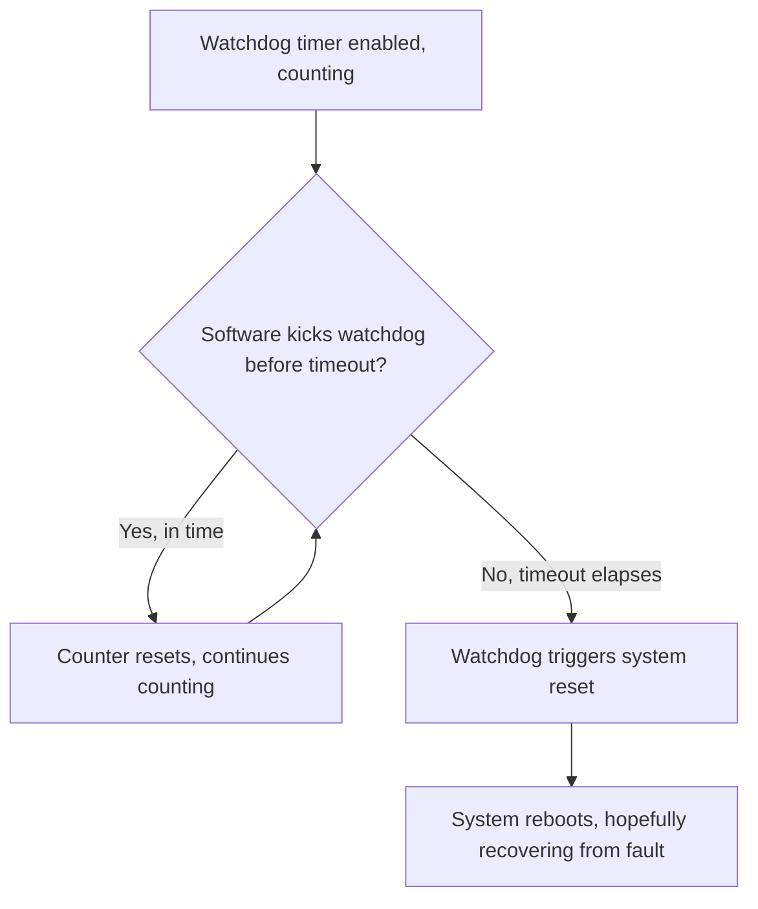
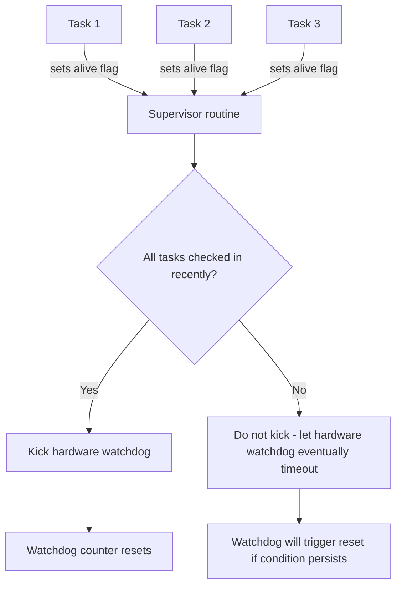

## Watchdog Timers

### Overview

A watchdog timer is a hardware peripheral designed to detect and recover from software that has stopped executing correctly — hung in an infinite loop, stuck waiting on a condition that will never occur, or otherwise failed to return control to its normal execution flow within an expected time. It operates on a simple principle: the timer counts continuously, and if the application software does not periodically "service" (reset, or "kick"/"pet"/"feed") it before it reaches a timeout threshold, the watchdog assumes the system has malfunctioned and forces a hardware reset.

### The Core Watchdog Mechanism

1. The watchdog timer is enabled and configured with a timeout period.
2. The timer counts down (or up, toward a threshold) continuously, independent of the main application's normal execution.
3. Application software must periodically execute a specific "refresh" or "kick" operation (writing a specific value, or sequence of values, to a designated register) before the timeout elapses.
4. If the refresh occurs in time, the counter resets and the cycle continues.
5. If the timeout elapses without a refresh, the watchdog triggers a system reset (or, on some architectures, an interrupt as an early warning, sometimes prior to an eventual reset if unaddressed).

### Watchdog Operation Flow (Mermaid Diagram)



### Why Watchdogs Exist

Software can fail in ways that leave the CPU technically still executing instructions but no longer performing useful or correct work — an infinite loop caused by a logic bug, a deadlock waiting on a peripheral that never responds, memory corruption causing a jump to an invalid code region, or a hardware glitch (e.g., from electrical noise) causing the program counter to land in an unintended location. In many of these scenarios, the software itself has no way to detect its own malfunction from the inside. A watchdog provides an independent, external mechanism that doesn't rely on the malfunctioning code to notice the problem — it relies only on the *absence* of a properly-timed kick, which a hung system will, by definition, fail to provide.

### Types of Watchdog Timers

**Independent Watchdog (IWDG-style)**

Runs from its own dedicated, often low-power/low-accuracy internal oscillator, separate from the main system clock. This independence is deliberate: if the main system clock fails or is misconfigured, a watchdog dependent on that same clock would be equally disabled, defeating its purpose as a fault-detection mechanism.

- Typically less precise in timeout accuracy due to using a simpler internal RC oscillator rather than a crystal-derived clock. [Inference — exact timeout accuracy/tolerance is device-specific and documented per MCU]
- Usually cannot be disabled once started, by design, in many implementations — since a watchdog that software could freely disable would offer weaker protection against exactly the kind of software fault it exists to catch.

**Windowed Watchdog**

Adds a lower time bound in addition to the standard upper timeout: the watchdog must be kicked not only *before* the timeout expires, but also *after* a minimum elapsed time since the last kick — kicking too early (within the "closed" window) also triggers a reset, just as kicking too late does.

- This catches a specific class of fault: software that is executing so fast or erratically (e.g., stuck in an unexpectedly tight loop, or a runaway condition executing kicks far more often than the intended service interval) that a standard watchdog would never notice, since it only ever checks for excessively *slow* execution.

**Windowed Watchdog Valid Range (SVG)**

<svg xmlns="http://www.w3.org/2000/svg" viewBox="0 0 700 160">
  <text x="20" y="20" font-family="monospace" font-size="14" fill="#333">Windowed Watchdog Valid Kick Range (svg_diagram)</text>
  <line x1="60" y1="90" x2="640" y2="90" stroke="#333" stroke-width="2" />
  <rect x="60" y="80" width="150" height="20" fill="#fee" />
  <text x="65" y="120" font-family="monospace" font-size="10" fill="#a00">Too early - reset</text>
  <rect x="210" y="80" width="250" height="20" fill="#efe" />
  <text x="230" y="120" font-family="monospace" font-size="10" fill="#080">Valid kick window</text>
  <rect x="460" y="80" width="180" height="20" fill="#fee" />
  <text x="470" y="120" font-family="monospace" font-size="10" fill="#a00">Too late - reset (timeout)</text>
  <line x1="210" y1="70" x2="210" y2="110" stroke="#333" stroke-dasharray="3,2" />
  <line x1="460" y1="70" x2="460" y2="110" stroke="#333" stroke-dasharray="3,2" />
</svg>

**Window/Task-Level (Software-Assisted) Watchdogs**

In systems with an RTOS or multiple cooperative tasks, a common pattern layers software logic on top of the hardware watchdog: rather than any single point in the code kicking the watchdog, each critical task must periodically signal its own "I am still alive and functioning correctly" status (e.g., setting a per-task flag or incrementing a per-task counter), and a separate supervisory routine only kicks the actual hardware watchdog if *all* monitored tasks have recently checked in. This extends fault coverage beyond "the CPU is executing something" to "the specific tasks that matter are each still functioning," catching a single hung task even if other tasks (including whatever code path happens to call the watchdog kick function) are still running.

### Multi-Task Watchdog Supervision Pattern (Mermaid Diagram)



### Configuring a Watchdog (Conceptual Example)

```c
// Conceptual example; exact register names/API vary significantly by vendor
Watchdog_SetTimeout(WATCHDOG_TIMEOUT_MS_500);
Watchdog_Enable();

void mainLoop() {
    while (1) {
        performRoutineTask();
        Watchdog_Kick();   // must occur within the configured timeout period
    }
}
```

### Watchdog Reset vs. Power-On Reset

After a watchdog-triggered reset, most microcontrollers set a specific status flag or register bit distinguishing a watchdog reset from a normal power-on reset or an externally-applied reset pin reset. Checking this flag at startup allows application code to:

- Log or record that an unexpected fault occurred (useful for post-mortem diagnostics, especially in deployed field devices without a debugger attached).
- Take different startup action depending on reset cause (e.g., entering a safe/degraded mode after repeated watchdog resets, rather than resuming completely normal operation as if nothing happened).

```c
// Conceptual example
if (ResetCause_Get() == RESET_CAUSE_WATCHDOG) {
    logFaultEvent();
    // optionally: enter a diagnostic or safe mode
}
```

### Choosing a Watchdog Timeout Value

- **Too short**: legitimate, correctly-functioning code paths that occasionally take longer than expected (e.g., a slow peripheral response, a longer-than-typical computation) risk triggering unwanted watchdog resets during entirely normal operation.
- **Too long**: the system can remain in a hung/malfunctioning state for an extended period before the watchdog intervenes, which may be unacceptable in applications with real-time safety or responsiveness requirements.
- A common approach is to set the timeout comfortably longer than the worst-case expected duration of the longest normal operation in the main loop or critical task, with margin, based on actual measured execution timing rather than assumption. [Inference — the specific margin chosen is application-specific and often informed by measured worst-case execution time analysis]

### Watchdogs and Low-Power/Sleep Modes

- Some watchdog peripherals continue running (and must still be kicked) even while the CPU is in certain low-power sleep modes, which requires either periodically waking specifically to service the watchdog or configuring the watchdog to be disabled/paused during sleep, depending on what the specific architecture and application's fault-tolerance requirements call for.
- Other implementations allow the watchdog to be explicitly frozen during debug sessions (a common feature, since a debugger halting CPU execution at a breakpoint would otherwise trigger an unwanted watchdog reset during normal debugging activity).

### Watchdog Interrupt (Early Warning) Mode

Some watchdog peripherals support generating an interrupt at a point before the actual reset would occur, giving software a brief opportunity to take corrective or diagnostic action (e.g., logging state, attempting a graceful shutdown of critical operations) before the unavoidable reset happens if the underlying issue isn't resolved in time.

- This early-warning interrupt should generally not be used as a way to indefinitely avoid the actual reset (e.g., by treating the interrupt itself as a substitute kick in cases where the real fault condition persists), since doing so would undermine the resilience the watchdog is meant to provide against genuinely hung software. [Inference — this is a design guidance point rather than a strict architectural rule, since some implementations do allow the interrupt handler to also kick the watchdog under specific application-justified circumstances]

### Common Pitfalls

- Kicking the watchdog from within an ISR that fires unconditionally on a timer, regardless of whether the actual application logic the watchdog is meant to be protecting is functioning correctly — this defeats the watchdog's purpose, since the kick becomes decoupled from any real indicator of system health.
- Setting an unrealistically short timeout that triggers spurious resets during legitimate (if occasionally slow) operation, training a team to view watchdog resets as noise rather than a meaningful fault signal.
- Forgetting to check and log the reset-cause register after a watchdog reset, losing valuable diagnostic information about what triggered the fault in a deployed system.
- Disabling the watchdog during development for convenience and forgetting to properly integrate watchdog kicking into the final production firmware before deployment.
- Not accounting for watchdog behavior during low-power sleep modes, either being surprised by an unexpected reset during an intended long sleep period, or unintentionally leaving the watchdog running and requiring wake-ups purely to service it, undermining power savings.
- Treating a single, well-placed "kick everything is fine" call as sufficient in a complex multi-task system, when a hung individual task (with the watchdog kick living in unrelated, still-functioning code) would go completely undetected.

**Related Topics**
- Reset sources and startup sequence design
- RTOS task scheduling and health monitoring
- Fault handling and debugging (HardFault analysis)
- Low-power/sleep mode design considerations
- Timer and counter peripherals
- Firmware robustness and fail-safe design patterns