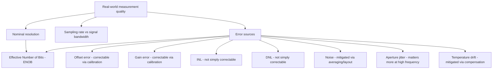

## ADC Resolution, Sampling Rate, and Error Sources

### Overview

This topic builds directly on analog-to-digital conversion principles, focusing specifically on the three factors that most determine how faithfully an ADC's digital output represents the real-world analog signal it measures: how finely it divides its input range (resolution), how often it captures that input (sampling rate), and the various imperfections (error sources) that cause real ADCs to fall short of ideal behavior. Understanding these in depth is essential for selecting an appropriate ADC configuration and interpreting its output correctly in a given application.

### Resolution in Depth

**Nominal vs. Effective Resolution**

- **Nominal resolution**: the number of output bits an ADC is specified to produce (e.g., "12-bit ADC"), determining the total number of possible output codes ($2^N$).
- **Effective Number of Bits (ENOB)**: a measure of an ADC's *actual* usable resolution once real-world noise and non-linearity are accounted for, typically lower than the nominal resolution. ENOB is commonly derived from measured Signal-to-Noise-and-Distortion Ratio (SINAD):

$$ENOB = \frac{SINAD_{dB} - 1.76}{6.02}$$

- A datasheet's nominal bit count describes the number of output codes available, not a guarantee that every one of those bits carries genuinely useful signal information free of noise. [Inference — the specific ENOB achieved depends on measurement conditions, board layout, and the individual device, and should be taken from characterization data rather than assumed from nominal resolution alone]

**Resolution vs. Reference Voltage Relationship**

Restating the core relationship from ADC principles, resolution in real-world voltage terms depends jointly on bit count and reference voltage:

$$V_{LSB} = \frac{V_{ref}}{2^N}$$

A narrower reference voltage range concentrates the same number of digital codes over a smaller voltage span, improving voltage resolution — a technique sometimes used deliberately (e.g., using a 1.2 V reference instead of a 3.3 V one for a sensor whose full signal range only spans a fraction of the supply voltage) to make better use of the ADC's available codes for a specific measurement range.

### Sampling Rate in Depth

**Maximum Sampling Rate Constraints**

An ADC's maximum achievable sampling rate is limited by several factors working together:

- **Conversion time**: the time the ADC's internal architecture requires to complete one conversion (architecture-dependent — see the architecture comparison in ADC principles).
- **Sample/acquisition time**: the time required for the sample-and-hold circuit to accurately capture the input voltage before conversion begins, itself dependent on source impedance.
- **Channel switching overhead**: additional settling time required when scanning across multiple multiplexed channels.
- **Bus/data transfer overhead**: time required to read out the conversion result, particularly relevant if results must be individually retrieved by CPU polling rather than moved via DMA.

$$f_{sample,max} = \frac{1}{t_{sample} + t_{convert} + t_{overhead}}$$

**Oversampling**

Sampling at a rate significantly higher than the strict Nyquist minimum, then combining multiple samples (commonly via averaging or more sophisticated digital filtering), can improve effective resolution beyond the ADC's nominal bit count, at the cost of reduced effective output data rate.

- A commonly cited relationship: averaging $4^n$ samples can ideally improve resolution by $n$ additional bits, assuming the noise present is uncorrelated (random) rather than systematic. [Inference — this relationship assumes ideal, uncorrelated (white) noise conditions; real-world noise sources such as periodic interference from switching power supplies may not average out as cleanly, reducing the practical benefit]

$$Additional\ Bits \approx \log_4(Number\ of\ Samples\ Averaged)$$

### Oversampling and Averaging Benefit (SVG)

<svg xmlns="http://www.w3.org/2000/svg" viewBox="0 0 700 240">
  <text x="20" y="20" font-family="monospace" font-size="14" fill="#333">Effect of Oversampling and Averaging (svg_diagram)</text>
  <text x="30" y="50" font-family="monospace" font-size="11">Single sample (noisy):</text>
  <path d="M 250 60 L 270 40 L 290 70 L 310 35 L 330 65 L 350 45 L 370 60" fill="none" stroke="#a00" stroke-width="2" />
  <text x="30" y="120" font-family="monospace" font-size="11">Averaged (64 samples):</text>
  <line x1="250" y1="130" x2="370" y2="130" stroke="#0066cc" stroke-width="2" />
  <text x="30" y="190" font-family="monospace" font-size="10" fill="#666">Averaging trades sample rate for reduced noise / improved effective resolution</text>
</svg>

**Sampling Rate and Signal Bandwidth Selection**

Choosing an appropriate sampling rate in practice generally means selecting a rate comfortably above the strict Nyquist minimum (often several times higher, providing margin and easing anti-aliasing filter design requirements), rather than sampling at exactly twice the signal bandwidth, since a filter with an infinitely sharp cutoff exactly at the Nyquist frequency is not physically realizable. [Inference — the specific oversampling margin chosen is application- and filter-design-specific]

### ADC Error Sources in Depth

**Offset Error**

A constant additive deviation across the full transfer function — the ADC reads a nonzero value even when the true input is zero, or vice versa consistently across the range. Often correctable through a one-time calibration measurement (recording the actual reading at a known zero-input condition and subtracting that offset from subsequent readings in software).

**Gain Error**

A deviation in the slope of the actual input-to-output relationship relative to the ideal, causing error magnitude to scale with the input voltage rather than remaining constant. Also often correctable via calibration against two or more known reference voltages, computing a software-applied gain correction factor.

**Integral Non-Linearity (INL) and Differential Non-Linearity (DNL)**

- **INL**: describes how far the actual transfer curve deviates from an ideal straight line across the entire input range — a smooth, overall curvature or bow in the response, generally not correctable via simple offset/gain calibration alone since it varies non-linearly across the range.
- **DNL**: describes local, code-to-code irregularities in step width — ideally, each output code should represent exactly one LSB width of input voltage, but real ADCs show variation. Severe DNL can result in "missing codes" (a code that never appears in the output regardless of input) or, in extreme cases, non-monotonic behavior (output code decreasing for an increasing input, which most application logic implicitly assumes cannot happen).

### INL and DNL Illustration (SVG)

<svg xmlns="http://www.w3.org/2000/svg" viewBox="0 0 700 260">
  <text x="20" y="20" font-family="monospace" font-size="14" fill="#333">INL vs DNL Concept (svg_diagram)</text>
  <line x1="50" y1="220" x2="350" y2="60" stroke="#ccc" stroke-width="1" stroke-dasharray="3,2" />
  <path d="M 50 220 L 100 190 L 150 170 L 200 140 L 250 120 L 300 90 L 350 60" fill="none" stroke="#0066cc" stroke-width="2" />
  <text x="60" y="240" font-family="monospace" font-size="10" fill="#333">INL: overall deviation from ideal straight line</text>
  <line x1="400" y1="220" x2="650" y2="60" stroke="#ccc" stroke-width="1" stroke-dasharray="3,2" />
  <path d="M 400 220 L 440 205 L 460 175 L 500 172 L 530 130 L 560 128 L 600 90 L 650 60" fill="none" stroke="#a00" stroke-width="2" />
  <text x="410" y="240" font-family="monospace" font-size="10" fill="#333">DNL: irregular step widths between codes</text>
</svg>

**Noise**

Random variation in the reading for a genuinely constant input, arising from thermal noise in the ADC's internal circuitry, power supply noise coupling into the reference or input path, and digital switching noise from nearby circuitry (including, notably, the microcontroller's own digital logic switching during or near the conversion).

- **Mitigation approaches**: physical separation of analog and digital ground/power planes on the PCB, dedicated analog reference decoupling capacitors, performing conversions during quieter periods of digital activity when timing allows, and oversampling/averaging as discussed above.

**Aperture Jitter**

Small, random variations in the exact instant the sample-and-hold circuit captures the input, which becomes an increasingly significant error source for higher-frequency input signals, since a given timing uncertainty translates to a larger voltage error when the signal is changing rapidly at the moment of capture. [Inference — the magnitude of this effect scales with input signal slew rate (rate of change) at the sampling instant, a relationship well-established in ADC theory generally, though the practically significant threshold is application-specific]

**Temperature Drift**

Offset, gain, and reference voltage characteristics can shift with temperature, which matters particularly for high-precision applications operating across a wide temperature range, where periodic recalibration or a temperature-compensated reference may be necessary. [Inference — the magnitude of drift is device- and reference-specific and documented in the relevant datasheet's temperature coefficient specifications]

### Practical Calibration Approach

A common two-point calibration procedure for correcting offset and gain error in software:

1. Apply a known, precise low reference voltage (e.g., 0 V or a known low value) to the ADC input; record the raw output code ($Code_{low}$).
2. Apply a known, precise high reference voltage; record the raw output code ($Code_{high}$).
3. Compute a linear correction applied to subsequent raw readings:

$$V_{measured} = V_{low} + (Code_{raw} - Code_{low}) \times \frac{V_{high} - V_{low}}{Code_{high} - Code_{low}}$$

This corrects for offset and gain error but does not address INL, DNL, noise, or aperture jitter, which require different mitigation strategies (averaging, board layout improvements, or accepting the ADC's inherent characterization limits).

### Summary: Factors Affecting Effective Measurement Quality (Mermaid Diagram)

### Common Pitfalls

- Treating nominal bit resolution as equivalent to real-world measurement precision without considering ENOB, noise, and non-linearity.
- Selecting a sampling rate based only on the strict Nyquist minimum without margin, resulting in an impractically demanding anti-aliasing filter requirement or marginal aliasing performance.
- Applying only offset/gain calibration and assuming this fully corrects ADC accuracy, when INL/DNL and noise remain uncorrected by this approach.
- Ignoring aperture jitter effects when sampling relatively high-frequency signals, where timing uncertainty becomes a meaningfully larger fraction of total error.
- Assuming averaging always improves resolution as the idealized $\log_4$ relationship suggests, without accounting for correlated (non-random) noise sources that don't average out as effectively as true random noise.
- Neglecting temperature drift effects in precision applications operating across a wide operating temperature range, leading to accuracy degradation not present during room-temperature bench testing.
- Not budgeting sampling rate overhead (channel switching, data transfer) when calculating whether a target sampling rate is actually achievable in a specific multi-channel configuration.

**Related Topics**
- Analog-to-digital conversion principles
- Direct memory access fundamentals
- Noise reduction and filtering techniques in embedded systems
- PCB layout considerations for mixed-signal designs
- Digital-to-analog conversion techniques
- Sensor interfacing and signal conditioning