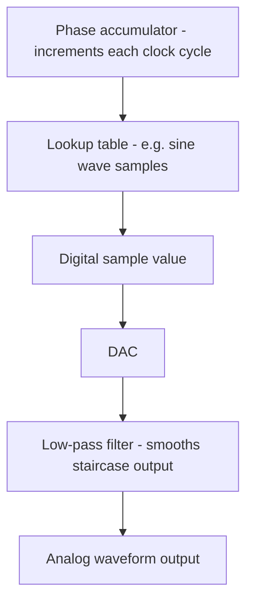

## Digital-to-Analog Conversion Principles

### Overview

Digital-to-analog conversion (DAC) is the inverse operation of ADC: it translates a discrete digital value into a continuous analog voltage or current output. DACs are essential wherever an embedded system needs to produce a genuinely analog signal — audio output, precise voltage references, analog control signals for actuators, waveform generation, or any application where a smoothly-varying voltage is required rather than a fixed set of digital logic levels.

### The Core Conversion Concept

A DAC accepts an N-bit digital code as input and produces a corresponding analog output voltage (or current) proportional to that code's value relative to the DAC's full-scale range, defined by its reference voltage.

$$V_{out} = \frac{Code}{2^N} \times V_{ref}$$

where $Code$ is the input digital value, $N$ is the DAC's bit resolution, and $V_{ref}$ is the reference voltage defining the maximum output.

**Example**: for a 10-bit DAC with a 3.3 V reference and an input code of 512:

$$V_{out} = \frac{512}{1024} \times 3.3\ V = 1.65\ V$$

### DAC Resolution and Step Size

Similar to ADC resolution, a DAC's output resolution is determined by its bit count:

$$V_{step} = \frac{V_{ref}}{2^N}$$

This represents the smallest incremental change in output voltage achievable between adjacent digital codes — the DAC's output is inherently a staircase of discrete voltage levels, not a truly continuous signal, though this staircase can be smoothed with external filtering.

### DAC Output Staircase (SVG)

<svg xmlns="http://www.w3.org/2000/svg" viewBox="0 0 700 240">
  <text x="20" y="20" font-family="monospace" font-size="14" fill="#333">DAC Output Staircase (svg_diagram)</text>
  <line x1="50" y1="200" x2="650" y2="200" stroke="#333" stroke-width="1" />
  <line x1="50" y1="200" x2="50" y2="40" stroke="#333" stroke-width="1" />
  <path d="M 50 190 L 100 190 L 100 170 L 150 170 L 150 150 L 200 150 L 200 140 L 250 140 L 250 110 L 300 110 L 300 100 L 350 100 L 350 80 L 400 80 L 400 70 L 450 70 L 450 60 L 500 60 L 500 50 L 550 50" fill="none" stroke="#0066cc" stroke-width="2" />
  <path d="M 50 190 L 550 50" stroke="#a00" stroke-width="1" stroke-dasharray="4,3" />
  <text x="450" y="220" font-family="monospace" font-size="10" fill="#333">digital input code →</text>
  <text x="560" y="45" font-family="monospace" font-size="10" fill="#a00">ideal continuous line</text>
</svg>

### Common DAC Architectures

**Binary-Weighted Resistor DAC**

Uses a set of resistors with values scaled by powers of two, each connected to one bit of the digital input through a switch, summed together (typically via an operational amplifier summing configuration) to produce the analog output. Conceptually simple but becomes impractical at higher resolutions since the resistor value range required grows exponentially with bit count, making precise resistor matching difficult to manufacture reliably.

**R-2R Ladder DAC**

Uses a repeating ladder network of only two resistor values (R and 2R), avoiding the wide value range problem of the binary-weighted approach, making it considerably more practical to manufacture with good precision at higher resolutions. This is a very commonly used architecture in integrated DAC circuits, including those built into many microcontrollers.

**Pulse Width Modulation (PWM) as DAC Approximation**

As covered in PWM generation and applications, a PWM signal passed through an analog low-pass filter produces an averaged analog voltage roughly proportional to duty cycle — a low-cost technique for approximating DAC functionality using only a timer peripheral and simple external filtering, at the cost of limited bandwidth (how quickly the "DAC" output can change) and residual switching ripple if filtering is insufficient.

**Delta-Sigma (ΔΣ) DAC**

Uses oversampling and noise-shaping techniques (conceptually related to sigma-delta ADCs) to achieve high effective resolution using a comparatively simple 1-bit (or few-bit) internal DAC core, followed by digital filtering. Commonly used in high-fidelity audio DAC applications due to strong noise performance characteristics.

### DAC Architecture Comparison

| Architecture | Complexity | Typical Resolution | Common Use Case |
|---|---|---|---|
| Binary-weighted resistor | Simple concept, poor scalability | Low (impractical at high bits) | Educational/simple applications |
| R-2R ladder | Moderate, good scalability | Moderate–high (8–16 bit common) | General-purpose integrated DACs |
| PWM + filter | Very simple (timer-based) | Effectively limited by filtering | Low-cost analog approximation |
| Delta-Sigma | Complex internally, simple external | High effective resolution | Audio, precision analog output |

### Settling Time

**Settling time** describes how long a DAC's output takes to stabilize within a specified accuracy band after a digital input code change, an important parameter for applications requiring the DAC output to update and stabilize quickly (e.g., generating fast-changing control signals or higher-frequency waveforms).

- Settling time is generally influenced by the DAC's internal architecture, any output buffering/amplification stage, and the capacitive/resistive loading of whatever circuit the DAC output feeds into.
- Applications requiring the DAC to track a rapidly changing target value (e.g., direct digital waveform synthesis at audio or higher frequencies) need to confirm the DAC's settling time is comfortably faster than the required update rate, or distortion of the intended output waveform will result. [Inference — the acceptable settling time margin is application-specific]

### Glitch Energy

When a DAC's input code changes such that multiple bits transition simultaneously (e.g., transitioning from a code like 011111111 to 100000000, where every bit flips), momentary mismatches in individual bit-switch timing within the DAC's internal circuitry can produce a brief, unwanted voltage spike or dip — called a glitch — before the output settles to its correct new value.

- This is a particular concern in applications sensitive to short-duration transients, such as high-fidelity audio, where audible clicks or artifacts can result from significant glitch energy at code transitions involving many simultaneous bit changes.
- Some DAC designs include architectural techniques specifically intended to minimize glitch energy, though these add design complexity. [Inference — the specific techniques and their effectiveness vary by DAC architecture and are documented per-device]

### Common DAC Applications

- **Audio output generation**: converting digital audio samples (from a file, a synthesized waveform, or a communication stream) into an analog signal suitable for driving a speaker or headphone amplifier.
- **Analog control/reference voltage generation**: producing a precise, software-adjustable voltage for controlling another analog circuit (e.g., setting the reference point for a comparator, or a bias voltage for an analog sensor circuit).
- **Waveform synthesis**: generating arbitrary or standard waveforms (sine, triangle, sawtooth) for test equipment, signal generators, or motor control (e.g., generating a sinusoidal reference for field-oriented motor control algorithms).
- **Direct Digital Synthesis (DDS)**: a technique combining a DAC with a phase accumulator and a lookup table (commonly containing sampled sine wave values) to generate precise, digitally-controlled frequency and phase output signals.

### DAC in a Direct Digital Synthesis System (Mermaid Diagram)

### DAC Output Buffering

Many integrated DAC peripherals include or require an output buffer (often an operational amplifier stage) to drive external loads without the DAC's own internal output impedance causing significant voltage drop or loading-dependent inaccuracy.

- Driving a low-impedance load directly from an unbuffered DAC output can cause the actual output voltage to deviate meaningfully from the intended value, since the DAC's internal resistance forms a voltage divider with the load impedance.
- Datasheets typically specify a maximum recommended load (minimum load impedance, or maximum load current) for accurate operation, particularly relevant when driving lower-impedance loads such as some sensor or actuator interfaces without an external buffer stage.

### Multi-Channel DAC Considerations

Some microcontrollers integrate multiple independent DAC channels, useful for applications requiring multiple simultaneous, independently-controlled analog outputs (e.g., stereo audio, multi-axis analog control signals). Channel-to-channel matching (how consistently identical digital codes produce identical analog outputs across channels) varies by device and may matter for applications requiring precise inter-channel tracking. [Inference — the specific matching specification is device-dependent and documented per-part]

### Common Pitfalls

- Driving a low-impedance external load directly from an unbuffered DAC output, causing voltage inaccuracy due to the DAC's own output impedance forming an unintended voltage divider with the load.
- Using a PWM-plus-filter DAC approximation for an application requiring fast-changing output values, without accounting for the filter's inherent bandwidth limitation, resulting in a sluggish or distorted approximation of the intended signal.
- Ignoring settling time when rapidly updating DAC output codes for waveform generation, producing a distorted output if new codes are applied faster than the DAC can physically settle.
- Not budgeting for glitch energy in applications sensitive to short transients (e.g., audio), where large simultaneous multi-bit code transitions can introduce audible or otherwise problematic artifacts.
- Assuming DAC output resolution alone determines signal quality without considering settling time, glitch energy, output buffering requirements, and reference voltage stability — all of which affect real-world output fidelity beyond the nominal bit count.
- Neglecting reference voltage noise/stability, since (mirroring the ADC case) any noise on the DAC's reference voltage directly translates into corresponding noise on the analog output.

**Related Topics**
- Analog-to-digital conversion principles
- PWM generation and applications
- Audio signal generation on embedded systems
- Timer and counter peripherals
- Voltage reference circuit design
- Sensor interfacing and signal conditioning