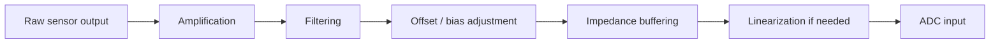
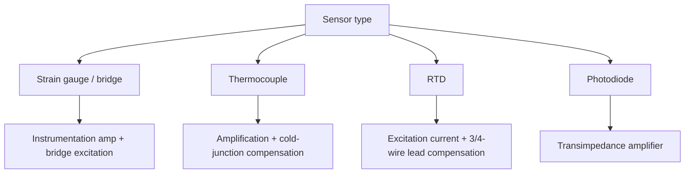

## Sensor Signal Conditioning

### Overview

Sensor signal conditioning refers to the set of analog (and sometimes mixed-signal) techniques applied to a raw sensor output before it reaches an ADC or other digital processing stage. Raw sensor signals are frequently too small, too noisy, riding on an inconvenient DC offset, non-linear, or otherwise mismatched to the input requirements of downstream circuitry. Signal conditioning bridges that gap, and getting it right is often the difference between a sensor that performs to its datasheet specifications and one that produces unreliable, noisy, or inaccurate readings in a real system.

### Why Signal Conditioning Is Necessary

Sensors rarely output a signal that can be fed directly into an ADC and produce a clean, accurate digital reading:

- **Amplitude mismatch**: many sensors output signals far smaller (millivolts) or far larger than an ADC's usable input range, wasting resolution or exceeding input limits.
- **Noise**: sensor outputs, especially from high-impedance sources or long cable runs, pick up electrical noise that can dominate the actual signal of interest if left unaddressed.
- **Non-linearity**: some sensors have an inherently non-linear relationship between the physical quantity being measured and their electrical output, requiring correction to obtain accurate readings.
- **Offset and bias**: many sensors produce a non-zero output even at a zero (or reference) input condition, which must be accounted for.
- **Impedance mismatch**: a high-impedance sensor output connected directly to a lower-impedance load (like an ADC's sampling capacitor) can cause loading errors and slow settling.

### Signal Conditioning Pipeline (Mermaid Diagram)

### Amplification

Many sensors (thermocouples, strain gauges, some photodiodes) produce output signals in the millivolt or even microvolt range, far below what most general-purpose ADCs can resolve meaningfully without amplification.

- **Operational amplifier (op-amp) gain stages**: a basic non-inverting or inverting op-amp configuration scales the sensor's small signal up to better utilize the ADC's input range.
- **Instrumentation amplifiers**: a specialized amplifier configuration (typically built from three op-amps or available as a single integrated part) offering high input impedance, excellent common-mode noise rejection, and precisely configurable gain — particularly well suited to differential sensor outputs like strain gauge bridges, where the signal of interest is a small difference between two larger, nearly-equal voltages.
- **Programmable Gain Amplifiers (PGAs)**: amplifiers with software-selectable gain settings, sometimes integrated directly into modern ADC peripherals, allowing firmware to dynamically adjust gain to match varying sensor signal ranges without hardware changes.

### Instrumentation Amplifier for Differential Sensing (SVG)

<svg xmlns="http://www.w3.org/2000/svg" viewBox="0 0 700 260">
  <text x="20" y="20" font-family="monospace" font-size="14" fill="#333">Instrumentation Amplifier Concept (svg_diagram)</text>
  <rect x="60" y="60" width="100" height="50" fill="none" stroke="#333" />
  <text x="70" y="90" font-family="monospace" font-size="10">Sensor Bridge</text>
  <line x1="160" y1="75" x2="240" y2="75" stroke="#0066cc" stroke-width="2" />
  <line x1="160" y1="95" x2="240" y2="95" stroke="#0066cc" stroke-width="2" />
  <text x="170" y="70" font-family="monospace" font-size="9">V+</text>
  <text x="170" y="112" font-family="monospace" font-size="9">V-</text>
  <polygon points="240,60 240,110 320,85" fill="none" stroke="#333" stroke-width="2" />
  <text x="255" y="88" font-family="monospace" font-size="10">In-Amp</text>
  <line x1="320" y1="85" x2="400" y2="85" stroke="#a00" stroke-width="2" />
  <text x="410" y="90" font-family="monospace" font-size="11" fill="#a00">Amplified single-ended output → ADC</text>
  <text x="60" y="150" font-family="monospace" font-size="10" fill="#666">Common-mode noise on V+ and V- is rejected; only the small differential signal is amplified</text>
</svg>

### Filtering

**Low-pass filtering**

Removes high-frequency noise and, critically, serves as an anti-aliasing filter before ADC sampling (see analog-to-digital conversion principles), typically implemented with a simple RC network for basic applications or an active op-amp-based filter (e.g., Sallen-Key topology) for sharper roll-off and better performance.

**High-pass filtering**

Removes unwanted DC offset or very low-frequency drift while passing the signal of interest, useful for AC-coupled sensor signals (e.g., vibration or audio sensors) where only the changing component matters and any DC bias is irrelevant or undesirable.

**Band-pass filtering**

Combines both, passing only a specific frequency range of interest — common in applications targeting a known signal frequency band while rejecting both low-frequency drift and high-frequency noise outside that band.

**Notch filtering**

Rejects a specific narrow frequency band, most commonly used to remove mains power line interference (50 Hz or 60 Hz, depending on region) that couples into sensitive analog signal paths from nearby AC wiring.

### Filter Types by Frequency Response (SVG)

<svg xmlns="http://www.w3.org/2000/svg" viewBox="0 0 700 240">
  <text x="20" y="20" font-family="monospace" font-size="14" fill="#333">Filter Frequency Responses (svg_diagram)</text>
  <text x="30" y="55" font-family="monospace" font-size="10">Low-pass</text>
  <path d="M 120 40 L 220 40 L 260 90" fill="none" stroke="#0066cc" stroke-width="2" />
  <text x="30" y="105" font-family="monospace" font-size="10">High-pass</text>
  <path d="M 320 90 L 360 40 L 460 40" fill="none" stroke="#0066cc" stroke-width="2" />
  <text x="30" y="155" font-family="monospace" font-size="10">Band-pass</text>
  <path d="M 520 90 L 560 40 L 600 40 L 640 90" fill="none" stroke="#0066cc" stroke-width="2" />
  <text x="30" y="205" font-family="monospace" font-size="10">Notch</text>
  <path d="M 120 190 L 180 190 L 200 220 L 220 190 L 280 190" fill="none" stroke="#0066cc" stroke-width="2" />
</svg>

### Offset and Bias Adjustment

- **DC offset correction**: some sensors output a signal centered around a non-zero baseline (e.g., a sensor outputting 2.5 V at rest with the signal of interest riding above and below that point); conditioning circuitry may shift this to better utilize the ADC's input range, or software may simply subtract a known baseline value after conversion.
- **Level shifting**: sensors producing bipolar (positive and negative) output voltages may need level-shifting circuitry to fit within an ADC's typically unipolar (0 to $V_{ref}$) input range, commonly achieved by adding a fixed DC offset via a resistor network or op-amp summing configuration.

### Impedance Buffering

High-output-impedance sensors (some photodiodes, piezoelectric sensors, high-impedance chemical sensors) can be significantly affected by the loading of subsequent circuitry, including the ADC's own sample-and-hold capacitor.

- **Voltage follower (unity-gain buffer)**: an op-amp configured with its output directly feeding back to its inverting input, providing very high input impedance and low output impedance, isolating the sensitive sensor source from the loading effects of downstream circuitry without adding voltage gain.
- **Transimpedance amplifiers**: used specifically for current-output sensors (such as photodiodes operating in photoconductive mode), converting a small sensor output current into a proportional output voltage suitable for further conditioning or direct ADC sampling.

### Linearization

Some sensors have an inherently non-linear relationship between the measured physical quantity and their electrical output (e.g., many thermistors, some pressure sensors).

- **Hardware linearization**: analog circuit techniques (e.g., specific resistor network configurations for thermistors) that approximately compensate for known non-linearity before the signal reaches the ADC.
- **Software linearization**: applying a known correction curve, lookup table, or polynomial fit in firmware after digitizing the raw signal — often more flexible and precise than hardware linearization, at the cost of requiring computation and calibration data storage.

$$T_{actual} = f(V_{measured})$$

where $f$ represents a characterized, sensor-specific non-linear correction function (often derived from the sensor manufacturer's provided curve or a calibration procedure), rather than a simple universal formula. [Inference — the specific functional form depends entirely on the individual sensor type and its documented or empirically characterized response curve]

### Common Sensor Interface Patterns

**Wheatstone Bridge (Strain Gauges, Pressure Sensors)**

A four-resistor bridge configuration where one or more resistive elements change value in response to the measured physical quantity (strain, pressure), producing a small differential voltage proportional to that change — typically requiring instrumentation amplification due to the very small differential signal riding on a much larger common-mode voltage.

**Thermocouple Cold-Junction Compensation**

Thermocouples measure a voltage proportional to the *difference* in temperature between the measurement junction and a reference ("cold") junction, requiring the cold junction's actual temperature to be independently measured (often via a separate, simpler sensor) and compensated for in software to obtain an absolute temperature reading rather than merely a relative one.

**RTD (Resistance Temperature Detector) Excitation**

RTDs change resistance with temperature and require a known excitation current source to produce a measurable voltage; careful circuit design (e.g., 3-wire or 4-wire configurations) is used to cancel out the resistance of the wiring itself, which would otherwise introduce measurement error, particularly over longer cable runs.

### Signal Conditioning for Different Sensor Types (Mermaid Diagram)

### Grounding and Shielding Considerations

- **Analog vs. digital ground separation**: mixed-signal PCB designs commonly separate analog and digital ground planes, joined at a single point, to prevent noisy digital return currents from coupling into sensitive analog signal paths.
- **Shielded cabling**: for sensor signals traveling any meaningful distance, particularly in electrically noisy environments (near motors, switching power supplies, or high-power wiring), shielded cable with the shield properly grounded (typically at one end only, to avoid ground loop currents) reduces electromagnetic interference pickup.
- **Twisted-pair wiring**: for differential sensor signals, twisting the pair of wires helps ensure both conductors pick up similar induced noise, which a differential amplifier stage can then reject as common-mode interference.

### Common Pitfalls

- Feeding a small-amplitude sensor signal directly into an ADC without amplification, wasting most of the ADC's resolution on a signal that occupies only a small fraction of its input range.
- Omitting anti-aliasing/low-pass filtering before sampling a sensor signal with meaningful high-frequency noise or interference content.
- Neglecting cold-junction compensation for thermocouple measurements, resulting in a temperature reading that reflects only the temperature *difference* rather than an absolute value.
- Using a 2-wire RTD configuration in an application with long cable runs, introducing lead-resistance error that a 3-wire or 4-wire configuration would have compensated for.
- Ignoring ground loop and shielding considerations in electrically noisy environments, resulting in noisy or unstable sensor readings that no amount of digital filtering can fully correct after the fact.
- Applying a generic or assumed linearization formula rather than the sensor's actual characterized response curve, introducing systematic measurement error that increases away from the calibration point.
- Failing to account for high sensor output impedance when connecting directly to an ADC or long cable run, leading to signal loading errors or excessive noise pickup.

**Related Topics**
- Analog-to-digital conversion principles
- Noise reduction and filtering techniques in embedded systems
- PCB layout considerations for mixed-signal designs
- Operational amplifier circuit fundamentals
- Voltage reference circuit design
- Common sensor types and interfacing (thermocouples, RTDs, strain gauges, photodiodes)