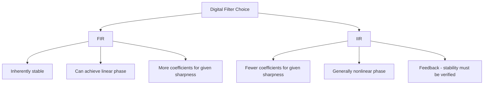

## Filtering: RC Filters and Digital Filters

### Overview

Filtering is the process of selectively passing or attenuating a signal's frequency components, used throughout embedded systems for noise reduction, anti-aliasing before ADC sampling, smoothing control loop feedback, and extracting a signal of interest from unwanted interference. Embedded designers work with two broad categories: analog filters (implemented with physical resistors, capacitors, and sometimes op-amps) and digital filters (implemented as software algorithms operating on already-sampled data). Each has distinct advantages, and real systems frequently combine both.

### Why Filtering Matters in Embedded Systems

- **Anti-aliasing**: analog filtering before an ADC removes frequency content above the Nyquist frequency that would otherwise fold back as false low-frequency artifacts (see analog-to-digital conversion principles).
- **Noise reduction**: both analog and digital filtering reduce the impact of electrical noise, improving measurement accuracy and signal quality.
- **Smoothing/averaging**: extracting a slowly-varying trend from a noisy or rapidly-fluctuating raw signal, useful in sensor readings and control loop feedback.
- **Signal isolation**: extracting a specific frequency band of interest while rejecting others, relevant in communication and specific sensing applications.

### RC Low-Pass Filter

The simplest and most common analog filter, built from a single resistor and capacitor, passing low-frequency signals while attenuating higher frequencies.

$$f_c = \frac{1}{2\pi RC}$$

where $f_c$ is the cutoff frequency (the point at which output amplitude has dropped to approximately 70.7%, or -3 dB, of the input amplitude), $R$ is resistance, and $C$ is capacitance.

**Time-domain behavior**: an RC low-pass filter's step response follows an exponential charging/discharging curve, characterized by the time constant:

$$\tau = RC$$

After one time constant, the output reaches approximately 63.2% of its final value; after roughly 5 time constants, it is considered to have effectively settled (within about 0.7% of final value).

### RC Low-Pass Filter Response (SVG)

<svg xmlns="http://www.w3.org/2000/svg" viewBox="0 0 700 260">
  <text x="20" y="20" font-family="monospace" font-size="14" fill="#333">RC Low-Pass Filter: Frequency and Step Response (svg_diagram)</text>
  <text x="30" y="50" font-family="monospace" font-size="11">Frequency response:</text>
  <line x1="60" y1="100" x2="300" y2="100" stroke="#333" stroke-width="1" />
  <line x1="60" y1="60" x2="60" y2="140" stroke="#333" stroke-width="1" />
  <path d="M 60 70 L 160 70 L 300 130" fill="none" stroke="#0066cc" stroke-width="2" />
  <line x1="160" y1="60" x2="160" y2="140" stroke="#a00" stroke-dasharray="3,2" />
  <text x="130" y="150" font-family="monospace" font-size="9" fill="#a00">f_c</text>

  <text x="400" y="50" font-family="monospace" font-size="11">Step response:</text>
  <line x1="420" y1="140" x2="650" y2="140" stroke="#333" stroke-width="1" />
  <line x1="420" y1="60" x2="420" y2="140" stroke="#333" stroke-width="1" />
  <path d="M 420 140 Q 460 70, 650 65" fill="none" stroke="#0066cc" stroke-width="2" />
  <line x1="465" y1="90" x2="465" y2="140" stroke="#a00" stroke-dasharray="3,2" />
  <text x="440" y="155" font-family="monospace" font-size="9" fill="#a00">τ (63.2%)</text>
</svg>

### RC High-Pass Filter

Swapping the resistor and capacitor positions relative to the low-pass configuration produces a high-pass filter, passing high frequencies while attenuating low frequencies (including DC).

$$f_c = \frac{1}{2\pi RC}$$

The cutoff frequency formula is identical in form; only the circuit topology (which component the output is taken across) differs.

### Limitations of Simple RC Filters

- **Gentle roll-off**: a single-stage RC filter attenuates at only 20 dB per decade (6 dB per octave) beyond the cutoff frequency, a relatively gradual transition compared to more complex filter topologies.
- **No sharp cutoff**: frequencies somewhat above the cutoff are attenuated but not eliminated, which may be insufficient for applications requiring strong rejection of specific nearby frequencies.
- **Cascading stages**: multiple RC stages can be cascaded to achieve steeper roll-off, though each additional passive stage also loads the previous one, requiring buffering (e.g., with op-amp voltage followers between stages) to maintain the intended cutoff behavior of each individual stage.

### Active Analog Filters

For steeper roll-off and more precisely controlled frequency response than passive RC filters provide, active filters incorporate an op-amp along with resistors and capacitors.

- **Sallen-Key topology**: a common active filter configuration capable of implementing low-pass, high-pass, or band-pass responses with a single op-amp stage, offering steeper roll-off than a passive RC filter of equivalent order.
- **Filter order and response characteristics**: active filter design often references named response characteristics — **Butterworth** (maximally flat passband, no ripple), **Chebyshev** (steeper roll-off than Butterworth at the cost of passband ripple), and **Bessel** (optimized for preserving signal timing/phase relationships, at the cost of a less sharp cutoff) — each representing a different trade-off appropriate to different application priorities. [Inference — the specific choice among these depends entirely on which characteristic (flatness, roll-off steepness, or phase linearity) matters most for the given application]

### Digital Filters: Moving Average

One of the simplest digital filtering techniques: each output sample is the average of the most recent $N$ input samples.

$$y[n] = \frac{1}{N}\sum_{i=0}^{N-1} x[n-i]$$

```c
// Simple moving average filter (fixed window)
#define WINDOW_SIZE 8
int16_t buffer[WINDOW_SIZE] = {0};
uint8_t index = 0;

int16_t movingAverage(int16_t newSample) {
    buffer[index] = newSample;
    index = (index + 1) % WINDOW_SIZE;

    int32_t sum = 0;
    for (uint8_t i = 0; i < WINDOW_SIZE; i++) {
        sum += buffer[i];
    }
    return (int16_t)(sum / WINDOW_SIZE);
}
```

- **Advantages**: simple to implement, effective at reducing random noise, easy to understand and reason about.
- **Disadvantages**: introduces a delay (lag) proportional to window size, and has a relatively gentle frequency roll-off compared to more sophisticated digital filter designs — not the most efficient noise-reduction-per-unit-of-lag technique available.

### Digital Filters: Exponential Moving Average (EMA) / Low-Pass IIR

A computationally efficient alternative that weights the most recent sample against a running accumulated average, requiring only one stored value (rather than a full window buffer) and one multiply-accumulate operation per new sample.

$$y[n] = \alpha \cdot x[n] + (1 - \alpha) \cdot y[n-1]$$

where $\alpha$ (typically between 0 and 1) controls the filter's responsiveness: a larger $\alpha$ weights new samples more heavily (faster response, less smoothing), while a smaller $\alpha$ smooths more aggressively at the cost of slower response to genuine changes.

```c
// Exponential moving average filter
float filteredValue = 0.0f;
const float alpha = 0.1f;  // smoothing factor

float emaFilter(float newSample) {
    filteredValue = alpha * newSample + (1.0f - alpha) * filteredValue;
    return filteredValue;
}
```

- This is mathematically a first-order Infinite Impulse Response (IIR) low-pass filter, and its relationship to the RC filter's time constant can be approximated for a given sampling interval $T_s$:

$$\alpha \approx \frac{T_s}{\tau + T_s}$$

- **Advantages**: minimal memory footprint (a single stored value), computationally cheap (one multiply and one add per sample), commonly used in resource-constrained embedded applications for basic sensor smoothing.
- **Disadvantages**: like the RC filter it mathematically resembles, it has a relatively gentle roll-off and introduces phase lag that increases with lower $\alpha$ values.

### FIR vs. IIR Digital Filters

**Finite Impulse Response (FIR) Filters**

- Output depends only on a finite window of current and past *input* samples (no feedback of previous outputs).
- Inherently stable (cannot become unstable from feedback issues, since there is no feedback path).
- Can be designed with exactly linear phase response, which preserves the relative timing relationship between different frequency components — important in applications like audio or precise waveform measurement where phase distortion is undesirable.
- Generally require more coefficients (and thus more computation per sample) than an IIR filter achieving a comparable frequency-response sharpness.

**Infinite Impulse Response (IIR) Filters**

- Output depends on both current/past input samples and past *output* samples (feedback), which is what gives them their name — their impulse response theoretically continues indefinitely rather than terminating after a finite window.
- Can achieve a given frequency-response sharpness with substantially fewer coefficients (less computation) than an equivalent FIR filter, an important consideration on resource-constrained microcontrollers.
- Generally cannot achieve exactly linear phase response.
- Feedback structure introduces the possibility of instability if not designed and implemented carefully (particularly relevant with fixed-point/limited-precision arithmetic, where coefficient quantization and rounding errors can degrade stability margins present in the idealized mathematical design). [Inference — the practical significance of quantization-induced instability risk depends on filter order, coefficient precision, and the specific fixed-point implementation used]

### FIR vs IIR Comparison (Mermaid Diagram)



### Median Filter

A non-linear digital filter that outputs the median (middle) value of the most recent $N$ samples rather than their average, particularly effective at removing occasional large outlier spikes (impulse noise) without the smoothing/blurring effect a moving average would apply to the surrounding, non-outlier samples.

```c
// Conceptual median filter (simplified, small fixed window)
int16_t medianFilter(int16_t newSample) {
    static int16_t window[5];
    static uint8_t idx = 0;
    window[idx] = newSample;
    idx = (idx + 1) % 5;

    int16_t sorted[5];
    memcpy(sorted, window, sizeof(sorted));
    // sort 'sorted' array (implementation omitted for brevity)
    return sorted[2]; // middle element of sorted 5-element window
}
```

- Particularly useful for sensor data occasionally corrupted by brief transient spikes (e.g., electrical interference glitches) that a moving average would only partially suppress while also blurring genuine signal transitions.

### Choosing Between Analog and Digital Filtering

- **Analog filtering is mandatory before ADC sampling for anti-aliasing purposes** — a digital filter applied after sampling cannot undo aliasing that has already occurred during an under-sampled analog-to-digital conversion.
- **Digital filtering offers flexibility**: filter characteristics can be changed in software without any hardware modification, multiple filter types can be applied to the same sampled data, and filter parameters can even be adjusted dynamically at runtime based on operating conditions.
- **Combined approach is typical**: a simple analog anti-aliasing filter (often a basic RC stage) precedes the ADC to satisfy the Nyquist requirement, with more sophisticated filtering (moving average, EMA, FIR/IIR designs) applied digitally afterward for further noise reduction or signal shaping, since digital filter design and modification is generally far more flexible than iterating on analog component values.

### Common Pitfalls

- Relying solely on digital filtering and omitting analog anti-aliasing entirely, allowing aliasing artifacts into the sampled data that no subsequent digital filter can remove.
- Using a moving average filter when the application actually needs outlier rejection, when a median filter would better address occasional spike interference without excessive smoothing of legitimate signal changes.
- Choosing an EMA/IIR filter's $\alpha$ (or equivalent time constant) without considering the resulting phase lag's impact on a control loop's stability or responsiveness, particularly in feedback control applications where delayed information can degrade control performance.
- Implementing an IIR filter in fixed-point arithmetic without adequate consideration of coefficient quantization effects on stability, particularly for filters with poles close to the stability boundary.
- Assuming a single-stage RC filter provides adequate frequency separation for applications requiring steep roll-off or strong rejection of nearby interfering frequencies, when a higher-order or active filter design would be necessary.
- Not accounting for a moving average filter's inherent processing delay (window size × sample period) in applications where response latency matters, such as real-time control loops.

**Related Topics**
- Analog-to-digital conversion principles
- Sensor signal conditioning
- Control loop design and PID fundamentals
- Digital signal processing basics
- ADC resolution, sampling rate, and error sources
- Noise reduction and PCB layout for mixed-signal designs