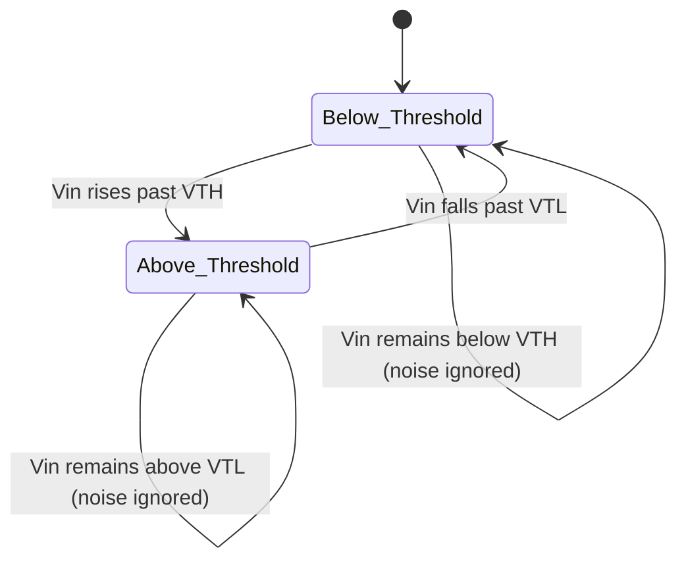

## Comparators and Threshold Detection

### Overview

A comparator is an analog circuit block that continuously compares two input voltages and produces a binary digital output indicating which input is larger. Threshold detection is the broader application category built on comparators: converting a continuously varying analog signal into a discrete digital event whenever it crosses a defined voltage level. This function bridges the analog and digital domains without requiring an ADC, making comparators one of the most common analog building blocks in embedded systems for tasks like zero-crossing detection, overvoltage/undervoltage protection, wake-on-threshold sensing, and simple analog-to-digital classification.

### Comparator Fundamentals

#### Basic Operation

A comparator has two inputs — non-inverting (+) and inverting (−) — and one digital output. Its ideal transfer function is:

$$V_{out} = \begin{cases} V_{OH} & \text{if } V_+ > V_- \\ V_{OL} & \text{if } V_+ < V_- \end{cases}$$

Where $V_{OH}$ and $V_{OL}$ are the output high and low rail voltages, which for open-drain output comparators are set externally by a pull-up resistor and supply rail, and for push-pull output comparators are set internally near the supply rails.

Although a comparator is structurally similar to an op-amp (both are differential-input, single-output devices), the two are optimized for different purposes and are generally not interchangeable in practice:

| Characteristic | Comparator | Op-Amp |
| --- | --- | --- |
| Intended operating mode | Open-loop, saturated output | Closed-loop, linear region |
| Output stage | Often open-drain, fast digital swing | Linear, rail-limited analog swing |
| Speed priority | Propagation delay minimized | Bandwidth/gain-bandwidth optimized |
| Output states | Two discrete states | Continuous range |
| Typical output stage design | Optimized to slam between rails quickly | Optimized for slew linearity, not raw switching speed |

Using an op-amp as a comparator is possible but generally discouraged for precision timing applications, since op-amp output stages are not designed for fast rail-to-rail switching and internal compensation capacitance slows the transition; dedicated comparator ICs offer response times (propagation delay) that are typically an order of magnitude faster for a similar power budget. [Inference — the exact performance gap depends on the specific op-amp and comparator parts being compared.]

#### Basic Threshold Detection Circuit (svg_diagram)

<svg xmlns="http://www.w3.org/2000/svg" viewBox="0 0 700 320">
\<style\>
.lbl { font-family: monospace; font-size: 13px; fill: #1a1a1a; }
.small { font-family: monospace; font-size: 11px; fill: #444; }
.box { fill: none; stroke: #1a1a1a; stroke-width: 1.5; }
.wire { stroke: #1a1a1a; stroke-width: 1.5; fill: none; }
.title { font-family: monospace; font-size: 15px; fill: #000; font-weight: bold; }
\</style\>

<text x="350" y="24" text-anchor="middle" class="title">Comparator Threshold Detection (svg_diagram)</text>

<path class="wire" d="M40,120 L160,120" />
<text x="20" y="115" class="lbl">Vin</text>
<text x="45" y="112" class="small">(sensor signal)</text>
<path class="wire" d="M40,220 L160,220" />
<text x="20" y="215" class="lbl">Vref</text>
<text x="45" y="212" class="small">(threshold)</text>
<path class="box" d="M160,90 L160,250 L240,170 Z" />
<text x="170" y="130" class="lbl">+</text>
<text x="170" y="240" class="lbl">-</text>
<path class="wire" d="M240,170 L320,170" />

<path class="wire" d="M320,170 L320,80" />
<rect x="300" y="50" width="40" height="30" class="box" />
<text x="345" y="65" class="small">Rpu</text>
<path class="wire" d="M320,50 L320,30" />
<text x="300" y="20" class="lbl">Vcc</text>
<path class="wire" d="M320,170 L420,170" />
<text x="430" y="175" class="lbl">Vout -&gt; MCU GPIO</text>

<text x="350" y="290" class="small" text-anchor="middle">Output switches HIGH when Vin exceeds Vref, LOW otherwise</text>

</svg>

### Hysteresis and the Schmitt Trigger Comparator

#### The Chattering Problem

A comparator with a single, fixed threshold and a noisy or slowly-changing input near that threshold will produce rapid, spurious output transitions ("chattering") as noise causes the input to cross the threshold repeatedly. This is especially problematic when the comparator output feeds a microcontroller interrupt pin, since each spurious edge can trigger an unwanted interrupt service routine execution.

#### Hysteresis Solution

Hysteresis introduces two distinct thresholds instead of one — a higher threshold $V_{TH}$ used when the output is currently low (transitioning low-to-high), and a lower threshold $V_{TL}$ used when the output is currently high (transitioning high-to-low). This is implemented with positive feedback, typically via a resistor divider from the output back to the non-inverting input.

$$V_{TH} = V_{ref} + \frac{R_1}{R_1 + R_2}(V_{OH} - V_{ref})$$

$$V_{TL} = V_{ref} - \frac{R_1}{R_1 + R_2}(V_{ref} - V_{OL})$$

The difference between the two thresholds is the hysteresis band, sized to exceed the expected peak-to-peak noise on the input signal so that noise alone cannot cause spurious transitions.

#### Hysteresis Transfer Curve (svg_diagram)

<svg xmlns="http://www.w3.org/2000/svg" viewBox="0 0 600 400">
\<style\>
.lbl { font-family: monospace; font-size: 13px; fill: #1a1a1a; }
.small { font-family: monospace; font-size: 11px; fill: #444; }
.axis { stroke: #1a1a1a; stroke-width: 1.5; }
.curve { stroke: #1a1a1a; stroke-width: 2; fill: none; }
.dash { stroke: #888; stroke-width: 1; stroke-dasharray: 4,4; fill: none; }
.title { font-family: monospace; font-size: 15px; fill: #000; font-weight: bold; }
\</style\>

<text x="300" y="24" text-anchor="middle" class="title">Schmitt Trigger Hysteresis Loop (svg_diagram)</text>

<path class="axis" d="M80,340 L520,340" />
<path class="axis" d="M80,340 L80,60" />
<text x="520" y="360" class="lbl">Vin</text>
<text x="40" y="60" class="lbl">Vout</text>

<path class="curve" d="M80,300 L300,300" />
<path class="curve" d="M300,300 L300,100" />
<path class="curve" d="M300,100 L520,100" />

<path class="curve" d="M520,100 L220,100" />
<path class="curve" d="M220,100 L220,300" />
<path class="curve" d="M220,300 L80,300" />
<path class="dash" d="M220,340 L220,300" />
<path class="dash" d="M300,340 L300,100" />

<text x="205" y="358" class="small">VTL</text>

<text x="285" y="358" class="small">VTH</text>

<text x="330" y="90" class="small">rising input path</text>

<text x="130" y="290" class="small">falling input path</text>

</svg>

### Threshold Detection State Flow

### Common Embedded Applications

#### Zero-Crossing Detection

Used in AC power applications (dimmers, phase-controlled motor drivers) to detect when an AC mains waveform crosses 0 V, providing a synchronization reference for triac firing angle timing. Typically implemented with a comparator referenced at the midpoint of a scaled-down and level-shifted mains waveform, often through an optocoupler for isolation.

#### Overvoltage / Undervoltage Lockout (OVLO / UVLO)

A comparator monitors a supply rail or battery voltage against a fixed reference and asserts a fault or shutdown signal if the voltage moves outside a safe operating window. This is frequently built into power management ICs but can also be implemented discretely for custom protection logic, disabling a load switch or triggering a microcontroller's non-maskable interrupt.

#### Wake-on-Threshold / Low-Power Sensing

A comparator can monitor a sensor signal (e.g., a light sensor, microphone envelope, or motion sensor output) while the microcontroller is in a low-power sleep state, and assert an interrupt pin only when the signal crosses a threshold — allowing the MCU to remain asleep until an event of interest occurs, since comparator quiescent current is typically far lower than an active ADC conversion loop.

#### Window Comparator

Two comparators are combined to detect whether a signal falls within (or outside) a voltage band bounded by an upper and lower reference, rather than a single threshold. This is common in battery charge-state monitoring and analog fault-window detection.

**Window Comparator Structure** (svg_diagram):

<svg xmlns="http://www.w3.org/2000/svg" viewBox="0 0 700 340">
\<style\>
.lbl { font-family: monospace; font-size: 13px; fill: #1a1a1a; }
.small { font-family: monospace; font-size: 11px; fill: #444; }
.box { fill: none; stroke: #1a1a1a; stroke-width: 1.5; }
.wire { stroke: #1a1a1a; stroke-width: 1.5; fill: none; }
.title { font-family: monospace; font-size: 15px; fill: #000; font-weight: bold; }
\</style\>

<text x="350" y="24" text-anchor="middle" class="title">Window Comparator (svg_diagram)</text>

<path class="wire" d="M30,140 L100,140" />
<path class="wire" d="M30,140 L30,220 L100,220" />
<text x="10" y="135" class="lbl">Vin</text>
<path class="box" d="M100,110 L100,170 L170,140 Z" />
<text x="108" y="125" class="small">+ Vhigh</text>
<text x="108" y="160" class="small">- Vin</text>
<path class="box" d="M100,190 L100,250 L170,220 Z" />
<text x="108" y="205" class="small">+ Vin</text>
<text x="108" y="240" class="small">- Vlow</text>
<path class="wire" d="M170,140 L230,140 L230,180" />
<path class="wire" d="M170,220 L230,220 L230,180" />
<path class="box" d="M230,150 L230,210 L280,180 Z" />
<text x="235" y="185" class="small">AND</text>
<path class="wire" d="M280,180 L360,180" />
<text x="365" y="185" class="lbl">Vout: HIGH if Vlow &lt; Vin &lt; Vhigh</text>
</svg>

### Key Design Parameters

- **Propagation delay** ($t_{PD}$): Time from input crossing threshold to output reaching valid logic level. Critical for timing-sensitive applications like zero-crossing detection and fast overcurrent protection.
- **Input offset voltage**: Same concern as with op-amps — a small internal mismatch that shifts the effective threshold from the intended reference value.
- **Output type**: Open-drain (requires external pull-up, allows wired-OR bus configurations and voltage-domain flexibility) vs. push-pull (faster switching, no external pull-up needed, but output swing tied to comparator supply).
- **Hysteresis (fixed vs. adjustable)**: Some comparator ICs include internal fixed hysteresis; others require external positive feedback resistors for a designer-specified hysteresis band.
- **Input common-mode range**: The range of voltages over which the comparator inputs function correctly; some parts do not operate correctly with inputs near the supply rails ("rail-to-rail input" parts are needed for full-range operation).
- **Reference stability**: The threshold reference (whether a resistor divider, bandgap reference IC, or DAC output) must be stable relative to the required detection accuracy — reference drift directly translates to threshold drift.

### Firmware-Side Considerations

- **Debouncing in firmware vs. hardware hysteresis**: While hardware hysteresis addresses analog noise chattering, mechanical or logical debounce (e.g., for a threshold tied to a physical button or slow mechanical sensor) may still require a firmware-side debounce timer layered on top.
- **Interrupt configuration**: Comparator outputs feeding a GPIO interrupt pin should typically be configured for edge-triggered detection (rising, falling, or both, depending on the application) rather than level-triggered, to avoid repeated ISR entry while the signal remains past threshold.
- **Reference generation**: If the threshold reference is generated by a DAC or PWM-filtered signal from the same microcontroller, firmware must ensure the reference has settled and stabilized before relying on comparator output validity, particularly after a reference change.
- **Built-in MCU comparators**: Many microcontrollers integrate one or more analog comparators on-chip (often pairable with a DAC or internal reference for the threshold), reducing external component count; these share design considerations with discrete comparator ICs but often have more limited hysteresis and offset specifications, so equivalent performance to a dedicated external comparator IC should not be assumed. [Inference — internal MCU comparator specifications vary significantly by silicon vendor and part family, and the datasheet for the specific part should be consulted before relying on this for precision applications.]

### Related Topics

- Schmitt trigger digital logic gates and their use as clean-up buffers for slow/noisy digital edges
- On-chip microcontroller analog comparator peripherals and configuration registers
- Zero-crossing detection circuits for AC phase control
- Window comparator applications in battery management systems
- Voltage supervisor and brown-out detection ICs
- DAC-referenced adjustable threshold detection
- Debounce techniques in firmware for interrupt-driven sensing