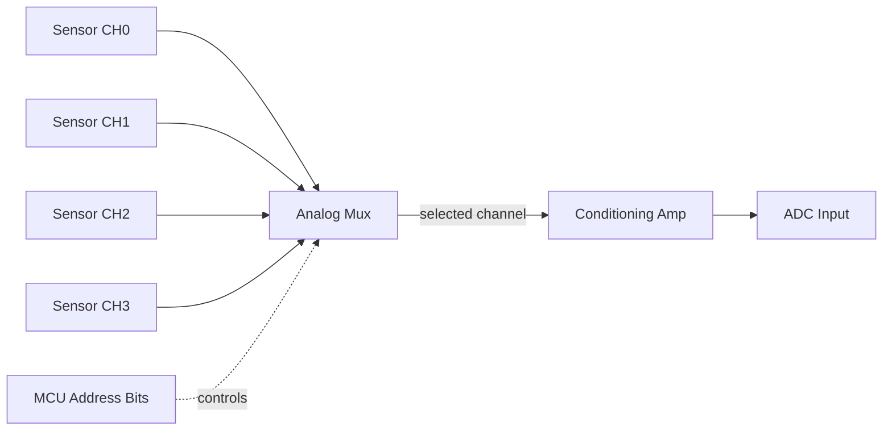

## Analog Multiplexing

### Overview

An analog multiplexer (mux) is a switching device that connects one of several analog input channels to a single common output line, selected by a digital control code. It allows a single downstream resource — most commonly an ADC input, but also amplifiers, filters, or measurement instruments — to be shared across multiple analog signal sources, avoiding the cost and board space of dedicated conditioning and conversion hardware per channel. Analog demultiplexers perform the inverse function, routing a single input to one of several outputs, and the same physical device (an analog switch matrix) is often used bidirectionally for both purposes.

### Why Analog Multiplexing Is Used

Embedded systems frequently need to sample more analog channels than the microcontroller has dedicated ADC inputs, or need to route a shared signal-conditioning chain (amplifier, filter, precision reference) across many sensors without duplicating that circuitry per channel. Common motivations include:

- **Pin/ADC channel scarcity**: A microcontroller may expose fewer ADC channels than the application needs (e.g., 8 sensors, 4 ADC-capable pins).
- **Cost reduction on shared conditioning circuitry**: Precision instrumentation amplifiers, voltage references, or active filters are often the most expensive components in a signal chain; multiplexing allows one such stage to serve many sensor inputs sequentially.
- **Routing flexibility**: Test and calibration systems often need to selectively connect a measurement instrument to different points in a circuit under software control.
- **Sensor array scanning**: Applications like resistive touch panels, thermocouple arrays, or multi-point strain gauge systems scan across many similar sensors sequentially rather than reading them all simultaneously.

The tradeoff is throughput: each additional multiplexed channel reduces the effective sample rate available per channel, since channels are read sequentially rather than in parallel, and each channel switch introduces settling time before a valid reading can be taken.

### Analog Switch Fundamentals

The building block of an analog multiplexer is the analog switch, typically implemented as a CMOS transmission gate — a parallel combination of an N-channel and P-channel MOSFET that, when enabled, presents a low-resistance bidirectional path between its two analog terminals, and when disabled, presents a high-impedance open circuit.

#### CMOS Transmission Gate (svg_diagram)

<svg xmlns="http://www.w3.org/2000/svg" viewBox="0 0 620 260">
\<style\>
.lbl { font-family: monospace; font-size: 13px; fill: #1a1a1a; }
.small { font-family: monospace; font-size: 11px; fill: #444; }
.wire { stroke: #1a1a1a; stroke-width: 1.5; fill: none; }
.box { fill: none; stroke: #1a1a1a; stroke-width: 1.5; }
.title { font-family: monospace; font-size: 15px; fill: #000; font-weight: bold; }
\</style\>

<text x="310" y="24" text-anchor="middle" class="title">CMOS Transmission Gate (svg_diagram)</text>

<path class="wire" d="M40,130 L160,130" />
<text x="15" y="125" class="lbl">A</text>

<rect x="160" y="90" width="80" height="30" class="box" />
<text x="170" y="110" class="small">NMOS</text>

<rect x="160" y="150" width="80" height="30" class="box" />
<text x="170" y="170" class="small">PMOS</text>
<path class="wire" d="M240,105 L340,105 L340,130" />
<path class="wire" d="M240,165 L340,165 L340,130" />
<path class="wire" d="M340,130 L460,130" />
<text x="470" y="135" class="lbl">B</text>

<path class="wire" d="M200,90 L200,50" />
<text x="160" y="45" class="small">EN (gate ctrl)</text>
<path class="wire" d="M200,180 L200,220" />
<text x="160" y="235" class="small">EN_bar (inverted)</text>

<text x="310" y="255" class="small" text-anchor="middle">Complementary gate drive maintains low RON across full input voltage range</text>

</svg>

Key electrical characteristics of the transmission gate directly affect signal integrity when placed in an analog signal path:

- **On-resistance ($R_{ON}$)**: Not zero — typically tens to a few hundred ohms depending on the part — and it varies somewhat with the signal voltage being switched, which can introduce nonlinearity if the mux drives a load sensitive to source impedance (e.g., directly into a fast ADC sampling capacitor without a buffer).
- **Off-isolation and leakage**: A disabled channel is not a perfect open circuit; small leakage currents and parasitic capacitance couple some signal through, which becomes relevant in high-impedance or high-precision measurement paths.
- **Charge injection**: Switching the control signal injects a small charge transient onto the analog signal path through parasitic gate capacitance, appearing as a brief voltage glitch at the moment of switching — relevant in sample-and-hold and precision measurement applications.
- **Bandwidth**: The $R_{ON}$ combined with load and parasitic capacitance forms an RC low-pass characteristic, limiting the frequency content that can pass cleanly through the switch.

### Multiplexer Architectures

#### Single-Ended Multiplexer

The most common configuration: N input channels, each routed through its own analog switch, all switch outputs tied to a common bus line, with a digital decoder selecting exactly one switch to be enabled at a time based on an address input.

$$N_{address\ bits} = \lceil \log_2(N_{channels}) \rceil$$

An 8-channel mux requires 3 address bits; a 16-channel mux requires 4.

#### 8-Channel Analog Multiplexer Block Diagram (svg_diagram)

<svg xmlns="http://www.w3.org/2000/svg" viewBox="0 0 700 420">
\<style\>
.lbl { font-family: monospace; font-size: 13px; fill: #1a1a1a; }
.small { font-family: monospace; font-size: 11px; fill: #444; }
.box { fill: none; stroke: #1a1a1a; stroke-width: 1.5; }
.wire { stroke: #1a1a1a; stroke-width: 1.2; fill: none; }
.title { font-family: monospace; font-size: 15px; fill: #000; font-weight: bold; }
\</style\>

<text x="350" y="24" text-anchor="middle" class="title">8-Channel Analog Multiplexer (svg_diagram)</text>

<g>
<path class="wire" d="M30,60 L260,140" /><text x="10" y="60" class="small">CH0</text>
<path class="wire" d="M30,90 L260,150" /><text x="10" y="90" class="small">CH1</text>
<path class="wire" d="M30,120 L260,160" /><text x="10" y="120" class="small">CH2</text>
<path class="wire" d="M30,150 L260,170" /><text x="10" y="150" class="small">CH3</text>
<path class="wire" d="M30,180 L260,180" /><text x="10" y="180" class="small">CH4</text>
<path class="wire" d="M30,210 L260,190" /><text x="10" y="210" class="small">CH5</text>
<path class="wire" d="M30,240 L260,200" /><text x="10" y="240" class="small">CH6</text>
<path class="wire" d="M30,270 L260,210" /><text x="10" y="270" class="small">CH7</text>
</g>
<rect x="260" y="120" width="160" height="110" class="box" />
<text x="280" y="180" class="lbl">8:1 Mux</text>
<text x="280" y="198" class="small">Core</text>
<path class="wire" d="M420,175 L520,175" />
<text x="530" y="180" class="lbl">COM -&gt; ADC</text>

<path class="wire" d="M300,230 L300,300" />
<path class="wire" d="M340,230 L340,320" />
<path class="wire" d="M380,230 L380,300" />
<text x="270" y="330" class="small">A0 A1 A2</text>
<text x="250" y="350" class="small">(from MCU GPIO or decoder)</text>
<path class="wire" d="M260,150 L230,150" />
<text x="140" y="155" class="small">EN (chip enable)</text>
</svg>

#### Differential Multiplexer

Uses two ganged switch banks controlled by the same address lines, routing a differential signal pair (+ and −) together so that a differential downstream stage (e.g., an instrumentation amplifier) always sees a matched pair from the same selected channel. Essential when the source signals are inherently differential, such as thermocouple pairs or bridge sensor outputs, since routing the + and − legs through independently-timed switches would introduce transient common-mode errors.

#### Multiplexer/Demultiplexer Signal Flow

### Timing Considerations

#### Settling Time After Channel Switch

When the mux switches to a new channel, the new signal must propagate through the switch's $R_{ON}$ and charge any downstream sampling or filter capacitance before a valid reading can be taken. The settling time depends on the RC time constant of the path:

$$t_{settle} \approx n \cdot R_{ON} \cdot C_{load}$$

where $n$ is the number of time constants required for the desired settling accuracy (e.g., ~7 time constants for 12-bit / 0.1% settling, more for higher resolution). Firmware must insert an adequate delay — or use a hardware timer — between switching the mux address and triggering an ADC conversion, or the reading will reflect a mix of the previous and new channel's voltage.

#### Break-Before-Make vs. Make-Before-Break Switching

Multiplexer ICs are typically designed as "break-before-make," meaning the previously selected channel is disconnected before the newly selected channel is connected, avoiding a momentary short between two different signal sources during the address transition. This behavior should be confirmed in the specific part's datasheet, since break-before-make timing margins vary by device and process. [Inference — exact break-before-make guard time is device-specific and not standardized across vendors.]

### Design Considerations

- **Bandwidth vs. channel count tradeoff**: Higher channel-count muxes generally have more parasitic capacitance on the common output line (from all the disabled switches' off-capacitance summing), reducing achievable bandwidth compared to a low channel-count part.
- **Voltage range and supply compatibility**: The mux must be supplied with rails that encompass the full range of signals being switched; switching a signal outside the supply rails can forward-bias internal protection diodes and cause latch-up or channel damage.
- **Break-before-make guard time**: Especially important when multiplexing power or high-current analog signals, not just measurement signals, to avoid momentary shorts.
- **ESD and overvoltage protection**: Muxes exposed to external, possibly noisy or fault-prone signal sources (e.g., a mux at the edge of a sensor harness) may need additional external protection beyond the IC's internal ESD structures.
- **Buffering before the ADC**: Since $R_{ON}$ varies with signal level and can be significant relative to a fast ADC's input sampling requirements, a unity-gain buffer is often placed between the mux common output and the ADC input to isolate the ADC's sampling capacitor from the mux's variable source impedance.

### Firmware-Side Considerations

- **Channel scan sequencing**: Firmware typically implements a round-robin or priority-based scan loop, setting the mux address, waiting for settling time, triggering conversion, storing the result, and advancing to the next channel.
- **Settling delay implementation**: This delay is commonly implemented via a hardware timer or a fixed number of ADC "dummy" conversions discarded before the valid reading is taken, rather than a busy-wait loop, to avoid blocking other firmware tasks.
- **Calibration per channel**: If channel-dependent gain or offset errors exist (e.g., from slightly different $R_{ON}$ per switch, or from differing sensor characteristics), per-channel calibration coefficients may be required rather than a single global calibration.
- **Address line glitch avoidance**: If multiple GPIO pins drive the address lines, firmware should be aware that non-atomic GPIO writes can cause the address to transition through invalid intermediate states, briefly selecting an unintended channel; using a single port write (rather than sequential pin writes) avoids this where the MCU architecture supports it.

### Related Topics

- Sample-and-hold circuits and their interaction with multiplexed ADC inputs
- CMOS transmission gate design and on-resistance linearity
- Differential signal routing and common-mode error sources
- ADC channel scan modes and DMA-driven multi-channel acquisition
- Charge injection and its mitigation in precision switching applications
- Sensor array scanning architectures (resistive touch, thermocouple arrays)
- Settling time analysis for RC-dominated analog switching paths