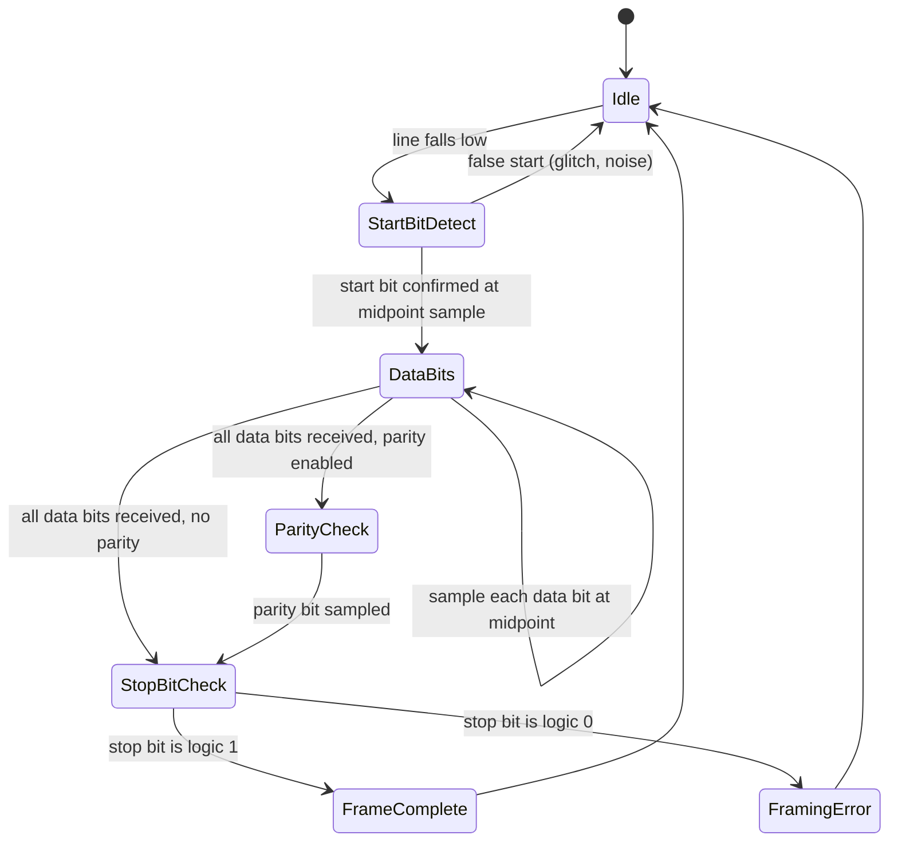

## UART Fundamentals and Framing

### Overview

A Universal Asynchronous Receiver/Transmitter (UART) is a hardware peripheral that converts data between parallel form (as used internally by a microcontroller's bus) and serial form (as transmitted over a wire), without requiring a shared clock signal between transmitter and receiver. "Asynchronous" refers to the absence of a dedicated clock line — timing is instead recovered by the receiver from the data stream itself, using a mutually agreed-upon baud rate and a defined frame structure that both sides must match exactly for correct communication.

### Why UART Is Used

UART remains one of the most widely used point-to-point serial interfaces in embedded systems because it requires minimal wiring (as few as two signal lines plus ground), is supported natively by nearly every microcontroller, and needs no shared clock line — unlike SPI, which requires a clock, or I2C, which requires clock and open-drain data lines with pull-ups. Its simplicity makes it the default choice for:

- Debug/console output and command-line interfaces during firmware development
- Communication with GPS modules, Bluetooth/Wi-Fi radio modules, and cellular modems
- Simple sensor-to-MCU or MCU-to-MCU links over short-to-moderate distances
- Legacy industrial and instrumentation equipment (often via RS-232 or RS-485 physical layers built on UART framing)

### Frame Structure

A UART frame is the fundamental unit of transmission, consisting of a fixed sequence of bit fields surrounding the data payload. Both transmitter and receiver must be configured identically for all frame parameters, since UART has no mechanism to negotiate or auto-detect configuration mid-transmission (autobaud detection exists in some peripherals but operates as a separate calibration step, not per-frame negotiation).

#### Frame Field Breakdown

| Field | Typical Size | Purpose |
| --- | --- | --- |
| Start bit | 1 bit, always logic 0 | Signals the beginning of a frame to the receiver; the idle line state is logic 1, so this falling edge is what the receiver's sampling logic detects |
| Data bits | 5–9 bits (8 is most common) | The actual payload byte (or partial byte) being transmitted |
| Parity bit | 0 or 1 bit (optional) | Basic error detection: even, odd, mark, or space parity |
| Stop bit(s) | 1, 1.5, or 2 bits, always logic 1 | Signals the end of the frame and guarantees a minimum idle period before the next start bit can be detected |

The complete frame is commonly described in shorthand as, for example, "8N1" — meaning 8 data bits, no parity, 1 stop bit — which is by far the most common configuration in embedded applications, though "8E1" (even parity) and other combinations appear in specific protocols or legacy equipment.

#### UART Frame Timing Diagram (svg_diagram)

<svg xmlns="http://www.w3.org/2000/svg" viewBox="0 0 780 260">
\<style\>
.lbl { font-family: monospace; font-size: 13px; fill: #1a1a1a; }
.small { font-family: monospace; font-size: 11px; fill: #444; }
.wire { stroke: #1a1a1a; stroke-width: 2; fill: none; }
.dash { stroke: #888; stroke-width: 1; stroke-dasharray: 3,3; fill: none; }
.title { font-family: monospace; font-size: 15px; fill: #000; font-weight: bold; }
\</style\>

<text x="390" y="24" text-anchor="middle" class="title">UART Frame: 8N1, Transmitting 0x55 (svg_diagram)</text>

<path class="wire" d="M40,80 L80,80" />

<path class="wire" d="M80,80 L80,140 L140,140" />

<path class="wire" d="M140,140 L140,80 L180,80" />
<path class="wire" d="M180,80 L180,140 L220,140" />
<path class="wire" d="M220,140 L220,80 L260,80" />
<path class="wire" d="M260,80 L260,140 L300,140" />
<path class="wire" d="M300,140 L300,80 L340,80" />
<path class="wire" d="M340,80 L340,140 L380,140" />
<path class="wire" d="M380,140 L380,80 L420,80" />
<path class="wire" d="M420,80 L420,140 L460,140" />

<path class="wire" d="M460,140 L460,80 L540,80" />

<text x="80" y="170" class="small">Start</text>

<text x="140" y="170" class="small">D0=1</text>

<text x="180" y="170" class="small">D1=0</text>

<text x="220" y="170" class="small">D2=1</text>

<text x="260" y="170" class="small">D3=0</text>

<text x="300" y="170" class="small">D4=1</text>

<text x="340" y="170" class="small">D5=0</text>

<text x="380" y="170" class="small">D6=1</text>

<text x="420" y="170" class="small">D7=0</text>

<text x="480" y="170" class="small">Stop</text>

<path class="dash" d="M40,200 L540,200" />
<text x="40" y="220" class="small">Line idles HIGH before start and after stop bit</text>
<text x="40" y="240" class="small">Bit sampled at midpoint of each bit period by receiver</text>
</svg>

### Baud Rate and Timing

Baud rate defines the number of signal transitions (bit periods) per second, and for UART's simple binary signaling, equals the bit rate in bits per second. Common standard rates include 9600, 19200, 38400, 57600, and 115200 bps, though any rate the hardware's baud generator can produce (within its resolution) is usable.

$$T_{bit} = \frac{1}{\text{baud rate}}$$

$$T_{frame} = T_{bit} \times (1 + N_{data} + N_{parity} + N_{stop})$$

For an 8N1 frame, each byte transmitted requires 10 bit periods (1 start + 8 data + 1 stop), giving an effective data throughput of baud rate ÷ 10 bytes per second, before accounting for any higher-layer protocol overhead.

#### Baud Rate Tolerance

Because the receiver has no shared clock and instead free-runs its own local oscillator to sample incoming bits, any mismatch between the transmitter's and receiver's actual bit rate accumulates error across the frame. The receiver typically samples near the center of each bit period (often using 16x oversampling internally) to maximize timing margin, but cumulative baud rate error must stay within a bounded tolerance — commonly cited as approximately ±2% to ±3% for standard 8N1 framing with 16x oversampling — or the receiver may sample the wrong bit value, particularly toward the later bits of a longer frame. Exact tolerable error depends on the specific UART peripheral's oversampling ratio and clock generation method, and should be verified against the target hardware's baud rate generator accuracy, especially when deriving the baud clock from an internal RC oscillator rather than a crystal. [Inference — the ±2-3% figure is a commonly cited engineering guideline, not a universal specification; margin varies with oversampling ratio, frame length, and clock source stability.]

### Parity and Basic Error Detection

Parity provides a minimal single-bit error detection mechanism, computed by the transmitter and checked by the receiver:

- **Even parity**: The parity bit is set so that the total number of logic-1 bits (data bits plus parity bit) is even.
- **Odd parity**: The parity bit is set so that the total number of logic-1 bits is odd.
- **Mark parity**: The parity bit is always fixed at logic 1, regardless of data content.
- **Space parity**: The parity bit is always fixed at logic 0.
- **No parity**: No parity bit is transmitted (most common in embedded applications, with error detection instead delegated to a higher-layer protocol checksum or CRC if needed).

Parity can only reliably detect an odd number of bit errors within the frame; it cannot detect even-numbered bit errors (e.g., two flipped bits canceling out in the parity calculation) and cannot correct any detected error, only flag it. Because of this limited coverage, most embedded protocols layered on top of UART (e.g., Modbus RTU, custom binary protocols) implement their own CRC or checksum at the application/protocol layer rather than relying on UART parity alone.

### Frame Reception State Machine

### Common Errors and Fault Conditions

- **Framing error**: The receiver expects a logic-1 stop bit at the end of the frame but samples a logic-0 instead, indicating the receiver's bit timing has drifted out of sync with the transmitter, or that the frame configuration (data bits/parity/stop bits) doesn't match between the two devices.
- **Parity error**: The received parity bit doesn't match the parity computed from the received data bits, indicating either a genuine bit error during transmission or a parity configuration mismatch between transmitter and receiver.
- **Overrun error**: The receiver's hardware or software buffer was not read quickly enough before the next frame arrived, causing the new frame's data to overwrite the unread previous data. This is a firmware/software timing issue rather than a signal integrity issue, and is typically resolved by servicing the UART receive interrupt or DMA transfer promptly, or by enabling hardware flow control.
- **Break condition**: A special signaling state where the line is held low for longer than a full frame period (longer than start bit + data + stop), used by some protocols as an out-of-band signal (e.g., to request autobaud detection or signal a reset condition) distinct from normal framing errors.

### Flow Control

Because UART has no inherent mechanism to pause a transmitter when a receiver's buffer is full, flow control is added at the physical or protocol layer for links where buffer overrun is a concern:

- **Hardware flow control (RTS/CTS)**: Two additional signal lines — Request To Send and Clear To Send — allow the receiver to deassert CTS to signal the transmitter to pause, and reassert it when ready to receive more data. Requires two extra GPIO pins beyond the basic TX/RX pair.
- **Software flow control (XON/XOFF)**: Special control characters transmitted in-band on the same data line to signal pause/resume, avoiding extra wiring at the cost of consuming those character codes from the usable data space and adding latency (the pause request must itself be received and processed).
- **No flow control**: Common in embedded links where buffer sizing and firmware servicing latency are known and controlled well enough that overrun is not a practical risk, or where the protocol design tolerates occasional data loss.

### Physical Layer Variants

Note that UART itself refers to the framing and timing protocol; the electrical signaling standard is a separate, layered consideration:

- **TTL/CMOS-level UART**: Direct logic-level signaling (e.g., 0–3.3V or 0–5V) between chips on the same board or closely connected boards, most common for MCU-to-MCU or MCU-to-module links.
- **RS-232**: Defines inverted logic levels (traditionally ±3V to ±15V) and connector/handshaking conventions for longer-distance or legacy equipment links, requiring a level-shifting transceiver IC between the MCU's UART peripheral and the RS-232 line.
- **RS-485**: A differential signaling standard supporting multi-drop bus topologies and longer cable runs with better noise immunity than single-ended TTL or RS-232, commonly used in industrial fieldbus applications (e.g., Modbus RTU), also requiring a dedicated transceiver IC.

### Firmware-Side Considerations

- **Interrupt-driven vs. polled reception**: Polling the UART status register in a tight loop wastes CPU cycles and risks missing data if other code delays the poll; interrupt-driven reception (or DMA-based reception for higher throughput) is standard practice for anything beyond simple debug console use.
- **Ring buffer implementation**: Received bytes are typically pushed into a circular buffer by the receive interrupt handler, with the main application loop consuming from the buffer asynchronously, decoupling reception timing from application processing timing.
- **Baud rate register calculation**: The baud rate generator divides down a peripheral clock to produce the target baud rate; the achievable baud rate is quantized by the divider's integer (or fractional) resolution, and firmware should verify the actual generated rate's deviation from the target rate falls within tolerance, particularly at higher baud rates or with certain peripheral clock frequencies that don't divide evenly.
- **Timeout handling for variable-length frames**: Since UART itself has no built-in "end of message" concept beyond the stop bit of each byte, protocols using variable-length messages over UART commonly implement an inter-byte timeout (no new byte received within N bit periods implies the message is complete) or an explicit length/terminator field within the application protocol.

### Related Topics

- SPI protocol fundamentals and clock-synchronous framing
- I2C protocol fundamentals and multi-master bus arbitration
- RS-485 differential signaling and multi-drop bus design
- CRC and checksum algorithms for application-layer error detection
- DMA-driven UART reception for high-throughput links
- Modbus RTU protocol structure over RS-485/UART
- Autobaud detection techniques in UART peripherals