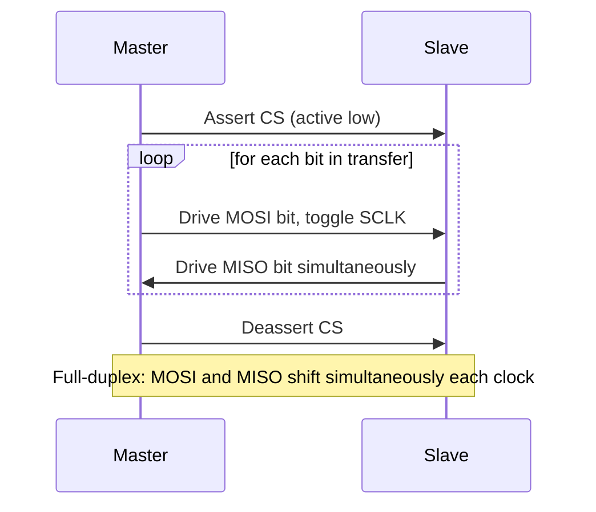

## SPI Protocol and Multi-Device Configurations

### Overview

Serial Peripheral Interface (SPI) is a synchronous, full-duplex, master-driven serial communication protocol using a shared clock line to time data transfer between a controller (master) and one or more peripheral (slave) devices. Unlike UART, SPI requires an explicit clock signal generated by the master, eliminating baud rate matching and drift concerns, and unlike I2C, it uses dedicated data lines for each direction rather than a single shared bidirectional line, enabling higher achievable throughput at the cost of more pins.

### Signal Lines

A standard SPI bus uses four signal lines, though naming conventions vary by vendor and generation:

| Signal | Common Alternate Names | Function |
| --- | --- | --- |
| SCLK | SCK, CLK | Serial clock, always driven by the master |
| MOSI | SDO (master), COPI | Master Out Slave In — data from master to slave |
| MISO | SDI (master), CIPO | Master In Slave Out — data from slave to master |
| SS / CS | nCS, CSB, chip select | Slave/Chip Select — identifies which slave is active; typically active-low |

Note that newer documentation increasingly uses COPI (Controller Out Peripheral In) and CIPO (Controller In Peripheral Out) in place of MOSI/MISO, reflecting a broader industry shift away from master/slave terminology; both naming schemes refer to the same physical signals and functional roles. [Unverified — terminology adoption varies by vendor and datasheet vintage, so both naming conventions should be expected in practice.]

### Basic Operation

SPI is a shift-register-based protocol: the master and slave each contain a shift register, and the two registers are effectively connected in a ring through MOSI and MISO. On each clock pulse, both devices simultaneously shift one bit out and one bit in, meaning a full-duplex transfer occurs on every clock cycle regardless of whether the application logically needs data flowing in both directions.

$$f_{SCLK} \leq \min(f_{master,max}, f_{slave,max}, f_{bus,max})$$

The maximum usable clock frequency is bounded by the slowest device on the bus and by signal integrity limits of the physical bus (trace length, capacitance, number of devices), not solely by the master's peripheral clock capability.

#### SPI Full-Duplex Shift Register Exchange (svg_diagram)

<svg xmlns="http://www.w3.org/2000/svg" viewBox="0 0 720 320">
\<style\>
.lbl { font-family: monospace; font-size: 13px; fill: #1a1a1a; }
.small { font-family: monospace; font-size: 11px; fill: #444; }
.box { fill: none; stroke: #1a1a1a; stroke-width: 1.5; }
.wire { stroke: #1a1a1a; stroke-width: 1.5; fill: none; }
.title { font-family: monospace; font-size: 15px; fill: #000; font-weight: bold; }
\</style\>

<text x="360" y="24" text-anchor="middle" class="title">SPI Shift Register Ring (svg_diagram)</text>

<rect x="60" y="100" width="200" height="70" class="box" />
<text x="80" y="130" class="lbl">Master</text>
<text x="80" y="150" class="small">Shift Register</text>
<rect x="460" y="100" width="200" height="70" class="box" />
<text x="480" y="130" class="lbl">Slave</text>
<text x="480" y="150" class="small">Shift Register</text>
<path class="wire" d="M260,120 L460,120" />
<text x="300" y="112" class="small">MOSI -&gt;</text>
<path class="wire" d="M460,150 L260,150" />
<text x="300" y="168" class="small">&lt;- MISO</text>
<path class="wire" d="M60,90 L460,90 L460,100" />
<text x="200" y="85" class="small">SCLK (master-driven, shared)</text>
<path class="wire" d="M60,180 L460,180 L460,170" />
<text x="200" y="200" class="small">CS (master-driven, per-slave)</text>
</svg>

### Clock Polarity and Phase (SPI Modes)

SPI defines four operating modes based on two configuration bits: Clock Polarity (CPOL) and Clock Phase (CPHA). Both master and slave must be configured to the same mode for correct communication, since these settings determine the idle clock state and precisely which clock edge is used to sample versus shift data.

| Mode | CPOL | CPHA | Clock Idle State | Data Sampled On |
| --- | --- | --- | --- | --- |
| 0 | 0 | 0 | Low | Rising edge (leading) |
| 1 | 0 | 1 | Low | Falling edge (trailing) |
| 2 | 1 | 0 | High | Falling edge (leading) |
| 3 | 1 | 1 | High | Rising edge (trailing) |

Mode 0 is the most commonly used default across many devices, but this is not universal — many sensor and memory ICs specify a particular required mode in their datasheet, and mismatched mode configuration is one of the most common causes of SPI communication failure during bring-up, since a wrong mode typically produces plausible-looking but scrambled or shifted data rather than an obvious error.

#### SPI Clock Modes Timing (svg_diagram)

<svg xmlns="http://www.w3.org/2000/svg" viewBox="0 0 760 380">
\<style\>
.lbl { font-family: monospace; font-size: 13px; fill: #1a1a1a; }
.small { font-family: monospace; font-size: 10px; fill: #444; }
.wire { stroke: #1a1a1a; stroke-width: 1.8; fill: none; }
.dash { stroke: #888; stroke-width: 1; stroke-dasharray: 3,3; fill: none; }
.title { font-family: monospace; font-size: 15px; fill: #000; font-weight: bold; }
\</style\>

<text x="380" y="20" text-anchor="middle" class="title">SPI Modes 0-3 Clock Timing (svg_diagram)</text>

<text x="20" y="55" class="lbl">Mode 0</text>

<path class="wire" d="M120,60 L160,60 L160,40 L220,40 L220,60 L280,60 L280,40 L340,40 L340,60 L400,60" />

<circle cx="160" cy="40" r="3" fill="`#1a1a1a`" />

<circle cx="280" cy="40" r="3" fill="`#1a1a1a`" />

<text x="410" y="50" class="small">idle LOW, sample rising</text>

<text x="20" y="115" class="lbl">Mode 1</text>

<path class="wire" d="M120,120 L160,120 L160,100 L220,100 L220,120 L280,120 L280,100 L340,100 L340,120 L400,120" />

<circle cx="220" cy="120" r="3" fill="`#1a1a1a`" />

<circle cx="340" cy="120" r="3" fill="`#1a1a1a`" />

<text x="410" y="110" class="small">idle LOW, sample falling</text>

<text x="20" y="175" class="lbl">Mode 2</text>

<path class="wire" d="M120,160 L160,160 L160,180 L220,180 L220,160 L280,160 L280,180 L340,180 L340,160 L400,160" />

<circle cx="160" cy="180" r="3" fill="`#1a1a1a`" />

<circle cx="280" cy="180" r="3" fill="`#1a1a1a`" />

<text x="410" y="175" class="small">idle HIGH, sample falling</text>

<text x="20" y="235" class="lbl">Mode 3</text>

<path class="wire" d="M120,220 L160,220 L160,240 L220,240 L220,220 L280,220 L280,240 L340,240 L340,220 L400,220" />

<circle cx="220" cy="220" r="3" fill="`#1a1a1a`" />

<circle cx="340" cy="220" r="3" fill="`#1a1a1a`" />

<text x="410" y="230" class="small">idle HIGH, sample rising</text>

<text x="380" y="300" class="small" text-anchor="middle">Filled dots mark the clock edge used for data sampling in each mode</text>

</svg>

### Multi-Device Bus Configurations

#### Independent Chip Select (Star Topology)

The standard multi-slave configuration: SCLK, MOSI, and MISO are shared across all slaves on the bus, but each slave has its own dedicated CS line driven independently by the master. Only the slave with its CS asserted responds on MISO; all other slaves must place their MISO output in a high-impedance state when deselected, since MISO is a shared, single-driver-at-a-time bus line.

$$N_{CS\ pins} = N_{slaves}$$

This is the most common configuration for MCUs with a handful of SPI peripherals (sensors, memory, ADCs), since it requires no special addressing logic and each device can use full-speed, full-duplex communication independently — but it scales linearly in required master GPIO pins, which becomes a limiting factor as slave count grows.

#### Independent Chip Select Topology (svg_diagram)

<svg xmlns="http://www.w3.org/2000/svg" viewBox="0 0 700 340">
\<style\>
.lbl { font-family: monospace; font-size: 13px; fill: #1a1a1a; }
.small { font-family: monospace; font-size: 11px; fill: #444; }
.box { fill: none; stroke: #1a1a1a; stroke-width: 1.5; }
.wire { stroke: #1a1a1a; stroke-width: 1.5; fill: none; }
.title { font-family: monospace; font-size: 15px; fill: #000; font-weight: bold; }
\</style\>

<text x="350" y="20" text-anchor="middle" class="title">SPI Independent Chip Select Bus (svg_diagram)</text>

<rect x="30" y="130" width="120" height="80" class="box" />
<text x="45" y="175" class="lbl">Master</text>
<rect x="400" y="40" width="120" height="60" class="box" />
<text x="415" y="75" class="small">Slave 0</text>
<rect x="400" y="140" width="120" height="60" class="box" />
<text x="415" y="175" class="small">Slave 1</text>
<rect x="400" y="240" width="120" height="60" class="box" />
<text x="415" y="275" class="small">Slave 2</text>
<path class="wire" d="M150,150 L400,70" />
<path class="wire" d="M150,150 L400,170" />
<path class="wire" d="M150,150 L400,270" />
<text x="200" y="90" class="small">CS0</text>
<text x="200" y="150" class="small">CS1</text>
<text x="200" y="230" class="small">CS2</text>
<path class="wire" d="M150,170 L400,90" />
<path class="wire" d="M150,170 L400,190" />
<path class="wire" d="M150,170 L400,290" />
<text x="590" y="20" class="small">SCLK, MOSI, MISO shared across all slaves</text>
</svg>

#### Daisy-Chain Topology

Used primarily with devices explicitly designed for this mode (e.g., many shift-register-based LED drivers and some ADC/DAC families): each slave's MISO output feeds directly into the next slave's MOSI input, forming a single long shift register spanning all devices, with a single shared CS line for the entire chain. The master shifts out data for all devices in one combined transaction, and data "ripples" through the chain over successive clock cycles.

This configuration uses only one CS line regardless of chain length, but requires shifting through the entire chain for every transaction (even to address just one device), increasing per-transaction latency as the chain grows, and requires all devices in the chain to support this specific daisy-chain shift mode — it is not a universal SPI feature and must be explicit in each device's design.

#### Daisy-Chain Topology (svg_diagram)

<svg xmlns="http://www.w3.org/2000/svg" viewBox="0 0 700 220">
\<style\>
.lbl { font-family: monospace; font-size: 13px; fill: #1a1a1a; }
.small { font-family: monospace; font-size: 11px; fill: #444; }
.box { fill: none; stroke: #1a1a1a; stroke-width: 1.5; }
.wire { stroke: #1a1a1a; stroke-width: 1.5; fill: none; }
.title { font-family: monospace; font-size: 15px; fill: #000; font-weight: bold; }
\</style\>

<text x="350" y="20" text-anchor="middle" class="title">SPI Daisy-Chain Topology (svg_diagram)</text>

<rect x="20" y="80" width="100" height="60" class="box" />
<text x="35" y="115" class="lbl">Master</text>
<rect x="220" y="80" width="100" height="60" class="box" />
<text x="235" y="115" class="small">Slave 0</text>
<rect x="420" y="80" width="100" height="60" class="box" />
<text x="435" y="115" class="small">Slave 1</text>
<rect x="610" y="80" width="70" height="60" class="box" />
<text x="615" y="115" class="small">Slave 2</text>
<path class="wire" d="M120,100 L220,100" />
<path class="wire" d="M320,110 L420,100" />
<path class="wire" d="M520,110 L610,100" />
<text x="130" y="95" class="small">MOSI</text>
<text x="330" y="95" class="small">MISO-&gt;MOSI</text>
<text x="530" y="95" class="small">MISO-&gt;MOSI</text>
<path class="wire" d="M420,130 L320,130 L220,130 L120,130" />
<text x="180" y="150" class="small">MISO (final chain output back to master)</text>
<path class="wire" d="M70,80 L70,50 L650,50 L650,80" />
<text x="300" y="45" class="small">single shared CS</text>
</svg>

#### Multi-Master Considerations

SPI is not natively a multi-master arbitration protocol in the way I2C is — there is no built-in bus arbitration mechanism for two potential masters to negotiate control. Multi-master SPI topologies exist but require external logic (e.g., a shared bus-request/grant scheme, or software-coordinated mastership handoff) to avoid bus contention, and are considerably less common in embedded designs than single-master, multi-slave configurations.

### Data Transaction Structure

### Design and Signal Integrity Considerations

- **Clock frequency vs. trace length**: At higher SCLK frequencies, trace length mismatches between SCLK, MOSI, and MISO become significant relative to the bit period, and signal reflections from unterminated or long traces can cause data corruption; high-speed SPI designs may require controlled-impedance routing and termination.
- **CS setup and hold timing**: Devices typically require the CS line to be asserted for a minimum setup time before the first clock edge, and held asserted through a minimum hold time after the last clock edge, per the specific device's datasheet timing diagram.
- **Pull-up/pull-down on CS during MCU reset**: Since many slave devices interpret CS as active-low chip select, an unconfigured or floating CS pin during MCU boot/reset can inadvertently select a slave and cause bus contention with other slaves; external pull-ups (or MCU-internal pull-ups configured early in boot) are commonly used as a precaution.
- **MISO tri-state behavior verification**: When multiple slaves share MISO, each deselected slave must correctly tri-state its MISO driver; a device that fails to do so (due to a design flaw or incorrect configuration) will contend with the currently selected slave's output and corrupt the shared bus.

### Firmware-Side Considerations

- **Per-slave configuration structs**: Since different slaves on the same physical bus may require different SPI modes or clock speeds, firmware typically reconfigures peripheral registers (or uses a per-transaction configuration parameter, depending on the HAL/driver architecture) immediately before each slave's transaction.
- **DMA-driven transfers for bulk data**: For larger transfers (e.g., reading a block from SPI flash, or streaming ADC samples), DMA-based SPI transfer avoids CPU involvement in per-byte shifting, freeing the core for other tasks during the transfer.
- **CS assertion timing relative to peripheral enable**: Some HAL/driver implementations assert CS automatically as part of the transfer call; others require manual CS control via GPIO before and after invoking the SPI transfer function — this distinction affects how multi-byte or multi-register transactions are correctly framed as a single logical operation versus multiple separate ones.
- **Half-duplex and simplex driver modes**: Some SPI peripherals or use cases only need MOSI or MISO (e.g., a display that is write-only), and firmware/driver configuration should match the device's actual duplex requirement to avoid unnecessary pin usage or clocking overhead.

### Related Topics

- I2C protocol and multi-master bus arbitration
- SPI flash memory addressing and command structures
- Daisy-chain shift-register device families (LED drivers, expander ICs)
- Signal integrity and controlled-impedance routing for high-speed serial buses
- DMA-driven peripheral transfer architectures
- SPI mode determination from device datasheets and common misconfiguration pitfalls
- Chip select management strategies for large slave counts (GPIO expanders, decoders)