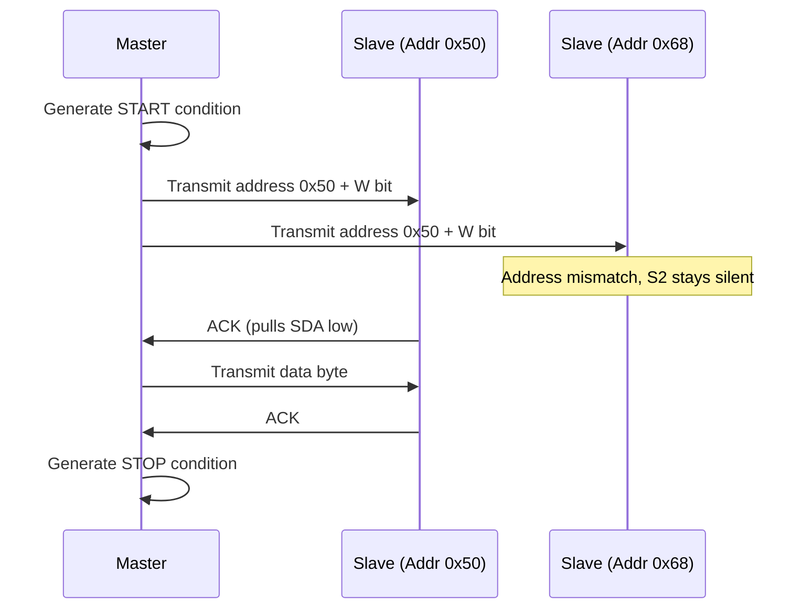

## I2C Protocol and Addressing

### Overview

Inter-Integrated Circuit (I2C) is a synchronous, multi-master, multi-slave serial communication protocol using only two shared bus lines — a clock (SCL) and a bidirectional data line (SDA) — both operating as open-drain with external pull-up resistors. This two-wire design allows many devices to share a single bus with minimal pin usage, at the cost of lower maximum throughput compared to SPI and additional protocol complexity for addressing and arbitration.

### Signal Lines and Electrical Characteristics

I2C uses exactly two signal lines plus a common ground reference:

| Signal | Function |
| --- | --- |
| SCL | Serial Clock — normally driven by the master, though slaves can stretch it |
| SDA | Serial Data — bidirectional, driven by whichever device is currently transmitting |

Both lines are open-drain (or open-collector in older implementations), meaning any device on the bus can only actively pull the line low; a device cannot actively drive the line high. Instead, external pull-up resistors (one per line, sized for the bus, not per device) passively pull each line back to the supply rail when no device is pulling it low. This open-drain structure is what enables both multi-master arbitration and clock stretching, described below.

$$R_{pullup} \approx \frac{V_{cc}}{I_{OL,max}} \text{ (lower bound)}, \quad R_{pullup} \leq \frac{t_r}{0.8473 \times C_{bus}} \text{ (upper bound, per I2C spec guidance)}$$

The pull-up value is a tradeoff: too large a resistance slows the rising edge (limited by bus capacitance), potentially violating timing requirements at higher bus speeds; too small a resistance increases current draw and heat when a line is held low, and may exceed a device's maximum sink current rating.

#### Open-Drain Bus Structure (svg_diagram)

<svg xmlns="http://www.w3.org/2000/svg" viewBox="0 0 700 320">
\<style\>
.lbl { font-family: monospace; font-size: 13px; fill: #1a1a1a; }
.small { font-family: monospace; font-size: 11px; fill: #444; }
.box { fill: none; stroke: #1a1a1a; stroke-width: 1.5; }
.wire { stroke: #1a1a1a; stroke-width: 1.5; fill: none; }
.title { font-family: monospace; font-size: 15px; fill: #000; font-weight: bold; }
\</style\>

<text x="350" y="20" text-anchor="middle" class="title">I2C Open-Drain Bus with Pull-Ups (svg_diagram)</text>

<text x="330" y="45" class="lbl">Vcc</text>

<path class="wire" d="M280,55 L280,80" />

<path class="wire" d="M380,55 L380,80" />

<rect x="265" y="80" width="30" height="40" class="box" />

<rect x="365" y="80" width="30" height="40" class="box" />

<text x="270" y="75" class="small">Rpu(SCL)</text>

<text x="365" y="75" class="small">Rpu(SDA)</text>

<path class="wire" d="M280,120 L280,260" />
<path class="wire" d="M380,120 L380,260" />
<text x="240" y="140" class="lbl">SCL</text>
<text x="390" y="140" class="lbl">SDA</text>
<rect x="40" y="160" width="140" height="60" class="box" />
<text x="55" y="195" class="small">Master (MCU)</text>
<path class="wire" d="M180,175 L280,175" />
<path class="wire" d="M180,200 L380,200" />
<rect x="480" y="140" width="140" height="60" class="box" />
<text x="495" y="175" class="small">Slave 1</text>
<path class="wire" d="M480,155 L280,155" />
<path class="wire" d="M480,180 L380,180" />
<rect x="480" y="230" width="140" height="60" class="box" />
<text x="495" y="265" class="small">Slave 2</text>
<path class="wire" d="M480,245 L280,245" />
<path class="wire" d="M480,270 L380,270" />

<text x="200" y="290" class="small">Any device pulls SCL/SDA low; pull-ups restore HIGH when released</text>

</svg>

### Frame Structure and Transaction Protocol

An I2C transaction begins with a START condition, followed by a 7-bit (or 10-bit) address plus a read/write bit, an acknowledgment phase, one or more data bytes each followed by acknowledgment, and concludes with a STOP condition.

#### START and STOP Conditions

Unlike normal data bits (which must only change while SCL is low), START and STOP conditions are defined precisely by SDA transitioning while SCL is high:

- **START**: SDA transitions from high to low while SCL is high.
- **STOP**: SDA transitions from low to high while SCL is high.
- **Repeated START**: A START condition issued without a preceding STOP, allowing the master to change transaction direction (e.g., switch from write to read) or address a different slave without releasing the bus — commonly used in register-read sequences (write register address, repeated start, read data).

#### Address and R/W Bit

Following START, the master transmits a 7-bit (standard) or 10-bit (extended addressing) slave address, most-significant-bit first, immediately followed by a single R/W bit indicating the direction of the subsequent data phase (0 = master writes to slave, 1 = master reads from slave).

$$N_{addressable\ devices,7-bit} = 2^7 = 128 \text{ (minus reserved addresses)}$$

Several address ranges in the 7-bit space are reserved by the I2C specification for special purposes (general call address, START byte, CBUS compatibility, high-speed mode master codes, and 10-bit addressing prefixes), reducing the practically usable address space slightly below the full 128.

#### Acknowledge (ACK/NACK)

After every 8 bits transmitted (whether address or data byte), the receiving device pulls SDA low during a dedicated 9th clock pulse to acknowledge (ACK) successful reception; leaving SDA high during this clock (allowing the pull-up to hold it high) signals a negative acknowledge (NACK), indicating either no device responded to that address, a data reception error, or (in a read transaction) that the master is intentionally ending the read after the final byte.

#### Complete I2C Write Transaction (svg_diagram)

<svg xmlns="http://www.w3.org/2000/svg" viewBox="0 0 780 220">
\<style\>
.lbl { font-family: monospace; font-size: 12px; fill: #1a1a1a; }
.small { font-family: monospace; font-size: 10px; fill: #444; }
.wire { stroke: #1a1a1a; stroke-width: 1.8; fill: none; }
.title { font-family: monospace; font-size: 15px; fill: #000; font-weight: bold; }
\</style\>

<text x="390" y="20" text-anchor="middle" class="title">I2C Write Transaction Sequence (svg_diagram)</text>

<rect x="20" y="60" width="70" height="30" fill="none" stroke="#1a1a1a" />
<text x="25" y="80" class="small">START</text>
<rect x="90" y="60" width="120" height="30" fill="none" stroke="#1a1a1a" />
<text x="100" y="80" class="small">7-bit ADDR</text>
<rect x="210" y="60" width="50" height="30" fill="none" stroke="#1a1a1a" />
<text x="215" y="80" class="small">W=0</text>
<rect x="260" y="60" width="50" height="30" fill="none" stroke="#1a1a1a" />
<text x="265" y="80" class="small">ACK</text>
<rect x="310" y="60" width="120" height="30" fill="none" stroke="#1a1a1a" />
<text x="320" y="80" class="small">REG ADDR</text>
<rect x="430" y="60" width="50" height="30" fill="none" stroke="#1a1a1a" />
<text x="435" y="80" class="small">ACK</text>
<rect x="480" y="60" width="120" height="30" fill="none" stroke="#1a1a1a" />
<text x="490" y="80" class="small">DATA BYTE</text>
<rect x="600" y="60" width="50" height="30" fill="none" stroke="#1a1a1a" />
<text x="605" y="80" class="small">ACK</text>
<rect x="650" y="60" width="70" height="30" fill="none" stroke="#1a1a1a" />
<text x="655" y="80" class="small">STOP</text>

<text x="20" y="120" class="lbl">Master drives:</text>

<text x="20" y="140" class="small">START, ADDR, W bit, REG ADDR, DATA — releases SDA during each ACK slot</text>

<text x="20" y="170" class="lbl">Slave drives:</text>

<text x="20" y="190" class="small">Pulls SDA low during each ACK slot to confirm receipt</text>

</svg>

### Addressing Details

#### 7-Bit vs. 10-Bit Addressing

Standard I2C addressing uses 7 bits, giving up to 128 possible addresses (minus reserved ranges). The 10-bit addressing extension, signaled by a reserved prefix pattern in the first address byte, allows up to 1024 addresses for applications with a very large number of I2C devices sharing a bus, though 10-bit addressing is considerably less common in typical embedded sensor/peripheral designs than 7-bit.

#### Address Conflicts and Resolution Strategies

A common practical problem: multiple instances of the same sensor or peripheral IC on one bus (e.g., two identical accelerometers) will have the same fixed or default address, causing a conflict since I2C has no built-in mechanism to distinguish two devices sharing an address. Standard resolution strategies include:

- **Address pin strapping**: Many I2C devices expose one or more address-select pins (e.g., ADDR0, ADDR1) that can be tied high, low, or to a specific voltage divider to select among a small set of possible addresses (commonly 2, 4, or 8 options).
- **Multiple I2C bus segments**: Using more than one physical I2C peripheral on the MCU (if available) or a bus multiplexer/switch IC to place conflicting devices on electrically separate bus segments.
- **I2C bus multiplexer/switch ICs**: A dedicated switch IC (addressable itself at a fixed address) that connects the master to one of several downstream bus segments under software control, allowing many identical devices to coexist by activating only one segment at a time.
- **Software-assigned addressing via GPIO reset sequencing**: Some device families support a one-time address-programming sequence, where devices are brought out of reset sequentially (via separate GPIO reset lines) and each is individually commanded to adopt a unique address before the next is released — used in some LED driver and sensor array designs.

### Multi-Master Arbitration

I2C is natively designed to support multiple master devices sharing one bus, using a non-destructive bitwise arbitration scheme built on the open-drain bus structure:

- Each master, while transmitting, simultaneously monitors the actual SDA line state.
- If a master drives SDA high (releases it) but observes the line is actually low (because another master pulled it low), that master recognizes it has lost arbitration and immediately stops driving, backing off to let the other master continue uncontested.
- Because a dominant "0" always wins over a released "1" on an open-drain line, arbitration naturally favors the master transmitting the lowest address value bit pattern in case of simultaneous transmission, and no data is corrupted in the process — the losing master simply retries later.

This differs fundamentally from SPI, which has no native multi-master arbitration and requires external coordination logic if multiple masters are needed.

### Clock Stretching

Because SCL is also open-drain, a slave device can hold SCL low after the master releases it, delaying the next clock pulse — this is clock stretching, used by slower slave devices (e.g., those with internal processing delay before they can respond, such as a sensor still completing an ADC conversion) to pause the bus without violating protocol timing. The master must support and correctly handle clock stretching by monitoring the actual SCL line state before proceeding, rather than assuming the clock resumes at a fixed rate; not all master implementations handle this correctly, particularly some simplified bit-banged I2C implementations. [Inference — clock stretching support varies by hardware I2C peripheral and by software/bit-banged implementation quality, and should be verified for the specific MCU peripheral in use.]

### Bus Speed Modes

| Mode | Maximum Clock Rate |
| --- | --- |
| Standard mode | 100 kHz |
| Fast mode | 400 kHz |
| Fast mode plus | 1 MHz |
| High-speed mode | 3.4 MHz |
| Ultra-fast mode | 5 MHz (unidirectional, push-pull, no arbitration) |

Higher speed modes generally require correspondingly lower pull-up resistance (to meet rise-time requirements against bus capacitance) and tighter control of bus capacitance (shorter traces, fewer devices, careful PCB layout), and not all devices on a shared bus necessarily support the higher speed grades — the bus must be operated at the lowest maximum speed supported by any device sharing it.

### I2C Transaction and Arbitration Flow

### Design and Signal Integrity Considerations

- **Bus capacitance limits**: The I2C specification defines a maximum total bus capacitance (400 pF for standard/fast mode) which limits practical bus length and device count; exceeding this without compensating (e.g., with an active bus buffer IC) risks rise-time violations at the target speed.
- **Pull-up resistor sizing tradeoffs**: As covered above, sizing must satisfy both the rise-time upper bound and the sink-current lower bound simultaneously; a single pull-up pair is normally used per bus segment, not one per device.
- **Level-shifting for mixed-voltage buses**: Devices operating at different logic voltages (e.g., a 1.8V sensor and a 3.3V MCU) sharing a bus require a bidirectional level-shifting circuit, commonly a MOSTFET-based translator exploiting the open-drain nature of I2C.
- **Ground bounce and long cable runs**: I2C was designed primarily for on-board or short inter-board connections; long cable runs increase susceptibility to noise and ground potential differences, and are generally not recommended without additional buffering/isolation compared to differential alternatives like RS-485.

### Firmware-Side Considerations

- **Bus recovery from stuck slave**: If a slave device holds SDA low indefinitely (e.g., due to a fault or power-cycle timing mismatch mid-transaction), the bus can become permanently stuck since a normal STOP condition cannot be generated with SDA held low; firmware bus-recovery routines typically involve manually clocking SCL a fixed number of times to force the stuck slave to release SDA, followed by an explicit STOP condition.
- **Timeout handling for ACK polling**: Many I2C-based memory devices (EEPROMs in particular) use ACK polling after a write cycle to signal write-completion busy status; firmware must implement a bounded retry/timeout rather than polling indefinitely, to handle a genuinely faulty or absent device gracefully.
- **Register read/write abstraction layers**: Because most I2C peripheral communication follows a consistent write-register-address-then-read/write-data pattern, firmware commonly implements a thin driver abstraction (read_register, write_register, read_burst) built on top of the raw I2C transaction primitives, rather than hand-coding each transaction inline.
- **Interrupt vs. polled transaction completion**: Similar to SPI and UART, I2C peripheral drivers can be implemented as blocking/polled, interrupt-driven, or DMA-driven, with the choice affecting CPU availability during transactions, particularly relevant given I2C's comparatively slower throughput versus SPI.

### Related Topics

- SPI protocol and multi-device configurations
- I2C bus multiplexer and switch IC architectures (e.g., addressable segment switching)
- Level-shifting circuits for mixed-voltage I2C buses
- Bus recovery and stuck-bus fault handling routines
- SMBus and PMBus as I2C-derived protocols with additional timing/reliability constraints
- EEPROM and sensor register-map driver abstraction design
- Differential bus alternatives (RS-485, CAN) for longer or noisier interconnects