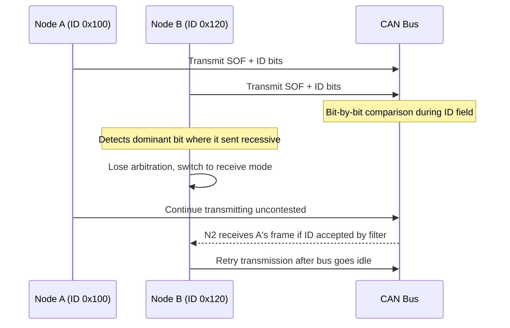

## CAN Bus Fundamentals

### Overview

Controller Area Network (CAN) is a robust, differential, multi-master serial bus protocol originally developed for automotive applications and now widely used across industrial, aerospace, and general embedded systems wherever reliable communication in electrically noisy environments is required. Unlike I2C or SPI, CAN is message-based rather than address-based: nodes broadcast messages identified by a message ID rather than addressing a specific recipient, and any node on the bus can receive any message it chooses to accept based on that ID.

### Physical Layer

#### Differential Signaling

CAN uses two signal lines, CAN_H and CAN_L, driven differentially rather than single-ended. Data is encoded as the voltage difference between the two lines rather than either line's absolute voltage relative to ground, which is what gives CAN its strong immunity to common-mode noise — electrical interference that affects both lines equally cancels out in the differential measurement.

$$V_{diff} = V_{CAN\_H} - V_{CAN\_L}$$

Two logical bus states are defined:

- **Recessive state**: Both lines rest near a common voltage (typically ~2.5V on each line for High-Speed CAN), giving a differential voltage near 0V. This represents a logical "1" and is the passive, undriven bus state.
- **Dominant state**: CAN_H is actively driven higher and CAN_L actively driven lower (typically ~3.5V and ~1.5V respectively for High-Speed CAN), giving a differential voltage of roughly 2V. This represents a logical "0" and is actively driven by any transmitting node.

Similar to I2C's open-drain wired-AND behavior, CAN's dominant/recessive scheme means any node driving dominant overrides all nodes attempting recessive — this is the electrical foundation for CAN's non-destructive arbitration, described below.

#### CAN Differential Bus Levels (svg_diagram)

<svg xmlns="http://www.w3.org/2000/svg" viewBox="0 0 700 300">
\<style\>
.lbl { font-family: monospace; font-size: 13px; fill: #1a1a1a; }
.small { font-family: monospace; font-size: 11px; fill: #444; }
.wire { stroke: #1a1a1a; stroke-width: 2; fill: none; }
.dash { stroke: #888; stroke-width: 1; stroke-dasharray: 3,3; fill: none; }
.title { font-family: monospace; font-size: 15px; fill: #000; font-weight: bold; }
\</style\>

<text x="350" y="20" text-anchor="middle" class="title">CAN Differential Signaling: Recessive vs Dominant (svg_diagram)</text>

<text x="20" y="60" class="lbl">CAN_H</text>

<path class="wire" d="M100,80 L200,80 L200,50 L340,50 L340,80 L440,80" />

<text x="20" y="130" class="lbl">CAN_L</text>

<path class="wire" d="M100,110 L200,110 L200,140 L340,140 L340,110 L440,110" />

<path class="dash" d="M150,40 L150,180" />
<path class="dash" d="M270,40 L270,180" />
<path class="dash" d="M390,40 L390,180" />

<text x="120" y="200" class="small">recessive</text>

<text x="235" y="200" class="small">dominant</text>

<text x="360" y="200" class="small">recessive</text>

<text x="20" y="240" class="small">Recessive: both lines ~2.5V, Vdiff ~= 0V (logic 1, bus idle/undriven)</text>

<text x="20" y="260" class="small">Dominant: CAN_H ~3.5V, CAN_L ~1.5V, Vdiff ~= 2V (logic 0, actively driven)</text>

</svg>

#### Termination

A CAN bus must be terminated at each physical end of the bus with a 120-ohm resistor between CAN_H and CAN_L, matching the characteristic impedance of standard twisted-pair CAN cable. Correct termination (exactly two termination points, one at each physical end, not one per node) is necessary to prevent signal reflections that corrupt data at higher bit rates or longer bus lengths; missing or excessive termination is a common practical fault during CAN network bring-up.

### Message Frame Structure

CAN defines four frame types — data, remote, error, and overload frames — with the data frame being the primary carrier of application information.

#### Standard (11-bit) vs. Extended (29-bit) Identifier

| Field | Standard (CAN 2.0A) | Extended (CAN 2.0B) |
| --- | --- | --- |
| Identifier length | 11 bits | 29 bits |
| Addressable message IDs | 2048 | ~537 million |
| Common usage | Automotive, industrial legacy | Automotive OEM-specific, J1939, larger ID spaces |

Both identifier lengths can coexist on the same physical bus if the controller hardware supports mixed-format reception, though a given message is transmitted as either standard or extended, not a mix.

#### Data Frame Fields

| Field | Approximate Size | Purpose |
| --- | --- | --- |
| Start of Frame (SOF) | 1 bit | Dominant bit signaling frame start, synchronizes all nodes |
| Identifier | 11 or 29 bits | Message ID, also determines arbitration priority |
| RTR/SRR | 1 bit | Distinguishes data frame (dominant) from remote frame request (recessive) |
| Control field | 6 bits | Includes Data Length Code (DLC) specifying payload byte count (0-8) |
| Data field | 0-64 bits (0-8 bytes) | The actual payload |
| CRC field | 15 bits + delimiter | Cyclic redundancy check for error detection |
| ACK field | 2 bits | Any receiving node that correctly receives the frame asserts dominant here |
| End of Frame (EOF) | 7 bits | Sequence of recessive bits marking frame end |

Classic CAN limits the data payload to a maximum of 8 bytes per frame — a deliberate design constraint favoring low latency and bounded transmission time over throughput, appropriate for the small, frequent control messages typical of automotive and industrial control applications. CAN FD (Flexible Data-rate), a later extension, increases the maximum payload to 64 bytes and allows a faster bit rate during the data phase, but is a distinct capability requiring CAN FD-compatible controllers and transceivers on all nodes sharing that capability.

#### CAN Data Frame Structure (svg_diagram)

<svg xmlns="http://www.w3.org/2000/svg" viewBox="0 0 780 200">
\<style\>
.lbl { font-family: monospace; font-size: 11px; fill: #1a1a1a; }
.small { font-family: monospace; font-size: 10px; fill: #444; }
.box { fill: none; stroke: #1a1a1a; stroke-width: 1.5; }
.title { font-family: monospace; font-size: 15px; fill: #000; font-weight: bold; }
\</style\>

<text x="390" y="20" text-anchor="middle" class="title">CAN 2.0A Data Frame Layout (svg_diagram)</text>

<rect x="20" y="60" width="40" height="40" class="box" /><text x="22" y="115" class="small">SOF</text>

<rect x="60" y="60" width="110" height="40" class="box" /><text x="65" y="115" class="small">ID (11b)</text>

<rect x="170" y="60" width="30" height="40" class="box" /><text x="172" y="115" class="small">RTR</text>

<rect x="200" y="60" width="60" height="40" class="box" /><text x="202" y="115" class="small">Control/DLC</text>

<rect x="260" y="60" width="160" height="40" class="box" /><text x="265" y="115" class="small">Data (0-8 bytes)</text>

<rect x="420" y="60" width="110" height="40" class="box" /><text x="425" y="115" class="small">CRC (15b)</text>

<rect x="530" y="60" width="50" height="40" class="box" /><text x="532" y="115" class="small">ACK</text>

<rect x="580" y="60" width="90" height="40" class="box" /><text x="585" y="115" class="small">EOF (7b)</text>

<text x="390" y="150" class="small" text-anchor="middle">Identifier field doubles as arbitration priority: lower ID = higher priority</text>

</svg>

### Arbitration and Bus Access

CAN uses a non-destructive, priority-based arbitration scheme conceptually similar to I2C's, but applied to every single message transmission rather than only to simultaneous transaction starts.

#### CSMA/CD with Bitwise Arbitration

When multiple nodes attempt to transmit simultaneously, each transmits its identifier bit by bit while monitoring the actual bus state:

1. All contending nodes begin transmitting their SOF and identifier bits in sync (CAN nodes synchronize to bus edges).
2. At each bit position, a node transmitting recessive (1) that observes the bus is actually dominant (0) — because another node is transmitting dominant at that position — immediately loses arbitration and stops transmitting, switching to receive mode for the remainder of that frame.
3. The node transmitting the lowest numerical identifier value wins arbitration, since more leading zero bits in the ID field means that node holds dominant for longer without needing to yield.
4. Arbitration is lossless: the winning node's message transmits without interruption or corruption, and losing nodes automatically retry once the bus is free.

This means, distinctively, that CAN identifier values function simultaneously as message identity and as fixed transmission priority — a design implication that must be considered when assigning message IDs during system design, since the lowest-ID messages will always win contention against higher-ID messages, making ID assignment a priority-engineering decision, not merely a labeling one.

#### Arbitration Priority Flow

### Error Detection and Fault Confinement

CAN includes extensive built-in error detection, considerably more elaborate than the single-parity-bit approach of UART:

- **Bit monitoring**: Every transmitting node reads back the bus state after each bit it sends and flags a bit error if the observed state doesn't match what it intended to send (outside of expected arbitration loss or ACK slot behavior).
- **CRC check**: Each receiving node computes its own CRC over the received frame and compares it against the transmitted CRC field, flagging a CRC error on mismatch.
- **Frame check**: Fixed-format fields (like certain delimiter bits, which must always be recessive) are checked for correct value, flagging a form error if violated.
- **ACK check**: The transmitting node checks that at least one receiving node asserted dominant in the ACK slot; if no node acknowledges, an ACK error is flagged, since a properly functioning bus should have at least one listener.
- **Bit-stuffing check**: To ensure adequate edge density for clock synchronization, CAN inserts a stuff bit of opposite polarity after five consecutive identical bits in the transmitted stream; a stuff error is flagged if six consecutive identical bits appear where a stuff bit was expected.

#### Fault Confinement States

CAN nodes maintain internal error counters and transition through defined states to isolate persistently faulty nodes from disrupting the bus for well-behaved nodes:

- **Error-active**: Normal operating state; a node actively participates in error signaling (transmits active error frames) when it detects a fault.
- **Error-passive**: Entered when a node's transmit or receive error counter exceeds a defined threshold (128 in the base CAN specification); the node continues to participate but signals errors more passively (passive error frames) and must wait longer before retransmitting, reducing its ability to disrupt the bus.
- **Bus-off**: Entered when the transmit error counter exceeds a higher threshold (256 in the base CAN specification); the node disconnects entirely from bus transmission, requiring an explicit recovery sequence (per the CAN specification, monitoring 128 occurrences of 11 consecutive recessive bits) before it may attempt to rejoin.

This graduated fault-confinement mechanism is a defining feature of CAN's robustness for safety- and reliability-relevant applications: a single malfunctioning node is progressively isolated rather than being permitted to indefinitely corrupt bus traffic for all other nodes.

### Common Bus Speeds and Length Tradeoffs

| Bit Rate | Approximate Maximum Bus Length |
| --- | --- |
| 1 Mbit/s | ~40 m |
| 500 kbit/s | ~100 m |
| 250 kbit/s | ~250 m |
| 125 kbit/s | ~500 m |

These figures are commonly cited approximate guidelines rather than fixed physical constants — actual achievable length at a given bit rate depends on cable characteristics, transceiver propagation delay, and node count, and should be validated against the specific transceiver and cable specifications for a given design rather than assumed universally. [Inference — exact length limits vary by transceiver part, cable type, and topology, and the table values represent commonly referenced approximations rather than a fixed specification.]

### Common Higher-Layer Protocols Built on CAN

Base CAN defines only the physical and data-link layers; application-level meaning (what a given message ID and payload actually represent) is defined by a higher-layer protocol layered on top:

- **J1939**: Widely used in heavy-duty vehicles (trucks, agricultural, construction equipment), defining standardized parameter groups and extended (29-bit) identifiers.
- **CANopen**: Common in industrial automation and machinery, defining object dictionaries and standardized device profiles.
- **OBD-II (via CAN)**: Standardized vehicle diagnostics protocol, with CAN as one of its permitted physical/data-link implementations in modern vehicles.

### Firmware-Side Considerations

- **Message filtering configuration**: CAN controller hardware typically includes ID-based acceptance filters so the controller only interrupts the CPU for messages of interest, rather than requiring firmware to inspect and discard every message on the bus in software.
- **Bus-off recovery handling**: Firmware should monitor the CAN controller's error state register and implement (or rely on hardware auto-recovery, if supported) the bus-off recovery sequence, since a node that silently remains in bus-off after a transient fault will appear to have failed even though the underlying condition may have cleared.
- **Message ID and priority planning**: Because identifier value directly determines arbitration priority, system-level message ID assignment should be planned deliberately around real-time requirements — safety-critical, low-latency messages assigned lower IDs, less time-critical telemetry assigned higher IDs.
- **DLC and payload validation**: Firmware receiving CAN frames should validate the declared Data Length Code against expected message definitions, since a malformed or unexpected DLC value for a given ID may indicate a bus fault, misconfigured node, or protocol version mismatch.

### Related Topics

- CAN FD (Flexible Data-Rate) extended payload and dual bit-rate operation
- J1939 and CANopen higher-layer protocol structures
- CAN transceiver IC selection and termination network design
- Bit-stuffing and synchronization mechanisms in differential serial buses
- Fault confinement state machines and bus-off recovery procedures
- LIN bus as a lower-cost complementary protocol in automotive networks
- Message ID allocation strategies for real-time priority management