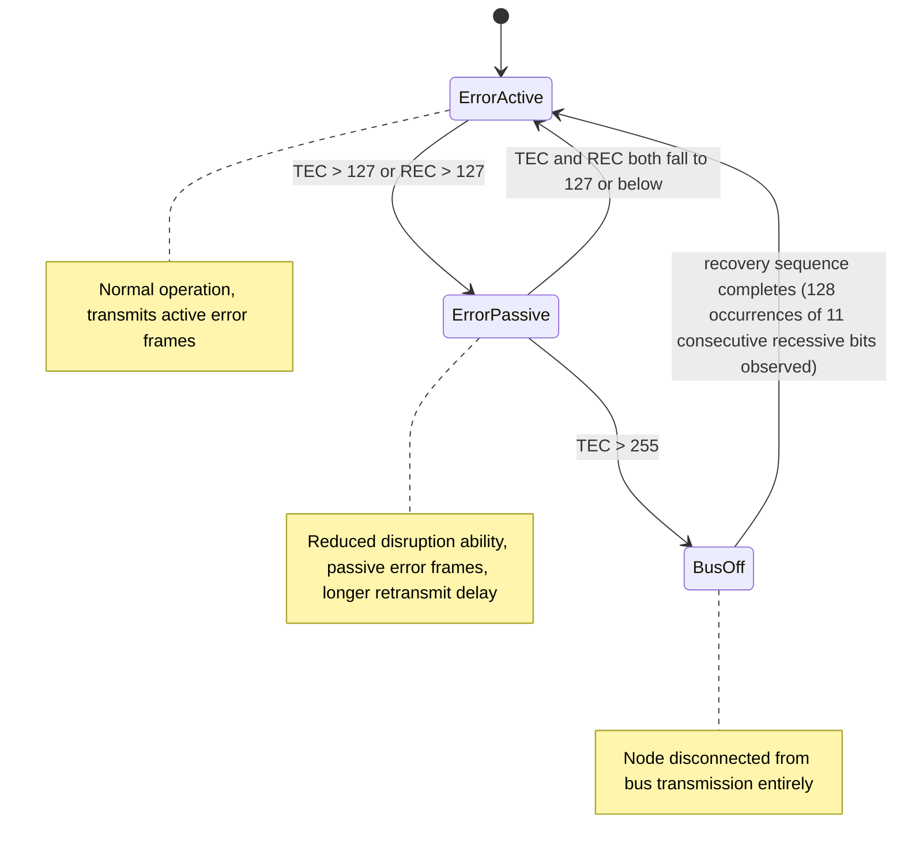

## CAN Error Handling and Arbitration

### Overview

CAN's reliability in electrically noisy environments rests on two tightly coupled mechanisms: a deterministic, priority-based arbitration scheme that resolves simultaneous transmission attempts without corrupting data, and a multi-layered error detection and fault-confinement system that identifies corrupted frames, signals errors bus-wide, and progressively isolates persistently faulty nodes. This content expands on both mechanisms in depth, building on the foundational CAN bus concepts covered previously.

### Arbitration Mechanism in Detail

#### Why Arbitration Is Needed

CAN is a broadcast, multi-master bus — any node may attempt to transmit whenever it observes the bus is idle. Because multiple nodes can begin transmitting in the same bit period (having independently detected an idle bus), a mechanism is required to resolve which node's message actually proceeds, without corrupting either node's data and without requiring a central bus arbiter.

#### The Bitwise Arbitration Process

Arbitration occurs during the identifier field of the frame, using the same dominant-overrides-recessive electrical principle described in CAN's physical layer: a node driving dominant (logical 0) on the bus always wins against a node driving recessive (logical 1) at the same bit position, because the dominant state physically overrides the recessive state on the shared differential bus.

The procedure, bit by bit through the identifier field:

1. Every contending node transmits its next identifier bit.
2. Every contending node simultaneously reads back the actual bus state.
3. A node that transmitted recessive but reads back dominant recognizes another node is transmitting a lower-priority-favoring bit at this position, and immediately ceases transmission, switching to a receiving role for the remainder of the frame.
4. A node that transmitted dominant, or transmitted recessive and read back recessive (meaning no competitor differed at this bit), continues to the next bit.
5. This continues through the full identifier (and, for standard frames, into the RTR bit) until only one node remains actively transmitting — that node has won arbitration and proceeds with its frame uninterrupted.

$$\text{Priority} \propto \frac{1}{\text{Identifier value}}$$

Because dominant bits are logical zeros, a smaller numerical identifier value corresponds to more leading zero bits, which corresponds to holding dominant longer into the comparison before any possible recessive bit — meaning a numerically lower identifier value always has arbitration priority over a higher one, without exception, as a direct consequence of the encoding.

#### Extended vs. Standard Frame Arbitration Interaction

When standard (11-bit) and extended (29-bit) identifier frames coexist on the same bus, arbitration must resolve priority between them as well. The frame format itself is structured so that a standard frame's IDE (Identifier Extension) bit is transmitted as dominant, while an extended frame's corresponding bit position is recessive at that point in the comparison — meaning a standard frame with the same leading 11 bits as an extended frame's leading 11 bits will always win arbitration over that extended frame, since dominant beats recessive at the IDE bit position. This is a deliberate design choice ensuring predictable priority resolution between mixed frame formats on a shared bus.

#### Arbitration Outcome Guarantees

- **No data corruption**: The winning node's frame transmits exactly as intended; arbitration loss is detected and resolved before any data field bits are transmitted.
- **No wasted bus bandwidth beyond the arbitration bits themselves**: Losing nodes stop immediately upon detecting arbitration loss, rather than continuing to transmit and corrupt the bus.
- **Automatic retry**: A node that loses arbitration is expected (at the firmware/driver level) to retry its transmission once the bus returns to idle, typically handled automatically by the CAN controller hardware's transmit buffer/mailbox logic without firmware intervention, though this should be confirmed against the specific controller's behavior. [Inference — automatic retry-on-arbitration-loss is standard behavior for most CAN controller hardware, but the exact mailbox/buffer management semantics vary by controller IC and should be verified against its reference manual.]

### Error Detection Mechanisms in Detail

CAN implements five independent error-checking mechanisms operating at different points in frame transmission and reception, providing substantially more robust error coverage than protocols relying on a single parity or checksum field.

#### Bit Error

Every transmitting node monitors the actual bus level after each bit it drives (outside of the arbitration field and the ACK slot, where a mismatch is expected and meaningful rather than erroneous). If a node transmits a given bit level but observes a different level on the bus, and this occurs outside the legitimate arbitration-loss or ACK-response context, a bit error is flagged.

#### CRC Error

Each frame includes a 15-bit CRC computed by the transmitter over the SOF, arbitration field, control field, and data field. Every receiving node independently computes the same CRC over the bits it received and compares it to the transmitted CRC value; a mismatch flags a CRC error, indicating the received data does not match what was actually sent — typically due to noise-induced bit corruption that happened to also pass bit-level monitoring (e.g., corruption at a receiving node not shared by the transmitter's own bit-monitoring check).

#### Form Error

Certain fields within the CAN frame have fixed, mandatory bit values (such as the CRC delimiter, ACK delimiter, and end-of-frame sequence, which must be recessive). A form error is flagged if any node observes one of these fixed-format fields containing an unexpected value.

#** Note: the following two mechanisms complete the five-error-type set.**

#### ACK Error

After the CRC field, every node that correctly received the frame (validated CRC) asserts a dominant bit during the ACK slot, overriding the transmitter's own recessive default in that slot. If the transmitting node observes the ACK slot remains recessive (no receiver acknowledged), it flags an ACK error — this can indicate no other node is present on the bus, all receiving nodes rejected the frame due to their own detected errors, or a bus fault is preventing acknowledgment from propagating.

#### Stuff Error

To maintain adequate signal transition density for receiver clock synchronization (since CAN nodes derive their bit timing from bus edges rather than a separate clock line), the transmitter inserts a stuff bit of opposite polarity after every five consecutive identical bits within the relevant portion of the frame. A stuff error is flagged by any node if six consecutive identical bits are observed where bit-stuffing rules should have prevented this.

### Error Signaling: Error Frames

When any node detects one of the five error conditions, it immediately transmits an error frame onto the bus, consisting of an error flag (six consecutive dominant bits, itself deliberately violating the bit-stuffing rule to force a stuff error detection in all other nodes) followed by an error delimiter (eight recessive bits). This causes every node on the bus to detect the corruption and discard the current frame, ensuring bus-wide consistency: either all nodes correctly receive a frame, or none of them accept it, preventing a scenario where some nodes silently accept corrupted data.

#### Error Frame Propagation (svg_diagram)

<svg xmlns="http://www.w3.org/2000/svg" viewBox="0 0 720 260">
\<style\>
.lbl { font-family: monospace; font-size: 13px; fill: #1a1a1a; }
.small { font-family: monospace; font-size: 11px; fill: #444; }
.box { fill: none; stroke: #1a1a1a; stroke-width: 1.5; }
.wire { stroke: #1a1a1a; stroke-width: 1.5; fill: none; }
.title { font-family: monospace; font-size: 15px; fill: #000; font-weight: bold; }
\</style\>

<text x="360" y="20" text-anchor="middle" class="title">Error Frame Detection and Propagation (svg_diagram)</text>

<rect x="30" y="60" width="140" height="50" class="box" /><text x="40" y="90" class="small">Node A (TX)</text>

<rect x="290" y="60" width="140" height="50" class="box" /><text x="300" y="90" class="small">Node B (RX)</text>

<rect x="550" y="60" width="140" height="50" class="box" /><text x="560" y="90" class="small">Node C (RX)</text>

<path class="wire" d="M30,150 L690,150" />
<text x="330" y="145" class="small">shared CAN bus</text>

<text x="290" y="180" class="small">Node B detects CRC mismatch</text>

<text x="290" y="200" class="small">Node B transmits error flag (6 dominant bits)</text>

<text x="30" y="220" class="small">Nodes A and C observe stuff-rule violation from error flag</text>

<text x="30" y="240" class="small">All nodes discard current frame; transmitter (A) will retransmit</text>

</svg>

### Fault Confinement in Detail

#### Error Counters

Each node maintains two internal counters, incremented and decremented according to defined rules in the CAN specification:

- **Transmit Error Counter (TEC)**: Incremented when the node, as transmitter, detects or causes an error; decremented on successful transmission.
- **Receive Error Counter (REC)**: Incremented when the node, as receiver, detects an error in an incoming frame; decremented on successful reception.

The exact increment/decrement amounts differ by error type and context (e.g., a node's own transmission causing an error increments TEC by more than a node merely detecting someone else's error as a receiver), reflecting the specification's intent to more heavily penalize a node that appears to be the source of bus disruption versus one that is merely observing it.

#### State Transitions

- **Error-active**: The default and normal state. A node in this state, upon detecting an error, transmits an active error frame (using the dominant six-bit error flag described above), actively participating in signaling the fault to the rest of the bus.
- **Error-passive**: Entered when either error counter exceeds 127. A node in this state still detects and flags errors, but does so with a passive error flag (six recessive bits rather than dominant), meaning its error signaling does not forcibly override other bus traffic the way an active error flag does. It must also wait an additional fixed delay before attempting retransmission after losing arbitration or encountering an error, reducing its ability to monopolize or repeatedly disrupt the bus.
- **Bus-off**: Entered when the transmit error counter exceeds 255. The node ceases all bus transmission entirely — it can neither transmit frames nor error flags — effectively disconnecting itself from active bus participation. Recovery requires an explicit sequence (monitoring the bus and observing 128 occurrences of 11 consecutive recessive bits, per the base CAN specification) before the node may re-enter error-active state and resume normal operation.

This graduated response — active participation, then reduced participation, then full disconnection — ensures that a node with a genuine, persistent hardware fault cannot indefinitely corrupt bus traffic for all other well-behaved nodes, while transient or isolated errors (which decrement the counters back down on successful frames) do not needlessly disconnect a fundamentally healthy node.

### Practical Debugging Implications

- **Distinguishing arbitration loss from a bus fault**: Arbitration loss is a normal, expected event on any bus with more than one active transmitter and should not itself be logged or treated as an anomaly; genuine concern arises only if a specific node loses arbitration far more often than its message priority would predict, or never successfully transmits at all.
- **Error counter monitoring as a health indicator**: Reading a node's TEC/REC values (where the controller exposes this, which most dedicated CAN controller ICs do via status registers) during development and field diagnostics can reveal a node trending toward error-passive or bus-off before a hard failure occurs, allowing preventive investigation.
- **Common causes of elevated error rates**: Missing or incorrect bus termination, marginal bit-timing configuration mismatches between nodes (each node's bit-rate and sample-point configuration must be compatible, even if nominally the same bit rate), ground potential differences between nodes on separate power domains, and electrically noisy environments near the physical bus wiring.
- **Silent bus-off failure mode**: Because a bus-off node stops transmitting entirely rather than producing an obvious fault signal to other nodes, a bus-off condition can present as a node simply "going quiet" from the perspective of other nodes' application logic — firmware should not assume total transmission silence implies a benign or intentional idle state without checking the local error state where visibility into a specific node is available (e.g., via diagnostic tooling or a system-level watchdog message pattern).

### Firmware-Side Considerations

- **Bus-off auto-recovery configuration**: Many CAN controller peripherals offer a configurable option for automatic bus-off recovery (attempting the recovery sequence without firmware intervention) versus requiring explicit firmware action to re-initialize the controller after bus-off; the appropriate choice depends on whether repeated automatic recovery attempts against a persistent fault are acceptable for the application, or whether such a condition should instead escalate to a higher-level fault handler.
- **Retry and priority interaction under sustained contention**: On a heavily loaded bus, lower-priority (higher-ID) messages can experience significant transmission delay if higher-priority messages are frequent, since arbitration always favors lower IDs; firmware and system-level message scheduling should account for worst-case latency of lower-priority messages rather than assuming even bus access.
- **Error frame flood risk from misconfiguration**: A node with a badly mismatched bit-timing configuration relative to the rest of the bus may generate errors on nearly every frame, rapidly driving both itself and potentially other nodes toward error-passive or bus-off states; this failure mode is a common outcome of a bit-timing configuration mistake during bring-up and is worth checking early when a newly added node causes bus-wide instability.
- **Logging and diagnostic message design**: Systems with strict reliability requirements sometimes dedicate specific low-priority message IDs to periodic node health/heartbeat reporting, including local error counter state, allowing a system-level diagnostic node to detect a node trending toward failure across the network rather than relying solely on each node's local behavior.

### Related Topics

- CAN bus fundamentals and physical layer signaling
- Bit-timing configuration and sample-point selection across multi-node CAN networks
- CAN FD error handling differences from Classic CAN
- Message ID allocation strategy and real-time priority engineering
- CAN transceiver fault detection and protection features
- Diagnostic and heartbeat message design patterns for distributed embedded networks
- Bus analyzer tools and techniques for CAN error frame capture and interpretation