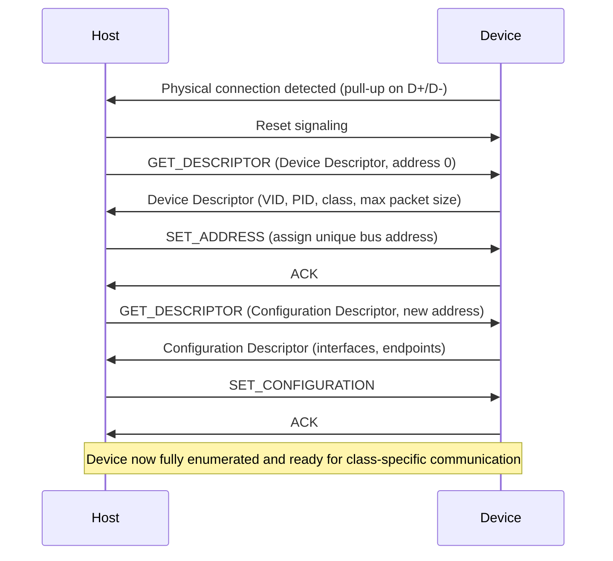

## USB Basics for Embedded Devices

### Overview

Universal Serial Bus (USB) is a host-centric, layered serial communication standard originally designed to standardize peripheral connectivity for personal computers, now widely embedded into microcontroller-based devices as both a data interface and a power source. Unlike CAN, I2C, or SPI, USB's architecture assumes a single host controller polling and managing all bus traffic — devices (including embedded MCUs acting as USB peripherals) never initiate communication independently, but respond to host-driven transactions, which fundamentally shapes how embedded firmware must implement USB functionality.

### USB Roles and Topology

#### Host, Device, and Hub Roles

- **Host**: The USB controller that initiates all bus transactions, enumerates connected devices, allocates bus bandwidth, and manages power distribution. In embedded contexts, a host role is less common than a device role, but appears in systems like single-board computers or MCUs with USB host controller peripherals that need to interface with USB peripherals (e.g., a keyboard, USB flash drive, or USB-to-serial adapter).
- **Device (Peripheral)**: A USB endpoint that responds to host requests and never initiates communication on its own. This is the most common role for embedded MCUs — presenting as a USB keyboard, mass storage device, virtual COM port, custom HID device, or other device class.
- **Hub**: A device that provides additional downstream USB ports, multiplexing host bus access across multiple connected devices. Embedded systems occasionally implement hub functionality when aggregating multiple onboard USB peripherals behind a single upstream connection.
- **On-The-Go (OTG)**: A specification allowing a single USB port to dynamically switch between host and device roles depending on what is connected, common in embedded systems (e.g., a smartphone or tablet-class device) that need to act as a peripheral when connected to a PC but as a host when a USB flash drive or keyboard is plugged in.

#### Tiered Star Topology

USB is not a shared bus in the electrical sense of CAN or I2C — it uses a tiered star topology, where the host sits at the root, and hubs (including the host's own root hub) provide branching points to downstream devices, with each device connected via a dedicated point-to-point link to its parent hub or the host.

#### USB Topology (svg_diagram)

<svg xmlns="http://www.w3.org/2000/svg" viewBox="0 0 700 320">
\<style\>
.lbl { font-family: monospace; font-size: 13px; fill: #1a1a1a; }
.small { font-family: monospace; font-size: 11px; fill: #444; }
.box { fill: none; stroke: #1a1a1a; stroke-width: 1.5; }
.wire { stroke: #1a1a1a; stroke-width: 1.5; fill: none; }
.title { font-family: monospace; font-size: 15px; fill: #000; font-weight: bold; }
\</style\>

<text x="350" y="20" text-anchor="middle" class="title">USB Tiered Star Topology (svg_diagram)</text>

<rect x="290" y="40" width="120" height="50" class="box" /><text x="305" y="70" class="small">Host (root)</text>

<path class="wire" d="M350,90 L350,130" />
<rect x="270" y="130" width="160" height="50" class="box" /><text x="285" y="160" class="small">External Hub</text>
<path class="wire" d="M300,180 L150,220" />
<path class="wire" d="M350,180 L350,220" />
<path class="wire" d="M400,180 L550,220" />

<rect x="80" y="220" width="140" height="50" class="box" /><text x="95" y="250" class="small">Embedded MCU (device)</text>

<rect x="280" y="220" width="140" height="50" class="box" /><text x="295" y="250" class="small">USB Flash Drive</text>

<rect x="480" y="220" width="140" height="50" class="box" /><text x="495" y="250" class="small">USB Sensor Module</text>

<text x="80" y="300" class="small">Each device has a dedicated point-to-point link, not a shared bus</text>

</svg>

### Signal Lines and Physical Layer

A standard USB connection uses four core signal lines (with additional lines in newer high-speed/USB-C variants):

| Signal | Function |
| --- | --- |
| VBUS | +5V nominal power supply from host/hub to device |
| D+ | Differential data line, positive |
| D− | Differential data line, negative |
| GND | Common ground reference |

Data is transmitted differentially across D+/D−, similar in principle to CAN's differential signaling, providing good noise immunity. USB additionally uses the resting/idle state of D+/D− (which line is pulled high via an internal pull-up resistor at the device end) to signal device speed to the host during connection detection — a full-speed or low-speed device is distinguished by which data line has its pull-up resistor enabled internally.

$$\text{Speed class signaled by} \begin{cases} \text{D+ pulled high} & \to \text{Full-Speed device} \\ \text{D-- pulled high} & \to \text{Low-Speed device} \end{cases}$$

### USB Speed Classes

| Speed Class | Nominal Data Rate | Typical Embedded Use |
| --- | --- | --- |
| Low-Speed (USB 1.0) | 1.5 Mbit/s | Simple HID devices (keyboards, mice), minimal MCU resource use |
| Full-Speed (USB 1.1/2.0) | 12 Mbit/s | Most common embedded MCU USB peripheral implementation |
| High-Speed (USB 2.0) | 480 Mbit/s | Higher-throughput applications; requires more capable PHY hardware |
| SuperSpeed (USB 3.x) | 5 Gbit/s and above | Less common in typical low-cost embedded MCU designs due to PHY complexity and cost |

Most low-cost microcontrollers with integrated USB peripherals implement Full-Speed USB, since it balances adequate throughput for common embedded use cases (virtual serial ports, HID devices, moderate-rate data streaming) against the added silicon complexity and cost of High-Speed or SuperSpeed PHY hardware.

### Enumeration Process

When a USB device is connected, the host performs a defined sequence — enumeration — to identify the device, assign it a bus address, and determine which drivers or interfaces are needed to communicate with it. This process is entirely host-initiated; the device's firmware must correctly respond to each step's requests within defined timing windows.

#### Descriptor Hierarchy

USB devices describe themselves to the host through a structured hierarchy of descriptors, which firmware must define correctly for successful enumeration:

- **Device Descriptor**: Top-level descriptor containing Vendor ID (VID), Product ID (PID), device class, and maximum packet size for endpoint 0.
- **Configuration Descriptor**: Describes a specific power/interface configuration a device can operate in (most simple embedded devices define only one configuration); includes power requirements (bus-powered vs. self-powered, maximum current draw).
- **Interface Descriptor**: Describes a functional grouping within a configuration (e.g., a composite device might expose both a virtual serial interface and a mass storage interface, each as separate interface descriptors).
- **Endpoint Descriptor**: Describes each communication channel (endpoint) within an interface, specifying transfer type, direction, and maximum packet size.
- **String Descriptors**: Optional, human-readable text (manufacturer name, product name, serial number) referenced by index from other descriptors.

### Endpoints and Transfer Types

An endpoint is a uniquely addressable data source or sink within a USB device, identified by an endpoint number and direction (IN, toward the host, or OUT, toward the device). Every device has a mandatory Endpoint 0, used bidirectionally for control transfers during enumeration and ongoing device management; additional endpoints are defined per the device's function.

#### Four Transfer Types

| Transfer Type | Guaranteed Delivery | Guaranteed Bandwidth | Typical Use |
| --- | --- | --- | --- |
| Control | Yes (retried on error) | No | Device enumeration, configuration, standard requests |
| Bulk | Yes (retried on error) | No | Large, non-time-critical data (mass storage, firmware updates) |
| Interrupt | Yes (retried on error) | Yes (polled at guaranteed minimum interval) | Small, time-sensitive data (HID devices — keyboards, mice, sensors) |
| Isochronous | No (no retry on error) | Yes (guaranteed fixed bandwidth allocation) | Real-time streaming data tolerant of occasional loss (audio, video) |

The choice of transfer type for a given embedded application depends fundamentally on whether data loss is acceptable in exchange for guaranteed timing (isochronous), or whether guaranteed eventual delivery matters more than strict timing (bulk), with control and interrupt transfers reserved for their specific defined roles (device management, and small guaranteed-latency data respectively).

### USB Device Classes

Rather than requiring a custom host-side driver for every device, USB defines standardized device classes with well-known, host-OS-supported drivers, significantly simplifying embedded USB device implementation when an existing class fits the application:

- **HID (Human Interface Device)**: Keyboards, mice, and also commonly repurposed by embedded designers for simple, low-throughput custom data exchange, since HID drivers are natively supported by virtually all host operating systems without a custom driver.
- **CDC (Communications Device Class)**: Includes the widely used CDC-ACM subclass, which presents the device as a virtual serial (COM) port to the host — extremely common for embedded debug consoles, firmware update interfaces, and simple data logging, since it requires no custom host application beyond a standard terminal program.
- **Mass Storage Class (MSC)**: Presents the device as a block storage device (e.g., appearing as a removable drive), commonly used for devices with onboard flash storage intended for direct file access from a host PC.
- **Audio Class**: Standardized descriptors and endpoint behavior for audio streaming devices.
- **DFU (Device Firmware Upgrade)**: A standardized class specifically for firmware update procedures, often implemented as a secondary interface alongside a device's primary function.
- **Vendor-specific/custom class**: Used when no standard class fits the application's needs, requiring a custom host-side driver — increases development complexity but allows full flexibility in protocol design.

### Power Considerations

USB defines standardized power delivery limits per the connection state and negotiated configuration:

$$I_{max,unconfigured} = 100\text{mA (typical, per USB 2.0 spec baseline)}, \quad I_{max,configured} = 500\text{mA (typical, per USB 2.0 spec baseline)}$$

A bus-powered device must not draw more than the low default current limit until it has successfully enumerated and had a configuration with a higher current requirement accepted by the host; devices requiring more power than USB can supply, or requiring power before enumeration completes, must be self-powered (using an external supply) rather than relying solely on bus power. USB Power Delivery (USB PD) and USB-C's higher current/voltage negotiation capabilities extend these limits substantially in newer implementations, but represent additional negotiated protocol layers beyond baseline USB 2.0 power rules. [Inference — exact power limit figures and negotiation details vary somewhat by USB specification revision (2.0 vs. 3.x) and should be confirmed against the specific USB specification version targeted by a given design.]

### Firmware-Side Considerations

- **USB stack selection**: Most MCU vendors provide a USB device stack (middleware) handling the low-level protocol details (enumeration state machine, descriptor parsing/response, endpoint buffer management), allowing application firmware to focus on class-specific behavior rather than reimplementing USB protocol handling from scratch; third-party stacks (e.g., TinyUSB) are also common, particularly for cross-vendor portability.
- **Descriptor table correctness**: Enumeration failures are frequently traced to descriptor table errors (incorrect endpoint sizes, malformed string descriptor encoding, interface/endpoint count mismatches between descriptors); firmware should be tested against USB descriptor validation tools during development.
- **Timing constraints during enumeration**: The host imposes strict timing requirements on device responses during enumeration (e.g., SET_ADDRESS must be processed within a defined window); firmware handling USB interrupts must avoid long blocking operations within the USB interrupt service routine that could cause enumeration timeouts.
- **Endpoint buffer and double-buffering management**: For higher-throughput applications (bulk or isochronous transfers), firmware must correctly manage endpoint buffer sizes and, where the peripheral hardware supports it, double-buffering to avoid data loss or stalls when the host requests data faster than the application can prepare it.
- **CDC-ACM as a debug/development shortcut**: Because CDC-ACM requires no custom host driver on most operating systems, it is frequently the fastest path to a working USB-based debug console or command interface during early firmware development, even if the final product uses a different class or interface for its primary function.

### Related Topics

- USB device class implementation details (HID report descriptors, CDC-ACM line coding)
- USB descriptor structure and enumeration failure debugging
- USB OTG and dual-role port implementation
- USB Power Delivery and USB-C negotiation protocols
- DFU (Device Firmware Upgrade) class implementation for field firmware updates
- Composite USB device design (multiple interfaces in one device)
- USB protocol analyzers and enumeration debugging techniques