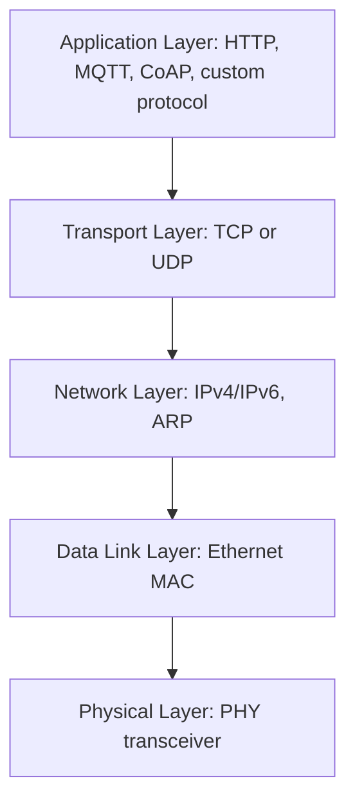

## Ethernet and Embedded Networking

### Overview

Ethernet is a family of wired networking standards defining the physical and data-link layers for local area network communication, widely adopted in embedded systems requiring high-throughput, standardized, routable network connectivity — from industrial automation controllers to IoT gateways and embedded web servers. Unlike the point-to-point or shared-bus protocols covered previously (UART, SPI, I2C, CAN, USB), Ethernet is designed from the outset to interoperate with the broader IP networking stack, making it the natural choice when an embedded device must communicate over standard local networks or the internet.

### Embedded Ethernet Architecture

#### MAC and PHY Separation

Embedded Ethernet implementations split functionality between two logical (and often physically separate) blocks:

- **MAC (Media Access Control)**: Handles frame formatting, addressing, and the data-link layer protocol logic. In many microcontrollers, the MAC is integrated on-chip as a peripheral.
- **PHY (Physical Layer transceiver)**: Handles the actual analog signal encoding/decoding onto the physical medium (typically twisted-pair copper for embedded applications). The PHY is frequently a separate external IC connected to the MCU's MAC via a standardized digital interface.

#### MAC-PHY Interface Standards

| Interface | Data Width | Typical Use |
| --- | --- | --- |
| MII (Media Independent Interface) | 4-bit | Legacy, still common in cost-sensitive designs |
| RMII (Reduced MII) | 2-bit | Fewer pins than MII, widely used in embedded MCU designs |
| GMII / RGMII | 8-bit / 4-bit (DDR) | Gigabit Ethernet, higher pin count or DDR clocking |

RMII is a particularly common choice in embedded MCU designs because it reduces the pin count needed between MAC and PHY (compared to MII) while remaining supported by a very wide range of low-cost PHY ICs, an important consideration given the typically limited GPIO budget on microcontroller packages.

#### Embedded Ethernet Block Diagram (svg_diagram)

<svg xmlns="http://www.w3.org/2000/svg" viewBox="0 0 700 260">
\<style\>
.lbl { font-family: monospace; font-size: 13px; fill: #1a1a1a; }
.small { font-family: monospace; font-size: 11px; fill: #444; }
.box { fill: none; stroke: #1a1a1a; stroke-width: 1.5; }
.wire { stroke: #1a1a1a; stroke-width: 1.5; fill: none; }
.title { font-family: monospace; font-size: 15px; fill: #000; font-weight: bold; }
\</style\>

<text x="350" y="20" text-anchor="middle" class="title">Embedded Ethernet Signal Chain (svg_diagram)</text>

<rect x="20" y="90" width="140" height="70" class="box" /><text x="30" y="120" class="small">MCU</text><text x="30" y="140" class="small">(integrated MAC)</text>

<path class="wire" d="M160,125 L260,125" />
<text x="165" y="115" class="small">RMII</text>

<rect x="260" y="90" width="120" height="70" class="box" /><text x="270" y="120" class="small">PHY IC</text>

<path class="wire" d="M380,125 L460,125" />
<text x="385" y="115" class="small">MDI</text>

<rect x="460" y="90" width="100" height="70" class="box" /><text x="470" y="120" class="small">Magnetics</text><text x="470" y="140" class="small">(transformer)</text>

<path class="wire" d="M560,125 L640,125" />

<rect x="600" y="90" width="80" height="70" class="box" /><text x="610" y="120" class="small">RJ45</text>

<text x="200" y="210" class="small">MAC handles framing/addressing; PHY handles analog line encoding</text>

</svg>

### Physical Layer and Isolation

Embedded Ethernet ports require isolation magnetics (typically an integrated transformer module, sometimes combined with the RJ45 connector itself) between the PHY and the physical cable connection, providing galvanic isolation for electrical safety and common-mode noise rejection — a design detail distinct from the purely digital interfaces covered in prior UART/SPI/I2C topics, since Ethernet's physical medium is expected to span longer distances and connect to equipment on potentially different ground references.

Common embedded-relevant physical layer standards:

| Standard | Speed | Cable | Notes |
| --- | --- | --- | --- |
| 10BASE-T | 10 Mbit/s | Cat3+ | Largely legacy, occasionally used in simple/low-cost embedded designs |
| 100BASE-TX | 100 Mbit/s | Cat5+ | Most common in cost-sensitive embedded designs ("Fast Ethernet") |
| 1000BASE-T | 1 Gbit/s | Cat5e+ | Used where higher throughput justifies added PHY complexity/cost |

### Ethernet Frame Structure

The EtherType field distinguishes the encapsulated higher-layer protocol (most commonly IPv4, IPv6, or ARP in embedded network stacks), allowing a single Ethernet frame format to carry various protocol payloads. The Frame Check Sequence is a CRC32 covering the frame, providing data-link layer error detection analogous in purpose (though different in algorithm and scope) to CAN's CRC field.

### The Embedded Network Stack

Ethernet itself only provides the physical and data-link layers; embedded devices communicating over IP networks require a network stack implementing the higher layers on top of the MAC/PHY hardware.

#### Common Embedded TCP/IP Stack Options

- **lwIP (lightweight IP)**: A widely used open-source TCP/IP stack specifically designed for resource-constrained embedded systems, offering a reduced memory footprint compared to full-scale desktop/server network stacks while implementing the core protocol set (IP, TCP, UDP, ICMP, DHCP, DNS).
- **Vendor-provided stacks**: Many MCU vendors bundle a network stack (often built on or derived from lwIP) integrated with their HAL and Ethernet peripheral drivers.
- **RTOS-integrated stacks**: Real-time operating systems commonly used in embedded networking applications frequently include or integrate a compatible TCP/IP stack as part of their standard middleware offering.

### Application-Layer Protocols Common in Embedded Networking

- **HTTP/HTTPS**: Used for embedded web servers (device configuration interfaces) and, increasingly, for RESTful API-based device control and telemetry.
- **MQTT**: A lightweight publish-subscribe protocol widely used in IoT applications, favored for its low overhead and suitability for constrained, potentially intermittent network connections.
- **CoAP (Constrained Application Protocol)**: Designed specifically for constrained devices and networks, using UDP rather than TCP and a compact binary message format, often paired with 6LoWPAN in low-power wireless mesh contexts though also applicable over wired Ethernet.
- **Modbus TCP**: An adaptation of the Modbus industrial protocol (traditionally serial/RS-485-based) onto Ethernet/TCP, common in industrial automation for integrating legacy protocol semantics onto modern network infrastructure.
- **DHCP and DNS clients**: Necessary for a device to obtain a dynamic IP address and resolve hostnames on networks that don't rely purely on static addressing.

### Power over Ethernet (PoE)

Some embedded Ethernet designs incorporate Power over Ethernet, allowing DC power to be delivered over the same cable as the data connection, eliminating the need for a separate power supply at the device — useful for devices in locations where running separate power wiring is impractical (e.g., ceiling-mounted sensors, remote industrial nodes).

$$P_{max} \approx 25.5\text{W (IEEE 802.3at, Type 2)}, \quad P_{max} \approx 90\text{W (IEEE 802.3bt, Type 4)}$$

PoE requires dedicated interface circuitry (a PoE-compliant PD — Powered Device — controller IC) to properly negotiate power classification with the PoE-sourcing switch/injector and to safely extract DC power from the appropriate conductor pairs; this is a separate hardware subsystem layered on top of the base Ethernet PHY/magnetics design, not an inherent capability of standard Ethernet hardware alone. Exact power class figures and negotiation details depend on the specific IEEE 802.3 PoE standard revision targeted, and should be confirmed against the relevant specification and PD controller IC datasheet for a given design. [Inference — power figures cited are commonly referenced approximate values for the noted 802.3 revisions; exact allocable power depends on cable length, PD controller efficiency, and classification negotiation outcome.]

### Design and Signal Integrity Considerations

- **PHY-to-magnetics trace routing**: The differential pairs between PHY and magnetics module require controlled impedance routing (typically 100-ohm differential) with matched trace lengths, since Ethernet's higher data rates make this link considerably more sensitive to routing quality than the lower-speed digital interfaces covered previously.
- **Crystal/oscillator accuracy for PHY timing**: PHY ICs typically require a precision reference oscillator (commonly 25 MHz) meeting a defined frequency tolerance, since Ethernet timing recovery and standards compliance depend on adequate clock accuracy at the PHY.
- **EMI considerations**: Ethernet's higher clock rates and longer cable runs make it a more significant EMI concern than short on-board digital buses; proper grounding of the isolation magnetics shield and adherence to PHY vendor layout guidelines is important for both regulatory compliance and signal integrity.
- **MDI/MDI-X auto-crossover**: Modern PHY ICs commonly support automatic MDI/MDI-X detection and correction, eliminating the historical need to distinguish "straight-through" versus "crossover" cabling for direct device-to-device connections — a detail worth confirming in the specific PHY's feature set if simplifying cabling requirements for a given deployment.

### Firmware-Side Considerations

- **Driver and stack integration effort**: Bringing up embedded Ethernet typically involves more integration work than simpler serial peripherals — MAC driver initialization, PHY register configuration/link negotiation, and TCP/IP stack configuration (buffer counts, memory pool sizing for constrained RAM) all require coordinated setup, often guided by vendor reference implementations.
- **Link status and auto-negotiation handling**: Firmware should monitor and respond appropriately to PHY link-status changes (cable connect/disconnect, negotiated speed/duplex changes) rather than assuming a persistently valid, initialized-at-boot-only network link, particularly in field-deployed devices where cable state may change during operation.
- **Memory footprint management**: Because full TCP/IP stack operation (particularly with TLS/HTTPS support) can consume substantial RAM and flash relative to a typical microcontroller's resources, careful configuration of buffer counts, connection limits, and (if used) TLS cipher suite selection is often necessary to fit within a constrained device's memory budget.
- **Security considerations for network-connected devices**: Any embedded device exposed to a network (particularly the broader internet) inherits standard network security considerations — secure boot/firmware update mechanisms, TLS for sensitive communications, and minimizing exposed services/ports are common baseline practices, though the specific requirements are highly application- and threat-model-dependent.

### Related Topics

- lwIP stack configuration and memory footprint tuning for constrained devices
- TLS/DTLS implementation considerations for resource-constrained embedded TCP/IP stacks
- MQTT and CoAP protocol design for IoT telemetry applications
- Power over Ethernet (PoE) powered-device circuit design
- Industrial Ethernet protocols (EtherCAT, PROFINET) and real-time determinism extensions
- PHY register configuration and auto-negotiation debugging
- Embedded web server and RESTful device configuration interface design