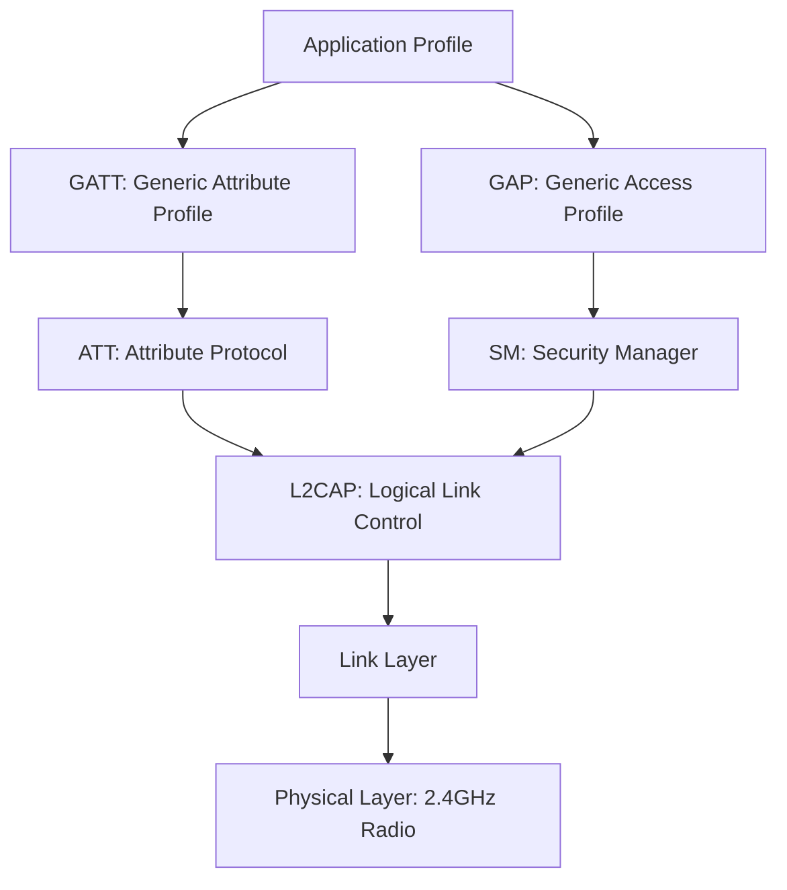

## Wireless Protocols: Bluetooth and BLE

### Overview

Bluetooth is a short-range wireless communication standard operating in the 2.4 GHz ISM band, encompassing two distinct protocol families relevant to embedded design: Classic Bluetooth (BR/EDR — Basic Rate/Enhanced Data Rate), oriented toward continuous, higher-throughput streaming use cases, and Bluetooth Low Energy (BLE), designed from the outset for battery-powered, intermittently-connected embedded devices. The two share the same underlying radio band and Bluetooth SIG governance but differ substantially in protocol stack, power profile, and typical embedded application, and are generally not directly interoperable at the protocol level despite some chips supporting both ("dual-mode").

### Classic Bluetooth vs. BLE

| Characteristic | Classic Bluetooth (BR/EDR) | Bluetooth Low Energy (BLE) |
| --- | --- | --- |
| Primary design goal | Continuous data streaming | Intermittent, low-power data exchange |
| Typical power profile | Higher average current, continuous connection | Very low average current, sleep between events |
| Typical throughput | Up to ~3 Mbit/s (EDR) | Lower, optimized for small/periodic payloads |
| Connection model | Continuous, always-connected while paired | Connection intervals with sleep between events |
| Common embedded use | Audio streaming, wireless serial replacement | Sensors, wearables, beacons, IoT telemetry |
| Typical current draw | Milliamps, sustained | Microamps average, brief mA spikes during radio events |

Because embedded designs increasingly prioritize battery life and intermittent sensor reporting over continuous streaming, BLE has become the dominant Bluetooth variant in new embedded product designs, with Classic Bluetooth largely reserved for applications specifically requiring its continuous-streaming characteristics (e.g., audio).

### BLE Protocol Stack Layers

- **Physical Layer**: Defines the 2.4 GHz radio characteristics, modulation (GFSK), and 40 channels within the ISM band.
- **Link Layer**: Manages the low-level radio state machine — advertising, scanning, initiating, and connected states — and implements adaptive frequency hopping for interference resilience.
- **L2CAP (Logical Link Control and Adaptation Protocol)**: Provides protocol multiplexing and segmentation/reassembly of higher-layer data over the link layer's limited packet size.
- **ATT (Attribute Protocol)**: Defines the client-server data exchange model used to read/write structured data (attributes) between devices.
- **GATT (Generic Attribute Profile)**: Builds on ATT to define the standardized hierarchy of Services, Characteristics, and Descriptors that structures how application data is organized and exposed.
- **GAP (Generic Access Profile)**: Defines device discovery, connection establishment, and the overall roles a device can take (broadcaster, observer, peripheral, central).
- **SM (Security Manager)**: Handles pairing, bonding, and encryption key management.

### BLE Roles

- **Broadcaster**: Transmits advertising packets without establishing connections; used for beacon-style, one-way data broadcast (e.g., an environmental sensor beacon reporting readings to any listener in range).
- **Observer**: Scans for and receives advertising packets without connecting; the receiving counterpart to a broadcaster.
- **Peripheral**: A device that advertises its presence and accepts incoming connections from a central device; this is the typical role for most embedded sensor/peripheral devices (e.g., a fitness tracker, a smart lock).
- **Central**: A device that scans for and initiates connections to peripherals, typically managing multiple simultaneous peripheral connections; commonly a smartphone, gateway, or hub device rather than a battery-constrained sensor node, though embedded gateway devices frequently implement this role.

A single device can implement multiple roles simultaneously if its BLE stack and application support it (e.g., a gateway device that is peripheral to a phone app while acting as central to several sensor nodes), though simple embedded sensor nodes most commonly implement only the peripheral role.

#### BLE Central-Peripheral Connection Model (svg_diagram)

<svg xmlns="http://www.w3.org/2000/svg" viewBox="0 0 700 280">
\<style\>
.lbl { font-family: monospace; font-size: 13px; fill: #1a1a1a; }
.small { font-family: monospace; font-size: 11px; fill: #444; }
.box { fill: none; stroke: #1a1a1a; stroke-width: 1.5; }
.wire { stroke: #1a1a1a; stroke-width: 1.5; fill: none; }
.title { font-family: monospace; font-size: 15px; fill: #000; font-weight: bold; }
\</style\>

<text x="350" y="20" text-anchor="middle" class="title">BLE Central Managing Multiple Peripherals (svg_diagram)</text>

<rect x="280" y="40" width="140" height="60" class="box" /><text x="295" y="75" class="small">Central (gateway)</text>

<path class="wire" d="M300,100 L120,200" />
<path class="wire" d="M350,100 L350,200" />
<path class="wire" d="M400,100 L580,200" />

<rect x="60" y="200" width="130" height="50" class="box" /><text x="70" y="230" class="small">Peripheral: Temp sensor</text>

<rect x="285" y="200" width="130" height="50" class="box" /><text x="295" y="230" class="small">Peripheral: Motion sensor</text>

<rect x="510" y="200" width="130" height="50" class="box" /><text x="520" y="230" class="small">Peripheral: Beacon tag</text>

<text x="60" y="270" class="small">Each connection uses its own connection interval and parameters</text>

</svg>

### GATT: Services, Characteristics, and Attributes

GATT structures application data hierarchically, and understanding this structure is essential for embedded firmware implementing a custom BLE peripheral profile:

- **Service**: A logical grouping of related functionality (e.g., "Heart Rate Service," "Battery Service," or a custom vendor-specific service), identified by a 16-bit (standard) or 128-bit (custom) UUID.
- **Characteristic**: A single data value within a service (e.g., "Heart Rate Measurement" within the Heart Rate Service), also UUID-identified, with defined properties controlling how it can be accessed:
  - **Read**: The central can request the current value.
  - **Write / Write Without Response**: The central can set the value, with or without requiring peripheral acknowledgment.
  - **Notify**: The peripheral can proactively push value updates to a subscribed central without requiring a request-response round trip for each update.
  - **Indicate**: Similar to notify, but requires acknowledgment from the central for each update, providing reliable delivery at the cost of additional overhead.
- **Descriptor**: Metadata about a characteristic (e.g., a human-readable description, or the Client Characteristic Configuration Descriptor used to enable/disable notifications).

Standardized GATT services and characteristics (defined by the Bluetooth SIG for common device types like heart rate monitors, battery services, and HID devices) allow interoperability with generic host applications without custom app development, while custom UUIDs allow vendor-specific data structures when no standard profile fits the application.

### Advertising and Connection Establishment

#### Advertising

A BLE peripheral periodically broadcasts advertising packets on one or more of three dedicated advertising channels, containing basic identifying information and optionally application data (in advertising data or scan response payloads), before any connection is established. Advertising interval and payload content are configurable and directly affect both power consumption and discoverability latency — more frequent advertising improves discovery speed and connection latency at the cost of higher average power draw.

#### Connection Parameters

Once connected, a central and peripheral communicate during periodic connection events, with timing governed by negotiated connection parameters:

- **Connection Interval**: The time between successive connection events, during which data can be exchanged; shorter intervals allow faster data exchange and lower latency at the cost of higher power consumption on both ends.
- **Slave Latency**: Allows the peripheral to skip a defined number of connection events without penalty if it has no data to send, reducing power consumption for devices with infrequent data needs without requiring the central to also reduce its connection interval.
- **Supervision Timeout**: The maximum time without a successful connection event before the link is considered lost, providing tolerance for temporary interference or range issues without immediately dropping the connection.

$$P_{avg} \propto \frac{1}{T_{connection\ interval}} \times (1 - \text{fraction of events skipped via slave latency})$$

Tuning these three parameters is one of the primary levers embedded BLE firmware developers have for balancing battery life against responsiveness, and is frequently one of the most impactful power-optimization decisions in a battery-powered BLE product's design.

### Pairing, Bonding, and Security

- **Pairing**: The process of establishing a shared, encrypted link between two devices for the current session, using one of several association models (Just Works, Passkey Entry, Numeric Comparison, Out of Band) depending on the I/O capabilities of the devices involved (e.g., a device without a display or keypad is typically limited to the lower-security "Just Works" model).
- **Bonding**: Persisting the pairing-derived keys across sessions/reconnections, so future connections can re-establish encryption without repeating the full pairing exchange — most embedded products intended for repeated use with the same paired device implement bonding rather than requiring re-pairing on every connection.
- **LE Secure Connections**: A stronger pairing method introduced in later Bluetooth versions using elliptic-curve cryptography, offering improved resistance to passive eavesdropping during pairing compared to legacy pairing methods, and generally recommended for new designs where the hardware/stack supports it.

Security model selection has direct implications for both user experience (how a device is paired) and actual security posture (resistance to eavesdropping or spoofing), and should be deliberately chosen based on the device's I/O capabilities and threat model rather than defaulting to the simplest available option without consideration. [Inference — appropriate security model selection depends on the specific product's threat model, user interaction constraints, and applicable regulatory or industry requirements, which vary by application.]

### Power Consumption Characteristics

BLE's power profile is characterized by brief, relatively high-current radio events (transmission/reception during advertising or connection events) separated by long low-power sleep periods, in contrast to Classic Bluetooth's more continuous power draw:

- **Advertising power**: Dominated by advertising interval and the number of advertising channels used per event; less frequent advertising and fewer channels reduce average power at the cost of discovery latency.
- **Connected power**: Dominated by connection interval and slave latency, as covered above.
- **Sleep current**: The baseline current draw between radio events, determined primarily by the SoC/radio IC's sleep mode current specification rather than the BLE protocol itself.

Achievable battery life for a given BLE application depends on the interaction of all these factors together with the specific radio IC's RF and sleep-current characteristics, and should be estimated using the specific chosen hardware's datasheet current figures combined with the application's actual advertising/connection parameter configuration, rather than assumed from BLE's general "low energy" branding alone. [Inference — actual battery life is highly application- and hardware-specific; general BLE "low power" characterization does not substitute for a concrete power budget calculation using real device parameters.]

### Firmware-Side Considerations

- **SoftDevice/stack architecture on constrained SoCs**: Many BLE-integrated SoCs (particularly Nordic Semiconductor's nRF series and similar parts) implement the BLE protocol stack as a separate, often precompiled binary blob (e.g., Nordic's "SoftDevice") running alongside application firmware, with defined memory and interrupt-priority partitioning between stack and application code — application firmware must respect these boundaries and interact with the stack via its defined API rather than directly manipulating radio hardware.
- **GATT profile definition and code generation**: Custom service/characteristic definitions are typically declared through vendor SDK macros or, in some toolchains, generated from higher-level profile description tools, reducing manual boilerplate for standard read/write/notify characteristic handling.
- **Connection parameter negotiation handling**: Firmware should handle the possibility that a central may reject or renegotiate proposed connection parameters (particularly relevant with mobile OS centrals, which often impose their own connection parameter policies), rather than assuming requested parameters are always granted as specified.
- **Advertising/connection state machine management**: Application firmware typically implements explicit state handling for the peripheral's current BLE state (advertising, connected, disconnected, bonding in progress), since application behavior (e.g., what data to expose, whether to allow writes) often depends on which state and security level the current session has reached.

### Related Topics

- Nordic nRF, Espressif ESP32, and other common BLE SoC platform comparisons
- Custom GATT profile design and UUID allocation practices
- BLE mesh networking as an extension for multi-node topologies
- Power profiling and current-draw measurement techniques for battery-powered BLE devices
- BLE security models and threat mitigation for IoT product design
- Coexistence considerations when BLE and Wi-Fi share a 2.4GHz radio on the same SoC
- Over-the-air (OTA) firmware update mechanisms via BLE