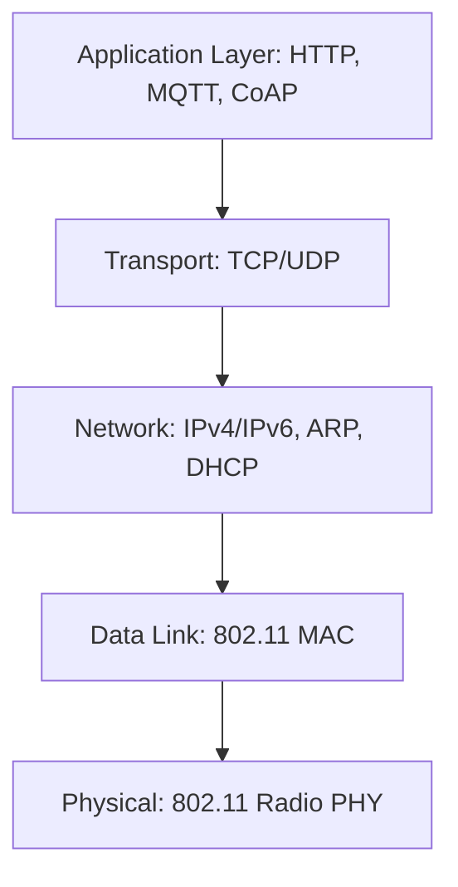

## Wireless Protocols: Wi-Fi for Embedded

### Overview

Wi-Fi (IEEE 802.11) is a wireless local area networking standard offering substantially higher throughput than Bluetooth/BLE at the cost of higher power consumption, making it the preferred wireless choice for embedded devices requiring IP network connectivity, internet access, or high-bandwidth data transfer, while being generally less suitable than BLE for coin-cell or long-life battery-powered sensor nodes. Embedded Wi-Fi implementations typically integrate a dedicated Wi-Fi SoC or module handling the RF and lower-layer protocol complexity, interfaced to the main application MCU via SPI, UART (AT-command based), or, in combined SoC designs, directly on the same silicon as the application processor.

### Wi-Fi Standards Relevant to Embedded Design

| Standard | Frequency Band | Approx. Max PHY Rate | Embedded Relevance |
| --- | --- | --- | --- |
| 802.11b/g/n | 2.4 GHz | Up to ~150-300 Mbit/s (n) | Most common in cost-sensitive embedded modules; widest device compatibility |
| 802.11n/ac | 5 GHz | Up to ~1+ Gbit/s (ac) | Less common in low-cost embedded modules; higher throughput, shorter range, less obstacle penetration |
| 802.11ax (Wi-Fi 6) | 2.4/5/6 GHz | Higher efficiency, higher rate | Increasingly available in newer embedded modules, improved performance in dense environments |
| 802.11ah (Wi-Fi HaLow) | Sub-1 GHz | Lower rate | Purpose-designed for IoT: longer range, lower power, better obstacle penetration than 2.4/5GHz |

Most cost-sensitive embedded Wi-Fi designs use 2.4 GHz 802.11b/g/n modules due to their low cost, wide compatibility with existing consumer/enterprise access point infrastructure, and mature, well-supported chipset ecosystem — even though the 2.4 GHz band is shared with Bluetooth and many other consumer devices, creating potential interference considerations addressed further below.

### Embedded Wi-Fi Architecture Patterns

#### Combined SoC (Application Processor + Wi-Fi)

Chips like the Espressif ESP32 family integrate a general-purpose application processor core alongside Wi-Fi (and often BLE) radio hardware on a single die, allowing application firmware and network stack to run on the same processor without a separate host-module command interface. This reduces bill-of-materials cost and PCB complexity, at the tradeoff of application code sharing processing/memory resources with the network stack and radio management tasks.

#### Host MCU + Wi-Fi Module

A separate, dedicated Wi-Fi module (often itself containing its own small processor running a network stack and Wi-Fi firmware) is connected to a general-purpose host MCU via SPI or UART, with the module exposing a simplified command interface (frequently AT-commands over UART, or a vendor-specific SPI protocol) rather than requiring the host MCU to implement 802.11 protocol details directly.

#### Two Common Embedded Wi-Fi Architectures (svg_diagram)

<svg xmlns="http://www.w3.org/2000/svg" viewBox="0 0 760 300">
\<style\>
.lbl { font-family: monospace; font-size: 12px; fill: #1a1a1a; }
.small { font-family: monospace; font-size: 10px; fill: #444; }
.box { fill: none; stroke: #1a1a1a; stroke-width: 1.5; }
.wire { stroke: #1a1a1a; stroke-width: 1.5; fill: none; }
.title { font-family: monospace; font-size: 15px; fill: #000; font-weight: bold; }
\</style\>

<text x="380" y="20" text-anchor="middle" class="title">Combined SoC vs. Host+Module Wi-Fi Architectures (svg_diagram)</text>

<text x="60" y="55" class="lbl">Combined SoC</text>

<rect x="60" y="70" width="220" height="100" class="box" />

<text x="75" y="100" class="small">Application Processor Core</text>

<text x="75" y="120" class="small">+ Wi-Fi/BLE Radio</text>

<text x="75" y="145" class="small">(e.g. ESP32-class SoC)</text>

<text x="440" y="55" class="lbl">Host + Module</text>

<rect x="440" y="70" width="130" height="100" class="box" />

<text x="450" y="100" class="small">Host MCU</text>

<text x="450" y="120" class="small">(application logic)</text>

<path class="wire" d="M570,120 L630,120" />
<text x="575" y="112" class="small">SPI/UART</text>
<rect x="630" y="70" width="130" height="100" class="box" />
<text x="640" y="100" class="small">Wi-Fi Module</text>
<text x="640" y="120" class="small">(own MCU + stack)</text>

<text x="40" y="230" class="small">Combined: fewer components, shared resources between app and network stack</text>

<text x="40" y="250" class="small">Host+Module: cleaner separation, module handles RF/protocol complexity independently</text>

</svg>

### Wi-Fi Operating Modes

- **Station (STA) mode**: The device connects to an existing access point as a client, the most common mode for embedded devices joining a home/office/facility network for internet or LAN connectivity.
- **Access Point (AP) mode**: The device itself creates a Wi-Fi network that other devices can connect to, commonly used for initial device setup/provisioning (e.g., a smart device creates a temporary AP for a smartphone app to connect and configure Wi-Fi credentials) or for devices acting as a local hub.
- **Wi-Fi Direct / peer-to-peer**: Allows direct device-to-device connection without a traditional access point intermediary, less commonly used in typical embedded product designs compared to STA/AP modes.
- **Simultaneous STA+AP mode**: Some embedded Wi-Fi chipsets support operating in both STA and AP mode concurrently (often used during provisioning, where a device is simultaneously connecting to the target network while still hosting a setup AP), though this typically involves tradeoffs in available channel/timing resources compared to single-mode operation.

### Network Stack Layers for Embedded Wi-Fi

Once associated with a network, embedded Wi-Fi devices rely on the same general TCP/IP stack architecture as embedded Ethernet devices (covered previously), since 802.11 provides the physical/data-link layer equivalent to Ethernet's MAC/PHY, with IP and above layered identically on top:

This shared upper-layer architecture means much of the same embedded network stack tooling (lwIP, MQTT/CoAP client libraries, TLS implementations) applies equally to Wi-Fi and Ethernet-connected embedded devices, with the wireless-specific complexity largely isolated to the association/authentication and radio management layers below IP.

### Security and Authentication

- **WPA2-Personal (PSK)**: Pre-shared key authentication, the most common security mode for embedded devices joining home/small-office networks, requiring the device to be configured with the network's passphrase.
- **WPA2/WPA3-Enterprise**: Uses 802.1X authentication against a RADIUS server, more common in corporate/institutional deployments; embedded devices supporting enterprise networks require additional certificate/credential management complexity compared to simple PSK.
- **WPA3**: Introduces stronger cryptographic protections and improved resistance to offline dictionary attacks on the pre-shared key compared to WPA2, with increasing embedded module support as the standard matures, though backward compatibility considerations with WPA2-only networks remain relevant for broad deployment compatibility. [Inference — WPA3 adoption rate and specific embedded chipset support vary by module vendor and product generation; current support should be verified against the specific Wi-Fi module or SoC datasheet.]
- **Provisioning security**: The initial credential-provisioning process (getting Wi-Fi network credentials onto the device) is itself a security-relevant design point — transmitting credentials in the clear over an unencrypted temporary AP connection, for example, is a common but recognized weak pattern, and secure provisioning schemes (encrypted BLE-based provisioning, QR-code-based key exchange, or similar) are increasingly used in commercial IoT product design to mitigate this exposure window.

### Power Consumption Characteristics

Wi-Fi's power profile differs substantially from BLE's, generally drawing meaningfully higher average current due to the protocol's more complex association/authentication overhead, larger typical packet sizes, and continuous beacon-monitoring requirements even in idle-but-associated states:

- **Active/transmit current**: Wi-Fi transmit current is typically on the order of hundreds of milliamps during active transmission, substantially higher than BLE's brief radio events.
- **Power-save mode**: Most Wi-Fi chipsets support 802.11 power-save mode, where the device sleeps between periodic beacon-interval wake-ups to check for buffered traffic from the access point, reducing average power compared to continuously-active association, though still generally higher average power than a comparably configured BLE link.
- **Deep sleep with periodic reconnection**: For applications not requiring a persistently maintained association, some embedded designs fully power down the Wi-Fi radio between periodic connect-transmit-disconnect cycles, trading reconnection/re-association latency and overhead for lower average power compared to maintaining an idle association continuously.

Because of this power profile, Wi-Fi is generally a less suitable choice than BLE or sub-GHz protocols for coin-cell-powered, multi-year-battery-life sensor nodes, and is more commonly paired with mains power, larger rechargeable batteries, or applications where more frequent charging/battery replacement is acceptable — though exact achievable battery life remains highly dependent on the specific use pattern (transmission frequency, payload size, power-save configuration) and chosen hardware's current specifications. [Inference — the general power-profile comparison to BLE is a widely observed engineering pattern, but exact battery-life outcomes depend on device-specific usage patterns and hardware, and should be calculated from real current-draw measurements for a given design rather than assumed generically.]

### 2.4 GHz Band Coexistence

Because 2.4 GHz Wi-Fi shares spectrum with Bluetooth/BLE, Zigbee, and various other unlicensed-band devices, embedded designs incorporating both Wi-Fi and BLE/Zigbee on the same board (or even the same combined SoC) must consider coexistence:

- **Time-division coexistence**: Many combined Wi-Fi/BLE SoCs implement internal arbitration logic to time-share the radio (if physically shared) or coordinate simultaneous operation (if separate radios exist on-chip) to minimize mutual interference between the two protocols' transmissions.
- **Channel selection**: Wi-Fi's wider channel bandwidth (20/40 MHz) overlaps significantly with the narrower BLE/Zigbee channels; some embedded designs implement channel-aware coexistence logic to avoid scheduling conflicting protocol activity on overlapping frequencies where feasible.
- **Physical antenna considerations**: In designs with separate antennas for Wi-Fi and BLE, adequate physical/RF isolation between antennas helps reduce direct interference beyond what protocol-level coexistence logic alone can address.

### Firmware-Side Considerations

- **AT-command vs. native SDK integration**: When using a separate Wi-Fi module, firmware must implement either an AT-command parser/state-machine (for UART-based modules) or a vendor SDK's SPI-based command/event interface, with associated considerations for command timeout handling, asynchronous event processing (e.g., unsolicited disconnect notifications), and buffer management for command/response parsing.
- **Reconnection and network resilience logic**: Firmware should implement robust reconnection handling for association loss, DHCP lease renewal, and access point unavailability, since embedded Wi-Fi devices in field deployments will encounter network interruptions that a well-designed device should recover from without requiring manual intervention.
- **Provisioning workflow implementation**: A complete embedded Wi-Fi product typically requires a defined provisioning workflow (AP mode + captive portal, BLE-assisted provisioning, or similar) allowing an end user to configure network credentials without direct firmware access, adding a meaningful firmware complexity and testing surface beyond the core Wi-Fi connectivity itself.
- **Memory and stack coexistence on combined SoCs**: On combined application-processor-plus-radio SoCs, firmware must account for the network stack, Wi-Fi driver, and application logic sharing the same limited RAM/flash resources, often requiring more careful memory budget management than a host+module architecture where the module's own processor handles stack overhead independently.

### Related Topics

- Zigbee and Thread as lower-power mesh alternatives for IoT sensor networks
- Wi-Fi provisioning UX patterns (AP+captive portal, BLE-assisted, QR code)
- ESP32 and similar combined Wi-Fi/BLE SoC platform architecture
- TLS/mutual authentication for secure embedded cloud connectivity over Wi-Fi
- 802.11 power-save mode configuration and battery-life optimization
- 2.4GHz radio coexistence design for combined Wi-Fi/Bluetooth embedded systems
- Sub-GHz long-range protocols (LoRa, Wi-Fi HaLow) as alternatives for range-constrained deployments