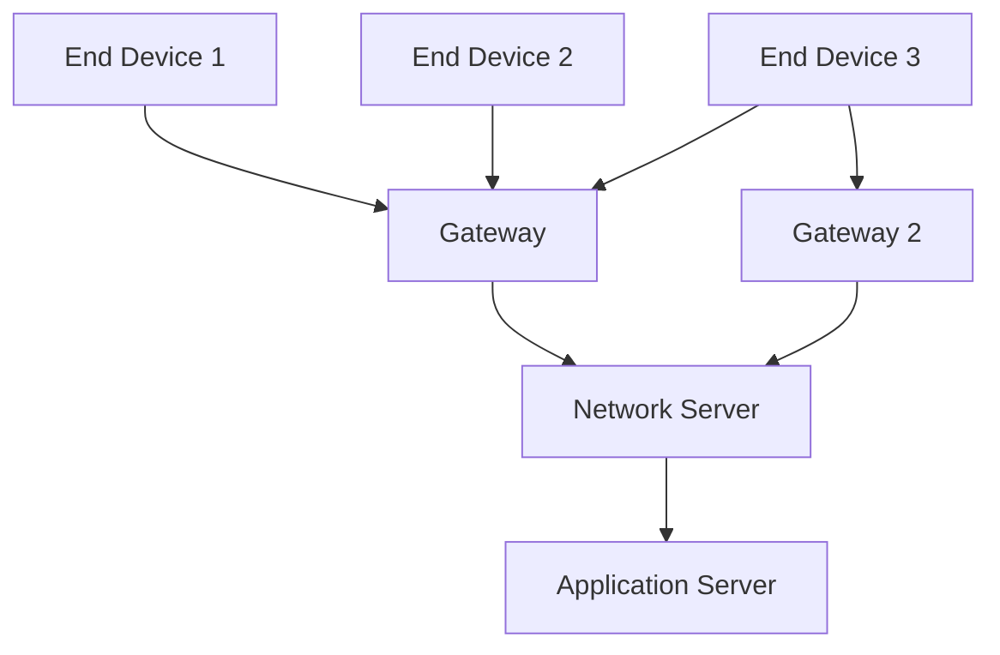

## Low-Power Wireless: Zigbee, LoRa, Thread

### Overview

Zigbee, LoRa, and Thread represent three distinct approaches to low-power wireless connectivity for embedded IoT devices, each optimized for a different combination of range, throughput, power consumption, and network topology. Where BLE (covered previously) is optimized primarily for short-range, point-to-point or small-star connections to a phone or gateway, and Wi-Fi for high-throughput IP connectivity, these three protocols address the broader category of multi-node sensor networks and long-range, ultra-low-power telemetry — each with different tradeoffs that make protocol selection highly application-dependent.

### Zigbee

#### Overview and Architecture

Zigbee is a mesh networking protocol built on the IEEE 802.15.4 physical and MAC layers, designed for low-power, low-data-rate applications requiring many nodes to communicate over a self-healing mesh topology rather than a simple star. It operates primarily in the 2.4 GHz ISM band (with some regional sub-GHz variants), sharing the band with Wi-Fi and Bluetooth, which introduces coexistence considerations similar to those discussed for BLE and Wi-Fi.

#### Zigbee Device Roles

- **Coordinator**: Exactly one per network; initializes the network, assigns the PAN (Personal Area Network) ID, and manages network formation. Typically the most capable/powered device in the network (e.g., a hub or gateway), since it must remain active to manage network operations.
- **Router**: Relays messages between nodes that are not in direct radio range of each other, extending network coverage and enabling the mesh's self-healing property; routers must remain powered and radio-active continuously to fulfill this relay role, making them generally unsuitable for battery-only operation.
- **End Device**: A battery-friendly leaf node that communicates only with its parent router or coordinator, sleeping between communications and relying on its parent to buffer any incoming messages until it wakes — the typical role for battery-powered sensors in a Zigbee network.

#### Zigbee Mesh Topology (svg_diagram)

<svg xmlns="http://www.w3.org/2000/svg" viewBox="0 0 700 320">
\<style\>
.lbl { font-family: monospace; font-size: 12px; fill: #1a1a1a; }
.small { font-family: monospace; font-size: 10px; fill: #444; }
.box { fill: none; stroke: #1a1a1a; stroke-width: 1.5; }
.wire { stroke: #1a1a1a; stroke-width: 1.2; fill: none; }
.title { font-family: monospace; font-size: 15px; fill: #000; font-weight: bold; }
\</style\>

<text x="350" y="20" text-anchor="middle" class="title">Zigbee Mesh: Coordinator, Routers, End Devices (svg_diagram)</text>

<circle cx="350" cy="80" r="30" class="box" /><text x="325" y="85" class="small">Coord</text>

<circle cx="180" cy="160" r="26" class="box" /><text x="160" y="165" class="small">Router</text>

<circle cx="520" cy="160" r="26" class="box" /><text x="500" y="165" class="small">Router</text>

<circle cx="90" cy="250" r="20" class="box" /><text x="72" y="255" class="small">End</text>

<circle cx="230" cy="260" r="20" class="box" /><text x="212" y="265" class="small">End</text>

<circle cx="450" cy="260" r="20" class="box" /><text x="432" y="265" class="small">End</text>

<circle cx="600" cy="250" r="20" class="box" /><text x="582" y="255" class="small">End</text>

<path class="wire" d="M350,110 L180,134" />
<path class="wire" d="M350,110 L520,134" />
<path class="wire" d="M180,186 L90,230" />
<path class="wire" d="M180,186 L230,240" />
<path class="wire" d="M520,186 L450,240" />
<path class="wire" d="M520,186 L600,230" />
<path class="wire" d="M180,160 L520,160" stroke-dasharray="3,3" />

<text x="30" y="300" class="small">Routers relay traffic and enable self-healing alternate paths (dashed)</text>

</svg>

#### Key Characteristics

$$\text{Typical PHY rate (2.4GHz)} = 250\text{ kbit/s}, \quad \text{Typical range per hop} \approx 10\text{-}100\text{m (environment-dependent)}$$

Zigbee's mesh architecture allows the effective network coverage to extend well beyond a single radio's range by relaying through intermediate routers, making it well suited to applications like whole-building sensor/automation networks where many nodes are distributed across an area larger than a single radio hop, at the cost of requiring some proportion of mains-powered or otherwise non-battery-constrained router nodes to maintain the mesh.

### LoRa / LoRaWAN

#### Overview and Architecture

LoRa (Long Range) is a proprietary sub-GHz physical layer modulation technique (chirp spread spectrum) providing very long range at very low data rates and low power consumption. LoRaWAN is the open network protocol layered on top of the LoRa physical layer, defining the MAC layer, network architecture, and device classes — the distinction matters because "LoRa" alone refers only to the radio modulation, while "LoRaWAN" refers to the full networked protocol stack.

#### Star-of-Stars Topology

Unlike Zigbee's mesh, LoRaWAN uses a star-of-stars topology: end devices communicate directly with one or more gateways (not relaying through other end devices), and gateways forward received data to a central network server over a backhaul connection (commonly Ethernet, Wi-Fi, or cellular).

Because end devices transmit directly to any gateway within range (often several kilometers in favorable conditions) rather than relaying through neighboring end devices, LoRaWAN end nodes require no mesh-relay capability and can remain in deep sleep almost continuously, contributing to LoRaWAN's characteristic very-low average power consumption compared to mesh protocols requiring some nodes to stay radio-active for relaying.

#### LoRaWAN Device Classes

| Class | Behavior | Power Profile |
| --- | --- | --- |
| Class A | Uplink-initiated; brief downlink receive windows only after an uplink | Lowest power, longest battery life |
| Class B | Class A behavior plus scheduled periodic receive windows (beacon-synchronized) | Moderate power, more predictable downlink latency |
| Class C | Continuously listening except when transmitting | Highest power, lowest downlink latency |

Class A is the default and most common choice for battery-powered sensor applications where downlink (server-to-device) communication is infrequent or not time-critical, since it minimizes receive-window duty cycle; Class C is typically reserved for mains-powered devices needing near-immediate downlink responsiveness (e.g., actuators requiring prompt command delivery).

#### Range, Data Rate, and Duty Cycle Tradeoffs

$$\text{Range} \approx \text{few km (urban)} \text{ to } \text{10+ km (rural/line-of-sight)}, \quad \text{Data rate} \approx 0.3\text{ to } 50\text{ kbit/s}$$

LoRa's spreading factor parameter directly trades data rate against range and receiver sensitivity — higher spreading factors extend range and improve reception in weak-signal conditions at the cost of proportionally longer airtime per message, which matters because most regional regulatory regimes impose duty-cycle limits (e.g., a maximum percentage of time a device may transmit within the unlicensed sub-GHz band) that constrain how frequently a device can transmit at a given spreading factor without violating regulatory limits. Exact regulatory duty-cycle limits and available sub-GHz frequency allocations vary significantly by region (EU868, US915, AS923, and other regional plans differ), and must be confirmed against the applicable regulatory framework for the deployment region rather than assumed uniform globally. [Inference — regional regulatory parameters are jurisdiction-specific and change over time with regulatory updates; current requirements should be verified against the applicable regional LoRaWAN Regional Parameters document.]

### Thread

#### Overview and Architecture

Thread is an IPv6-based, low-power mesh networking protocol also built on the IEEE 802.15.4 physical/MAC layer (the same radio layer as Zigbee), but distinguished by its native IPv6 addressing, which allows Thread devices to be directly addressable on an IP network without a translating application-layer gateway, in contrast to Zigbee's non-IP application layer requiring a gateway/bridge for internet-facing integration.

#### Key Distinguishing Characteristics

- **Native IPv6 mesh**: Every Thread device has a routable IPv6 address, enabling more straightforward integration with standard internet protocols and, notably, with Matter (a cross-vendor smart-home application-layer standard that uses Thread, among other transports, as one of its underlying network layers).
- **Self-healing mesh with automatic router selection**: Similar in principle to Zigbee's mesh self-healing, but Thread's specification places strong emphasis on automatic network formation and role assignment (which devices become routers versus end devices) without requiring a single point-of-failure coordinator analogous to Zigbee's coordinator role — Thread networks can have multiple potential "Border Router" gateway devices for redundancy.
- **Border Router requirement for internet connectivity**: While Thread devices communicate natively via IPv6 within the mesh, connecting the Thread mesh to the broader internet/home network requires at least one Border Router device (often integrated into a smart speaker, hub, or dedicated device) bridging Thread's 802.15.4 radio to Wi-Fi/Ethernet.

#### Zigbee vs. Thread Comparison

| Characteristic | Zigbee | Thread |
| --- | --- | --- |
| Radio layer | IEEE 802.15.4 (shared) | IEEE 802.15.4 (shared) |
| Network layer | Zigbee proprietary/application-layer | Native IPv6 |
| Internet integration | Requires application-layer gateway/translation | Requires only IP-layer Border Router |
| Ecosystem association | Established, long legacy device base | Increasingly tied to Matter smart-home standard |
| Application layer | Zigbee Cluster Library / vendor-specific | Typically paired with Matter or CoAP-based application layers |

Because Zigbee and Thread share the same underlying 802.15.4 radio layer, some newer radio SoCs support both protocols (and sometimes BLE as well) on the same hardware, with the choice of which network-layer protocol to run determined by firmware/software configuration rather than radio hardware selection — though this multi-protocol capability is chip- and vendor-specific and should be confirmed against the specific SoC's datasheet rather than assumed universal. [Inference — multi-protocol radio support varies by specific SoC vendor and part; not all 802.15.4-capable radios support running Zigbee, Thread, and BLE stacks interchangeably or concurrently.]

### Protocol Selection Considerations

| Requirement | Favors |
| --- | --- |
| Many nodes across a large building/facility, moderate data rates | Zigbee mesh |
| Very long range, very low data rate, minimal infrastructure (few gateways over wide area) | LoRaWAN |
| Native IP addressability, smart-home/Matter ecosystem integration | Thread |
| Battery-only end nodes with no relay burden | LoRaWAN (star-of-stars) or Zigbee end device role |
| Dense mesh redundancy without single coordinator dependency | Thread |
| Existing regulatory/spectrum constraints favoring sub-GHz over 2.4GHz | LoRaWAN (or regional Zigbee sub-GHz variants) |

Protocol selection in practice depends heavily on the specific application's node count, coverage area, required data rate, existing ecosystem/gateway infrastructure, and battery life targets — no single protocol among these three is universally superior, and many commercial IoT products are designed around a specific protocol choice justified by that product's particular deployment constraints rather than a general-purpose default. [Inference — protocol suitability is inherently application-specific; the guidance above reflects general engineering tendencies rather than fixed rules, and edge cases favoring atypical protocol choices are common in practice.]

### Firmware-Side Considerations

- **Stack maturity and vendor SDK dependency**: All three protocols typically rely on a vendor- or foundation-provided protocol stack (e.g., Zigbee via a vendor SDK, Thread via OpenThread, LoRaWAN via a vendor or open-source LoRaWAN stack) rather than a from-scratch implementation, given the protocol complexity involved; firmware architecture should account for the specific stack's memory footprint, threading model, and API conventions.
- **Commissioning and network joining procedures**: Each protocol defines its own device-joining/commissioning process (Zigbee network join with install codes, Thread commissioning with device credentials, LoRaWAN OTAA/ABP activation) that firmware must implement correctly, and which often represents a significant portion of new-device bring-up complexity beyond basic radio communication.
- **Power management integration**: Achieving the low-power characteristics these protocols are chosen for requires firmware-level sleep/wake scheduling coordinated with the protocol stack's own timing requirements (e.g., LoRaWAN Class A receive windows, Zigbee end device poll timing), not merely selecting a "low power protocol" and expecting low power behavior without deliberate firmware power-management design.
- **Regulatory compliance testing**: Sub-GHz protocols (LoRaWAN, some Zigbee variants) in particular require regulatory certification testing (e.g., FCC, ETSI) specific to the target deployment region's frequency allocation and duty-cycle rules, which should be planned into the product development timeline rather than treated as a late-stage formality.

### Related Topics

- IEEE 802.15.4 physical and MAC layer fundamentals shared by Zigbee and Thread
- Matter smart-home standard and its relationship to Thread as an underlying transport
- LoRaWAN network server architecture and OTAA/ABP device activation
- OpenThread stack architecture and Border Router implementation
- Regional regulatory duty-cycle and frequency allocation rules for sub-GHz IoT devices
- Mesh network self-healing and route discovery algorithms
- Power budget calculation methodologies for battery-powered mesh/star network end nodes