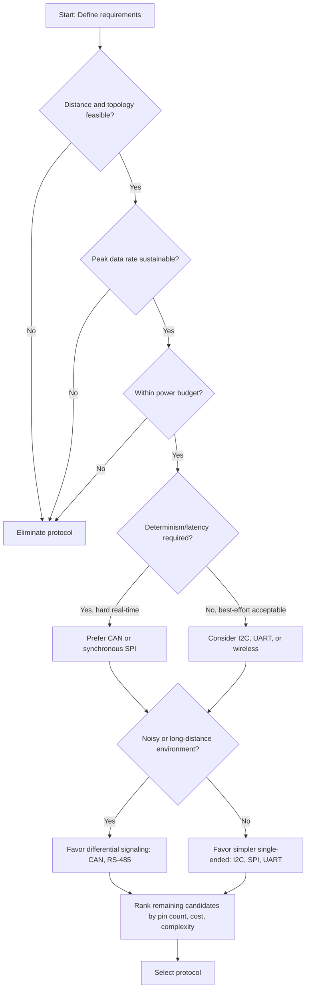

## Protocol Selection Criteria

### Overview

Choosing a communication protocol for an embedded system is a constrained optimization problem. No single protocol is universally superior; each represents a specific trade-off among throughput, latency, power consumption, wiring complexity, distance, cost, and software overhead. The selection process should start from system requirements (not from a preferred or familiar protocol) and eliminate candidates that violate hard constraints before optimizing among the survivors.

### Primary Selection Criteria

#### Data Rate and Bandwidth Requirements

The required throughput sets a hard floor that immediately eliminates unsuitable candidates.

- Low-rate sensor polling (temperature, humidity, simple ADC readings): I2C or UART are typically sufficient, often well under 100 kbps of effective payload.
- Moderate-rate control loops (motor control, multi-sensor fusion): SPI or higher-speed UART, into the low Mbps range.
- High-rate streaming (audio, video, high-resolution sensor arrays): parallel interfaces, high-speed SPI, USB, or dedicated interfaces like I2S/CSI are usually required.

**Key Points**

- Always budget for peak, not average, data rate — bursty sensor data can momentarily saturate a link sized only for the mean.
- Account for protocol overhead (addressing, framing, CRC) since it reduces effective payload throughput below the nominal bit rate.

#### Latency and Determinism

Some applications tolerate variable delay; others require bounded, predictable response times.

- Hard real-time control (motor commutation, safety interlocks) generally favors deterministic protocols like CAN (with its priority-based arbitration) or synchronous SPI, where timing is not subject to unbounded retries.
- Soft real-time or best-effort telemetry can tolerate the variable latency of protocols like I2C (clock stretching, arbitration loss) or wireless links (retransmission, contention).

[Inference] Exact worst-case latency figures depend heavily on bus loading, clock speed, and implementation details, so system-specific analysis (e.g., CAN bus timing analysis) is typically necessary rather than relying on protocol category alone.

#### Distance and Physical Topology

- On-board, chip-to-chip (a few centimeters): I2C, SPI.
- Board-to-board or intra-enclosure (tens of centimeters to a few meters): UART, CAN, RS-485.
- Building or vehicle-scale (tens to hundreds of meters): RS-485, CAN, Ethernet.
- Long-range or where wiring is impractical: wireless protocols (BLE, Wi-Fi, LoRa, Zigbee, cellular).

Topology also matters: I2C and CAN natively support multi-drop bus topologies with many nodes sharing two wires; SPI natively supports a star topology with a dedicated chip-select per device, which scales wiring poorly as device count grows; UART is inherently point-to-point.

#### Power Consumption

Power budget is often the dominant constraint for battery-operated devices.

- Wired protocols (I2C, SPI, UART) generally consume less energy per bit than wireless protocols because they avoid RF transmission overhead and the associated power amplifier draw.
- Among wireless options, BLE and Zigbee are designed for low average power via duty-cycled operation and low-power sleep states, whereas Wi-Fi and cellular radios draw substantially more power, particularly during association/connection setup.
- Protocol choice interacts with sleep strategy: a protocol that requires the radio or bus master to remain active (polling-based) will consume more power than an event- or interrupt-driven design.

**Example**

A battery-powered soil moisture sensor reporting once per hour is well suited to BLE advertising packets or LoRa, both of which allow the radio to remain off for the vast majority of the duty cycle; using Wi-Fi for the same task would shorten battery life considerably due to the overhead of associating with an access point on each wake cycle.

#### Number of Devices and Addressing

- I2C supports many devices on one bus using 7-bit or 10-bit addressing, but practical limits emerge from bus capacitance and address collisions between components from different vendors.
- SPI requires one chip-select line per device (or more complex daisy-chaining/addressing schemes for some peripherals), so device count is constrained by available GPIO.
- CAN supports many nodes without a formal addressing scheme, arbitrating access by message identifier priority instead of by node.
- UART is fundamentally point-to-point and requires additional hardware (UART multiplexers, RS-485 transceivers) to support multiple devices.

#### Pin Count and Hardware Cost

Pin availability on the microcontroller is frequently a hard constraint, especially on low-pin-count packages.

- I2C: 2 pins (SDA, SCL) regardless of device count.
- SPI: 4 pins minimum per device in the simplest configuration (SCLK, MOSI, MISO, CS), though CS lines multiply with device count.
- UART: 2 pins (TX, RX) per point-to-point link.
- CAN: 2 pins (CAN_H, CAN_L) shared across all nodes on the bus, but it requires a dedicated CAN transceiver IC and often a CAN controller if not integrated into the MCU.

#### Noise Environment and Reliability

- Automotive, industrial, and motor-adjacent environments have high electromagnetic interference, favoring differential signaling protocols such as CAN or RS-485, which reject common-mode noise far better than single-ended signaling like standard I2C or UART.
- CAN additionally provides built-in error detection (CRC, acknowledgment, bit-stuffing violation detection) and automatic retransmission, which raises reliability in noisy environments at the cost of protocol complexity.
- For wireless links, environments with RF interference or many competing devices (e.g., dense Wi-Fi deployments) can degrade the reliability of protocols sharing the same unlicensed spectrum, such as BLE and Wi-Fi both operating in the 2.4 GHz band.

#### Software and Hardware Complexity

- I2C and SPI are usually implemented directly by MCU peripheral hardware, requiring comparatively simple driver code.
- CAN requires a CAN controller and transceiver plus a more involved software stack to manage message filtering, identifiers, and error states.
- Wireless protocols (Wi-Fi, BLE) require substantially more complex stacks (association, encryption, connection management) and often more RAM/flash than the application logic itself, which can be a limiting factor on resource-constrained MCUs.

[Unverified] Specific RAM/flash footprint figures vary widely by vendor stack and protocol version, so they should be checked against the specific SDK/library being used rather than assumed from protocol category alone.

#### Cost

- Per-unit bill-of-materials cost matters at scale: I2C and SPI require no external transceiver in most cases, keeping cost low.
- CAN requires a transceiver IC on every node.
- Wireless protocols require a radio module or SoC with integrated radio, plus antenna considerations (matching network, shielding, certification), which raises both component cost and certification/compliance cost (e.g., FCC, CE).

### Decision Framework

A practical elimination order:

1. **Eliminate by distance/topology** — does the protocol physically reach all nodes in the required arrangement?
2. **Eliminate by data rate** — can it sustain peak throughput with margin?
3. **Eliminate by power budget** — is average and peak current draw within the energy budget (especially for battery/energy-harvesting systems)?
4. **Eliminate by determinism** — does the application require bounded latency, and does the protocol provide it?
5. **Rank survivors by pin count, cost, and software complexity** — among protocols that satisfy the hard constraints, choose the simplest and cheapest.

### Protocol Comparison Diagram

<svg xmlns="http://www.w3.org/2000/svg" viewBox="0 0 900 560">
\<style\>
.title { font: bold 18px sans-serif; fill: #1a1a1a; }
.axis { font: 12px sans-serif; fill: #333; }
.label { font: bold 13px sans-serif; fill: #1a1a1a; }
.sub { font: 11px sans-serif; fill: #555; }
.grid { stroke: #ddd; stroke-width: 1; }
\</style\>
<text x="450" y="30" text-anchor="middle" class="title">Protocol Selection Space: Range vs. Data Rate (svg_diagram)</text>

<line x1="100" y1="480" x2="820" y2="480" stroke="#333" stroke-width="2" />
<line x1="100" y1="480" x2="100" y2="70" stroke="#333" stroke-width="2" />
<text x="460" y="520" text-anchor="middle" class="axis">Range (log scale) →</text>
<text x="40" y="270" text-anchor="middle" class="axis" transform="rotate(-90 40 270)">Data Rate (log scale) →</text>

<line x1="220" y1="70" x2="220" y2="480" class="grid" />
<line x1="380" y1="70" x2="380" y2="480" class="grid" />
<line x1="540" y1="70" x2="540" y2="480" class="grid" />
<line x1="700" y1="70" x2="700" y2="480" class="grid" />
<line x1="100" y1="380" x2="820" y2="380" class="grid" />
<line x1="100" y1="280" x2="820" y2="280" class="grid" />
<line x1="100" y1="180" x2="820" y2="180" class="grid" />

<text x="220" y="500" text-anchor="middle" class="sub">cm</text>

<text x="380" y="500" text-anchor="middle" class="sub">m</text>

<text x="540" y="500" text-anchor="middle" class="sub">10s of m</text>

<text x="700" y="500" text-anchor="middle" class="sub">km+</text>

<circle cx="180" cy="380" r="26" fill="#4a90d9" opacity="0.85" />
<text x="180" y="384" text-anchor="middle" fill="white" class="sub" font-weight="bold">I2C</text>

<circle cx="180" cy="180" r="30" fill="#50b06b" opacity="0.85" />
<text x="180" y="184" text-anchor="middle" fill="white" class="sub" font-weight="bold">SPI</text>

<circle cx="260" cy="330" r="24" fill="#e0a030" opacity="0.85" />
<text x="260" y="334" text-anchor="middle" fill="white" class="sub" font-weight="bold">UART</text>

<circle cx="480" cy="300" r="26" fill="#c0503f" opacity="0.85" />
<text x="480" y="304" text-anchor="middle" fill="white" class="sub" font-weight="bold">CAN</text>

<circle cx="540" cy="330" r="24" fill="#9b59b6" opacity="0.85" />
<text x="540" y="334" text-anchor="middle" fill="white" class="sub" font-weight="bold">RS-485</text>

<circle cx="440" cy="230" r="24" fill="#3aafa9" opacity="0.85" />
<text x="440" y="234" text-anchor="middle" fill="white" class="sub" font-weight="bold">BLE</text>

<circle cx="500" cy="130" r="28" fill="#e0574a" opacity="0.85" />
<text x="500" y="134" text-anchor="middle" fill="white" class="sub" font-weight="bold">Wi-Fi</text>

<circle cx="740" cy="420" r="24" fill="#5a5a8a" opacity="0.85" />
<text x="740" y="424" text-anchor="middle" fill="white" class="sub" font-weight="bold">LoRa</text>

<circle cx="620" cy="120" r="26" fill="#2f7d4f" opacity="0.85" />
<text x="620" y="124" text-anchor="middle" fill="white" class="sub" font-weight="bold">Ethernet</text>

<text x="450" y="550" text-anchor="middle" class="sub">Bubble position is approximate and illustrative, not to precise scale</text>

</svg>

### Decision Flow

### Common Trade-off Scenarios

**Example**

A wearable fitness tracker needs to sample an accelerometer at high rate internally, but only needs to transmit summarized data to a phone periodically. This typically results in a two-protocol architecture: SPI or I2C between the MCU and accelerometer (short distance, moderate rate, low power), and BLE between the MCU and phone (longer range, low duty cycle, optimized for battery life). No single protocol satisfies both link requirements simultaneously, which is why embedded systems frequently use multiple protocols internally and externally rather than one universal choice.

**Example**

An industrial factory floor with dozens of sensors and actuators spread across a large physical area, in an electrically noisy environment with motors and variable-frequency drives, is a strong fit for CAN or RS-485 rather than I2C, because I2C's single-ended signaling and short maximum bus length make it unreliable at that distance and noise level.

### Multi-Protocol Systems

It is common, and often necessary, for a single embedded product to use several protocols simultaneously, each matched to a specific sub-link:

- Sensor-to-MCU: I2C or SPI (short range, low power, simple).
- MCU-to-MCU or module-to-module within an enclosure: UART or SPI.
- Enclosure-to-enclosure or distributed nodes: CAN or RS-485.
- Device-to-cloud or device-to-phone: BLE, Wi-Fi, or cellular.

This layered approach means "protocol selection" is rarely a single decision for a whole system — it is a per-link decision repeated across the system's architecture.

### Related Topics

- Embedded Communication Protocols — I2C fundamentals and bus arbitration
- Embedded Communication Protocols — SPI modes and multi-slave configurations
- Embedded Communication Protocols — UART framing and baud rate tolerance
- Embedded Communication Protocols — CAN bus arbitration and error handling
- Embedded Communication Protocols — RS-485 multi-drop networking
- Embedded Communication Protocols — BLE GATT profile design for low-power devices
- Embedded Communication Protocols — Protocol stack layering and OSI model mapping in embedded systems
- Power budgeting for battery-operated embedded systems
- EMI/EMC design considerations for embedded PCB layout