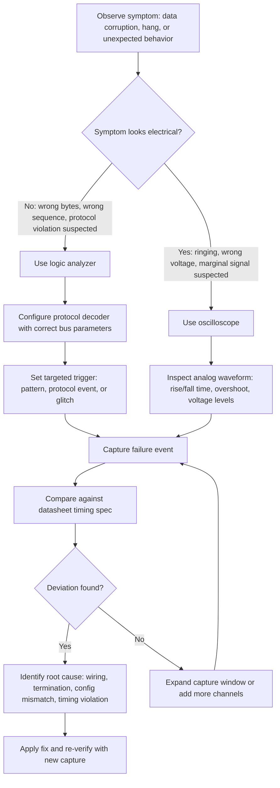

## Bus Analyzers and Protocol Debugging

### Overview

Bus analyzers are diagnostic tools that capture, decode, and display the electrical signals of a communication bus (I2C, SPI, UART, CAN, USB, etc.) so that engineers can verify protocol correctness, locate timing violations, and diagnose intermittent faults that are otherwise invisible to application-level debugging. Because embedded communication failures often stem from electrical-layer issues (noise, timing violations, incorrect voltage levels) rather than pure software bugs, bus analysis frequently sits at the intersection of hardware and firmware debugging.

### Categories of Bus Analysis Tools

#### Logic Analyzers

A logic analyzer samples digital signals (high/low states) at high speed across multiple channels simultaneously, then reconstructs the protocol-level meaning from the raw bit transitions.

- Captures raw logic levels (0/1) without regard to analog signal quality.
- Most modern logic analyzers include protocol decoders (I2C, SPI, UART, CAN, etc.) that overlay human-readable transaction data on top of the raw waveform.
- Sampling rate must be significantly higher than the bus clock rate to avoid aliasing; a common guideline is at least 4–10x oversampling relative to the fastest signal edge of interest.

**Key Points**

- Logic analyzers are generally lower-cost and easier to use for pure protocol-level debugging (correct bytes, correct sequence, correct timing) than oscilloscopes.
- They cannot reveal analog signal integrity issues such as ringing, overshoot, or marginal voltage levels, since they only report a signal as above or below a logic threshold.

#### Oscilloscopes

An oscilloscope captures the actual analog voltage waveform over time, which is necessary when a fault is suspected to originate in the analog domain.

- Useful for diagnosing signal integrity problems: ringing, reflections, insufficient rise/fall time, undershoot/overshoot, and incorrect voltage levels (e.g., a 3.3V device driving a line expected to reach 5V logic-high thresholds).
- Many mid-to-high-end oscilloscopes include built-in serial protocol decoding (I2C, SPI, UART, CAN) as an add-on feature, effectively merging logic-analyzer-style decoding with analog waveform capture.
- Mixed-signal oscilloscopes (MSOs) combine analog channels with digital logic channels in a single instrument, allowing correlation between an analog anomaly (e.g., a voltage droop) and its digital-level effect (e.g., a corrupted byte).

[Inference] Whether an oscilloscope or logic analyzer is the better first tool for a given fault typically depends on whether the symptom looks like a protocol/timing problem (favor logic analyzer) or a physical/electrical problem (favor oscilloscope), though this determination often requires trying one and switching to the other.

#### Dedicated Protocol Analyzers

Some tools are purpose-built for a single protocol family (e.g., CAN bus analyzers, USB protocol analyzers) and provide deeper protocol-specific features than general-purpose logic analyzers.

- CAN analyzers typically decode arbitration IDs, DLC fields, error frames, and bus-off events, and often include DBC file support for mapping raw CAN IDs to human-readable signal names.
- USB protocol analyzers decode the USB transaction/frame structure and can classify errors specific to the USB specification (e.g., NAK handling, enumeration failures).
- These tools generally offer more actionable protocol-specific diagnostics (e.g., "bus-off due to excessive error count") than a generic logic analyzer's raw decode.

### Core Debugging Workflow

#### Signal Capture Setup

1. Identify which signals need monitoring (clock, data, chip-select, differential pair, etc.).
2. Connect probes with correct ground reference — a missing or poor ground connection is a common source of noisy or unreliable captures.
3. Set the sampling rate high enough to resolve the fastest expected transition without aliasing.
4. Configure trigger conditions to capture the event of interest rather than continuously streaming irrelevant idle bus traffic.

#### Triggering Strategies

Efficient debugging depends on capturing the specific failure event rather than sifting through large amounts of idle or irrelevant traffic.

- **Edge triggers**: capture on a rising/falling edge of a specific signal — useful for a first, coarse capture.
- **Pattern triggers**: capture on a specific bit pattern or byte value (e.g., a specific I2C address, or a specific CAN identifier) — useful once the suspect transaction is known.
- **Protocol-aware triggers**: some analyzers can trigger on protocol-level events such as an I2C NACK, a SPI chip-select assertion, or a CAN error frame, which is far more targeted than a raw edge trigger.
- **Glitch triggers**: capture on pulses shorter than expected, useful for identifying spurious noise or bus contention.

**Example**

When debugging an intermittent I2C NACK that occurs roughly once every few thousand transactions, a plain edge trigger would fill the capture buffer with thousands of successful transactions before the fault occurs. Configuring the analyzer to trigger specifically on a NACK condition captures only the failure event (plus surrounding context), making the root cause visible without manually scrolling through a large capture.

#### Decoding and Interpretation

Once captured, the raw signal must be decoded into protocol-level transactions.

- Verify the decoder is configured with the correct bus parameters (clock polarity/phase for SPI, baud rate for UART, addressing mode for I2C, bit timing for CAN) — an incorrectly configured decoder produces garbage output that can be mistaken for a device fault.
- Cross-reference decoded transactions against the protocol specification or device datasheet timing diagrams to confirm expected sequencing (e.g., correct start condition, address, R/W bit, ACK/NACK, and stop condition for I2C).
- Look for deviations from expected timing (setup/hold violations, clock stretching duration, inter-frame gaps) as well as deviations from expected data content.

### Protocol-Specific Debugging Considerations

#### I2C

- Common faults: missing pull-up resistors (weak or absent rise time), address conflicts between devices, clock stretching that violates a master's timeout, and bus lockup from a slave holding SDA low.
- A logic analyzer trace showing a slow, rounded rising edge (rather than a sharp transition) is a strong indicator of insufficient pull-up strength or excessive bus capacitance.
- Multi-master arbitration issues can appear as unexpected NACKs or corrupted data when two masters attempt simultaneous transactions.

#### SPI

- Common faults: mismatched clock polarity/phase (CPOL/CPHA) between master and slave, incorrect bit order (MSB vs. LSB first), and chip-select timing violations relative to clock edges.
- Because SPI has no built-in acknowledgment mechanism, a mismatched configuration often produces plausible-looking but incorrect data rather than an obvious error — the analyzer must be configured with the correct CPOL/CPHA to decode meaningfully.

#### UART

- Common faults: baud rate mismatch (causing framing errors), incorrect parity/stop-bit configuration, and voltage-level mismatches (e.g., connecting a 5V UART directly to a 3.3V-only input).
- A logic analyzer can directly measure the actual baud rate from bit timing, which is useful for confirming whether a mismatch is due to clock source inaccuracy (e.g., an inaccurate internal RC oscillator) rather than a configuration error.

#### CAN

- Common faults: bus termination errors (missing or duplicate 120Ω termination resistors), bit-timing mismatches between nodes, and error-frame storms caused by a single faulty node.
- CAN analyzers reporting a rising error counter or transition to "bus-off" state on a node indicate that node is generating an excessive number of errors and should be electrically isolated to confirm whether it is the fault source.

**Key Points**

- Termination resistor problems on CAN often manifest as reflections visible only on an oscilloscope, not on a logic analyzer trace, since the logical bit values can still be read correctly despite significant signal degradation.

### Debugging Workflow Diagram

### Signal Path Illustration

<svg xmlns="http://www.w3.org/2000/svg" viewBox="0 0 900 400">
\<style\>
.title { font: bold 18px sans-serif; fill: #1a1a1a; }
.label { font: bold 13px sans-serif; fill: #1a1a1a; }
.sub { font: 11px sans-serif; fill: #555; }
.box { fill: #f4f6f8; stroke: #333; stroke-width: 1.5; }
\</style\>
<text x="450" y="30" text-anchor="middle" class="title">Bus Debugging Signal Path (svg_diagram)</text>

<rect x="60" y="150" width="120" height="80" rx="6" class="box" />
<text x="120" y="195" text-anchor="middle" class="label">MCU</text>

<line x1="180" y1="175" x2="380" y2="175" stroke="#333" stroke-width="2" />
<line x1="180" y1="205" x2="380" y2="205" stroke="#333" stroke-width="2" />
<text x="280" y="160" text-anchor="middle" class="sub">Clock</text>
<text x="280" y="225" text-anchor="middle" class="sub">Data</text>

<rect x="380" y="150" width="120" height="80" rx="6" class="box" />
<text x="440" y="195" text-anchor="middle" class="label">Peripheral</text>

<line x1="280" y1="175" x2="280" y2="100" stroke="#c0503f" stroke-width="2" stroke-dasharray="4,3" />
<line x1="280" y1="205" x2="330" y2="270" stroke="#c0503f" stroke-width="2" stroke-dasharray="4,3" />
<circle cx="280" cy="175" r="4" fill="#c0503f" />
<circle cx="280" cy="205" r="4" fill="#c0503f" />

<rect x="220" y="20" width="130" height="70" rx="6" class="box" fill="#eaf2fb" />
<text x="285" y="50" text-anchor="middle" class="label">Logic Analyzer</text>
<text x="285" y="68" text-anchor="middle" class="sub">/ Oscilloscope</text>

<rect x="580" y="130" width="280" height="140" rx="6" class="box" fill="#f0f7f0" />
<text x="720" y="155" text-anchor="middle" class="label">Decoded Transaction</text>
<text x="600" y="180" class="sub" font-family="monospace">START</text>
<text x="600" y="200" class="sub" font-family="monospace">ADDR: 0x50 W</text>
<text x="600" y="220" class="sub" font-family="monospace">ACK</text>
<text x="600" y="240" class="sub" font-family="monospace">DATA: 0xA3</text>
<text x="600" y="260" class="sub" font-family="monospace">STOP</text>
<line x1="500" y1="190" x2="580" y2="190" stroke="#333" stroke-width="1.5" marker-end="url(#arrow)" />
</svg>

### Interpreting Timing Diagrams

- Setup and hold time violations appear as data transitioning too close to a clock edge; the decoder or datasheet compliance check flags these as marginal or invalid samples.
- Jitter (variation in clock period) can be measured by comparing successive clock period measurements across a capture; excessive jitter can cause intermittent misreads even when the average clock rate is within specification.
- Inter-frame or inter-byte gaps that are shorter than a protocol's minimum requirement (e.g., I2C's minimum bus-free time between STOP and START conditions) can cause protocol violations that only manifest under specific timing conditions, contributing to intermittent rather than consistent failures.

### Common Pitfalls in Bus Debugging

**Key Points**

- Probing itself can alter signal behavior: high-impedance logic analyzer probes generally have minimal loading effect, but adding an oscilloscope probe with significant capacitance to a high-speed or marginal signal can change rise/fall time enough to mask or alter the very fault being investigated.
- Insufficient sample depth (buffer memory) can truncate a capture before an intermittent fault occurs, especially for rare events on a fast, high-traffic bus — increasing sample rate reduces effective capture duration for a fixed buffer size, so there is a direct trade-off between temporal resolution and capture window length.
- Ground loops or inadequate grounding between the analyzer and the device under test can introduce noise into the capture that does not exist in normal operation, leading to misdiagnosis of a probing artifact as a real hardware fault.
- Decoding with incorrect protocol parameters (wrong CPOL/CPHA, wrong baud rate, wrong address bit width) produces a corrupted decode that can be mistaken for a genuine device malfunction.

### Software-Level Debugging Complements

Bus analyzers address the electrical/protocol layer, but firmware-level tools are often used alongside them:

- **Debug UART/printf logging**: correlating a bus analyzer capture timestamp with application-level log output helps connect a low-level protocol event to the higher-level software state that triggered it.
- **In-circuit debuggers (JTAG/SWD)**: allow breakpointing firmware at the exact point a transaction is initiated, which can be combined with a triggered bus capture to see both the code path and the resulting electrical transaction.
- **RTOS trace tools**: in systems with real-time operating systems, task-switching traces can reveal whether a bus timing violation stems from a software scheduling delay (e.g., a higher-priority task delaying a time-sensitive bus transaction) rather than a purely electrical cause.

**Conclusion**

Effective bus-level debugging generally requires combining the right tool for the symptom (oscilloscope for electrical/analog issues, logic or protocol analyzer for protocol/timing issues) with a targeted triggering strategy and cross-referencing against the protocol specification and device datasheet. Because embedded bus failures are frequently intermittent and rooted in edge-case timing or electrical marginality rather than gross logic errors, systematic capture and correlation with firmware-level state is often necessary to reach a confirmed root cause rather than a plausible but unverified guess.

### Related Topics

- Embedded Communication Protocols — Protocol selection criteria
- Embedded Communication Protocols — I2C fundamentals and bus arbitration
- Embedded Communication Protocols — SPI modes and multi-slave configurations
- Embedded Communication Protocols — CAN bus arbitration and error handling
- Signal integrity fundamentals for embedded PCB design
- JTAG/SWD debugging fundamentals for embedded firmware
- EMI/EMC design considerations for embedded PCB layout
- Choosing sample rate and memory depth when selecting a logic analyzer