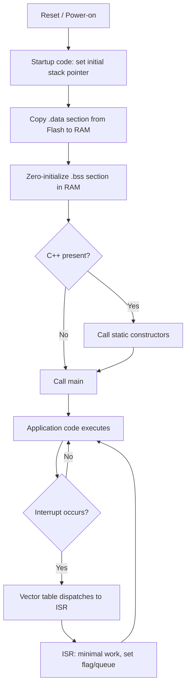

## C Language Fundamentals for Embedded Targets


### Overview

Embedded C differs from general-purpose application C not in core syntax but in the constraints and assumptions surrounding it: no operating system to reclaim leaked memory, direct hardware register access, tight memory budgets (often kilobytes, not gigabytes), and code that may need to behave deterministically and run for years without restart. Writing correct embedded C requires understanding both the language itself and the specific ways the language interacts with constrained, hardware-adjacent execution environments.

### Data Types and Sizing

#### Fixed-Width Integer Types

Standard C types (`int`, `long`, `short`) have platform- and compiler-dependent widths, which is unacceptable when a register is a specific bit width or a communication protocol expects an exact byte layout.

- `<stdint.h>` provides fixed-width types: `uint8_t`, `int8_t`, `uint16_t`, `int16_t`, `uint32_t`, `int32_t`, `uint64_t`, `int64_t`.
- `uint_fast8_t`, `uint_least8_t`, and similar variants specify a minimum width while allowing the compiler to choose a potentially wider, faster type — useful when exact width doesn't matter but a minimum guarantee does.
- Using `int` for a value that must fit in an 8-bit peripheral register risks silent truncation or, on some compilers/architectures, warnings that are easy to overlook without `-Wconversion` enabled.

**Key Points**

- Always use `<stdint.h>` types for hardware register definitions, protocol payloads, and any data that crosses a serialization boundary (network, storage, IPC).
- Plain `int` remains reasonable for loop counters and other purely local, non-serialized values where portability of exact width does not matter.

#### volatile Qualifier

`volatile` tells the compiler that a variable's value may change outside the normal flow of the program (via hardware, an interrupt handler, or another thread/core), which prevents the compiler from applying optimizations that assume the value is stable.

- Memory-mapped hardware registers must be declared `volatile`, or the compiler may cache a read in a register and never re-read the actual hardware state, causing the program to poll a stale value indefinitely.
- Variables shared between an interrupt service routine (ISR) and main-line code must be `volatile`, or the compiler may optimize away a read in a polling loop, believing the value cannot change since main-line code never writes it.
- `volatile` does not provide atomicity and does not act as a memory barrier or synchronization primitive; a `volatile uint32_t` can still be read/written non-atomically on architectures where a 32-bit access is not a single bus transaction, and `volatile` does not by itself prevent instruction reordering across different variables.

**Example**

```c
// Without volatile, the compiler may hoist this read out of the loop entirely,
// since nothing in the visible code path modifies status_reg.
volatile uint32_t *status_reg = (volatile uint32_t *)0x40001000;

while ((*status_reg & READY_FLAG) == 0) {
    // wait for hardware to set the flag
}
```

[Inference] The exact optimizations a compiler would apply without `volatile` depend on the specific compiler and optimization level, but omitting it on hardware-facing or ISR-shared variables is a well-documented and common source of bugs that manifest as intermittent, optimization-level-dependent failures.

#### const Qualifier and Placement in ROM/Flash

- `const` data can often be placed by the linker into read-only flash memory rather than consuming scarce RAM, which matters significantly on microcontrollers with far less RAM than flash (e.g., 256 KB flash but only 32 KB RAM is a common ratio on mid-range MCUs).
- Large lookup tables, string literals, and constant configuration structures should be declared `const` specifically to benefit from this placement, subject to the linker script correctly mapping `const` data into a flash section.
- `const` and `volatile` can be combined (`const volatile uint32_t *reg`) for read-only hardware status registers that can still change asynchronously — the `const` prevents accidental writes from software, while `volatile` prevents stale caching.

#### Structure Packing and Alignment

- The compiler may insert padding bytes between structure members to satisfy the target architecture's alignment requirements, which can silently change the in-memory size and layout of a structure.
- This matters heavily for structures that map directly onto hardware registers or serialized protocol payloads, where the layout must match an external specification exactly.
- `__attribute__((packed))` (GCC/Clang) or `#pragma pack` (many compilers, syntax varies) remove padding, forcing byte-exact layout — at the cost of potentially slower, unaligned memory access on architectures that penalize or disallow unaligned accesses.

**Example**

```c
// Without packing, the compiler may insert 3 bytes of padding after 'cmd'
// to align 'value' to a 4-byte boundary, making the struct 8 bytes instead of 5.
typedef struct __attribute__((packed)) {
    uint8_t  cmd;
    uint32_t value;
} protocol_frame_t;
```

[Inference] Whether unaligned access on a packed struct is silently slow, causes a bus fault, or is entirely fine depends on the specific target architecture (e.g., many ARM Cortex-M cores support unaligned access with a performance penalty, while some other architectures fault), so packed structures accessed on unfamiliar hardware should be verified against that architecture's alignment rules.

### Memory Management

#### Avoiding Dynamic Allocation

Many embedded systems avoid `malloc`/`free` entirely, or restrict them to a fixed initialization phase, for several well-established reasons:

- Heap fragmentation over long uptimes can eventually cause allocation failures even when the total free memory is nominally sufficient, which is especially problematic in systems expected to run for months or years without reboot.
- Allocation timing is generally non-deterministic (allocator search time can vary), which conflicts with hard real-time requirements.
- Many small embedded targets have no heap at all in their default linker configuration, or a heap sized so small that dynamic allocation offers little practical benefit over static allocation.

**Key Points**

- Static allocation (global/file-scope arrays, structures sized at compile time) and stack allocation are strongly preferred in resource-constrained or safety-relevant embedded code.
- Where dynamic-like behavior is genuinely needed, fixed-size memory pools (pre-allocated arrays of same-sized blocks managed with a free list) are commonly used instead of the general-purpose heap, because pool allocation is $O(1)$ and immune to fragmentation across differently-sized allocations.

#### Stack Size Considerations

- Embedded stacks are typically fixed-size and much smaller than a desktop OS thread's default stack (often a few KB rather than megabytes), so deep recursion or large local arrays/structures can silently overflow the stack.
- Stack overflow in a system without memory protection (no MPU/MMU enforcement) often corrupts adjacent memory (heap, static data, or another task's stack in an RTOS) rather than producing an immediate, obvious fault, making it a notoriously difficult class of bug to diagnose.
- Recursive algorithms are frequently rewritten iteratively in embedded C specifically to bound worst-case stack usage to a known, calculable value.

[Unverified] The exact stack margin considered "safe" is highly application- and architecture-specific and is typically determined via static stack usage analysis (many toolchains support `-fstack-usage`) or watermarking techniques rather than a fixed rule of thumb.

### Interrupt Service Routines (ISRs)

#### Writing Correct ISRs

- ISRs should generally be kept as short as possible, deferring substantial work to main-line code (e.g., by setting a flag or pushing to a queue that main-line code polls or an RTOS task processes), because interrupts often block lower-priority interrupts and always delay the return to whatever code was interrupted.
- Any variable shared between an ISR and main-line/other-ISR code must be `volatile`, and on architectures without atomic multi-byte access, may additionally require disabling interrupts briefly during the shared access to prevent a torn read/write.
- Calling non-reentrant functions from an ISR (e.g., many implementations of `malloc`, or standard library functions that use static internal state) can corrupt state if the same function is also called, or interrupted mid-call, from main-line code.

**Example**

```c
// Shared flag pattern: ISR sets, main loop clears after handling.
volatile uint8_t data_ready = 0;

void UART_IRQHandler(void) {
    // Minimal work: capture data, set flag, return quickly.
    rx_buffer[rx_index++] = UART->DR;
    data_ready = 1;
}

int main(void) {
    for (;;) {
        if (data_ready) {
            process_data();   // Deferred, longer-running work
            data_ready = 0;
        }
    }
}
```

#### Critical Sections

- A critical section (interrupts disabled, or a specific interrupt masked) is often required when main-line code performs a multi-step, non-atomic operation on data also touched by an ISR — otherwise the ISR could interleave mid-operation and observe or produce inconsistent state.
- Critical sections should be kept as short as possible, since disabling interrupts globally delays the response of every other interrupt source in the system, which can itself violate real-time requirements elsewhere in the system if held too long.

### Pointers and Hardware Access

#### Memory-Mapped I/O

Embedded C frequently accesses hardware peripherals by treating a specific memory address as a pointer to a hardware register.

```c
#define GPIO_BASE  0x40020000UL
#define GPIO_ODR   (*(volatile uint32_t *)(GPIO_BASE + 0x14))

GPIO_ODR |= (1 << 5);   // Set bit 5 (e.g., turn on an LED)
```

- Many vendor-supplied CMSIS or HAL headers define these mappings via structures overlaid on the peripheral's base address, which is generally preferable to hand-rolled macros because it reduces the chance of an address or offset typo and is auto-generated from the vendor's register specification.
- Reading a register that has read-side-effects (e.g., reading a UART data register that also clears a "data available" flag) must be done carefully — reading it in a debugger watch expression or an unintended extra place in code can silently alter hardware state.

#### Function Pointers and Interrupt Vector Tables

- The interrupt vector table is commonly implemented as an array of function pointers at a fixed memory location, where the hardware automatically jumps to the corresponding function pointer's address when an interrupt occurs.
- Function pointers are also used for hardware abstraction layers, allowing the same higher-level code to call different low-level driver implementations based on which pointer is currently installed (a common pattern for supporting multiple peripheral variants or runtime-selectable drivers).

### Preprocessor Usage

#### Conditional Compilation for Portability

- `#ifdef`/`#if defined(...)` blocks are commonly used to select between different hardware targets, peripheral configurations, or feature sets at compile time, avoiding runtime overhead for decisions that are actually fixed for a given build.
- Overuse of nested conditional compilation can significantly harm readability and testability; many embedded codebases mitigate this by isolating hardware-specific code behind a consistent function-based hardware abstraction layer (HAL) rather than scattering `#ifdef` throughout application logic.

#### Macros vs. Inline Functions

- Function-like macros are textually substituted and have no type checking, which can produce subtle bugs (e.g., operator precedence issues if arguments aren't parenthesized, or double-evaluation of an argument with side effects).
- `static inline` functions (available since C99) provide type checking and avoid double-evaluation, and on most modern embedded compilers achieve equivalent performance to a macro when actually inlined, making them generally preferable for anything beyond the simplest constant definitions.

**Example**

```c
// Macro pitfall: MAX(i++, j) evaluates i++ potentially twice.
#define MAX(a, b) ((a) > (b) ? (a) : (b))

// Safer: type-checked, single evaluation of arguments.
static inline int max_int(int a, int b) {
    return (a > b) ? a : b;
}
```

### Undefined and Implementation-Defined Behavior

- Signed integer overflow is undefined behavior in standard C; on many embedded targets it happens to wrap using two's-complement arithmetic in practice, but the compiler is permitted to assume it never occurs and can optimize based on that assumption, which has caused real-world bugs when optimization settings change.
- Unsigned integer overflow, by contrast, is well-defined by the C standard to wrap modulo $2^n$, which is why loop counters and bit-manipulation code frequently prefer unsigned types when wraparound behavior is intentionally relied upon.
- Reading an uninitialized local variable, accessing an array out of bounds, or dereferencing a null/dangling pointer are all undefined behavior; on embedded targets without memory protection, these often do not crash immediately and instead silently corrupt unrelated memory, making them harder to detect than on a desktop OS where a segfault is common.

[Inference] The practical consequences of relying on implementation-defined or undefined behavior vary by compiler, optimization level, and target architecture, so behavior observed on one toolchain/target combination should not be assumed to hold on another without verification.

### Startup Sequence and the C Runtime

#### What Happens Before main()

On a typical bare-metal embedded target, a startup routine (often assembly or low-level C, provided by the vendor toolchain or written by the developer) runs before `main()` and is responsible for:

1. Setting the initial stack pointer.
2. Copying initialized global/static data (the `.data` section) from flash into RAM, since RAM contents are not guaranteed to persist or be pre-loaded, while flash contents are.
3. Zeroing uninitialized global/static data (the `.bss` section), since the C standard guarantees such data starts at zero but hardware RAM does not power up zeroed.
4. Optionally calling C++ static constructors, if C++ is used.
5. Branching to `main()`.

**Key Points**

- Global/static variables are guaranteed zero-initialized only after this startup sequence runs correctly; a misconfigured or bypassed startup routine (e.g., in some custom bootloader chaining scenarios) can leave `.bss` containing stale, non-zero memory.
- Understanding this sequence matters when debugging why a global variable appears to have an unexpected initial value, or when writing custom startup code for an unsupported target.

### Compiler-Specific Extensions and Portability

- Many embedded compilers (GCC-based, IAR, Keil/ARM Compiler) support extensions beyond standard C, such as `__attribute__` (GCC/Clang), `#pragma` variants, and intrinsics for specific instructions (e.g., saturating arithmetic, SIMD, or specific bit-manipulation instructions).
- Code intended to be portable across multiple compilers or targets should isolate compiler-specific extensions behind macros or a small abstraction header, so that switching toolchains requires changes in one place rather than scattered throughout the codebase.

### Code Size Optimization Techniques

- Compiler optimization flags (`-Os` for size, as opposed to `-O2`/`-O3` for speed) are commonly used on flash-constrained targets, trading some execution speed for a smaller binary footprint.
- Avoiding standard library functions that pull in large amounts of supporting code (e.g., full `printf` with floating-point formatting support) in favor of minimal custom implementations is a common technique when flash space is severely constrained.
- Link-time optimization (LTO) and enabling the linker to strip unused functions/sections (`--gc-sections` with corresponding per-function/per-data sections from `-ffunction-sections -fdata-sections`) can reduce final binary size by eliminating code that is compiled but never actually referenced.

### Startup and Memory Layout Diagram



### Memory Layout Illustration

<svg xmlns="http://www.w3.org/2000/svg" viewBox="0 0 700 480">
\<style\>
.title { font: bold 18px sans-serif; fill: #1a1a1a; }
.label { font: bold 13px sans-serif; fill: #1a1a1a; }
.sub { font: 11px sans-serif; fill: #555; }
.box { stroke: #333; stroke-width: 1.5; }
\</style\>
<text x="350" y="30" text-anchor="middle" class="title">Typical Embedded Memory Layout (svg_diagram)</text>


<text x="150" y="60" text-anchor="middle" class="label">Flash (Non-Volatile)</text>

<rect x="60" y="70" width="180" height="60" class="box" fill="`#fdeeee`" />

<text x="150" y="105" text-anchor="middle" class="sub">.text (code)</text>

<rect x="60" y="130" width="180" height="50" class="box" fill="#fdeeee" />
<text x="150" y="160" text-anchor="middle" class="sub">.rodata (const data)</text>
<rect x="60" y="180" width="180" height="50" class="box" fill="#fdeeee" />
<text x="150" y="210" text-anchor="middle" class="sub">.data (initial values)</text>

<line x1="240" y1="205" x2="420" y2="290" stroke="#333" stroke-width="2" marker-end="url(#arrow2)" />
<text x="330" y="240" class="sub">copied at startup</text>


<text x="510" y="60" text-anchor="middle" class="label">RAM (Volatile)</text>

<rect x="420" y="290" width="180" height="50" class="box" fill="`#eef4fb`" />

<text x="510" y="320" text-anchor="middle" class="sub">.data (working copy)</text>

<rect x="420" y="340" width="180" height="50" class="box" fill="#eef4fb" />
<text x="510" y="370" text-anchor="middle" class="sub">.bss (zero-init)</text>
<rect x="420" y="390" width="180" height="40" class="box" fill="#eef4fb" />
<text x="510" y="415" text-anchor="middle" class="sub">Heap (if used)</text>
<rect x="420" y="80" width="180" height="40" class="box" fill="#eef8ee" />
<text x="510" y="105" text-anchor="middle" class="sub">Stack (grows downward)</text>
</svg>

### Common Pitfalls Summary

**Key Points**

- Forgetting `volatile` on hardware registers or ISR-shared variables, producing optimization-dependent bugs that vanish or appear when switching optimization levels.
- Assuming signed overflow wraps predictably, which the compiler is not obligated to preserve under optimization.
- Deep or unbounded recursion overflowing a small, fixed-size stack with no hardware protection to catch it.
- Struct layout mismatches with external protocol/hardware specifications due to unaccounted-for padding.
- Using dynamic allocation in long-running systems without accounting for fragmentation risk over time.
- Performing non-trivial work inside an ISR, delaying other interrupts and potentially violating real-time deadlines elsewhere in the system.

### Related Topics

- Embedded C — Real-Time Operating System (RTOS) task and interrupt interaction
- Embedded C — Writing and using a Hardware Abstraction Layer (HAL)
- Embedded C — Static analysis and MISRA-C coding standards
- Embedded C — Linker scripts and memory section placement
- Embedded Communication Protocols — Protocol selection criteria
- Embedded Communication Protocols — Bus analyzers and protocol debugging
- Power budgeting for battery-operated embedded systems
- Watchdog timers and fault recovery strategies in embedded firmware