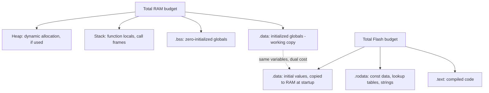

## Data Types and Memory Footprint Awareness

### Overview

Memory footprint awareness is the practice of deliberately choosing data types, structure layouts, and storage strategies based on their actual size and placement cost, rather than defaulting to whatever type is syntactically convenient. On embedded targets where RAM may be measured in kilobytes and flash budgets are fixed at manufacturing time, an inefficient type choice repeated across many variables or a large array can be the difference between a design that fits and one that doesn't.

### Fixed-Width Integer Types and Their Footprint

#### Why Width Matters

- `<stdint.h>` types (`uint8_t`, `uint16_t`, `uint32_t`, `uint64_t` and signed equivalents) guarantee an exact bit width across compilers and targets, unlike `int`/`long`/`short`, whose widths are only guaranteed to meet a *minimum*, not an exact size.
- Choosing the narrowest type that can hold the required value range directly reduces the memory used by that variable, and for arrays or structures repeated many times, the savings multiply linearly with element count.
- Narrower types are not automatically faster; on some architectures, operations on a type narrower than the native register width can require additional instructions to mask or sign-extend the value, so the "smallest type" choice is a memory-vs-possible-performance trade-off rather than a strict win on both axes.

**Example**

```c
// 1,000 elements at 4 bytes each = 4,000 bytes
uint32_t sensor_readings_32[1000];

// 1,000 elements at 1 byte each = 1,000 bytes, if the value range (0-255) permits it
uint8_t sensor_readings_8[1000];
```

Choosing `uint8_t` over `uint32_t` for this array saves 3,000 bytes of RAM — a meaningful fraction of total memory on a microcontroller with only 32 KB of RAM.

#### Fast and Least Variants

- `uint_least8_t` guarantees at least 8 bits with no upper bound, letting the compiler choose the smallest type available that satisfies the minimum — relevant on unusual architectures without a native 8-bit type.
- `uint_fast8_t` guarantees at least 8 bits but lets the compiler choose a potentially wider type if that type is faster to operate on for the target architecture, trading potential memory for potential speed.
- [Unverified] Actual behavior of `_fast` types (whether the compiler chooses a wider type, and how much faster it actually is) is architecture- and compiler-specific and should be checked against the target's `stdint.h` implementation rather than assumed.

### Structure Layout and Padding

#### Alignment Requirements

Most architectures require certain data types to be stored at memory addresses that are multiples of their size (e.g., a 4-byte `uint32_t` typically must start at an address divisible by 4). The compiler inserts padding bytes to satisfy this, which can silently inflate a structure's actual size beyond the sum of its members.

**Example**

```c
// Naive member ordering: likely 12 bytes due to padding
struct sensor_reading_a {
    uint8_t  id;       // 1 byte, then 3 bytes padding to align next member
    uint32_t value;    // 4 bytes
    uint8_t  status;   // 1 byte, then 3 bytes padding to align struct size to 4
};

// Reordered by descending size: likely 8 bytes, no padding needed
struct sensor_reading_b {
    uint32_t value;    // 4 bytes
    uint8_t  id;       // 1 byte
    uint8_t  status;   // 1 byte
    // 2 bytes padding to align struct size to 4, but 4 bytes total saved vs. above
};
```

[Inference] The exact padding inserted depends on the target architecture's alignment rules and the compiler's default packing behavior, so the specific byte counts above should be confirmed with `sizeof()` on the actual target rather than assumed universally, though the general principle (ordering members from largest to smallest alignment requirement minimizes padding) holds broadly across common architectures.

#### Ordering Members to Minimize Padding

**Key Points**

- Ordering structure members from largest alignment requirement to smallest (typically largest type to smallest type) generally minimizes total padding, since it avoids leaving small gaps between differently-sized members.
- `sizeof(struct_name)` should be checked directly on the target toolchain during development, particularly for structures used in large arrays or repeated many times, since padding overhead compounds with instance count.
- `__attribute__((packed))` or `#pragma pack` eliminates padding entirely, which is valuable for matching an external byte-exact specification (protocol frame, hardware register map) but can introduce unaligned access penalties or faults on some architectures when accessing the tightly packed members.

#### Bit-Fields for Sub-Byte Storage

When multiple flags or small-range values need to be stored compactly, bit-fields allow explicit control over how many bits each member occupies within a larger storage unit.

```c
typedef struct {
    uint8_t is_active   : 1;
    uint8_t has_error   : 1;
    uint8_t mode        : 3;   // supports values 0-7
    uint8_t reserved     : 3;
} status_flags_t;              // Packed into 1 byte total instead of 4 separate uint8_t/bool fields
```

- Bit-fields can reduce memory usage substantially when many boolean or small-range flags would otherwise each consume a full byte.
- The exact bit ordering (which bit-field occupies the most/least significant bit) and whether a bit-field is permitted to span a storage-unit boundary are implementation-defined by the C standard, meaning bit-field layout is not guaranteed portable across compilers or architectures.
- [Inference] Because bit-field layout is implementation-defined, bit-fields are generally unsuitable for matching an external byte-exact specification (e.g., a hardware register bit layout as documented in a datasheet) without verifying the actual compiled layout on the specific target and compiler, and explicit bit masking/shifting on a plain integer type is often preferred for that use case since its layout is fully deterministic.

### Enums and Their Storage Size

- The C standard permits the compiler to choose any integer type capable of representing all enumerator values, meaning `sizeof(enum_type)` is not guaranteed to be a specific size across compilers — it is commonly `int` (often 4 bytes) by default on many compilers even when all enumerator values would fit in a single byte.
- Some compilers offer extensions or flags (e.g., GCC's `-fshort-enums`, or `__attribute__((packed))` applied to an enum) to force the compiler to choose the smallest type that fits, which can matter when enums are used heavily in large arrays or structures.
- Where footprint and cross-compiler portability both matter, explicitly using a fixed-width type (e.g., `uint8_t`) with `#define` or `enum`-like named constants, rather than relying on `enum`'s default sizing behavior, avoids the ambiguity entirely.

### Placement: RAM vs. Flash

#### const Data and Read-Only Placement

- Data declared `const` and never modified at runtime can often be placed by the linker into flash (read-only, non-volatile memory) rather than RAM, which matters because embedded targets frequently have far more flash than RAM (e.g., 512 KB flash vs. 64 KB RAM is a common ratio on mid-range microcontrollers).
- This placement is linker-script-dependent; simply declaring a variable `const` does not guarantee flash placement unless the toolchain's default linker script (or a custom one) routes `const`/`.rodata` sections into flash — which is the common default behavior on most embedded toolchains, but should be verified via the linker map file for a given project.
- Large lookup tables, string literals used only for logging or fixed protocol responses, and static configuration data are strong candidates for `const` placement specifically to conserve RAM.

**Example**

```c
// Placed in flash (.rodata) on most toolchains, consuming no RAM at runtime
const uint16_t crc_lookup_table[256] = { /* ... precomputed values ... */ };
```

#### Static vs. Stack vs. Heap Trade-offs for Footprint

- Static/global allocation has a fixed, compile-time-known footprint that is easy to account for in a total memory budget, but persists for the entire program lifetime even when only used briefly.
- Stack allocation is reclaimed automatically when a function returns, making it efficient for short-lived data, but a fixed, generally small stack size means large local arrays or deeply nested calls with sizable locals risk overflow.
- Heap allocation (where used at all) offers flexible sizing at runtime but introduces fragmentation risk and non-deterministic allocation timing, both of which are frequently unacceptable trade-offs in memory-constrained or real-time embedded designs (see also: avoiding dynamic allocation).

### Measuring Actual Footprint

#### Using sizeof() and Map Files

- `sizeof(type)` or `sizeof(variable)` reports the compiler's actual chosen size at compile time and should be used directly during development rather than assumed from the C standard's minimum guarantees.
- The linker-generated map file (commonly `.map`, produced with a linker flag such as `-Map=output.map` in GCC-based toolchains) reports the actual size and placement of every symbol, section, and the overall `.text`/`.data`/`.bss` totals, providing ground truth for total flash and RAM consumption.
- Toolchain-provided size utilities (e.g., `size` in GNU binutils) give a quick summary of `.text`, `.data`, and `.bss` section sizes without requiring a full map file inspection, useful for quick iteration during development.

**Key Points**

- `.data` size counts against both flash (the initial values must be stored there) and RAM (the working copy occupies RAM at runtime), so a large initialized global array has a footprint cost in two separate budgets simultaneously.
- `.bss` (zero-initialized/uninitialized globals) counts only against RAM, since no initial values need to be stored in flash — the startup code simply zeroes the region.
- Stack and heap usage do not appear directly in static `.data`/`.bss`/`.text` totals, since their size is runtime-dependent; these require separate analysis (static stack usage analysis, heap high-water-mark tracking) to bound accurately.

### Memory Budget Allocation Diagram



### Type Selection Decision Diagram

<svg xmlns="http://www.w3.org/2000/svg" viewBox="0 0 900 460">
\<style\>
.title { font: bold 18px sans-serif; fill: #1a1a1a; }
.label { font: bold 12px sans-serif; fill: #1a1a1a; }
.sub { font: 11px sans-serif; fill: #555; }
.box { stroke: #333; stroke-width: 1.5; }
\</style\>
<text x="450" y="30" text-anchor="middle" class="title">Choosing a Data Type for Footprint (svg_diagram)</text>
<rect x="360" y="55" width="180" height="50" rx="6" class="box" fill="#f4f6f8" />
<text x="450" y="85" text-anchor="middle" class="label">What value range is needed?</text>
<line x1="400" y1="105" x2="220" y2="160" stroke="#333" stroke-width="1.5" />
<line x1="500" y1="105" x2="680" y2="160" stroke="#333" stroke-width="1.5" />
<rect x="100" y="160" width="240" height="50" rx="6" class="box" fill="#eaf2fb" />
<text x="220" y="182" text-anchor="middle" class="sub">Fits in 0-255 or -128..127</text>
<text x="220" y="198" text-anchor="middle" class="sub">→ use uint8_t / int8_t</text>
<rect x="560" y="160" width="240" height="50" rx="6" class="box" fill="#eaf2fb" />
<text x="680" y="182" text-anchor="middle" class="sub">Needs larger range</text>
<text x="680" y="198" text-anchor="middle" class="sub">→ uint16_t / uint32_t as required</text>
<line x1="220" y1="210" x2="220" y2="250" stroke="#333" stroke-width="1.5" />
<rect x="100" y="250" width="240" height="60" rx="6" class="box" fill="#eef8ee" />
<text x="220" y="272" text-anchor="middle" class="sub">Used many times</text>
<text x="220" y="288" text-anchor="middle" class="sub">(array/struct field)?</text>
<text x="220" y="302" text-anchor="middle" class="sub">→ savings compound</text>
<line x1="680" y1="210" x2="680" y2="250" stroke="#333" stroke-width="1.5" />
<rect x="560" y="250" width="240" height="60" rx="6" class="box" fill="#fdeeee" />
<text x="680" y="272" text-anchor="middle" class="sub">Written but never</text>
<text x="680" y="288" text-anchor="middle" class="sub">modified at runtime?</text>
<text x="680" y="302" text-anchor="middle" class="sub">→ mark const, favor flash</text>
<line x1="220" y1="310" x2="450" y2="360" stroke="#333" stroke-width="1.5" />
<line x1="680" y1="310" x2="450" y2="360" stroke="#333" stroke-width="1.5" />
<rect x="330" y="360" width="240" height="60" rx="6" class="box" fill="#fff8e0" />
<text x="450" y="382" text-anchor="middle" class="sub">Verify with sizeof() and</text>
<text x="450" y="398" text-anchor="middle" class="sub">linker map file on actual target</text>
</svg>

### Common Footprint Pitfalls

**Key Points**

- Assuming `enum` is always 1 byte, when many compilers default to a wider type (often `int`) unless a specific packing flag or attribute is used.
- Declaring large read-only tables without `const`, forcing them into RAM when they could reside in flash instead.
- Ignoring structure member ordering, leaving avoidable padding that compounds significantly across large arrays of that structure.
- Relying on the C standard's *minimum* width guarantees for `int`/`long`/`short` rather than checking actual compiled width via `sizeof()` on the target toolchain.
- Estimating total memory usage from source code alone rather than consulting the linker map file, which reports actual, ground-truth placement and size after all compiler and linker decisions have been applied.

**Conclusion**

Memory footprint awareness in embedded C is primarily about recognizing that every type, structure layout, and storage-class decision has a measurable and often multiplicative cost in a fixed, non-negotiable memory budget. Choosing fixed-width types matched to actual value ranges, ordering structure members to minimize padding, routing immutable data toward flash via `const`, and verifying actual sizes with `sizeof()` and the linker map file — rather than assuming behavior from the C standard's minimum guarantees — are the core practices that keep a design within budget as it grows.

### Related Topics

- Embedded C — C language fundamentals for embedded targets
- Embedded C — Linker scripts and memory section placement
- Embedded C — Static analysis and MISRA-C coding standards
- Embedded C — Avoiding dynamic allocation and memory pool design
- Embedded Communication Protocols — Protocol selection criteria
- Power budgeting for battery-operated embedded systems
- Choosing microcontroller RAM/flash sizing during hardware selection