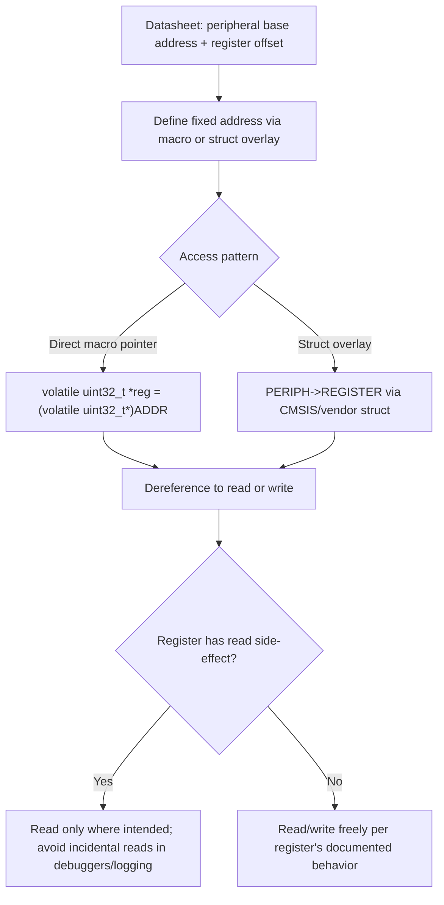

## Pointers and Memory Addressing


### Overview

Pointers are the primary mechanism by which embedded C code interacts directly with physical memory addresses — hardware registers, fixed memory regions, interrupt vector tables, and manually managed buffers. Unlike application-level programming where pointers mostly reference heap or stack objects abstracted by an operating system, embedded pointer usage frequently targets specific, fixed physical addresses defined by a hardware datasheet, making correct pointer arithmetic, typing, and dereferencing directly consequential for hardware behavior rather than purely a memory-safety concern.

### Pointer Fundamentals in an Embedded Context

#### What a Pointer Represents

- A pointer holds a memory address, and its declared type determines how the compiler interprets the bytes at that address and how many bytes an increment/decrement operation moves the pointer.
- On embedded targets, pointer width matches the architecture's address bus width (commonly 32 bits on many microcontrollers, though 16-bit and 64-bit targets exist), meaning `sizeof(void*)` reflects the target's addressing capability rather than a fixed universal value.
- A pointer can be made to reference any absolute address, including addresses with no valid backing memory (unmapped regions), and dereferencing such a pointer is undefined behavior that, on targets without a memory protection unit (MPU), may not fault immediately and can instead read or write unrelated hardware or memory.

#### Declaring and Using Basic Pointers

```c
uint32_t value = 42;
uint32_t *ptr = &value;   // ptr holds the address of value

*ptr = 100;               // Dereference: writes 100 into value's memory location
uint32_t read_back = *ptr; // Dereference: reads value's current content
```

**Key Points**

- `&` obtains the address of a variable; `*` dereferences a pointer to access the value at the address it holds.
- Pointer arithmetic is scaled by the pointed-to type's size: incrementing a `uint32_t*` advances the address by 4 bytes, while incrementing a `uint8_t*` advances by 1 byte — this scaling is a common source of off-by-N errors when the pointed-to type is chosen incorrectly for the intended traversal.

### Pointers to Fixed Hardware Addresses

#### Direct Register Access

Peripheral registers on memory-mapped architectures are accessed by treating a fixed numeric address as a pointer to the register's data type, most often combined with `volatile` to prevent the compiler from caching stale values.

```c
#define GPIO_ODR_ADDR   0x40020014UL

volatile uint32_t *gpio_odr = (volatile uint32_t *)GPIO_ODR_ADDR;
*gpio_odr |= (1 << 5);   // Set bit 5 without disturbing other bits
```

- The cast from an integer literal to a pointer type is required because C does not implicitly convert an integer constant to a pointer; the cast tells the compiler to treat that specific numeric value as an address.
- `volatile` is essential here specifically because hardware registers can change independent of program flow (or have write side effects), and omitting it risks the compiler optimizing away what it perceives as a redundant read or write.

#### Register Access via Structs

Rather than defining each register as a separate pointer, vendor header files (CMSIS for ARM Cortex-M targets, or equivalent vendor HALs for other architectures) commonly overlay a C struct onto a peripheral's base address, where each struct member corresponds to a specific register offset.

```c
typedef struct {
    volatile uint32_t MODER;
    volatile uint32_t OTYPER;
    volatile uint32_t OSPEEDR;
    volatile uint32_t PUPDR;
    volatile uint32_t IDR;
    volatile uint32_t ODR;
} GPIO_TypeDef;

#define GPIOA  ((GPIO_TypeDef *)0x40020000UL)

GPIOA->ODR |= (1 << 5);   // Equivalent effect, more readable and less error-prone
```

**Key Points**

- This pattern reduces the chance of an address-offset arithmetic mistake compared to hand-computing each register's address, since the struct's member layout — which must exactly match the datasheet's register map, including any reserved/padding fields — encodes the offsets once.
- The struct's member order and any explicit reserved fields must exactly match the datasheet's register map layout, since struct member offsets (and any compiler-inserted padding) determine the effective addresses; a missing reserved field or incorrect member order silently misaligns every subsequent register access.

### Pointer Arithmetic and Its Pitfalls

#### Array Traversal via Pointers

```c
uint16_t samples[100];
uint16_t *p = samples;

for (int i = 0; i < 100; i++) {
    process(*p);
    p++;   // Advances by sizeof(uint16_t) = 2 bytes, i.e., to the next element
}
```

- Pointer arithmetic on an array pointer moves in units of the pointed-to type's size, not in raw bytes, which is why `p++` correctly lands on the next `uint16_t` element rather than the next byte.
- Mixing pointer types during arithmetic (e.g., casting a `uint16_t*` to a `uint8_t*` mid-traversal) changes the effective step size and is a common source of buffer traversal bugs, particularly when manually parsing byte-oriented protocol data with a differently-typed pointer.

#### Out-of-Bounds and Dangling Pointers

- Advancing a pointer past the end of its valid array/buffer and dereferencing it is undefined behavior; on a target without an MPU, this frequently reads or corrupts adjacent memory silently rather than producing an immediate, diagnosable fault.
- A dangling pointer (one referencing memory that is no longer valid, such as a pointer to a stack-allocated local variable returned from a function after that function has returned) is especially dangerous in embedded systems, where subsequent interrupt activity or further function calls can overwrite that stack memory before the dangling pointer is next dereferenced, producing intermittent, timing-dependent corruption.

**Example**

```c
uint32_t *get_bad_pointer(void) {
    uint32_t local_value = 123;
    return &local_value;   // Returns address of a variable that ceases to exist
                            // once this function returns; the stack frame is reused
}
```

[Inference] The specific symptom of dereferencing a dangling stack pointer (garbage value, seemingly correct value, or crash) depends on what subsequent code has since overwritten that stack region, which is why such bugs often appear intermittent and timing-dependent rather than consistently reproducible.

### Function Pointers

#### Declaration and Use

Function pointers store the address of executable code rather than data, enabling runtime-selectable behavior without conditional branching at every call site.

```c
typedef void (*callback_t)(uint8_t data);

void handle_uart_byte(uint8_t data) { /* ... */ }
void handle_spi_byte(uint8_t data)  { /* ... */ }

callback_t active_handler = handle_uart_byte;

void dispatch(uint8_t data) {
    active_handler(data);   // Calls whichever function active_handler currently references
}
```

#### Common Embedded Uses

- **Interrupt vector tables**: an array of function pointers at a fixed, hardware-defined memory location, where the processor automatically loads the program counter from the corresponding entry when a given interrupt occurs.
- **Hardware abstraction layers**: a struct of function pointers ("driver ops" or "vtable" pattern) allows the same higher-level application code to operate against different underlying peripheral drivers by swapping which functions the pointers reference.
- **Bootloader-to-application handoff**: a bootloader may compute the application's reset vector address and jump to it via a function pointer constructed from a fixed offset, a pattern that requires careful attention to stack pointer reinitialization and vector table relocation.

[Unverified] The exact mechanism and required steps for bootloader-to-application handoff (vector table relocation registers, stack pointer reload sequence) are architecture-specific and should be verified against the target's reference manual rather than assumed to generalize across architectures.

### Pointer Qualifiers Relevant to Embedded Code

#### const with Pointers

C's `const` placement relative to `*` changes what is immutable — a frequent source of confusion.

```c
const uint32_t *p1;        // Pointer to const data: *p1 = x is invalid, p1 = &other is valid
uint32_t *const p2 = &x;   // Const pointer to data: *p2 = x is valid, p2 = &other is invalid
const uint32_t *const p3;  // Const pointer to const data: neither is valid
```

**Key Points**

- `const uint32_t *reg` is commonly used for read-only hardware status registers accessed through a pointer, signaling to both the compiler and future readers that the register should not be written through this pointer.
- Combined with `volatile` (`const volatile uint32_t *reg`), this expresses "this value can change outside program control, but this code must never write to it" — an accurate description of many hardware status/flag registers.

#### restrict Qualifier

- `restrict` (C99) is a hint to the compiler that, for the lifetime of the pointer, the referenced object will only be accessed through that specific pointer (or pointers derived from it), permitting more aggressive optimization since the compiler need not account for aliasing through other pointers.
- Commonly applied to function parameters in performance-sensitive routines (e.g., DSP-style buffer processing functions) where the caller guarantees input and output buffers do not overlap.
- Using `restrict` when the aliasing guarantee does not actually hold is undefined behavior, since the compiler may generate code that produces incorrect results if the pointers do, in fact, alias.

### Void Pointers and Generic Interfaces

- `void*` holds an address without an associated type, requiring an explicit cast before dereferencing, and is commonly used to build generic interfaces (e.g., a generic memory pool allocator, or a callback mechanism that passes an arbitrary user-supplied context pointer).
- Arithmetic on a `void*` is not standard C (its element size is undefined), though some compilers permit it as an extension treating it as `sizeof(char)`; portable code should cast to a sized pointer type before performing address arithmetic.

**Example**

```c
void timer_register_callback(void (*callback)(void *context), void *context);

// Later, in the callback:
void my_callback(void *context) {
    my_struct_t *data = (my_struct_t *)context;   // Cast back to the known concrete type
    // ...
}
```

### Null Pointers and Defensive Checks

- Dereferencing a null pointer is undefined behavior; on many embedded targets without memory protection, address 0 may not fault at all and can silently read or corrupt whatever happens to reside there (which, notably, is often the actual vector table base on some architectures, making a null-pointer bug particularly consequential rather than merely inert).
- Defensive null checks before dereferencing externally supplied or conditionally initialized pointers are a common and inexpensive safeguard, particularly at API boundaries between modules or when handling pointers returned from functions that can legitimately fail to produce a valid one.

### Pointer-to-Register Access Flow



### Memory Addressing Illustration

<svg xmlns="http://www.w3.org/2000/svg" viewBox="0 0 900 420">
\<style\>
.title { font: bold 18px sans-serif; fill: #1a1a1a; }
.label { font: bold 12px sans-serif; fill: #1a1a1a; }
.sub { font: 11px sans-serif; fill: #555; }
.box { stroke: #333; stroke-width: 1.5; }
\</style\>
<text x="450" y="30" text-anchor="middle" class="title">Pointer to Memory-Mapped Register (svg_diagram)</text>

<rect x="60" y="90" width="160" height="60" rx="6" class="box" fill="#eaf2fb" />
<text x="140" y="115" text-anchor="middle" class="label">gpio_odr</text>
<text x="140" y="135" text-anchor="middle" class="sub">value: 0x40020014</text>

<line x1="220" y1="120" x2="380" y2="120" stroke="#333" stroke-width="2" marker-end="url(#arrow3)" />
<text x="300" y="105" text-anchor="middle" class="sub">points to</text>


<text x="640" y="60" text-anchor="middle" class="label">Address Space</text>

<rect x="400" y="70" width="480" height="220" class="box" fill="`#f4f6f8`" />

<rect x="420" y="90" width="440" height="30" class="box" fill="#ffffff" />
<text x="440" y="110" class="sub" font-family="monospace">0x40020000 GPIOA_MODER</text>
<rect x="420" y="120" width="440" height="30" class="box" fill="#ffffff" />
<text x="440" y="140" class="sub" font-family="monospace">0x40020004 GPIOA_OTYPER</text>
<rect x="420" y="150" width="440" height="30" class="box" fill="#fdeeee" />
<text x="440" y="170" class="sub" font-family="monospace">0x40020014 GPIOA_ODR ← target</text>
<rect x="420" y="180" width="440" height="30" class="box" fill="#ffffff" />
<text x="440" y="200" class="sub" font-family="monospace">0x40020018 GPIOA_IDR</text>

<text x="450" y="330" class="sub">Dereferencing gpio_odr reads/writes the 4 bytes</text>

<text x="450" y="345" class="sub">starting at address 0x40020014, per the datasheet's register map.</text>

</svg>

### Common Pointer Pitfalls in Embedded Code

**Key Points**

- Omitting `volatile` on a pointer to a hardware register or ISR-shared memory, allowing the compiler to cache a stale read or eliminate what it perceives as a redundant write.
- Incorrect casts between pointer types of different sizes (e.g., truncating a 32-bit address through a 16-bit intermediate type on a target where that matters), silently corrupting the target address.
- Returning a pointer to a stack-local variable, producing a dangling pointer whose corruption is timing-dependent and often intermittent.
- Mismatched struct layout for a memory-mapped register block, where a missing reserved field or wrong member order silently misaligns every register access that follows it in the struct.
- Performing pointer arithmetic assuming byte-granularity when the pointer's type is wider than one byte, causing traversal to skip or overrun the intended range.
- Dereferencing a null or otherwise invalid pointer on a target without memory protection, where the access may silently succeed against unintended memory rather than faulting immediately.

**Conclusion**

Pointers in embedded C are the direct mechanism connecting software to physical hardware addresses, which raises the stakes of correct typing, qualification (`volatile`, `const`), and arithmetic well beyond general memory-safety concerns — an incorrect pointer here can silently alter hardware state, misread a register, or corrupt memory in ways that a desktop OS's memory protection would ordinarily prevent or immediately surface as a fault. Careful attention to pointer type width, qualifier usage, and exact address/offset correctness against the hardware datasheet is foundational to reliable low-level embedded code.

### Related Topics

- Embedded C — C language fundamentals for embedded targets
- Embedded C — Data types and memory footprint awareness
- Embedded C — Linker scripts and memory section placement
- Embedded C — Writing and using a Hardware Abstraction Layer (HAL)
- Embedded C — Interrupt service routines and critical sections
- Embedded Communication Protocols — Bus analyzers and protocol debugging
- Bootloader design and application handoff in embedded systems
- Memory Protection Units (MPUs) and fault isolation on embedded targets