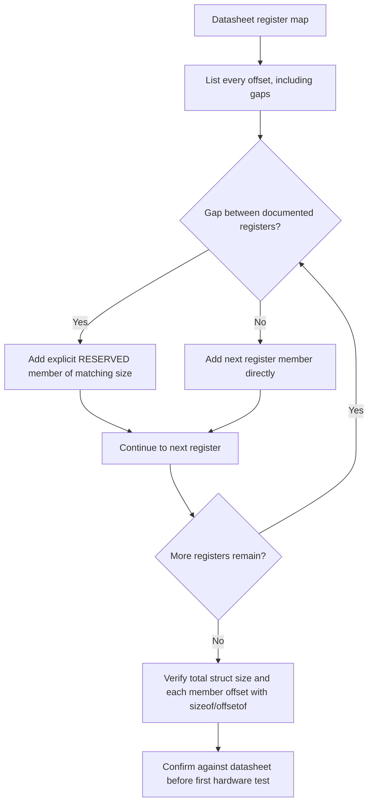

## Structs, Unions, and Bit-Fields

### Overview

Structs, unions, and bit-fields are the primary C constructs for organizing related data into composite types, and in embedded contexts they serve a purpose beyond code organization: they are frequently used to model hardware register layouts, protocol frame formats, and memory-efficient storage of many small flags or values. Because these constructs interact directly with memory layout — padding, alignment, byte ordering, and implementation-defined bit ordering — using them correctly for hardware-facing code requires understanding not just the language syntax but the underlying layout guarantees (and non-guarantees) the C standard provides.

### Structs

#### Basic Declaration and Use

A struct groups multiple, potentially differently-typed members into a single composite type, addressed as a contiguous block of memory.

```c
typedef struct {
    uint32_t timestamp;
    uint16_t sensor_id;
    int16_t  reading;
} sensor_sample_t;

sensor_sample_t sample = {
    .timestamp = 100000,
    .sensor_id = 3,
    .reading   = -42
};
```

**Key Points**

- Designated initializers (`.member = value`), available since C99, improve clarity and resilience to member reordering compared to positional initialization, and are widely supported by embedded toolchains.
- Struct member access uses `.` for a struct value and `->` for a pointer to a struct, with `->` being the common form when accessing hardware register structs through a pointer overlay.

#### Structs for Hardware Register Maps

As covered in pointer-based register access, vendor headers commonly define a struct whose members correspond, in order and size, to a peripheral's register map as documented in the datasheet.

```c
typedef struct {
    volatile uint32_t CR1;     // Control register 1, offset 0x00
    volatile uint32_t CR2;     // Control register 2, offset 0x04
    volatile uint32_t SR;      // Status register,    offset 0x08
    volatile uint32_t DR;      // Data register,       offset 0x0C
} UART_TypeDef;

#define UART1  ((UART_TypeDef *)0x40011000UL)

UART1->CR1 |= (1 << 3);        // Enable transmitter, per datasheet bit definition
```

- The struct's member order, size, and any reserved (unused) offsets must exactly mirror the datasheet's register map, since the compiler computes each member's address as an offset from the struct's base address, and a missing reserved field silently shifts every subsequent member's address.
- Reserved/unused offsets are typically represented with explicitly named padding members (e.g., `uint32_t RESERVED0;`) rather than omitted, to preserve correct offsets for the registers that follow.

#### Struct Layout for Protocol Frames

Structs are also commonly used to define the layout of a serialized protocol frame, though this use case interacts with padding in ways that require explicit control.

```c
typedef struct __attribute__((packed)) {
    uint8_t  frame_type;
    uint16_t payload_length;
    uint32_t crc;
} frame_header_t;   // 7 bytes exactly, with packing; without it, likely 8 due to alignment padding
```

[Inference] Whether the unpacked version pads to 8 bytes specifically depends on the target's alignment rules for `uint16_t` and `uint32_t`, but the general principle — that a naive struct's `sizeof()` may not equal the sum of its members' sizes — holds broadly, which is why `sizeof()` should be verified on the actual target rather than assumed from member declarations alone.

### Padding, Alignment, and Ordering

#### Why Padding Occurs

The compiler inserts padding bytes between (or after) struct members so that each member begins at an address satisfying its type's alignment requirement, and so that arrays of the struct maintain consistent alignment for every element.

**Example**

```c
struct example_a {
    uint8_t  a;    // offset 0
    uint32_t b;    // offset 4 (3 bytes padding inserted after 'a')
    uint8_t  c;    // offset 8
};                 // total size likely 12 (3 bytes trailing padding, to align array elements)

struct example_b {
    uint32_t b;    // offset 0
    uint8_t  a;    // offset 4
    uint8_t  c;    // offset 5
};                 // total size likely 8 (2 bytes trailing padding)
```

Reordering members from largest to smallest alignment requirement, as in `example_b`, generally reduces total padding compared to an unordered arrangement.

#### Controlling Layout Explicitly

- `__attribute__((packed))` (GCC/Clang) or `#pragma pack(n)` (widely supported, syntax varies by compiler) remove or reduce padding, forcing a tighter or byte-exact layout at the potential cost of unaligned member access, which some architectures handle transparently with a performance penalty and others disallow or fault on.
- Explicit padding members (e.g., `uint8_t reserved[2];`) can be added deliberately to document and control layout without relying on compiler-specific packing pragmas, which is useful when portability across compilers without a common packing syntax is required.
- `_Static_assert(sizeof(frame_header_t) == 7, "unexpected frame_header_t size");` (C11) is a common technique to catch layout assumptions being violated at compile time rather than discovering a mismatch only at runtime.

**Key Points**

- Always verify actual struct size with `sizeof()` on the target toolchain when the struct is used for a byte-exact external format; never assume size from the member list alone.
- Packed structs accessed on architectures with strict alignment requirements can cause a hardware fault (bus fault) rather than merely being slow, so packing should be paired with an understanding of the target architecture's unaligned access behavior.

### Unions

#### Basic Declaration and Use

A union declares multiple members that share the same memory location, with the union's total size equal to its largest member — allowing the same bytes to be interpreted through different types depending on which member is accessed.

```c
typedef union {
    uint32_t as_u32;
    uint8_t  as_bytes[4];
} word_view_t;

word_view_t w;
w.as_u32 = 0x12345678;
// w.as_bytes[0] through w.as_bytes[3] now provide byte-level access
// to the same 4 bytes, in whatever order the target's endianness dictates
```

#### Common Embedded Uses

- **Byte-level access to multi-byte values**: reinterpreting a 16- or 32-bit value as an array of bytes for serialization onto a byte-oriented bus (UART, SPI), without manual bit-shifting, though this approach's correctness depends on the target's endianness matching the protocol's expected byte order.
- **Overlaying different interpretations of the same hardware register**: some registers are documented with multiple valid interpretations (e.g., a control register readable as either a single 32-bit value or as individual named bit-field flags), and a union combined with a bit-field struct member is a common pattern to support both access styles.
- **Protocol message variants**: a union of differently-typed payload structs, paired with a separate type/tag field (a "tagged union" pattern), allows a single message structure to hold different payload shapes depending on message type, saving memory compared to allocating space for every possible variant simultaneously.

**Example**

```c
typedef struct {
    uint8_t message_type;
    union {
        struct { uint16_t temperature; } temp_reading;
        struct { uint8_t  button_id; uint8_t pressed; } button_event;
    } payload;
} message_t;
```

This tagged-union pattern allocates only enough memory for the largest payload variant, rather than the sum of all possible payload types, which matters when many message instances exist simultaneously (e.g., in a queue).

#### Type-Punning Caveats

- Using a union to reinterpret one member's bytes through a different member's type (type punning) is explicitly permitted by many C compilers as an extension and is common in embedded practice, but strictly reading a union member other than the one most recently written is technically undefined behavior per the C standard, though widely relied upon in practice on mainstream embedded compilers.
- [Unverified] Whether a specific compiler treats union type-punning as well-defined (as GCC documents it does, as an extension) should be checked against that compiler's documentation, since relying on undefined behavior — even widely-supported undefined behavior — is a portability risk when changing toolchains.
- Endianness affects the byte-level result of type-punning a multi-byte value; the same union code produces different byte orderings on a little-endian versus big-endian target, which matters significantly when the byte layout must match an external protocol specification rather than merely round-tripping within the same program.

### Bit-Fields

#### Declaration and Use

Bit-fields allow a struct member to occupy a specified number of bits rather than a whole byte or word, useful for compactly storing many small-range values or boolean flags.

```c
typedef struct {
    uint8_t enable    : 1;
    uint8_t mode      : 2;   // supports values 0-3
    uint8_t priority  : 3;   // supports values 0-7
    uint8_t reserved  : 2;
} config_flags_t;            // Likely occupies 1 byte total, given an 8-bit storage unit
```

**Key Points**

- Bit-fields reduce memory footprint substantially compared to using a full byte or word per flag, which matters when many flags are stored in a large array of structs or a frequently-instantiated message type.
- The declared type of a bit-field (commonly `unsigned int`, `int`, or a fixed-width type like `uint8_t` where the compiler permits it) affects the underlying storage unit the compiler uses to pack the bit-fields.

#### Layout Is Implementation-Defined

- The C standard leaves several bit-field layout decisions to the compiler: whether bits are allocated from the most-significant or least-significant end of the storage unit, whether a bit-field is permitted to span a storage-unit boundary, and the exact storage unit size chosen.
- Because of this, bit-field layout is not guaranteed portable across compilers or even across different optimization/target settings on the same compiler, and two compilers can produce genuinely different in-memory bit layouts from identical bit-field declarations.
- [Inference] For matching an external, byte-exact hardware register bit layout as documented in a datasheet, explicit bit masking and shifting on a plain integer type is generally more reliable than a bit-field struct, since masking/shifting behavior is fully specified by the standard while bit-field layout is not; bit-fields remain reasonable for internal-only flag storage where the exact bit arrangement is not externally significant.

**Example**

```c
// More portable alternative to a bit-field for a datasheet-defined register layout:
#define UART_CR1_ENABLE_Pos   3U
#define UART_CR1_ENABLE_Msk   (1U << UART_CR1_ENABLE_Pos)

UART1->CR1 |= UART_CR1_ENABLE_Msk;     // Set the enable bit
UART1->CR1 &= ~UART_CR1_ENABLE_Msk;    // Clear the enable bit
```

#### Bit-Fields and volatile

- Applying `volatile` to individual bit-field members of a struct overlaying a hardware register is supported by many compilers, but the resulting generated code (whether the compiler performs a read-modify-write of the whole storage unit, and whether that read-modify-write is atomic) is compiler- and architecture-specific.
- [Unverified] Because a bit-field write typically compiles to a read-modify-write sequence on the underlying storage unit, using bit-field structs directly over registers where individual bits have different access semantics (e.g., write-1-to-clear status bits) can produce unintended side effects on adjacent bits within the same storage unit; this should be verified against both the compiler's generated assembly and the register's documented access semantics before relying on it.

### Endianness Considerations

- Endianness (byte order: little-endian stores the least significant byte at the lowest address, big-endian stores the most significant byte at the lowest address) affects how multi-byte struct/union members are laid out in memory, independent of the C language's own layout rules for member ordering.
- Most common embedded architectures (many ARM Cortex-M configurations, x86) default to little-endian, but some architectures are big-endian or bi-endian (configurable), meaning code that assumes a specific byte order when serializing a struct directly onto a bus can produce incorrect results if ported to a different architecture, or when communicating with an external device using the opposite byte order.
- Protocol specifications commonly mandate a specific "wire" byte order regardless of the host's native endianness, requiring explicit conversion (e.g., `htons`/`ntohs`-style byte-swapping functions, or manual bit-shifting) rather than a direct struct-to-buffer memory copy, when the host and wire byte orders may differ.

**Key Points**

- Directly `memcpy`-ing a struct into a transmit buffer (or casting a receive buffer to a struct pointer) implicitly assumes the struct's in-memory byte order and padding exactly match the wire format, which is fragile across compilers, optimization settings, and architectures — explicit field-by-field serialization (reading/writing each field individually with defined byte order) is more portable, if more verbose.

### Struct/Union/Bit-Field Memory Layout Comparison

<svg xmlns="http://www.w3.org/2000/svg" viewBox="0 0 900 460">
\<style\>
.title { font: bold 18px sans-serif; fill: #1a1a1a; }
.label { font: bold 12px sans-serif; fill: #1a1a1a; }
.sub { font: 10px sans-serif; fill: #555; }
.box { stroke: #333; stroke-width: 1.5; }
\</style\>
<text x="450" y="30" text-anchor="middle" class="title">Struct vs. Union vs. Bit-Field Layout (svg_diagram)</text>


<text x="150" y="65" text-anchor="middle" class="label">Struct (sequential, padded)</text>

<rect x="60" y="80" width="60" height="40" class="box" fill="`#eaf2fb`" />

<text x="90" y="104" text-anchor="middle" class="sub">uint8_t a</text>

<rect x="120" y="80" width="60" height="40" class="box" fill="`#f4f4f4`" />

<text x="150" y="104" text-anchor="middle" class="sub">pad</text>

<rect x="180" y="80" width="80" height="40" class="box" fill="`#eaf2fb`" />

<text x="220" y="104" text-anchor="middle" class="sub">uint32_t b</text>

<text x="150" y="140" text-anchor="middle" class="sub">Each member has its own space</text>


<text x="450" y="65" text-anchor="middle" class="label">Union (overlapping)</text>

<rect x="380" y="80" width="140" height="40" class="box" fill="`#eef8ee`" />

<text x="450" y="104" text-anchor="middle" class="sub">as_u32 (4 bytes)</text>

<rect x="380" y="120" width="35" height="30" class="box" fill="`#fdeeee`" />

<text x="397" y="140" text-anchor="middle" class="sub">[0]</text>

<rect x="415" y="120" width="35" height="30" class="box" fill="`#fdeeee`" />

<text x="432" y="140" text-anchor="middle" class="sub">[1]</text>

<rect x="450" y="120" width="35" height="30" class="box" fill="`#fdeeee`" />

<text x="467" y="140" text-anchor="middle" class="sub">[2]</text>

<rect x="485" y="120" width="35" height="30" class="box" fill="`#fdeeee`" />

<text x="502" y="140" text-anchor="middle" class="sub">[3]</text>

<text x="450" y="175" text-anchor="middle" class="sub">Same 4 bytes, two interpretations</text>


<text x="740" y="65" text-anchor="middle" class="label">Bit-field (sub-byte packed)</text>

<rect x="640" y="80" width="200" height="40" class="box" fill="`#fff8e0`" />

<line x1="665" y1="80" x2="665" y2="120" stroke="#333" stroke-width="1" />

<line x1="715" y1="80" x2="715" y2="120" stroke="#333" stroke-width="1" />

<line x1="790" y1="80" x2="790" y2="120" stroke="#333" stroke-width="1" />

<text x="652" y="104" text-anchor="middle" class="sub">en</text>

<text x="690" y="104" text-anchor="middle" class="sub">mode</text>

<text x="752" y="104" text-anchor="middle" class="sub">priority</text>

<text x="815" y="104" text-anchor="middle" class="sub">rsv</text>

<text x="740" y="140" text-anchor="middle" class="sub">One byte, bit allocation is compiler-defined</text>

</svg>

### Register Struct with Reserved Fields Flow



### Common Pitfalls

**Key Points**

- Omitting a reserved/gap field in a hardware register struct, silently shifting every subsequent register's effective address.
- Relying on bit-field layout to match an external, datasheet-defined bit arrangement, when layout is implementation-defined and not guaranteed portable.
- Using a packed struct on an architecture that faults on unaligned access without verifying the target's tolerance for it first.
- Assuming a union's byte-level view matches wire protocol byte order without accounting for the target's actual endianness.
- Directly `memcpy`-ing a struct to/from a communication buffer, implicitly depending on padding and byte order matching the external format exactly.
- Performing a read-modify-write via a bit-field on a register where individual bits have special access semantics (e.g., write-1-to-clear), potentially clearing unrelated status bits unintentionally.

**Conclusion**

Structs, unions, and bit-fields provide powerful tools for organizing embedded data, but each carries layout guarantees that are weaker than they may first appear: struct padding depends on alignment rules, union type-punning technically relies on compiler-specific behavior, and bit-field bit ordering is entirely implementation-defined. For code where correctness depends on byte-exact layout — hardware registers, wire protocols — explicit verification via `sizeof()`, `offsetof()`, and, where necessary, explicit bit masking rather than reliance on default layout behavior is the more robust approach.

### Related Topics

- Embedded C — C language fundamentals for embedded targets
- Embedded C — Data types and memory footprint awareness
- Embedded C — Pointers and memory addressing
- Embedded C — Linker scripts and memory section placement
- Embedded Communication Protocols — Protocol selection criteria
- Endianness and byte-order conversion in embedded network code
- Static analysis and MISRA-C coding standards