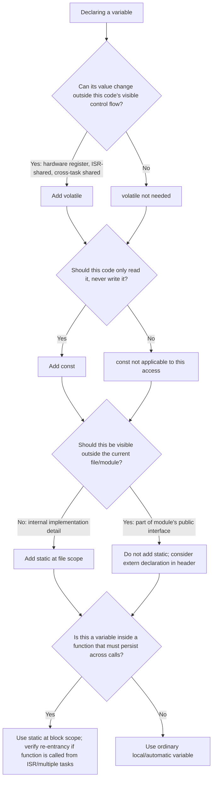

## Volatile, Const, and Static Qualifiers

### Overview

`volatile`, `const`, and `static` are three of the most consequential keywords in embedded C, not because their syntax is complex but because each interacts directly with compiler optimization, memory placement, and program lifetime in ways that have concrete hardware-level consequences. Misusing any of the three tends to produce bugs that are intermittent, optimization-level-dependent, or only visible when inspecting a linker map file — making a precise understanding of what each qualifier actually guarantees essential for reliable embedded code.

### The volatile Qualifier

#### What volatile Actually Means

`volatile` instructs the compiler that a variable's value may change through means outside the compiler's visibility into the current code path — hardware, an interrupt handler, or another execution context — and therefore every read and write to that variable in the source code must be preserved exactly as written, rather than optimized away, reordered relative to other volatile accesses, or cached in a register across accesses.

- Without `volatile`, a compiler is permitted to assume a variable's value cannot change unless the visible code path writes to it, and may therefore cache a single read in a register and reuse that cached value indefinitely, even inside a loop that appears to re-read the variable each iteration.
- With `volatile`, the compiler must generate an actual memory access (a load or store instruction) for every read or write in the source, in the order they appear relative to other volatile accesses.

**Example**

```c
volatile uint32_t *status_reg = (volatile uint32_t *)0x40001000;

// Without volatile, an optimizing compiler may transform this into an infinite loop
// that reads status_reg's value once and never checks hardware again, since nothing
// in the visible code path (from the compiler's perspective) modifies it.
while ((*status_reg & 0x01) == 0) {
    // wait for hardware flag
}
```

[Inference] The specific transformation an optimizer applies without `volatile` (whether it hoists the read entirely, caches it in a register, or eliminates the loop condition check) depends on the specific compiler and optimization level in use, but the general risk — an infinite or incorrect loop when polling non-volatile hardware state — is a well-documented and common consequence across mainstream embedded compilers.

#### When volatile Is Required

- **Memory-mapped hardware registers**: any address treated as a pointer to hardware state that can change independent of program flow, or where writes have side effects the compiler must not eliminate as apparently redundant.
- **Variables shared between an ISR and main-line code**: a flag or buffer index written by an interrupt handler and read by a polling loop in `main()` (or vice versa) must be `volatile`, or the compiler may assume the value is unchanged across the polling loop's iterations.
- **Variables shared across "threads" in a cooperative or RTOS-scheduled system**: any variable accessed by more than one task or execution context without the compiler being aware of the scheduling relationship.

#### What volatile Does NOT Provide

**Key Points**

- `volatile` does not guarantee atomicity. A `volatile uint32_t` read or write may still require multiple bus transactions on architectures where a 32-bit access is not naturally atomic, meaning an ISR could interrupt a main-line read/write mid-operation and observe a torn (partially updated) value.
- `volatile` does not act as a full memory barrier across different variables; it only orders volatile accesses relative to other volatile accesses, and does not by itself prevent the compiler or hardware from reordering non-volatile operations around it.
- `volatile` does not provide thread-safety or mutual exclusion. Protecting a multi-step, non-atomic update to shared data still requires a critical section (interrupts disabled, or an appropriate lock/mutex in an RTOS context) in addition to marking the data `volatile`.

[Unverified] Whether a given architecture's 32-bit (or other width) memory access is naturally atomic is architecture- and even instruction-sequence-specific, and should be confirmed against the target's reference manual rather than assumed, particularly for architectures without a guaranteed single-bus-cycle access for the type in question.

### The const Qualifier

#### Compiler-Enforced Immutability

`const` tells the compiler that, through this particular reference, the qualified data should not be modified, allowing the compiler to flag attempted writes as a compile-time error and enabling certain optimizations that assume the value is stable across the scope in which it is visible as `const`.

```c
const uint32_t max_retries = 5;
// max_retries = 10;   // Compile-time error: assignment of read-only variable
```

- `const` applied to a variable declaration prevents modification through that variable's name directly, though it does not prevent modification through a separately obtained non-const pointer to the same underlying memory (which is itself generally poor practice, and can be undefined behavior if the original object was actually defined `const`).
- `const` combined with pointers has two independent placements — pointer-to-const-data and const-pointer-to-data — each preventing a different kind of modification, as covered under pointer qualifiers.

#### const and Memory Placement

- Data declared `const` and never written at runtime is a strong candidate for placement into flash/ROM by the linker, rather than consuming RAM — a significant benefit on targets where flash capacity substantially exceeds RAM capacity.
- This placement is linker-script-dependent rather than an automatic consequence of the `const` keyword alone; most embedded toolchains route `const`/`.rodata` data into a flash-mapped section by default, but this should be confirmed via the project's linker script or map file rather than assumed universally.
- Large lookup tables, fixed configuration data, and string literals used only for logging or fixed protocol responses are common candidates for `const` specifically to benefit from flash placement and conserve RAM.

**Example**

```c
// Placed in flash on most toolchains by default linker script behavior,
// consuming no RAM at runtime.
const uint16_t crc16_table[256] = { /* precomputed values */ };
```

#### const with volatile for Read-Only Hardware State

```c
const volatile uint32_t *status_reg = (const volatile uint32_t *)0x40001000;
```

- Combining both qualifiers accurately expresses a common hardware pattern: the register's value can change asynchronously due to hardware (`volatile`), but software accessing it through this pointer should never write to it (`const`) — the compiler enforces the latter, `volatile` addresses the former.

### The static Qualifier

#### static at File Scope: Internal Linkage

A `static` global variable or function is visible only within the translation unit (source file) in which it is declared, rather than being accessible from other files via `extern`.

```c
// Only visible within this .c file; other files cannot reference it directly
static uint32_t internal_counter = 0;

static void helper_function(void) {
    internal_counter++;
}
```

**Key Points**

- File-scope `static` is a form of encapsulation in C, restricting a variable or function's visibility to implementation details of a single module, reducing the risk of accidental name collisions or unintended cross-module coupling in larger embedded codebases.
- Functions and variables not intended as part of a module's public interface should generally be declared `static`, both for encapsulation and because it can enable additional compiler optimizations (such as inlining) that are not available for externally-linkable symbols the compiler cannot prove are unused elsewhere.

#### static at Block Scope: Persistent Local Variables

A `static` variable declared inside a function retains its value between calls, rather than being reinitialized (and its storage reclaimed) each time the function returns, while still being scoped so that only that function can name it directly.

```c
void log_event(void) {
    static uint32_t call_count = 0;   // Initialized once, persists across calls
    call_count++;
    // ...
}
```

- Unlike a local (automatic/stack) variable, a `static` local variable is allocated in the `.data` or `.bss` section (depending on whether it has a non-zero initializer), giving it the same lifetime as a global variable while restricting its name's visibility to the enclosing function.
- This pattern is commonly used for simple state machines, call counters, or one-time-initialization flags within a single function, without exposing that state as a true global variable accessible from other functions.

[Inference] Because a `static` local variable behaves like a global in terms of storage duration and memory footprint, it counts against the same `.data`/`.bss` RAM budget as any other global-lifetime variable, which is a consideration when auditing total static memory usage via a linker map file — its function-local scope does not make it "free" relative to a true global.

#### static and Thread/Interrupt Safety

- A `static` local variable's persistent, shared storage means it is subject to the same re-entrancy concerns as a true global: if the containing function can be called from both an ISR and main-line code, or from multiple RTOS tasks, the `static` variable requires the same `volatile` and/or critical-section protection considerations as any other shared, mutable state.
- A function containing a `static` local variable that is modified is not re-entrant with respect to that variable, meaning calling the function recursively, or from an interrupt that preempts an in-progress call to the same function, can produce inconsistent results if the modification is not atomic or protected.

### Interactions Between the Three Qualifiers

#### const static Combinations

```c
static const uint8_t lookup_table[16] = { /* ... */ };
```

- `static const` at file scope combines internal linkage (visible only within this file) with flash placement eligibility (immutable, so eligible for `.rodata`), a common pattern for module-private constant data that need not be exposed outside its implementing file.

#### volatile static for Module-Private Hardware State Flags

```c
static volatile uint8_t rx_complete_flag = 0;   // ISR sets, this file's polling logic reads/clears
```

- Combines internal linkage (only this file's code references the flag by name) with the correctness guarantee that its value can change asynchronously (via an ISR in the same file) and must not be cached across accesses.

#### All Three Together

```c
static const volatile uint32_t *const status_ptr = (uint32_t *)0x40001000;
```

- File-scope-private (`static`), pointing to data that should not be written through this pointer (`const` on the pointed-to type) and can change asynchronously via hardware (`volatile`), where the pointer variable itself is also fixed once initialized (`const` on the pointer) — a fully qualified expression of "this file owns a fixed reference to a read-only, asynchronously-changing hardware register."

### Qualifier Decision Diagram



### Qualifier Effects Illustration

<svg xmlns="http://www.w3.org/2000/svg" viewBox="0 0 900 420">
\<style\>
.title { font: bold 18px sans-serif; fill: #1a1a1a; }
.label { font: bold 13px sans-serif; fill: #1a1a1a; }
.sub { font: 11px sans-serif; fill: #555; }
.box { stroke: #333; stroke-width: 1.5; }
\</style\>
<text x="450" y="30" text-anchor="middle" class="title">What Each Qualifier Controls (svg_diagram)</text>
<rect x="40" y="70" width="250" height="300" rx="8" class="box" fill="#eaf2fb" />
<text x="165" y="100" text-anchor="middle" class="label">volatile</text>
<text x="60" y="130" class="sub">Controls: optimizer behavior</text>
<text x="60" y="150" class="sub">Prevents: caching, reordering,</text>
<text x="60" y="168" class="sub">elimination of accesses</text>
<text x="60" y="200" class="sub">Does NOT provide:</text>
<text x="60" y="218" class="sub">atomicity, mutual exclusion,</text>
<text x="60" y="236" class="sub">general memory barriers</text>
<text x="60" y="270" class="sub">Typical use: hardware regs,</text>
<text x="60" y="288" class="sub">ISR-shared variables</text>
<rect x="325" y="70" width="250" height="300" rx="8" class="box" fill="#eef8ee" />
<text x="450" y="100" text-anchor="middle" class="label">const</text>
<text x="345" y="130" class="sub">Controls: write permission</text>
<text x="345" y="150" class="sub">via this reference</text>
<text x="345" y="182" class="sub">Enables: linker placement</text>
<text x="345" y="200" class="sub">into flash/.rodata</text>
<text x="345" y="232" class="sub">Does NOT prevent:</text>
<text x="345" y="250" class="sub">writes via a separate</text>
<text x="345" y="268" class="sub">non-const alias</text>
<text x="345" y="300" class="sub">Typical use: lookup tables,</text>
<text x="345" y="318" class="sub">read-only register views</text>
<rect x="610" y="70" width="250" height="300" rx="8" class="box" fill="#fff8e0" />
<text x="735" y="100" text-anchor="middle" class="label">static</text>
<text x="630" y="130" class="sub">Controls: linkage (file scope)</text>
<text x="630" y="150" class="sub">or lifetime (block scope)</text>
<text x="630" y="182" class="sub">File scope: hides symbol</text>
<text x="630" y="200" class="sub">from other translation units</text>
<text x="630" y="232" class="sub">Block scope: persists value</text>
<text x="630" y="250" class="sub">across function calls</text>
<text x="630" y="282" class="sub">Typical use: module-private</text>
<text x="630" y="300" class="sub">state, encapsulated helpers</text>
</svg>

### Common Pitfalls

**Key Points**

- Omitting `volatile` on a hardware register or ISR-shared variable, causing the compiler to cache a stale value or eliminate an apparently redundant access, with symptoms that often change or disappear entirely when the optimization level changes.
- Assuming `volatile` provides atomicity or thread-safety, and skipping a needed critical section around a multi-step update to shared state as a result.
- Assuming `const` guarantees a variable is placed in flash without confirming the linker script actually routes `.rodata` there for the specific target and toolchain in use.
- Using a `static` local variable inside a function called from both an ISR and main-line code (or from multiple RTOS tasks) without recognizing it introduces the same re-entrancy and shared-state concerns as a true global.
- Forgetting that a `static` local variable's storage counts against the same `.data`/`.bss` RAM budget as a global variable, since its function-local scope does not reduce its memory footprint.
- Declaring module-internal helper functions and variables without `static`, unnecessarily exposing them at link time and forgoing both encapsulation benefits and potential compiler optimizations.

**Conclusion**

`volatile`, `const`, and `static` each address a distinct concern — correctness under compiler optimization, write-protection and memory placement, and linkage/lifetime scoping, respectively — and embedded code frequently needs to reason about all three simultaneously when defining hardware-facing or module-private data. Precisely understanding what each qualifier does and does not guarantee, rather than treating them as interchangeable "safety" keywords, is necessary to avoid the class of bugs that only appear under specific optimization settings, specific interrupt timing, or specific linker configurations.

### Related Topics

- Embedded C — C language fundamentals for embedded targets
- Embedded C — Pointers and memory addressing
- Embedded C — Structs, unions, and bit-fields
- Embedded C — Interrupt service routines and critical sections
- Embedded C — Data types and memory footprint awareness
- Embedded C — Linker scripts and memory section placement
- Real-Time Operating System (RTOS) task and interrupt interaction
- Static analysis and MISRA-C coding standards