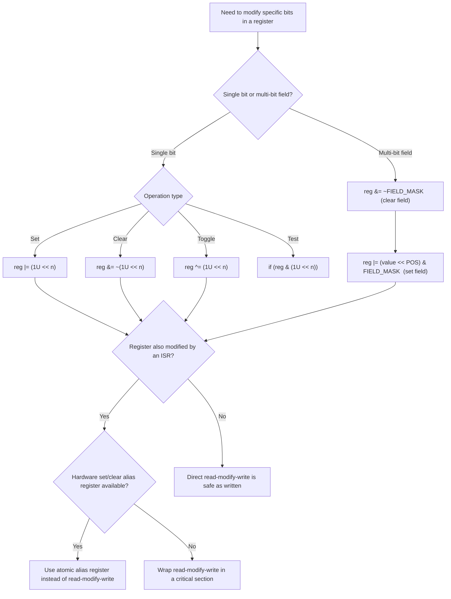

## Bitwise Operations and Register Manipulation

### Overview

Bitwise operations are the primary mechanism embedded C uses to read, set, clear, and toggle individual bits within hardware registers without disturbing unrelated bits in the same register. Because a single 32-bit control register often packs dozens of independent configuration fields — clock enables, mode selectors, interrupt flags — correct register manipulation depends on precise, predictable use of AND, OR, XOR, NOT, and shift operators, applied with masks that isolate exactly the bits intended to change.

### The Core Bitwise Operators

#### AND, OR, XOR, NOT

| Operator | Symbol | Common Register Use |
| --- | --- | --- |
| AND | `&` | Clearing bits (with an inverted mask), or testing/reading bit state |
| OR | `|` | Setting bits without disturbing others |
| XOR | `^` | Toggling bits |
| NOT | `~` | Inverting a mask, commonly paired with `&` to clear specific bits |

```c
uint32_t reg = 0x00;

reg = reg | (1 \<\< 3);    // Set bit 3:    reg becomes 0x08
reg = reg & ~(1 << 3);   // Clear bit 3:  reg becomes 0x00
reg = reg ^ (1 << 3);    // Toggle bit 3: flips its current state
```

**Key Points**

- `|=` sets bits without affecting others because OR-ing with 0 leaves a bit unchanged, while OR-ing with 1 forces it to 1.
- `&= ~mask` clears bits because AND-ing with 0 forces a bit to 0, while AND-ing with 1 leaves the existing bit unchanged — the `~` inverts the mask so that only the targeted bit positions become 0 in the mask itself.
- `^=` toggles bits because XOR-ing with 1 flips a bit's current state, while XOR-ing with 0 leaves it unchanged, making it useful for state-flipping operations like toggling an LED output on each call without tracking separate on/off state.

#### Shift Operators

```c
uint32_t value = 1;
uint32_t shifted_left  = value << 4;   // 0x00000010 — moves bits toward higher significance
uint32_t shifted_right = value \>\> 1;   // 0x00000000 — moves bits toward lower significance (1 >> 1 = 0)
```

- Left shift (`\<\<`) multiplies by $2^n$ for unsigned types and is the standard way to position a mask or value at a specific bit offset within a register.
- Right shift (`\>\>`) on an unsigned type performs a logical shift, filling vacated high bits with 0; on a signed type, the C standard leaves the fill behavior for negative values as implementation-defined (arithmetic shift, preserving sign, is common in practice but not guaranteed).
- Shifting by an amount greater than or equal to the operand's bit width is undefined behavior, a subtle risk when a shift amount is computed at runtime rather than a compile-time constant and could exceed the type's width.

[Inference] Because right-shift behavior on signed types is implementation-defined, register manipulation code — which almost always operates on unsigned register values — should consistently use unsigned types (`uint8_t`, `uint16_t`, `uint32_t`) for bit manipulation to avoid relying on this implementation-defined behavior at all.

### Common Register Manipulation Patterns

#### Setting a Single Bit

```c
#define ENABLE_BIT   (1U << 3)
reg |= ENABLE_BIT;
```

The `1U` (unsigned) suffix avoids relying on `int`'s signed shift behavior and prevents implicit signed-to-unsigned conversion warnings when the result is combined with an unsigned register type.

#### Clearing a Single Bit

```c
#define ENABLE_BIT   (1U << 3)
reg &= ~ENABLE_BIT;
```

**Key Points**

- `~ENABLE_BIT` inverts every bit of the mask, so AND-ing with it clears exactly the targeted bit while preserving every other bit's current value.
- Forgetting the `~` (writing `reg &= ENABLE_BIT` instead of `reg &= ~ENABLE_BIT`) is a common typo that clears every bit *except* the targeted one, rather than clearing only the targeted one — a bug that can be difficult to spot by visual inspection alone.

#### Toggling a Bit

```c
reg ^= ENABLE_BIT;
```

Useful for stateless toggling (e.g., blinking an LED without maintaining a separate on/off variable), since XOR with the same mask twice returns the register to its original value.

#### Testing a Bit

```c
if (reg & ENABLE_BIT) {
    // Bit is set
}
```

- AND-ing with the mask isolates the targeted bit(s); the result is non-zero if the bit is set and zero if it is clear, which C's `if` treats as true/false respectively.
- For a single-bit test, the result of `reg & ENABLE_BIT` is either `0` or the mask's value itself (not necessarily `1`), which is sufficient for a boolean `if` check but should not be directly compared with `== 1` unless the mask itself equals 1.

#### Setting a Multi-Bit Field

Many registers pack multi-bit fields (e.g., a 3-bit mode selector) rather than single independent flags, requiring both a clear-the-field and set-the-new-value step.

```c
#define MODE_FIELD_MASK   (0x7U << 4)   // 3-bit field starting at bit 4
#define MODE_FIELD_POS    4U

void set_mode(uint32_t new_mode) {
    reg &= ~MODE_FIELD_MASK;                          // Clear existing field value
    reg |= (new_mode << MODE_FIELD_POS) & MODE_FIELD_MASK;  // Set new value, masked for safety
}
```

**Example**

Setting `new_mode = 5` (binary `101`) into a 3-bit field at bit position 4: the clear step zeroes bits 4-6 regardless of their prior content, and the set step shifts `101` into position and ORs it in, producing bits 4-6 equal to `101` while every other bit in the register remains untouched.

[Inference] Masking the shifted value with `MODE_FIELD_MASK` in the set step (rather than trusting the caller to pass an already-valid range) guards against a caller passing a value wider than the field, which would otherwise silently corrupt adjacent bits — this defensive masking is a common but not universal practice, and its presence or absence should be verified when reading unfamiliar register-manipulation code.

### Read-Modify-Write Hazards

#### The Fundamental Risk

Most bit-set/clear/toggle operations on a register are not a single atomic hardware operation at the C source level — they compile to a read of the current register value, a modification in a CPU register, and a write back, and if that sequence is interrupted between the read and the write by an ISR that also modifies the same register, the ISR's change can be silently overwritten when the interrupted read-modify-write sequence resumes and writes back its now-stale value.

**Example**

```c
// Main-line code:
reg |= SOME_BIT;    // 1. Read reg  2. OR in SOME_BIT  3. Write back

// If an ISR fires between steps 1 and 3, and the ISR itself modifies reg
// (e.g., reg |= OTHER_BIT), the ISR's change is overwritten when main-line
// code completes its write-back with the stale value it read in step 1.
```

**Key Points**

- This hazard applies to any read-modify-write sequence on shared register or memory state, not only to obviously "shared" variables — a register accessed only via `|=`/`&=` patterns from both main-line and interrupt context is exactly this scenario.
- Mitigations include: performing the modification inside a critical section (interrupts disabled) around the read-modify-write; using a hardware-provided atomic set/clear register alias if the peripheral offers one (many peripherals provide separate "set" and "clear" registers specifically to sidestep this hazard); or restricting modification of a given register to a single execution context (only main-line, or only one specific ISR) by design.

#### Hardware Set/Clear Register Aliases

Many peripherals mitigate the read-modify-write hazard at the hardware level by providing dedicated registers where writing a 1 to a bit position atomically sets (or clears) only that bit, leaving all other bits unaffected, without requiring the software to read the current value first.

```c
// Example pattern (register names vary by vendor/peripheral):
GPIO->BSRR = (1 << 5);         // Atomically set bit 5 of the output register
GPIO->BSRR = (1 \<\< (5 + 16));  // Atomically clear bit 5 (upper half of BSRR, per this peripheral's design)
```

[Unverified] The specific register name, bit layout, and whether an atomic set/clear alias exists at all is entirely peripheral- and vendor-specific, so this pattern should be confirmed against the specific peripheral's datasheet or reference manual rather than assumed to exist universally across all registers or targets.

### Bit Manipulation for Data Processing

#### Packing and Unpacking Multi-Byte Values

Bitwise operations are also used to manually assemble or disassemble multi-byte values from individual bytes, common when receiving data over a byte-oriented bus (UART, SPI, I2C) where the protocol specifies a particular byte order.

```c
uint8_t byte_high = 0x12;
uint8_t byte_low  = 0x34;

uint16_t combined = ((uint16_t)byte_high << 8) | byte_low;   // Produces 0x1234

uint8_t extracted_high = (uint16_t)(combined \>\> 8) & 0xFF;
uint8_t extracted_low  = combined & 0xFF;
```

**Key Points**

- Explicit shifting and masking to assemble/disassemble multi-byte values is portable across target endianness, unlike directly reinterpreting a buffer's bytes as a multi-byte integer type via a pointer cast or union, which depends on the target's native byte order matching the protocol's wire order.
- The cast to `(uint16_t)` before shifting `byte_high` is necessary because `byte_high << 8` would otherwise be evaluated using C's usual arithmetic conversions (typically promoting to `int`), and while this often produces the intended result on common architectures, explicit casting makes the intended width unambiguous and avoids relying on implicit promotion rules.

#### Counting and Finding Bits

- Compiler intrinsics (e.g., GCC's `__builtin_popcount` for counting set bits, `__builtin_clz`/`__builtin_ctz` for counting leading/trailing zeros) are commonly preferred over hand-written bit-counting loops, since they frequently compile directly to a single dedicated CPU instruction on architectures that support one, offering both smaller code size and faster execution than an equivalent software loop.
- [Unverified] Availability and exact naming of these intrinsics varies by compiler (GCC/Clang-style `__builtin_*` names are not universal across all embedded toolchains), and whether a given target's instruction set actually has a matching hardware instruction (versus the intrinsic being emulated in software by the compiler) should be checked for the specific compiler and architecture in use.

### Bit Manipulation Pitfalls

**Key Points**

- Forgetting the `~` when clearing a bit, inverting the intended effect and clearing every bit except the targeted one.
- Omitting the `U` suffix on shift operands (`1 << 31` rather than `1U << 31`), which can produce undefined behavior on a 32-bit `int`, since shifting a value into or past the sign bit of a signed type is undefined by the C standard.
- Performing a non-atomic read-modify-write on a register also accessed by an ISR, silently losing the ISR's concurrent modification.
- Using a plain bitwise AND-based multi-bit field update without first clearing the field, leaving stale bits from the field's previous value mixed with the new value.
- Assuming a peripheral has hardware set/clear register aliases without checking that specific peripheral's datasheet, and either missing an available atomic mechanism or incorrectly assuming ordinary bit manipulation is safe when it is not.
- Relying on signed right-shift behavior for negative values, which is implementation-defined rather than guaranteed, when unsigned types would avoid the ambiguity entirely.

### Bit Manipulation Operation Flow



### Register Bit-Field Illustration

<svg viewBox="0 0 900 300" xmlns="http://www.w3.org/2000/svg">
\<style\>
.title { font: bold 18px sans-serif; fill: #1a1a1a; }
.label { font: bold 12px sans-serif; fill: #1a1a1a; }
.sub { font: 10px sans-serif; fill: #555; }
.box { stroke: #333; stroke-width: 1.5; }
\</style\>
<text x="450" y="30" text-anchor="middle" class="title">32-bit Register: Mixed Flags and Field (svg_diagram)</text>

<text x="450" y="60" text-anchor="middle" class="sub">Bit position (MSB to LSB)</text>

<!-- 32 bit boxes, grouped -->
<!-- bits 31-8 reserved -->
<rect x="60" y="80" width="480" height="40" class="box" fill="#f4f4f4"/>
<text x="300" y="105" text-anchor="middle" class="sub">Reserved (bits 31-8)</text>
<!-- bits 7-4 field -->
<rect x="540" y="80" width="160" height="40" class="box" fill="#fff8e0"/>
<text x="620" y="105" text-anchor="middle" class="sub">MODE field (bits 6-4)</text>
<!-- bit 3 -->
<rect x="700" y="80" width="40" height="40" class="box" fill="#eaf2fb"/>
<text x="720" y="105" text-anchor="middle" class="sub">EN</text>
<!-- bit 2 -->
<rect x="740" y="80" width="40" height="40" class="box" fill="#eef8ee"/>
<text x="760" y="105" text-anchor="middle" class="sub">RDY</text>
<!-- bits 1-0 -->
<rect x="780" y="80" width="80" height="40" class="box" fill="#fdeeee"/>
<text x="820" y="105" text-anchor="middle" class="sub">rsv</text>

<text x="300" y="160" class="sub">reg |= (1U << 3); // Set EN, leaves MODE and RDY untouched</text>

<text x="300" y="185" class="sub">reg &= ~(0x7U << 4); // Clear MODE field only</text>

<text x="300" y="210" class="sub">reg |= (mode << 4) & (0x7U << 4); // Set new MODE value</text>

<text x="300" y="235" class="sub">if (reg & (1U << 2)) { ... } // Test RDY without modifying reg</text>

</svg>

**Conclusion**

Bitwise operators are the mechanism by which embedded C achieves surgical, single-bit-or-field precision on registers that pack many independent settings into one word, and correct usage depends on consistently applying the right operator for the intent (OR to set, AND-with-inverted-mask to clear, XOR to toggle, AND-with-mask to test) alongside careful attention to unsigned types, correctly ordered clear-then-set sequences for multi-bit fields, and the read-modify-write hazard whenever a register is touched from both interrupt and main-line contexts.

### Related Topics

- Embedded C — C language fundamentals for embedded targets
- Embedded C — Pointers and memory addressing
- Embedded C — Volatile, const, and static qualifiers
- Embedded C — Interrupt service routines and critical sections
- Embedded C — Structs, unions, and bit-fields
- Embedded Communication Protocols — Bus analyzers and protocol debugging
- Real-Time Operating System (RTOS) task and interrupt interaction
- Static analysis and MISRA-C coding standards