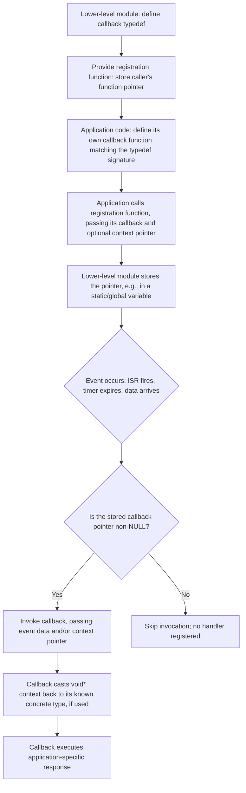

## Function Pointers and Callbacks

### Overview

Function pointers let embedded C treat executable code as data — storing the address of a function in a variable, passing it as an argument, and invoking it indirectly rather than by a hard-coded name at the call site. This indirection underlies some of the most fundamental mechanisms in embedded systems: interrupt vector tables, hardware abstraction layers that swap driver implementations at runtime, and event-driven architectures where a peripheral driver notifies application code of completion via a caller-supplied callback rather than a compile-time dependency.

### Function Pointer Fundamentals

#### Declaration Syntax

```c
// Declares a pointer to a function taking a uint8_t and returning void
void (*handler)(uint8_t data);

void my_function(uint8_t data) { /* ... */ }

handler = my_function;   // Assign: function name decays to its address
handler(42);              // Call through the pointer
```

**Key Points**

- A function name used without parentheses decays to a pointer to that function, similar to how an array name decays to a pointer to its first element — `handler = my_function;` and `handler = &my_function;` are equivalent in standard C.
- The function pointer's declared signature (parameter types and return type) must match the assigned function's actual signature; assigning a function with a mismatched signature through an incompatible pointer type, then calling it, is undefined behavior even if it happens to work on a specific compiler and architecture.

#### Typedefs for Readability

Raw function pointer syntax becomes difficult to read quickly, especially as parameter lists grow, so a `typedef` is commonly used to name the pointer type once and reuse it clearly throughout the codebase.

```c
typedef void (*event_callback_t)(uint8_t event_id, void *context);

event_callback_t on_button_press = NULL;

void register_callback(event_callback_t cb) {
    on_button_press = cb;
}
```

[Inference] While a raw function pointer declaration remains valid C without a typedef, most embedded codebases favor the typedef form specifically because it makes function pointer parameters and struct members read like an ordinary named type at the point of use, reducing the cognitive overhead of parsing C's declaration syntax repeatedly.

### Callbacks: The Core Pattern

#### Registering and Invoking a Callback

A callback is a function pointer supplied by one module (often application-level code) to another module (often a lower-level driver or library), which the second module invokes at an appropriate later point — typically to notify the caller of an event without the lower-level module needing any compile-time knowledge of what the caller actually does in response.

```c
typedef void (*uart_rx_callback_t)(uint8_t received_byte);

static uart_rx_callback_t rx_callback = NULL;

void uart_register_rx_callback(uart_rx_callback_t cb) {
    rx_callback = cb;
}

void UART_IRQHandler(void) {
    uint8_t byte = UART->DR;
    if (rx_callback != NULL) {
        rx_callback(byte);   // Driver invokes whatever function the application registered
    }
}
```

**Key Points**

- This pattern decouples the UART driver from any specific application behavior: the driver code compiles and functions correctly regardless of what the registered callback actually does, and the same driver can serve entirely different applications by registering a different callback.
- A null check before invoking the callback is standard defensive practice, since calling through an uninitialized or explicitly-cleared function pointer (`NULL`) is undefined behavior and, on many targets without memory protection, may not fault immediately, instead branching to address 0 or whatever garbage value the pointer happened to hold.

#### Passing Context to a Callback

A callback often needs access to caller-specific state beyond what the fixed callback signature provides, commonly solved by passing an opaque `void*` context pointer alongside the callback itself.

```c
typedef void (*timer_callback_t)(void *context);

void timer_start(uint32_t timeout_ms, timer_callback_t cb, void *context);

typedef struct {
    uint32_t elapsed_count;
} my_state_t;

void my_timer_handler(void *context) {
    my_state_t *state = (my_state_t *)context;   // Cast back to the known concrete type
    state->elapsed_count++;
}

my_state_t state = { 0 };
timer_start(1000, my_timer_handler, &state);
```

**Example**

This pattern allows the same `timer_start` function and the same `timer_callback_t` signature to serve any caller's arbitrary state, since the timer module itself never needs to know `my_state_t`'s actual layout — it only stores and later passes back the `void*` context pointer unchanged, and it is the callback's own responsibility to cast it back to the correct concrete type.

[Inference] Because the cast from `void*` back to a concrete type relies entirely on the caller and the callback agreeing on the actual type by convention rather than by compiler-enforced type checking, passing a context pointer of the wrong actual type is a class of bug the compiler cannot catch, and is a common source of subtle memory corruption if the calling and callback code fall out of sync during later modification.

### Function Pointers for Hardware Abstraction

#### The "Driver Ops" / vtable Pattern

A struct of function pointers can represent an abstract interface, with different concrete driver implementations populating the struct with their own functions, allowing higher-level code to operate against the interface without depending on which specific implementation is active.

```c
typedef struct {
    void (*init)(void);
    void (*write)(uint8_t data);
    uint8_t (*read)(void);
} comm_driver_t;

// UART-backed implementation
void uart_init(void)          { /* ... */ }
void uart_write(uint8_t data) { /* ... */ }
uint8_t uart_read(void)       { /* ... */ return 0; }

const comm_driver_t uart_driver = {
    .init  = uart_init,
    .write = uart_write,
    .read  = uart_read
};

// Application code operates against the interface, not a specific driver
void send_message(const comm_driver_t *driver, uint8_t byte) {
    driver->write(byte);
}
```

**Key Points**

- This pattern allows the same application logic to run against multiple interchangeable peripheral implementations (e.g., swapping UART for SPI, or a real driver for a test/mock driver) by passing a different `comm_driver_t` instance, without any conditional compilation or `if`/`switch` branching on driver type scattered through the application code.
- Declaring the driver instance `const` allows the linker to place the struct of function pointers into flash rather than RAM, since the pointers themselves do not change once the driver table is populated at compile time — though the individual functions the pointers reference are, of course, still executable code residing in flash regardless.

#### Runtime-Selectable Behavior

Beyond a fixed driver table, function pointers also support runtime-selected behavior, such as a state machine where the pointer to the "current state handler" function changes as the system transitions between states.

```c
typedef void (*state_handler_t)(void);

void state_idle(void)    { /* ... may transition current_state ... */ }
void state_running(void) { /* ... */ }
void state_error(void)   { /* ... */ }

state_handler_t current_state = state_idle;

void main_loop(void) {
    for (;;) {
        current_state();   // Executes whichever state's handler is currently assigned
    }
}
```

- This avoids a large `switch` statement re-evaluated every loop iteration, instead directly dispatching to the correct handler via the stored pointer, and each state's handler function is responsible for reassigning `current_state` when a transition condition is met.

### Interrupt Vector Tables as Function Pointer Arrays

- The processor's interrupt vector table is, at the hardware level, an array of function pointers (or, on some architectures, addresses treated as function pointers) stored at a fixed, architecture-defined memory location, where the hardware automatically loads the program counter from the corresponding table entry when a given interrupt or exception occurs.
- Vendor startup code typically initializes this table at compile time as a `const` array of function pointers, with unused vector entries pointing to a default handler (often an infinite loop or a fault-reporting routine) to catch unexpected or unimplemented interrupts safely rather than jumping to an undefined address.
- Some systems relocate the vector table at runtime (e.g., a bootloader jumping to an application that has its own vector table at a different flash offset), which requires updating a vector-table-base-address register and is a common source of hard-to-diagnose faults if done incorrectly, since an incorrect relocation causes every subsequent interrupt to dispatch to the wrong address.

[Unverified] The exact mechanism for vector table relocation (which register to write, and whether alignment requirements apply to the new table's base address) is architecture-specific and should be verified against the specific target's reference manual rather than assumed to generalize across architectures.

### Costs and Trade-offs of Function Pointer Indirection

**Key Points**

- Calling through a function pointer generally prevents the compiler from inlining the call, since the compiler cannot always determine at compile time which concrete function will actually be invoked at runtime — this is a deliberate trade-off, exchanging a small runtime indirection cost for the flexibility of runtime-selectable behavior.
- Function pointer calls typically compile to an indirect branch/call instruction rather than a direct call, which on some architectures and pipeline designs carries a modest additional cycle cost compared to a direct call, though [Unverified] the exact magnitude of this cost is architecture- and pipeline-specific and should be measured on the actual target if the difference is performance-critical rather than assumed from general principles.
- Excessive layers of function-pointer indirection (e.g., a callback that itself calls through another stored function pointer) can make code harder to trace statically, complicating both manual code review and some static analysis tools that struggle to determine all possible targets of an indirect call — a consideration in safety-critical or MISRA-C-governed codebases, which often place restrictions on function pointer usage for exactly this reason.

### Null Pointer and Uninitialized Callback Handling

**Key Points**

- Any code path that may invoke a function pointer that could legitimately be unset (not yet registered, or intentionally cleared) must null-check before calling, since invoking a null or otherwise invalid function pointer is undefined behavior and, on targets without memory protection, may silently branch to unintended memory rather than immediately faulting.
- Initializing function pointer variables explicitly to `NULL` at declaration (rather than relying on default zero-initialization, which does apply to `static`/global-scope pointers per the C standard but not to uninitialized automatic/stack-local pointers) is important, since an uninitialized stack-local function pointer holds an indeterminate value rather than a predictable, safely-checkable `NULL`.

### Callback Registration and Invocation Flow



### Driver Abstraction via Function Pointer Table

<svg xmlns="http://www.w3.org/2000/svg" viewBox="0 0 900 380">
\<style\>
.title { font: bold 18px sans-serif; fill: #1a1a1a; }
.label { font: bold 12px sans-serif; fill: #1a1a1a; }
.sub { font: 10px sans-serif; fill: #555; }
.box { stroke: #333; stroke-width: 1.5; }
\</style\>
<text x="450" y="30" text-anchor="middle" class="title">Hardware Abstraction via Function Pointer Table (svg_diagram)</text>

<rect x="60" y="70" width="200" height="60" rx="6" class="box" fill="#eaf2fb" />
<text x="160" y="105" text-anchor="middle" class="label">Application code</text>
<line x1="260" y1="100" x2="360" y2="100" stroke="#333" stroke-width="2" marker-end="url(#arrowfp)" />
<text x="310" y="90" text-anchor="middle" class="sub">calls</text>

<rect x="360" y="60" width="220" height="120" rx="6" class="box" fill="#fff8e0" />
<text x="470" y="85" text-anchor="middle" class="label">comm_driver_t (const)</text>
<text x="380" y="110" class="sub" font-family="monospace">init → ●</text>
<text x="380" y="130" class="sub" font-family="monospace">write → ●</text>
<text x="380" y="150" class="sub" font-family="monospace">read → ●</text>

<rect x="640" y="30" width="220" height="60" rx="6" class="box" fill="#eef8ee" />
<text x="750" y="65" text-anchor="middle" class="label">uart_init/write/read()</text>

<rect x="640" y="140" width="220" height="60" rx="6" class="box" fill="#fdeeee" />
<text x="750" y="175" text-anchor="middle" class="label">spi_init/write/read()</text>
<line x1="580" y1="110" x2="640" y2="60" stroke="#333" stroke-width="1.5" stroke-dasharray="4,3" />
<line x1="580" y1="150" x2="640" y2="170" stroke="#333" stroke-width="1.5" stroke-dasharray="4,3" />
<text x="600" y="230" class="sub">Struct's function pointers reference one concrete</text>
<text x="600" y="245" class="sub">implementation at a time; swap the struct instance to swap drivers.</text>
</svg>

### Common Pitfalls

**Key Points**

- Invoking a function pointer without a null check, when the pointer may legitimately be unset — an especially consequential bug on targets without memory protection, where branching through a bad address may not fault immediately.
- Assigning a function to a pointer with a mismatched signature (differing parameter or return types) and later calling through it, which is undefined behavior even when it appears to work on a specific compiler and target.
- Casting a `void*` context pointer back to the wrong concrete type, a bug the compiler cannot catch since it depends entirely on caller/callback convention rather than enforced typing.
- Relying on default zero-initialization for a function pointer that is actually a stack-local (automatic) variable rather than static/global, and thereby calling through an indeterminate, uninitialized pointer value.
- Incorrect interrupt vector table relocation, causing every interrupt to dispatch to the wrong handler address system-wide rather than producing an isolated, easily localized fault.
- Overusing layered function pointer indirection in safety- or certification-relevant code, complicating static analysis and manual traceability of which concrete function actually executes at a given call site.

**Conclusion**

Function pointers and the callback pattern they enable are foundational to embedded software's ability to decouple low-level drivers from application-specific behavior, to implement interrupt dispatch, and to support swappable hardware abstraction layers — but this flexibility comes with the compiler's reduced ability to verify correctness at the call site, making disciplined null-checking, signature matching, and consistent context-pointer typing essential practices rather than optional caution.

### Related Topics

- Embedded C — C language fundamentals for embedded targets
- Embedded C — Pointers and memory addressing
- Embedded C — Volatile, const, and static qualifiers
- Embedded C — Interrupt service routines and critical sections
- Embedded C — Structs, unions, and bit-fields
- Bootloader design and application handoff in embedded systems
- Static analysis and MISRA-C coding standards
- Event-driven architecture patterns in embedded firmware