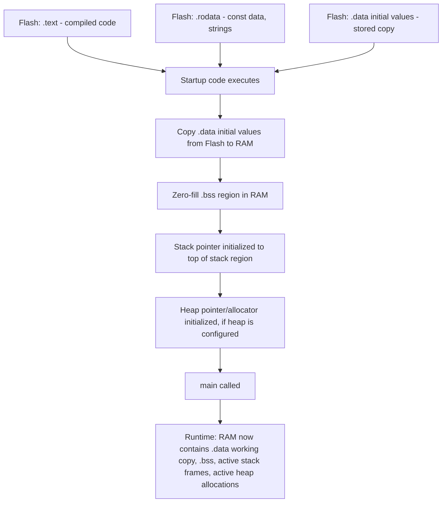

## Memory Sections: Text, Data, BSS, Heap, Stack

### Overview

An embedded program's memory footprint is organized into distinct sections, each with different content, placement (flash vs. RAM), and lifetime characteristics. Understanding this layout — what goes where, how it gets there, and what governs its size — is necessary for accurately budgeting memory, diagnosing corruption bugs, and configuring a linker script correctly, since the C source code alone does not determine memory placement; the toolchain's default behavior and any custom linker script jointly decide where each piece of a program actually resides at runtime.

### The .text Section

#### Content and Placement

- `.text` holds the compiled machine code instructions of the program — every function's executable code, effectively the "program" itself as the processor's instruction fetch unit sees it.
- `.text` is placed in flash (non-volatile memory) on essentially all embedded targets, since code must persist across power cycles and is not modified at runtime under normal operation.
- `.text` size is determined entirely by the compiled output of the source code and any linked libraries, and is a primary target of code-size optimization (`-Os` compiler flags, removing unused functions via `--gc-sections`) on flash-constrained designs.

**Key Points**

- Some architectures support executing code directly from flash (execute-in-place), while others require code to be copied into RAM before execution for performance reasons (RAM typically has lower access latency than flash) — [Unverified] whether a specific target supports or requires one approach over the other depends on that architecture's memory system design and should be confirmed against its reference manual.

### The .rodata Section

#### Read-Only Data

- `.rodata` ("read-only data") holds `const`-qualified data and string literals — content that is fixed at compile time and never modified during program execution.
- Like `.text`, `.rodata` is typically placed in flash on most embedded toolchains by default, since its content does not change and flash persists across power cycles, directly benefiting from the RAM-conservation strategy of marking large lookup tables and fixed configuration data `const`.
- Some linker scripts group `.rodata` immediately adjacent to `.text` in flash (sometimes reported together in size utility output), while others define it as a fully separate section — the specific grouping is toolchain- and linker-script-dependent.

### The .data Section

#### Initialized Global/Static Variables

- `.data` holds global and `static` variables that are explicitly initialized to a non-zero value at declaration, such as `static uint32_t counter = 5;`.
- `.data` has a dual footprint cost: the initial values must be stored somewhere in flash (since flash is what persists across power loss), and a working copy occupies RAM at runtime, since these variables must be readable and writable during program execution, which RAM supports and flash generally does not (or does so far more slowly and with wear implications on some flash technologies).
- At startup, before `main()` runs, startup code copies the initial values from their flash-stored location into the corresponding RAM addresses, so that by the time application code begins executing, `.data` variables hold their specified initial values in RAM.

**Example**

```c
static uint32_t error_count = 0;      // Initialized to 0: this is actually .bss, not .data (see below)
static uint32_t max_retries = 5;      // Initialized to non-zero: this is .data
```

[Inference] Some toolchains optimize a variable explicitly initialized to zero (`= 0`) by placing it in `.bss` rather than `.data`, since a zero-initialization is indistinguishable in effect from `.bss`'s zero-fill behavior at startup, avoiding the unnecessary flash storage cost of an explicit zero value — this optimization is common but toolchain-dependent and should be confirmed via the map file rather than assumed from source code alone.

### The .bss Section

#### Zero-Initialized and Uninitialized Global/Static Variables

- `.bss` ("block started by symbol," a historical assembler-era name) holds global and `static` variables that are either explicitly initialized to zero or left uninitialized in source code — the C standard guarantees such variables start at zero, a guarantee fulfilled by the startup code's zero-fill step rather than by any value stored in flash.
- Unlike `.data`, `.bss` requires no storage in flash at all, since no actual initial values need to be preserved — only the section's total size needs to be known, so startup code can zero exactly that many bytes of RAM.
- This makes `.bss` "free" in terms of flash budget but still fully counted against the RAM budget, an important distinction when auditing memory usage from a linker map file, where `.data` and `.bss` sizes should be considered together for total RAM impact, but only `.data`'s size (not `.bss`'s) additionally counts against flash.

**Key Points**

- Large statically-allocated buffers intended to start zeroed (e.g., a receive buffer, a lookup table built at runtime) should be declared without an explicit initializer or with an explicit `= {0}`, both of which typically land in `.bss` rather than `.data`, avoiding unnecessary flash consumption for what would otherwise be a large block of stored zero bytes.

### The Heap

#### Dynamic Allocation Region

- The heap is a region of RAM, typically located between `.bss` and the top of available RAM (or between `.bss` and the stack, with the exact arrangement depending on the linker script), from which `malloc`/`free`-style dynamic allocation draws memory at runtime.
- Heap size is commonly configured via a linker script symbol or a fixed reserved region, and many embedded targets either omit a heap entirely (no dynamic allocation support in the default configuration) or configure a small, fixed-size heap specifically to bound worst-case memory usage.
- As covered under memory management practices, many embedded designs avoid the general-purpose heap specifically due to fragmentation risk over long uptimes and non-deterministic allocation timing, preferring static allocation or fixed-size memory pools instead.

[Unverified] The specific heap growth behavior (whether it grows toward the stack, a fixed maximum size, or some other arrangement) is linker-script- and toolchain-specific, and should be verified against the actual linker script in use rather than assumed from general desktop-OS heap behavior, which typically involves OS-level virtual memory management not present on most bare-metal embedded targets.

### The Stack

#### Function Call Frames and Local Variables

- The stack is a region of RAM used for function call frames — return addresses, saved register values, and local (automatic) variables that do not have `static` storage duration — and grows and shrinks automatically as functions are called and return.
- On most embedded architectures, the stack grows downward from a high address toward lower addresses, though [Unverified] the specific growth direction is architecture-defined and should be confirmed for unfamiliar targets rather than assumed universally.
- Stack size is fixed at compile/link time (commonly via a linker script symbol reserving a specific region size) rather than growing dynamically as on many desktop operating systems, meaning a fixed, calculable worst-case stack depth is both achievable and important to verify for embedded designs, particularly those without a memory protection unit to catch an overflow.

**Key Points**

- Stack overflow — the stack growing beyond its reserved region — on a target without hardware-enforced boundary checking typically corrupts whatever memory lies adjacent to the stack (often the heap, or `.bss`, depending on the linker script's memory layout), producing corruption symptoms that can appear entirely unrelated to the actual overflow's location and timing, making it a notoriously difficult bug class to diagnose without dedicated stack usage analysis.
- Static stack usage analysis tools (e.g., GCC's `-fstack-usage` flag, which reports each function's individual stack frame size) combined with manual or tool-assisted call-graph analysis can establish a calculated worst-case stack depth, which is a more rigorous approach than empirical testing alone, since testing may not exercise the specific call path that produces the actual worst case.

### Full Memory Layout and Startup Sequence



### Memory Layout Diagram

<svg xmlns="http://www.w3.org/2000/svg" viewBox="0 0 900 520">
\<style\>
.title { font: bold 18px sans-serif; fill: #1a1a1a; }
.label { font: bold 12px sans-serif; fill: #1a1a1a; }
.sub { font: 10px sans-serif; fill: #555; }
.box { stroke: #333; stroke-width: 1.5; }
\</style\>
<text x="450" y="30" text-anchor="middle" class="title">Full Memory Section Layout (svg_diagram)</text>


<text x="160" y="60" text-anchor="middle" class="label">Flash (persistent)</text>

<rect x="60" y="70" width="200" height="60" class="box" fill="`#fdeeee`" />

<text x="160" y="105" text-anchor="middle" class="sub">.text (code)</text>

<rect x="60" y="130" width="200" height="60" class="box" fill="#fdeeee" />
<text x="160" y="165" text-anchor="middle" class="sub">.rodata (const data, strings)</text>
<rect x="60" y="190" width="200" height="60" class="box" fill="#fdeeee" />
<text x="160" y="225" text-anchor="middle" class="sub">.data (stored initial values)</text>

<text x="160" y="280" text-anchor="middle" class="sub">Total flash used ≈</text>

<text x="160" y="295" text-anchor="middle" class="sub">.text + .rodata + .data</text>


<line x1="260" y1="220" x2="500" y2="330" stroke="#333" stroke-width="2" marker-end="url(#arrowms)" />
<text x="380" y="270" text-anchor="middle" class="sub">copied at startup</text>


<text x="620" y="60" text-anchor="middle" class="label">RAM (volatile, runtime)</text>

<rect x="500" y="90" width="240" height="40" class="box" fill="#eef8ee" />
<text x="620" y="115" text-anchor="middle" class="sub">Stack (grows downward, call frames + locals)</text>
<rect x="500" y="140" width="240" height="60" class="box" fill="#fff8e0" />
<text x="620" y="165" text-anchor="middle" class="sub">Heap (dynamic allocation,</text>
<text x="620" y="180" text-anchor="middle" class="sub">if configured; grows upward)</text>
<rect x="500" y="330" width="240" height="50" class="box" fill="#eaf2fb" />
<text x="620" y="360" text-anchor="middle" class="sub">.data (working copy, RAM)</text>
<rect x="500" y="390" width="240" height="50" class="box" fill="#eaf2fb" />
<text x="620" y="420" text-anchor="middle" class="sub">.bss (zero-filled at startup)</text>

<text x="620" y="460" text-anchor="middle" class="sub">Total RAM used ≈</text>

<text x="620" y="475" text-anchor="middle" class="sub">.data + .bss + stack + heap (worst case)</text>

</svg>

### Measuring Section Sizes

#### Toolchain Utilities

- The GNU binutils `size` utility, run against the compiled ELF output, reports the total size of `.text`, `.data`, and `.bss` sections directly, providing a fast summary without needing to inspect a full map file.
- A linker map file (generated with a flag such as `-Map=output.map` in GCC-based toolchains) provides symbol-by-symbol detail — the exact size and address of every function and variable, and which section each was placed into — offering ground truth for precisely identifying which specific symbols consume the most space in a constrained section.

**Key Points**

- Total RAM usage at any given runtime moment equals `.data` + `.bss` + current stack depth + current heap allocations (if a heap is used), while total flash usage equals `.text` + `.rodata` + `.data`'s stored initial values — these are related but distinct sums, and a design can be flash-constrained, RAM-constrained, or both depending on which totals approach the target's actual capacity.
- Because stack and heap usage are runtime-dependent rather than fixed at link time, the `size` utility and map file report only the statically-determinable portions (`.text`, `.rodata`, `.data`, `.bss`); worst-case stack depth requires separate static analysis, and heap high-water-mark requires runtime instrumentation or a heap allocator that tracks peak usage.

### Common Pitfalls

**Key Points**

- Assuming a `const` variable is automatically placed in flash without confirming the actual linker script routes `.rodata` there for the specific target and toolchain — this is common default behavior but not a guarantee of the C language itself.
- Not accounting for `.bss`'s RAM cost when estimating memory usage from source code, since large uninitialized or zero-initialized buffers consume no flash but still fully count against the RAM budget.
- Sizing the stack region based on typical/average execution rather than a calculated worst-case call depth, risking silent stack overflow and adjacent-memory corruption under an infrequently-exercised call path.
- Configuring a heap region without verifying it is actually needed, consuming RAM that could otherwise be reserved for a larger stack or left unused as safety margin.
- Reading only a quick `size` utility summary when a specific section is unexpectedly large, rather than consulting the full map file to identify which specific symbols are responsible for the excess size.
- Assuming `.data` and `.bss` behave identically with respect to flash cost, when only `.data` requires flash storage for its initial values while `.bss` requires none.

**Conclusion**

Understanding the distinct roles of `.text`, `.rodata`, `.data`, `.bss`, the heap, and the stack — what each contains, where the linker places it, and what governs its size — is foundational to accurately budgeting both flash and RAM on a memory-constrained embedded target, and to correctly diagnosing memory-related bugs, since symptoms like stack overflow, heap exhaustion, and unexpectedly large flash usage each trace back to a specific section's behavior rather than being generic, undifferentiated "memory problems."

### Related Topics

- Embedded C — C language fundamentals for embedded targets
- Embedded C — Data types and memory footprint awareness
- Embedded C — Volatile, const, and static qualifiers
- Embedded C — Linker scripts and memory section placement
- Embedded C — Avoiding dynamic allocation and memory pool design
- Bootloader design and application handoff in embedded systems
- Choosing microcontroller RAM/flash sizing during hardware selection
- Static stack usage analysis and worst-case stack depth verification