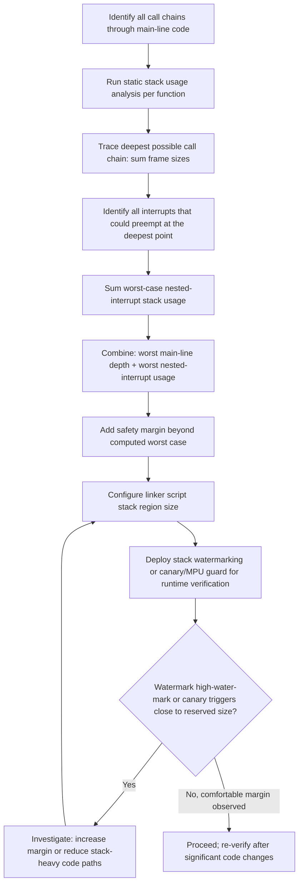

## Stack Usage and Overflow Prevention

### Overview

The stack is one of the most consequential memory regions in an embedded system precisely because its usage is dynamic, spread across every function call in the program, and — on most microcontrollers — entirely unguarded by hardware. A desktop operating system typically detects stack overflow via virtual memory protection and terminates the offending process cleanly; a bare-metal embedded target frequently has no such safety net, so an overflowing stack silently overwrites whatever memory happens to be adjacent to it, producing corruption that can appear unrelated to its actual cause. Preventing this requires understanding what consumes stack space, calculating worst-case usage rather than relying on typical-case testing, and applying both design practices and detection mechanisms.

### What Consumes Stack Space

#### Function Call Frames

Each function call typically pushes a stack frame containing the return address, saved register values (per the target's calling convention), and space for that function's local (automatic) variables.

```c
void process_reading(uint32_t raw_value) {
    uint8_t buffer[64];        // 64 bytes of stack space for this function's frame
    uint32_t scaled = raw_value * 2;
    // ...
}
```

**Key Points**

- Stack usage is cumulative across the active call chain — if `main()` calls `handle_event()`, which calls `process_reading()`, the total stack consumed at that moment is the sum of all three functions' frame sizes, not just the currently executing function's frame.
- Local arrays and structures are typically the largest contributors to an individual function's frame size, since simple scalar locals (a few integers) are comparatively small, while a local buffer of even a few hundred bytes can dominate a function's stack footprint.

#### Nested and Recursive Calls

- Deeply nested call chains (function A calls B calls C calls D...) accumulate stack usage linearly with call depth, and a call chain that is fine in typical testing can overflow if an unusual code path adds several additional levels of nesting not exercised during testing.
- Recursive functions are particularly risky because their maximum stack usage depends on the recursion depth, which is often data-dependent (e.g., recursing once per element of an input list) rather than fixed at compile time, making worst-case stack usage difficult or impossible to bound statically for genuinely unbounded recursive algorithms.

**Example**

A recursive function parsing a nested data structure (e.g., a JSON-like format) could, given sufficiently deeply nested or maliciously crafted input, recurse far beyond the depth exercised during normal testing, consuming stack proportional to input nesting depth rather than a fixed, predictable amount — a strong argument for converting genuinely unbounded recursive algorithms to an iterative form with an explicit, size-bounded data structure (e.g., a fixed-capacity array-based stack) when running on a fixed-size embedded stack.

#### Interrupt Service Routine (ISR) Stack Usage

- On many embedded architectures, ISRs execute on the same stack as main-line code (rather than a dedicated separate interrupt stack), meaning an interrupt firing while main-line code is already deep in its call chain adds the ISR's own frame size — and the frame size of any functions the ISR itself calls — on top of whatever stack depth main-line code had already reached.
- Nested interrupts (a higher-priority interrupt preempting a lower-priority one already executing) compound this further, and the worst-case combination — deepest main-line call depth, plus every simultaneously-possible nested interrupt's stack usage — is the figure that actually matters for sizing the stack region, not any single measured scenario in isolation.
- [Unverified] Whether a specific architecture provides a separate interrupt stack, or shares the main stack, is architecture- and configuration-specific (some architectures, such as certain ARM Cortex-M configurations, support an optional separate process/handler stack split) and should be confirmed against the target's reference manual rather than assumed.

### Calculating Worst-Case Stack Usage

#### Static Stack Usage Analysis

Rather than relying on empirical testing — which only exercises the specific call paths and interrupt timings that happened to occur during the test — static analysis examines the compiled code's call graph and each function's individual frame size to compute a provable worst-case bound.

- GCC's `-fstack-usage` flag generates a `.su` file per compiled source file, reporting each function's individual stack frame size in bytes, which can then be combined with call-graph analysis (tracing the deepest possible call chain) to compute a worst-case total.
- [Unverified] Equivalent stack usage reporting features exist in other embedded toolchains (IAR, Keil/ARM Compiler) under different flag names and output formats, and the specific mechanism should be checked against the toolchain actually in use rather than assumed to match GCC's exact interface.
- Recursive functions and function-pointer-based indirect calls (where the compiler cannot statically determine which concrete function is invoked) both break simple call-graph-based worst-case analysis, since a recursive function's depth is often data-dependent rather than fixed, and an indirect call's target may not be resolvable to a single function at analysis time — both cases typically require either a manually-supplied bound or a more conservative, worst-case-assuming analysis.

**Key Points**

- Worst-case stack analysis should account for the deepest call chain through main-line code, combined with the worst-case nested-interrupt scenario (every interrupt that could plausibly preempt at the deepest main-line point, stacked according to their actual priority-based nesting rules), rather than measuring either in isolation.
- A calculated worst-case figure, even when derived carefully, should include a safety margin beyond the computed value, since static analysis tools have their own limitations (particularly around recursion and indirect calls) that can cause the true worst case to be underestimated in specific circumstances.

#### Empirical Stack Watermarking

A complementary, runtime technique fills the stack region with a known pattern before the program begins normal execution, then periodically inspects how much of that pattern has been overwritten to estimate actual peak stack usage observed during operation.

```c
// Simplified watermarking pattern (conceptual, not a complete implementation)
#define STACK_PATTERN  0xAA

void fill_stack_with_pattern(void) {
    // Fill unused stack region with STACK_PATTERN before main() begins normal execution
}

uint32_t measure_stack_high_water_mark(void) {
    // Scan from the bottom of the stack region upward, counting how many
    // bytes still hold STACK_PATTERN; the boundary indicates the deepest
    // point the stack pointer has reached during execution so far.
    // ...
    return 0; // Placeholder
}
```

**Key Points**

- Watermarking reveals actual observed peak usage during whatever execution occurred, which — unlike static analysis — is empirical evidence rather than a computed bound, but is only as good as the code paths and interrupt timing actually exercised during the monitored period, so it complements rather than replaces static worst-case analysis.
- Many RTOS implementations provide built-in stack high-water-mark tracking per task (since each task typically has its own dedicated stack region in an RTOS), making this technique particularly practical and commonly available in RTOS-based designs without custom implementation.

### Sizing the Stack Region

#### Linker Script Configuration

- Stack size is typically reserved via a fixed-size region defined in the linker script, often exposed as a symbol (commonly something like `_Min_Stack_Size` or similar, naming varies by vendor toolchain template) that can be adjusted without modifying application source code.
- Choosing this size requires balancing two competing pressures: too small risks overflow under worst-case conditions, while too large wastes RAM that could otherwise be used for `.data`/`.bss`, a heap, or simply left as unused margin — a balance best informed by the static worst-case analysis and watermarking results described above, rather than an arbitrary round number.

#### RTOS Considerations: Per-Task Stacks

- In an RTOS-based design, each task typically has its own separate, fixed-size stack allocated from the overall RAM budget, meaning the "one stack to size" problem of a bare-metal design becomes "many stacks to size," each potentially requiring separate worst-case analysis based on that specific task's call chains and the interrupts that can preempt it.
- Under-sizing one task's stack while over-sizing another wastes total RAM without improving safety, making per-task worst-case analysis (rather than assigning a single uniform stack size to every task regardless of its actual needs) a more RAM-efficient approach, particularly on RAM-constrained targets running several tasks simultaneously.

### Overflow Detection Mechanisms

#### Guard Regions and Canary Values

- A "canary" or "guard" pattern — a known value written just beyond the stack's intended boundary, or at the very bottom of the reserved stack region — can be periodically checked; if the canary value has been overwritten, it indicates the stack has grown at least that far, providing an early-warning detection mechanism even on hardware without dedicated overflow protection.
- This technique detects overflow only when explicitly checked (e.g., periodically in a background task, or at specific checkpoints), rather than immediately at the moment of overflow, meaning some corruption may occur between the actual overflow event and the next canary check — a limitation compared to hardware-enforced detection.

#### Memory Protection Unit (MPU) Guard Regions

- On architectures equipped with a Memory Protection Unit (MPU), a small guard region can be configured at the boundary of each stack (particularly practical in RTOS designs with per-task stacks), such that any access into the guard region triggers an immediate hardware fault rather than silently corrupting adjacent memory.
- This provides detection at the moment of overflow, rather than only at the next periodic check, and additionally identifies precisely which task or context caused the overflow via the fault handler's context information — a substantially stronger detection mechanism than software-based canary checking where hardware support is available.

[Unverified] MPU availability, the number of configurable regions, and the exact configuration mechanism vary significantly across microcontroller families and even across variants within the same family, so whether this technique is available, and how to configure it, should be verified against the specific target's reference manual rather than assumed.

### Design Practices to Reduce Stack Risk

**Key Points**

- Converting genuinely unbounded or deep recursive algorithms to an iterative form with an explicit, fixed-capacity data structure removes the data-dependent stack usage risk entirely, at the cost of some additional code complexity compared to the recursive form.
- Avoiding large local arrays or structures in favor of `static` (or dynamically pooled, if a pool is used) storage moves that memory out of the per-call stack frame and into a fixed, statically-accounted-for location — though this introduces the re-entrancy considerations covered under `static` local variables if the function can be called from multiple contexts concurrently.
- Keeping ISRs short and deferring substantial processing to main-line or task context (as covered under interrupt service routines generally) limits how much additional stack depth an interrupt firing at the worst possible main-line call depth actually adds.
- Being cautious with deeply nested function calls in library code whose internal call depth may not be immediately obvious from its external interface, since a seemingly simple library call can internally recurse or call through several additional layers not visible at the call site.

### Stack Sizing Workflow



### Stack Growth and Guard Region Illustration

<svg xmlns="http://www.w3.org/2000/svg" viewBox="0 0 900 460">
\<style\>
.title { font: bold 18px sans-serif; fill: #1a1a1a; }
.label { font: bold 12px sans-serif; fill: #1a1a1a; }
.sub { font: 10px sans-serif; fill: #555; }
.box { stroke: #333; stroke-width: 1.5; }
\</style\>
<text x="450" y="30" text-anchor="middle" class="title">Stack Growth, Watermark, and Guard Region (svg_diagram)</text>

<text x="200" y="60" text-anchor="middle" class="label">High address (stack top)</text>

<rect x="120" y="70" width="200" height="30" class="box" fill="`#f4f4f4`" />

<text x="220" y="90" text-anchor="middle" class="sub">Initial stack pointer</text>

<rect x="120" y="100" width="200" height="80" class="box" fill="#eaf2fb" />
<text x="220" y="130" text-anchor="middle" class="sub">Used region</text>
<text x="220" y="148" text-anchor="middle" class="sub">(active call frames)</text>
<line x1="120" y1="180" x2="320" y2="180" stroke="#c0503f" stroke-width="2" stroke-dasharray="5,3" />
<text x="340" y="185" class="sub">← current stack pointer</text>
<rect x="120" y="180" width="200" height="60" class="box" fill="#eef8ee" />
<text x="220" y="205" text-anchor="middle" class="sub">Unused region</text>
<text x="220" y="220" text-anchor="middle" class="sub">(still holds watermark pattern)</text>
<line x1="120" y1="240" x2="320" y2="240" stroke="#2f7d4f" stroke-width="2" stroke-dasharray="5,3" />
<text x="340" y="245" class="sub">← observed high-water mark</text>
<rect x="120" y="240" width="200" height="80" class="box" fill="#fff8e0" />
<text x="220" y="270" text-anchor="middle" class="sub">Never-touched margin</text>
<text x="220" y="285" text-anchor="middle" class="sub">(reserve beyond worst case)</text>
<rect x="120" y="320" width="200" height="40" class="box" fill="#fdeeee" />
<text x="220" y="345" text-anchor="middle" class="sub">Guard region / canary (MPU-enforced or checked value)</text>

<text x="200" y="390" text-anchor="middle" class="label">Low address (stack bottom)</text>

<text x="600" y="150" class="sub">Stack grows downward on most architectures.</text>

<text x="600" y="170" class="sub">Overflow occurs when the stack pointer</text>

<text x="600" y="190" class="sub">crosses into the guard region — with an</text>

<text x="600" y="210" class="sub">MPU, this triggers an immediate fault;</text>

<text x="600" y="230" class="sub">with a canary alone, it is detected only</text>

<text x="600" y="250" class="sub">at the next periodic check.</text>

</svg>

### Common Pitfalls

**Key Points**

- Sizing the stack based on empirical testing of typical code paths alone, without static worst-case analysis, risking overflow under an infrequently-exercised deep call chain or worst-case interrupt nesting scenario not captured by testing.
- Using unbounded or deeply nested recursion for algorithms whose depth depends on runtime input, producing data-dependent stack usage that resists static bounding.
- Assuming ISRs use a separate stack without confirming the target architecture's actual configuration, when many architectures share the main stack between interrupt and main-line execution by default.
- Placing large local arrays or structures on the stack inside frequently-called or deeply-nested functions, rather than considering `static` storage or a fixed-size pool for large, non-reentrant-sensitive buffers.
- Relying solely on canary/watermark detection without recognizing its detection is only as good as the code paths and timing actually exercised, and that it may report overflow only after some corruption has already occurred, unlike hardware-enforced MPU guard regions.
- In RTOS designs, assigning a single uniform stack size to every task regardless of its actual worst-case usage, wasting RAM on some tasks while potentially under-provisioning others.

**Conclusion**

Stack overflow on embedded targets is a particularly insidious bug class because it frequently manifests as unrelated-looking corruption rather than an immediate, clearly-attributable fault, especially on hardware lacking a Memory Protection Unit. Reliable prevention combines static worst-case analysis (accounting for both deepest call chains and worst-case interrupt nesting), empirical watermarking or canary/MPU-based detection to verify assumptions against actual observed behavior, and design practices — avoiding unbounded recursion, keeping ISRs shallow, moving large buffers off the stack where appropriate — that reduce the worst case the analysis needs to account for in the first place.

### Related Topics

- Embedded C — Memory sections: text, data, bss, heap, stack
- Embedded C — C language fundamentals for embedded targets
- Embedded C — Interrupt service routines and critical sections
- Embedded C — Avoiding dynamic allocation and memory pool design
- Embedded C — Linker scripts and memory section placement
- Real-Time Operating System (RTOS) task and interrupt interaction
- Memory Protection Units (MPUs) and fault isolation on embedded targets
- Watchdog timers and fault recovery strategies in embedded firmware