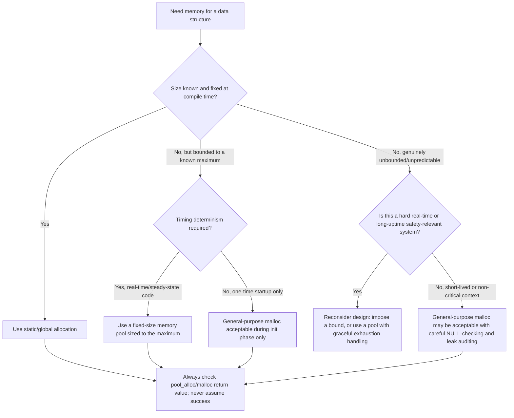

## Dynamic Memory Allocation Risks

### Overview

Dynamic memory allocation (`malloc`/`free` and their variants) is a standard, well-understood tool in general-purpose programming, but its risk profile changes substantially on embedded targets: long uptimes without reboot, no operating system to reclaim memory from a crashed process, no virtual memory to paper over fragmentation, and frequently no memory protection unit to contain a corruption bug. These factors mean the same `malloc` call that is routine on a desktop application carries materially different, and often more severe, consequences on a resource-constrained, long-running embedded system.

### Heap Fragmentation

#### How Fragmentation Occurs

Fragmentation arises when free memory exists but is scattered into blocks too small individually to satisfy a subsequent allocation request, even though the sum of all free blocks would be sufficient.

**Example**

A heap allocator serves three allocations of 100 bytes each from a contiguous 400-byte free region, then the middle allocation is freed. The heap now has 100 bytes free, then 100 bytes in use, then 200 bytes free — 300 bytes total free, but a subsequent request for 250 bytes contiguous would fail, since no single free block is that large, despite the total free memory exceeding the request.

- Fragmentation risk grows with the diversity of allocation sizes requested over the program's lifetime and with the total number of allocate/free cycles, since each cycle is another opportunity to leave behind a gap that doesn't cleanly match a future request's size.
- Unlike a desktop OS, where a long-running process can sometimes be restarted periodically (or benefits from virtual memory remapping that can make physically fragmented memory appear contiguous to the application), many embedded systems are expected to run continuously for months or years, giving fragmentation far more opportunity to accumulate toward a failure state.

#### Why Fragmentation Is Especially Dangerous in Embedded Systems

**Key Points**

- A fragmentation-caused allocation failure is highly timing- and history-dependent — the same code, given a different sequence of prior allocations and frees, may succeed or fail, making the bug difficult to reproduce in testing and prone to appearing only after extended field deployment.
- Systems without virtual memory (the overwhelming majority of microcontroller-class embedded targets) cannot relocate existing allocations to consolidate free space the way some desktop allocators or garbage collectors can, meaning fragmentation, once it occurs, generally cannot be resolved without freeing enough of the specific fragmenting allocations or restarting the system.
- [Inference] Because fragmentation's onset depends on the specific sequence and sizes of allocations over potentially very long uptimes, testing over a realistic but necessarily time-limited period may not reveal a fragmentation-related failure mode that would eventually occur in extended field deployment, making this a category of risk that is difficult to fully validate through testing alone.

### Non-Deterministic Allocation Timing

#### Why malloc's Timing Varies

- Most general-purpose heap allocator implementations search a free list (or equivalent internal structure) for a suitable block, and the time this search takes can vary depending on the current state of the heap — how fragmented it is, how many free blocks exist, and where a suitable block happens to be found in the search order.
- This variability conflicts directly with hard real-time requirements, where a function's worst-case execution time must be known and bounded in order to guarantee a control loop or interrupt response meets its deadline; an allocation whose timing depends on unpredictable heap state undermines that guarantee.
- [Unverified] The exact worst-case and average-case time complexity of a given `malloc` implementation depends entirely on that specific allocator's internal algorithm (first-fit, best-fit, buddy system, and others each have different complexity characteristics), so blanket statements about "malloc's speed" should be evaluated against the specific allocator implementation actually linked into the embedded target rather than assumed generically.

#### Consequences for Real-Time Systems

- A control loop or interrupt handler that calls `malloc` (directly, or indirectly through a library function that allocates internally) introduces an unbounded or difficult-to-bound source of timing variability into a code path that may otherwise be carefully analyzed for worst-case execution time, potentially invalidating that analysis.
- This is a primary reason many real-time and safety-critical embedded coding standards (including guidance commonly associated with MISRA-C) restrict or prohibit dynamic allocation after system initialization, confining any allocation to a one-time startup phase where timing variability is inconsequential, rather than during steady-state operation where deadlines must be met.

### Allocation Failure Handling

#### malloc Can Return NULL

- `malloc` (and `calloc`/`realloc`) returns `NULL` when it cannot satisfy a request, whether due to genuine exhaustion of heap memory or fragmentation preventing a sufficiently large contiguous block from being found, and standard C requires this return value to be checked before the returned pointer is used.
- On many embedded targets with a small, fixed-size heap (rather than a desktop OS's large, often near-unbounded virtual address space), allocation failure is a realistic and not merely theoretical outcome that production code must handle explicitly, rather than a scenario safe to assume will not occur.

**Example**

```c
uint8_t *buffer = malloc(256);
if (buffer == NULL) {
    // Handle allocation failure explicitly: fall back to a smaller buffer,
    // defer the operation, signal an error condition, or another defined
    // recovery strategy appropriate to the system — but never proceed
    // to dereference a NULL pointer.
} else {
    // Use buffer
    free(buffer);
}
```

**Key Points**

- Failing to check `malloc`'s return value and instead dereferencing the result directly is a null-pointer-dereference risk that, on a target without memory protection, may not fault immediately and could silently read or write unintended memory at or near address 0.
- Unlike a desktop application where allocation failure is often rare enough to treat as an exceptional, hard-to-test scenario, embedded designs with small heaps should treat allocation failure as an expected, regularly-testable code path, since the small heap size makes exhaustion far more plausible in normal operation.

### Memory Leaks

#### Why Leaks Are More Severe Over Long Uptimes

- A memory leak (an allocation whose corresponding `free` is never called, and whose pointer is subsequently lost, making the memory unreclaimable for the remainder of the program's execution) has consequences that scale with uptime: a small leak that would be inconsequential over a few minutes of desktop application use can, given weeks or months of continuous embedded operation, eventually exhaust all available heap memory.
- Embedded systems frequently lack a supervising operating system that can restart a leaking process independently, meaning a leak in embedded firmware typically requires a full device reset (whether manual, watchdog-triggered, or scheduled) to reclaim the lost memory, rather than the OS-level process isolation and cleanup available on a desktop or server platform.
- Leaks originating in rarely-executed error-handling or edge-case code paths (a common pattern: an early-return on an error condition that skips a `free` call reached only in the normal-completion path) are particularly insidious in embedded systems, since such conditions may occur infrequently during testing but accumulate consistently over a long field deployment where the edge case eventually recurs many times.

#### Detecting Leaks

- Some embedded-focused static analysis tools can detect certain classes of leak (an allocated pointer that goes out of scope without a corresponding `free` on some code path) at compile time, though [Unverified] the specific detection capability and false-positive/false-negative rate varies significantly by tool and should be evaluated against the specific static analyzer in use.
- Runtime heap instrumentation — tracking total outstanding allocations, or wrapping `malloc`/`free` with logging/accounting code during development and testing — can reveal a slow, cumulative leak that would otherwise only become apparent after an impractically long test duration, by extrapolating a rising outstanding-allocation trend observed over a shorter monitored period.

### Alternatives to General-Purpose Dynamic Allocation

#### Fixed-Size Memory Pools

A common alternative allocates a fixed-size array of same-sized blocks at compile time, then manages allocation/deallocation from that fixed pool via a free list, rather than using the general-purpose heap.

```c
#define POOL_BLOCK_SIZE   64
#define POOL_BLOCK_COUNT  16

static uint8_t pool_memory[POOL_BLOCK_COUNT][POOL_BLOCK_SIZE];
static uint8_t pool_used[POOL_BLOCK_COUNT] = {0};

void *pool_alloc(void) {
    for (int i = 0; i < POOL_BLOCK_COUNT; i++) {
        if (!pool_used[i]) {
            pool_used[i] = 1;
            return pool_memory[i];
        }
    }
    return NULL;   // Pool exhausted
}

void pool_free(void *block) {
    // Compute index from block's address, then clear pool_used[index]
    // (implementation detail omitted for brevity)
}
```

**Key Points**

- Because every block is the same fixed size, a memory pool is structurally immune to the fragmentation problem that affects general-purpose heaps with mixed-size allocations — a freed block is always exactly the right size for the next allocation request, since all requests are the same size by design.
- Pool allocation and deallocation are $O(n)$ in this simple linear-scan implementation (or $O(1)$ with a free-list-based implementation instead of scanning), and in either case the timing is far more predictable and analyzable than a general-purpose allocator's heap-state-dependent search, making pools substantially more suitable for real-time code paths.
- The primary trade-off is reduced flexibility: a pool sized for one specific block size cannot efficiently serve requests of substantially different sizes, often requiring multiple pools (of different block sizes) for a system with varied allocation needs — a more constrained but more predictable model than a single general-purpose heap.

#### Static Allocation as the Default

- The most robust mitigation for many embedded designs is avoiding dynamic allocation entirely after initialization, favoring compile-time-sized global/static arrays and structures sized for the application's actual known maximum requirements.
- This sacrifices the flexibility of adapting memory usage to runtime-varying needs but gains full compile-time visibility into total memory usage (verifiable via the linker map file, as covered under memory sections), eliminates fragmentation and leak risk entirely for that class of memory, and provides fully deterministic timing, since no allocator search is ever performed at runtime.

### Allocation Strategy Decision Diagram



### Fragmentation Illustration

<svg xmlns="http://www.w3.org/2000/svg" viewBox="0 0 900 380">
\<style\>
.title { font: bold 18px sans-serif; fill: #1a1a1a; }
.label { font: bold 12px sans-serif; fill: #1a1a1a; }
.sub { font: 10px sans-serif; fill: #555; }
.box { stroke: #333; stroke-width: 1.5; }
\</style\>
<text x="450" y="30" text-anchor="middle" class="title">Heap Fragmentation Over Time (svg_diagram)</text>

<text x="150" y="65" text-anchor="middle" class="label">Initial: 3 allocations</text>

<rect x="40" y="80" width="100" height="40" class="box" fill="`#c0503f`" opacity="0.7" />

<text x="90" y="105" text-anchor="middle" class="sub" fill="white">A (100B)</text>

<rect x="140" y="80" width="100" height="40" class="box" fill="`#4a90d9`" opacity="0.7" />

<text x="190" y="105" text-anchor="middle" class="sub" fill="white">B (100B)</text>

<rect x="240" y="80" width="100" height="40" class="box" fill="`#50b06b`" opacity="0.7" />

<text x="290" y="105" text-anchor="middle" class="sub" fill="white">C (100B)</text>

<rect x="340" y="80" width="200" height="40" class="box" fill="`#eef8ee`" />

<text x="440" y="105" text-anchor="middle" class="sub">Free (200B)</text>

<text x="150" y="165" text-anchor="middle" class="label">After freeing B</text>

<rect x="40" y="180" width="100" height="40" class="box" fill="`#c0503f`" opacity="0.7" />

<text x="90" y="205" text-anchor="middle" class="sub" fill="white">A (100B)</text>

<rect x="140" y="180" width="100" height="40" class="box" fill="`#eef8ee`" />

<text x="190" y="205" text-anchor="middle" class="sub">Free (100B)</text>

<rect x="240" y="180" width="100" height="40" class="box" fill="`#50b06b`" opacity="0.7" />

<text x="290" y="205" text-anchor="middle" class="sub" fill="white">C (100B)</text>

<rect x="340" y="180" width="200" height="40" class="box" fill="`#eef8ee`" />

<text x="440" y="205" text-anchor="middle" class="sub">Free (200B)</text>

<text x="150" y="265" text-anchor="middle" class="label">Request 250B contiguous: FAILS</text>

<text x="150" y="285" text-anchor="middle" class="sub">Total free = 300B, but largest</text>

<text x="150" y="300" text-anchor="middle" class="sub">contiguous block = 200B</text>

<rect x="500" y="180" width="360" height="130" rx="6" class="box" fill="#fff8e0" />
<text x="680" y="210" text-anchor="middle" class="sub">No virtual memory on most microcontrollers</text>
<text x="680" y="228" text-anchor="middle" class="sub">to remap and consolidate these blocks —</text>
<text x="680" y="246" text-anchor="middle" class="sub">unlike many desktop allocators, fragmentation</text>
<text x="680" y="264" text-anchor="middle" class="sub">here is not automatically resolvable without</text>
<text x="680" y="282" text-anchor="middle" class="sub">freeing A or C, or restarting the system.</text>
</svg>

### Common Pitfalls

**Key Points**

- Assuming a short test run validates long-term memory behavior, when fragmentation and slow leaks both scale with uptime and allocation-cycle count in ways a brief test cannot fully expose.
- Not checking `malloc`'s return value for `NULL`, treating allocation failure as a theoretical rather than realistic outcome on a small, fixed-size heap.
- Calling `malloc` (directly or indirectly via a library) from within a real-time code path, introducing unbounded timing variability into a section of code that otherwise has carefully analyzed worst-case execution time.
- Leaking memory on an infrequently-exercised error-handling path, where the leak accumulates unnoticed over a long field deployment despite passing normal-path testing.
- Choosing a single general-purpose heap over multiple fixed-size pools for a system with a small number of distinct, predictable allocation sizes, forgoing the fragmentation immunity and timing predictability pools offer for that use case.
- Treating dynamic allocation restrictions (as found in MISRA-C and similar guidance) as arbitrary rather than recognizing they address specific, well-documented failure modes — fragmentation, non-deterministic timing, and leak accumulation — that are disproportionately consequential in long-running, resource-constrained, and safety-relevant embedded contexts.

**Conclusion**

Dynamic memory allocation's risks are not unique to embedded systems, but their consequences are substantially amplified by long uptimes without reboot, small fixed heaps, absent virtual memory, and frequently absent memory protection — turning fragmentation, non-deterministic timing, and leaks from occasional annoyances into potential sources of field failure. This is why many embedded designs favor avoiding the general-purpose heap during steady-state operation in favor of static allocation or fixed-size memory pools, reserving `malloc`, where used at all, for a bounded initialization phase with explicit, always-checked failure handling.

### Related Topics

- Embedded C — Memory sections: text, data, bss, heap, stack
- Embedded C — Stack usage and overflow prevention
- Embedded C — C language fundamentals for embedded targets
- Embedded C — Static analysis and MISRA-C coding standards
- Embedded C — Linker scripts and memory section placement
- Real-Time Operating System (RTOS) task and interrupt interaction
- Watchdog timers and fault recovery strategies in embedded firmware
- Memory Protection Units (MPUs) and fault isolation on embedded targets