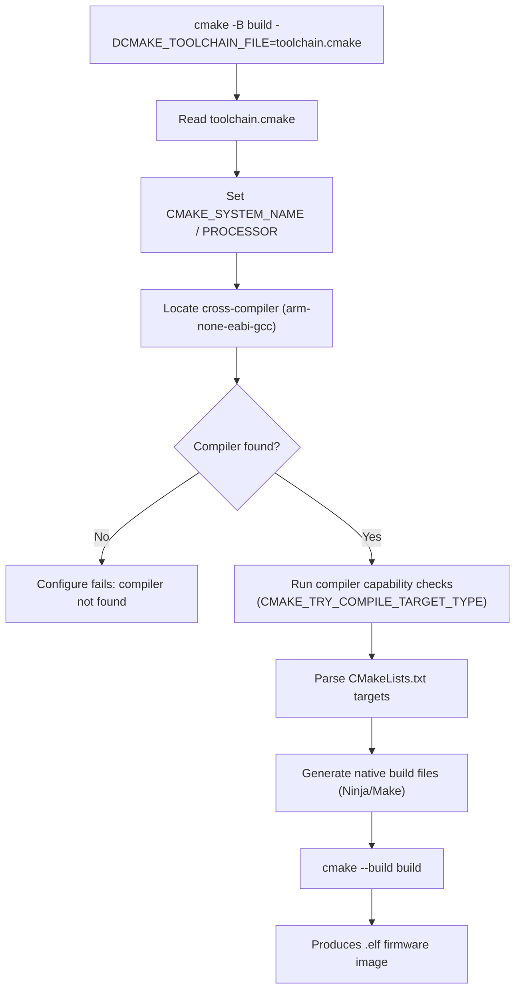
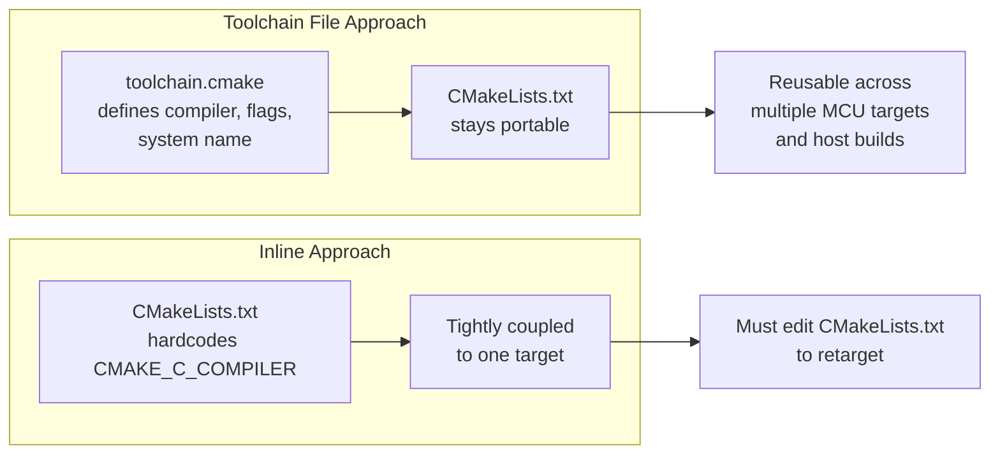

## CMake for Embedded Builds

### Overview

CMake is a cross-platform build system generator widely used in embedded development to manage complex toolchains, cross-compilation, multiple target configurations, and third-party dependencies. Rather than compiling code directly, CMake generates native build files (Makefiles, Ninja files, or IDE projects) from a higher-level, platform-independent description written in `CMakeLists.txt` files.

For embedded systems, CMake's primary value lies in its ability to cleanly separate the *build description* from the *host/target toolchain*, allowing the same project source to be built for a desktop simulator, an ARM Cortex-M microcontroller, or an RTOS target using different toolchain files.

### Why CMake for Embedded Projects

**Key Points**

- Decouples source code organization from compiler-specific flags via toolchain files
- Supports out-of-source builds, keeping generated artifacts separate from source trees
- Handles complex dependency graphs (HALs, RTOS kernels, third-party libraries) via `add_subdirectory` and `target_link_libraries`
- Integrates with static analysis, unit testing, and CI pipelines
- Generator-agnostic: same `CMakeLists.txt` can emit Makefiles, Ninja build files, or Eclipse/CLion project files
- Widely adopted by vendor SDKs (STM32CubeMX/CubeIDE exports, Zephyr RTOS, NXP MCUXpresso, Raspberry Pi Pico SDK) as a standard build backend

Embedded projects traditionally relied on hand-written Makefiles or vendor-locked IDE project files. CMake addresses portability and maintainability issues, though it introduces its own learning curve around scoping, generator expressions, and toolchain configuration.

### Core CMake Concepts

#### CMakeLists.txt and the Build Tree

Every CMake project has at least one `CMakeLists.txt` at the root, declaring the minimum CMake version, project name, and languages used:

```cmake
cmake_minimum_required(VERSION 3.20)
project(FirmwareApp LANGUAGES C CXX ASM)
```

CMake performs a two-stage process:

1. **Configure stage** — reads `CMakeLists.txt`, resolves variables, checks compiler capabilities, and generates native build files into a separate *build directory*.
2. **Generate/Build stage** — the native build tool (Make, Ninja) compiles and links using the generated files.

**Out-of-source builds** are strongly recommended: source stays untouched, and build artifacts live in a directory such as `build/`, making it trivial to delete and regenerate.

#### Targets

CMake's modern (post-2.8, "target-oriented") style centers on *targets* rather than global variables:

```cmake
add_executable(firmware
    src/main.c
    src/drivers/uart.c
    src/drivers/gpio.c
)

target_include_directories(firmware PRIVATE
    include/
)

target_compile_definitions(firmware PRIVATE
    STM32F407xx
    USE_HAL_DRIVER
)

target_compile_options(firmware PRIVATE
    -mcpu=cortex-m4
    -mfpu=fpv4-sp-d16
    -mfloat-abi=hard
    -mthumb
    -Wall
    -Wextra
)
```

Using target-scoped commands (`target_include_directories`, `target_compile_options`, `target_link_libraries`) instead of global ones (`include_directories`, `add_definitions`) prevents flag leakage across unrelated targets — important in embedded projects that often build multiple binaries (bootloader, application, test harness) from one tree.

### Cross-Compilation via Toolchain Files

Embedded builds are cross-compiled: the host (x86_64 Linux/macOS/Windows) builds binaries for a different target architecture (ARM, RISC-V, AVR, Xtensa). CMake formalizes this with a **toolchain file** — a separate `.cmake` script passed at configure time.

```cmake
# arm-none-eabi-gcc.cmake

set(CMAKE_SYSTEM_NAME Generic)
set(CMAKE_SYSTEM_PROCESSOR arm)

set(CMAKE_C_COMPILER   arm-none-eabi-gcc)
set(CMAKE_CXX_COMPILER arm-none-eabi-g++)
set(CMAKE_ASM_COMPILER arm-none-eabi-gcc)
set(CMAKE_OBJCOPY      arm-none-eabi-objcopy CACHE FILEPATH "")
set(CMAKE_SIZE         arm-none-eabi-size CACHE FILEPATH "")

# Prevents CMake from trying to run a test executable on the host,
# since bare-metal binaries cannot execute on a desktop OS.
set(CMAKE_TRY_COMPILE_TARGET_TYPE STATIC_LIBRARY)

set(CMAKE_C_FLAGS_INIT "-mcpu=cortex-m4 -mthumb -mfpu=fpv4-sp-d16 -mfloat-abi=hard")
set(CMAKE_EXE_LINKER_FLAGS_INIT "-T${CMAKE_SOURCE_DIR}/linker/STM32F407.ld -specs=nano.specs")
```

Invoked as:

```bash
cmake -B build -S . -DCMAKE_TOOLCHAIN_FILE=arm-none-eabi-gcc.cmake -DCMAKE_BUILD_TYPE=Release
cmake --build build
```

`CMAKE_SYSTEM_NAME Generic` signals a bare-metal target with no OS, which disables assumptions CMake makes about POSIX-like environments. `CMAKE_TRY_COMPILE_TARGET_TYPE STATIC_LIBRARY` is essential: by default, CMake's internal compiler checks attempt to *link and run* a test program, which fails for bare-metal targets since there is no OS to execute it under and often no `_exit`/`_start` runtime wired up yet.

### Toolchain Discovery Flow



### Producing Flashable Binary Formats

Embedded targets typically need `.bin` or `.hex` images, not just `.elf`. CMake handles this with post-build custom commands invoking `objcopy`:

```cmake
add_custom_command(TARGET firmware POST_BUILD
    COMMAND ${CMAKE_OBJCOPY} -O ihex $<TARGET_FILE:firmware> ${CMAKE_BINARY_DIR}/firmware.hex
    COMMAND ${CMAKE_OBJCOPY} -O binary $<TARGET_FILE:firmware> ${CMAKE_BINARY_DIR}/firmware.bin
    COMMAND ${CMAKE_SIZE} $<TARGET_FILE:firmware>
    COMMENT "Generating HEX and BIN images"
)
```

`$<TARGET_FILE:firmware>` is a **generator expression** — resolved at generate time rather than configure time, giving the correct output path regardless of generator or build type.

### Managing Vendor HALs and RTOS Sources

Large embedded projects commonly pull in a vendor Hardware Abstraction Layer (e.g., STM32 HAL, NXP SDK) or an RTOS (FreeRTOS, Zephyr, RIOT) as a subdirectory or interface library:

```cmake
add_library(stm32_hal STATIC
    Drivers/STM32F4xx_HAL_Driver/Src/stm32f4xx_hal.c
    Drivers/STM32F4xx_HAL_Driver/Src/stm32f4xx_hal_gpio.c
    Drivers/STM32F4xx_HAL_Driver/Src/stm32f4xx_hal_uart.c
)

target_include_directories(stm32_hal PUBLIC
    Drivers/STM32F4xx_HAL_Driver/Inc
    Drivers/CMSIS/Device/ST/STM32F4xx/Include
    Drivers/CMSIS/Include
)

target_compile_definitions(stm32_hal PUBLIC STM32F407xx USE_HAL_DRIVER)

target_link_libraries(firmware PRIVATE stm32_hal)
```

Declaring HAL includes as `PUBLIC` propagates them automatically to any target linking against `stm32_hal`, avoiding duplicated `target_include_directories` calls across the project.

For FreeRTOS specifically, the official CMake integration (via `FreeRTOS-Kernel`) uses an interface library pattern where the application provides `FreeRTOSConfig.h` through a config target:

```cmake
add_library(freertos_config INTERFACE)
target_include_directories(freertos_config INTERFACE config/)

set(FREERTOS_PORT "GCC_ARM_CM4F" CACHE STRING "")
add_subdirectory(third_party/FreeRTOS-Kernel)

target_link_libraries(firmware PRIVATE freertos_kernel)
```

### Linker Script Integration

Bare-metal firmware requires an explicit linker script (`.ld`) defining memory regions (Flash, RAM, CCM) and section placement. CMake does not interpret linker scripts itself — it just passes them through to the linker:

```cmake
target_link_options(firmware PRIVATE
    -T${CMAKE_SOURCE_DIR}/linker/STM32F407VG_FLASH.ld
    -Wl,-Map=${CMAKE_BINARY_DIR}/firmware.map
    -Wl,--gc-sections
)

set_target_properties(firmware PROPERTIES
    LINK_DEPENDS ${CMAKE_SOURCE_DIR}/linker/STM32F407VG_FLASH.ld
)
```

`LINK_DEPENDS` ensures CMake re-links the target if the linker script changes, since CMake cannot infer this dependency automatically. `--gc-sections` combined with `-ffunction-sections -fdata-sections` (set in compile options) enables dead-code elimination, which meaningfully reduces flash footprint. [Inference] The magnitude of size reduction from `--gc-sections` varies significantly by codebase and is not a guaranteed percentage.

### Build Configurations and Multi-Target Setups

Embedded projects frequently need multiple simultaneous outputs: a debug build, a release build, and sometimes a host-side unit test build using a native compiler. CMake presets (introduced in CMake 3.19+) formalize this via `CMakePresets.json`:

```json
{
  "version": 6,
  "configurePresets": [
    {
      "name": "stm32-debug",
      "generator": "Ninja",
      "binaryDir": "${sourceDir}/build/debug",
      "cacheVariables": {
        "CMAKE_TOOLCHAIN_FILE": "${sourceDir}/cmake/arm-none-eabi-gcc.cmake",
        "CMAKE_BUILD_TYPE": "Debug"
      }
    },
    {
      "name": "host-tests",
      "generator": "Ninja",
      "binaryDir": "${sourceDir}/build/host",
      "cacheVariables": {
        "CMAKE_BUILD_TYPE": "Debug",
        "BUILD_UNIT_TESTS": "ON"
      }
    }
  ]
}
```

```bash
cmake --preset stm32-debug
cmake --build --preset stm32-debug
```

Presets replace long, error-prone command lines and are commonly checked into version control so every developer and CI runner configures identically.

### Conditional Compilation for Multiple MCU Targets

A common pattern is a single codebase targeting several MCU variants, selected via a CMake cache variable:

```cmake
set(MCU_TARGET "STM32F407" CACHE STRING "Target MCU")
set_property(CACHE MCU_TARGET PROPERTY STRINGS STM32F407 STM32F411 STM32H743)

if(MCU_TARGET STREQUAL "STM32F407")
    target_compile_definitions(firmware PRIVATE STM32F407xx)
    target_compile_options(firmware PRIVATE -mcpu=cortex-m4 -mfpu=fpv4-sp-d16)
elseif(MCU_TARGET STREQUAL "STM32H743")
    target_compile_definitions(firmware PRIVATE STM32H743xx)
    target_compile_options(firmware PRIVATE -mcpu=cortex-m7 -mfpu=fpv5-d16)
endif()
```

### Example: Minimal Complete Project Layout

```plaintext
project/
├── CMakeLists.txt
├── cmake/
│   └── arm-none-eabi-gcc.cmake
├── linker/
│   └── STM32F407VG_FLASH.ld
├── src/
│   ├── main.c
│   └── startup_stm32f407xx.s
└── include/
    └── main.h
```

```cmake
cmake_minimum_required(VERSION 3.20)
project(BlinkyFirmware C ASM)

add_executable(blinky
    src/main.c
    src/startup_stm32f407xx.s
)

target_include_directories(blinky PRIVATE include)

target_compile_options(blinky PRIVATE
    -mcpu=cortex-m4 -mthumb -mfpu=fpv4-sp-d16 -mfloat-abi=hard
    -O2 -Wall -ffunction-sections -fdata-sections
)

target_link_options(blinky PRIVATE
    -T${CMAKE_SOURCE_DIR}/linker/STM32F407VG_FLASH.ld
    -Wl,--gc-sections -specs=nano.specs
)

add_custom_command(TARGET blinky POST_BUILD
    COMMAND ${CMAKE_OBJCOPY} -O binary $<TARGET_FILE:blinky> ${CMAKE_BINARY_DIR}/blinky.bin
    COMMAND ${CMAKE_SIZE} $<TARGET_FILE:blinky>
)
```

**Output**



```
   text    data     bss     dec     hex filename
   4216      20    1568    5804    16ac blinky.elf
```

### Toolchain File vs In-Tree Compiler Settings



Toolchain files are the preferred approach for any project expected to support more than one target or to also build host-side unit tests, since switching targets becomes a matter of passing a different `-DCMAKE_TOOLCHAIN_FILE`.

### Integration with IDEs and Debuggers

CMake's `compile_commands.json` export (`CMAKE_EXPORT_COMPILE_COMMANDS ON`) feeds language servers (clangd) for accurate code completion even under exotic cross-compiler flags. Most embedded-focused IDEs and extensions (CLion, VS Code + Cortex-Debug, Eclipse CDT via `cmake-tools`) consume CMake project structure directly, including launching OpenOCD/J-Link GDB servers using the resulting `.elf` for source-level debugging.

### Common Pitfalls

**Key Points**

- Forgetting `CMAKE_TRY_COMPILE_TARGET_TYPE STATIC_LIBRARY` causes the initial compiler check to fail on bare-metal targets, since CMake tries to link and execute a test binary
- Using global commands (`include_directories`, `link_libraries`) instead of target-scoped ones causes flag pollution across unrelated targets (e.g., bootloader picking up application-only defines)
- Omitting `LINK_DEPENDS` on the linker script means CMake will not re-link automatically after script edits
- Mixing host and cross-compiled targets in one configure without careful `CMAKE_SYSTEM_NAME` handling can cause CMake to attempt running cross-compiled test binaries on the host
- Not pinning a `cmake_minimum_required` version compatible with the toolchain file syntax used (e.g., `_INIT` flag variables require CMake ≥ 3.19 behavior in some contexts) [Unverified: exact minimum version requirements for specific `_INIT` variable behaviors should be checked against current CMake release notes, as this has evolved across versions]

### Related Topics

- Toolchains and Build Systems — Makefiles for embedded builds (classic alternative)
- Toolchains and Build Systems — Ninja as a CMake generator for faster incremental builds
- Toolchains and Build Systems — Zephyr RTOS build system (west + CMake)
- Toolchains and Build Systems — Yocto/Bitbake vs CMake for embedded Linux
- Debugging — OpenOCD and GDB integration with CMake-built firmware
- Testing — Unit testing embedded C code with CMake + Unity/CppUTest on host
- Static Analysis — Integrating clang-tidy and cppcheck into CMake builds
- Linker Scripts — Memory map design for Cortex-M devices