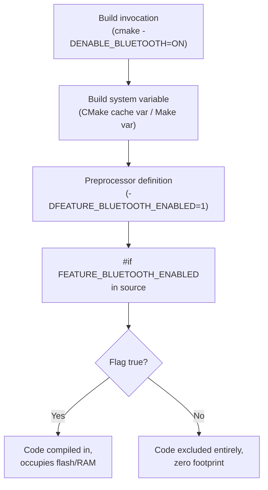
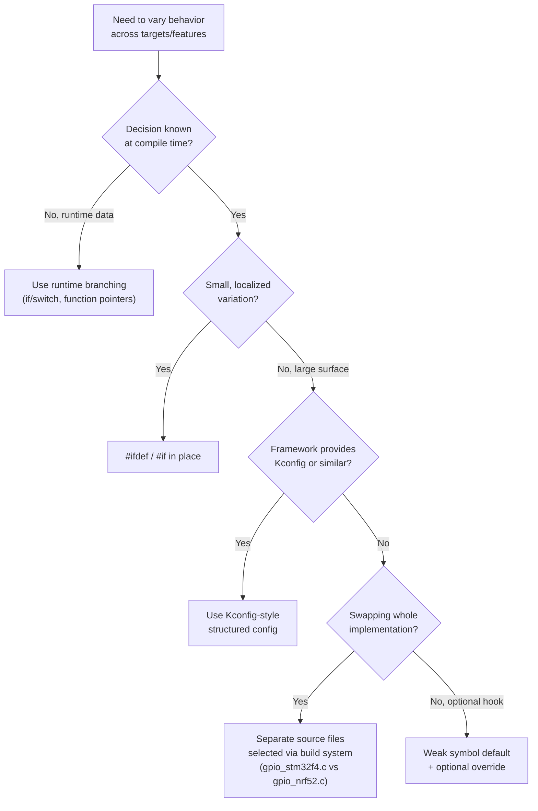

## Build Configuration and Conditional Compilation

### Overview

Build configuration and conditional compilation are the mechanisms by which a single embedded codebase produces different binaries for different targets, feature sets, or debug/release profiles — without maintaining separate source trees. This spans compiler preprocessor directives, build-system-level variables (CMake cache variables, Kconfig, Makefile flags), and code organization strategies that keep variant-specific logic maintainable as a project scales across MCU families, hardware revisions, and product SKUs.

### Why Conditional Compilation Matters in Embedded Systems

**Key Points**

- Embedded products frequently ship multiple hardware revisions (rev A/B/C boards) with differing peripherals, pin mappings, or memory sizes from the same firmware source
- Flash and RAM constraints make it impractical to compile in every possible feature; unused code must be excluded, not just left unreached
- Debug builds need instrumentation (logging, assertions, breakpoints) that must be fully absent from release builds for both size and timing reasons
- Product families often differ only in a handful of compile-time constants (buffer sizes, clock speeds, peripheral counts)
- Certification and safety-critical contexts (e.g., IEC 62304, DO-178C) often require traceable, auditable configuration of exactly what code is included in a given build

Unlike desktop or server software where features can often be toggled at runtime with negligible cost, embedded targets frequently cannot afford the flash footprint, RAM overhead, or execution-time branching of code paths that are known at build time to be unnecessary.

### The C Preprocessor as the Base Mechanism

At the lowest level, conditional compilation relies on the C preprocessor: `#define`, `#ifdef`, `#ifndef`, `#if`, `#elif`, `#else`, `#endif`.

```c
#if defined(STM32F407xx)
    #define SYSTEM_CLOCK_HZ 168000000UL
#elif defined(STM32F411xx)
    #define SYSTEM_CLOCK_HZ 100000000UL
#elif defined(STM32H743xx)
    #define SYSTEM_CLOCK_HZ 480000000UL
#else
    #error "No supported MCU target defined"
#endif
```

The `#error` directive is a deliberate safety net: rather than silently falling back to an undefined or default value, the build fails loudly if no recognized target macro was passed in, catching misconfiguration at compile time rather than at runtime on hardware.

**Feature flags** follow the same pattern:

```c
#define FEATURE_BLUETOOTH_ENABLED 1
#define FEATURE_USB_ENABLED       0

#if FEATURE_BLUETOOTH_ENABLED
void bt_init(void) {
    /* Bluetooth stack initialization */
}
#endif
```

Using `#if FEATURE_X` (numeric, always defined as 0 or 1) rather than `#ifdef FEATURE_X` (presence-based) is generally preferable: it lets the flag be referenced in ordinary boolean expressions (`#if FEATURE_A && FEATURE_B`) and avoids the common bug where a flag is accidentally defined as `0` but `#ifdef` still evaluates true because the macro exists.

### Passing Configuration from the Build System

Preprocessor macros are typically injected at the build-system level rather than hardcoded in source, so the same source compiles differently per invocation.

**GCC/Clang command line:**

```bash
arm-none-eabi-gcc -DSTM32F407xx -DFEATURE_BLUETOOTH_ENABLED=1 -c main.c
```

**CMake:**

```cmake
target_compile_definitions(firmware PRIVATE
    $<$<STREQUAL:${MCU_TARGET},STM32F407>:STM32F407xx>
    $<$<STREQUAL:${MCU_TARGET},STM32H743>:STM32H743xx>
    FEATURE_BLUETOOTH_ENABLED=$<BOOL:${ENABLE_BLUETOOTH}>
)
```

The `$<...>` syntax is a **generator expression**, evaluated at generate time. This allows configuration decisions (e.g., `ENABLE_BLUETOOTH` as a CMake option) to flow through to preprocessor definitions without branching logic scattered through `CMakeLists.txt`.

**Makefiles:**

```makefile
CFLAGS += -D$(MCU_TARGET) -DFEATURE_BLUETOOTH_ENABLED=$(ENABLE_BLUETOOTH)

build: CFLAGS += -DNDEBUG -O2
debug: CFLAGS += -DDEBUG -O0 -g3
```

### Configuration Flow



### Debug vs Release Configuration

Embedded projects almost universally distinguish at least two build types, often exposed via `CMAKE_BUILD_TYPE` or equivalent:

| Aspect | Debug | Release |
| --- | --- | --- |
| Optimization | `-O0` or `-Og` | `-O2` or `-Os` |
| Debug symbols | `-g3` (full) | none or `-g1` |
| Assertions | Enabled (`assert()` active) | Disabled (`-DNDEBUG`) |
| Logging | Verbose, often UART/SWO output | Minimal or none |
| Stack canaries | Often enabled | Sometimes disabled for size |
| Binary size | Larger | Minimized, often `-Os` prioritized over `-O2` |

```c
#ifdef DEBUG
    #define LOG_DEBUG(fmt, ...) printf("[DBG] " fmt "\n", ##__VA_ARGS__)
#else
    #define LOG_DEBUG(fmt, ...) ((void)0)
#endif
```

The `((void)0)` fallback ensures `LOG_DEBUG(...)` calls remain syntactically valid statements even when compiled out, so call sites don't need `#ifdef` guards around every logging call.

`assert()` behavior is itself governed by `NDEBUG`, per the C standard: when `NDEBUG` is defined, `assert()` expands to nothing. This is a built-in, standard-library-level conditional compilation mechanism, not project-specific.

### Hardware Abstraction via Conditional Compilation

A common architectural pattern uses conditional compilation to select between hardware-specific implementations behind a common interface, resolved entirely at compile time (no runtime function pointer overhead):

```c
// gpio_port.h
#if defined(STM32F4)
    #include "gpio_stm32f4.h"
#elif defined(NRF52)
    #include "gpio_nrf52.h"
#elif defined(HOST_SIMULATION)
    #include "gpio_sim.h"
#endif

void gpio_set_pin(gpio_pin_t pin, gpio_state_t state);
```

Each backend header/source implements the same function signatures, so application code calling `gpio_set_pin()` is portable across targets, while the linked object code contains only the implementation for the active target. The `HOST_SIMULATION` branch is a widely used pattern enabling unit tests to run on a development machine against a mocked hardware layer, entirely excluded from the embedded release build.

### Kconfig-Based Configuration (Zephyr, Linux-style)

Larger embedded frameworks (Zephyr RTOS, embedded Linux via Buildroot/Yocto) use **Kconfig** rather than raw preprocessor flags, providing a structured, dependency-aware configuration system with a menu-driven interface.

```kconfig
config BT
    bool "Bluetooth support"
    default n
    help
      Enable Bluetooth Low Energy stack.

config BT_MAX_CONN
    int "Maximum simultaneous BLE connections"
    depends on BT
    default 4
    range 1 8
```

Kconfig generates a header (`autoconf.h`) with corresponding `#define CONFIG_BT 1` macros consumed by source exactly like manually defined flags, but with the added benefits of dependency resolution (`BT_MAX_CONN` cannot be set without `BT` enabled), range validation, and a persisted `.config` file per build variant — critical for reproducibility across large configuration spaces.

```c
#if defined(CONFIG_BT)
    ble_stack_init();
#endif
```

### Weak Symbols as a Complementary Technique

Where preprocessor conditionals become unwieldy, **weak symbols** offer compile/link-time polymorphism without `#ifdef` branching in calling code:

```c
// Default implementation, provided by framework
__attribute__((weak)) void HAL_UART_ErrorCallback(UART_HandleTypeDef *huart) {
    /* default: do nothing */
}

// Application overrides by simply defining the same symbol
void HAL_UART_ErrorCallback(UART_HandleTypeDef *huart) {
    error_handler_log(huart);
}
```

If the application provides its own `HAL_UART_ErrorCallback`, the linker uses that definition; otherwise it falls back to the weak default. This is common in vendor HALs (STM32 HAL, NXP SDK) for optional user hook functions, and avoids requiring the vendor library source itself to be conditionally compiled per project.

### Multi-Variant Build Matrix Example

A product line with three hardware revisions and two feature tiers might structure configuration as an orthogonal matrix rather than one flag per combination:

```cmake
set(BOARD_REV "B" CACHE STRING "Hardware revision: A, B, or C")
set(PRODUCT_TIER "STANDARD" CACHE STRING "STANDARD or PRO")

target_compile_definitions(firmware PRIVATE
    BOARD_REV_${BOARD_REV}
    TIER_${PRODUCT_TIER}
)

if(PRODUCT_TIER STREQUAL "PRO")
    target_compile_definitions(firmware PRIVATE FEATURE_ADVANCED_TELEMETRY=1)
else()
    target_compile_definitions(firmware PRIVATE FEATURE_ADVANCED_TELEMETRY=0)
endif()
```

```c
#if defined(BOARD_REV_A)
    #define TEMP_SENSOR_I2C_ADDR 0x48
#elif defined(BOARD_REV_B) || defined(BOARD_REV_C)
    #define TEMP_SENSOR_I2C_ADDR 0x49  // sensor moved to different I2C address in rev B
#endif
```

This structure avoids combinatorial explosion (a naive one-flag-per-SKU approach scales as $O(n \times m)$ for $n$ revisions and $m$ tiers) by keeping revision and tier concerns orthogonal, each independently toggled.

### Conditional Compilation Decision Flow



### Common Pitfalls

**Key Points**

- Excessive `#ifdef` nesting ("ifdef hell") makes code difficult to read and test, since the number of logically distinct compiled variants grows combinatorially with the number of flags
- Forgetting to guard header inclusion consistently across translation units can cause one-definition-rule violations if different files see different macro states for the same struct/type definitions
- Testing only the default configuration and never building the excluded branches means dead-but-uncompiled code can silently rot and fail to compile when eventually enabled — CI matrices should build all supported flag combinations, or at least all shipped ones
- Relying on `#ifdef` for values that could instead be `const` variables removes debugger visibility, since preprocessor-substituted constants do not exist as symbols by the time the debugger inspects the binary [Inference: whether a given optimization level fully elides such constants from debug info depends on the specific compiler and DWARF settings in use]
- Mixing feature flags meant to be user/customer configurable with flags meant only for internal hardware variants, without clear naming conventions, tends to cause confusion about which flags are safe to toggle post-build versus which require a full firmware requalification

### Related Topics

- Toolchains and Build Systems — CMake for embedded builds
- Toolchains and Build Systems — Kconfig and Zephyr RTOS configuration workflow
- Toolchains and Build Systems — Makefile-based multi-target build matrices
- Software Architecture — Hardware Abstraction Layer (HAL) design patterns
- Testing — Structuring CI to build all supported configuration combinations
- Debugging — Preprocessor macro expansion inspection and debug symbol visibility
- Certification — Configuration traceability requirements in safety-critical firmware