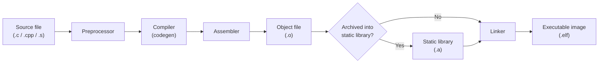
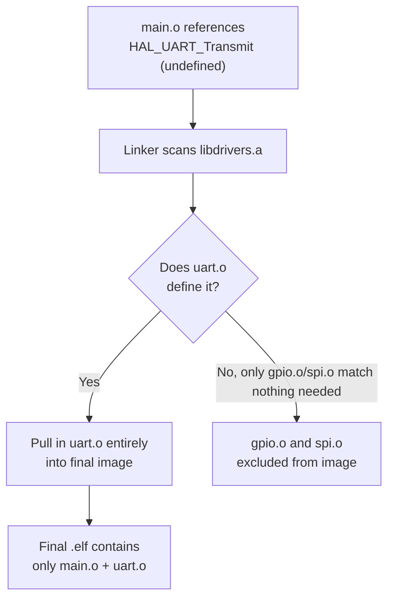

## Static Libraries and Object Files

### Overview

Object files and static libraries are the intermediate and packaged forms of compiled code that embedded toolchains produce and consume before final linking into an executable image. Understanding their structure — sections, symbols, relocations — is essential for embedded developers because memory placement, linker behavior, dead-code elimination, and binary size all hinge on how object code is organized at this level.

### The Compilation Pipeline



Each `.c` file is compiled independently into a `.o` object file; the linker later combines multiple object files (and libraries) into a single executable. This separate-compilation model is what allows incremental builds: only files that changed need recompiling, and the linker re-links the (mostly cached) set of object files.

### Anatomy of an Object File

Embedded toolchains (GCC, Clang/LLVM) typically emit object files in **ELF** (Executable and Linkable Format) even for bare-metal targets, prior to the final image being converted to `.bin`/`.hex` for flashing. An ELF object file is organized into **sections**:

| Section | Contents |
| --- | --- |
| `.text` | Compiled machine code (functions) |
| `.data` | Initialized global/static variables (non-zero) |
| `.bss` | Uninitialized/zero-initialized global/static variables (occupies no file space, only RAM at runtime) |
| `.rodata` | Read-only constants, string literals |
| `.symtab` | Symbol table (function/variable names and addresses) |
| `.rel.*` / `.rela.*` | Relocation entries — instructions for the linker on how to patch addresses |
| `.debug_*` | DWARF debug information (if compiled with `-g`) |
| `.ARM.attributes` | ARM-specific metadata (ABI version, FPU usage) on ARM targets |

This section-based structure is directly why linker scripts matter in embedded development: the linker script dictates which memory region (Flash vs. RAM, and which specific address range) each section is placed into.

**Inspecting an object file:**

```bash
arm-none-eabi-objdump -h main.o
```



```
Sections:
Idx Name          Size      VMA       LMA       File off  Algn
  0 .text         00000148  00000000  00000000  00000034  2**2
  1 .data         00000004  00000000  00000000  0000017c  2**2
  2 .bss          00000010  00000000  00000000  00000180  2**2
  3 .rodata       00000020  00000000  00000000  00000180  2**2
```

At this stage, VMA (Virtual Memory Address) and LMA (Load Memory Address) are still zero — actual addresses are assigned only once the linker places the object into the final image according to the linker script.

### Symbols and Symbol Resolution

Each object file has a **symbol table** listing every function and global/static variable it defines or references:

```bash
arm-none-eabi-nm main.o
```



```
00000000 T main
         U HAL_UART_Transmit
00000000 D g_counter
00000004 B g_buffer
```

- **`T`** — symbol defined in `.text` (a function)
- **`U`** — undefined; expected to be resolved by the linker from another object file or library
- **`D`** — defined in `.data` (initialized global)
- **`B`** — defined in `.bss` (uninitialized global)
- lowercase letters indicate **local** (static) linkage; uppercase indicate **global** linkage

The linker's core job is resolving every `U` (undefined) symbol against a `T`/`D`/`B` definition found in some other object file or library. If any undefined symbol remains unresolved after searching all inputs, the link fails with an "undefined reference" error — one of the most common embedded build errors, frequently caused by a missing source file, missing library, or incorrect link order.

### Static Libraries: Archives of Object Files

A static library (`.a` on GCC/Clang toolchains, sometimes `.lib` naming under some environments) is simply an **archive** — a container bundling multiple `.o` files together, created with `ar`:

```bash
arm-none-eabi-gcc -c uart.c -o uart.o
arm-none-eabi-gcc -c gpio.c -o gpio.o
arm-none-eabi-gcc -c spi.c  -o spi.o

arm-none-eabi-ar rcs libdrivers.a uart.o gpio.o spi.o
```

- **`r`** — insert/replace files in the archive
- **`c`** — create the archive if it doesn't already exist
- **`s`** — write an index (symbol table) into the archive, so the linker can quickly determine which member object provides which symbol without scanning every member sequentially

**Linking against it:**

```bash
arm-none-eabi-gcc main.o -L. -ldrivers -T linker/STM32F407.ld -o firmware.elf
```

`-ldrivers` tells the linker to look for `libdrivers.a` (the `lib` prefix and `.a` suffix are added automatically); `-L.` adds the current directory to the library search path.

### Critical Behavior: Static Linking Is Selective, Not Wholesale

A frequent point of confusion: linking a static library does **not** pull in every object file it contains. The linker pulls in only the *archive members* that resolve a currently-undefined symbol, and does so in a single pass over each library by default with the classic BFD linker (GNU `ld`).



This is precisely why static libraries are size-efficient for embedded targets compared to naively concatenating object files: an application using only UART functionality from a driver library does not pay flash cost for the unused SPI and GPIO object code, *provided* those unused functions live in separate object files (i.e., separate `.c` translation units) within the archive — the linker's inclusion granularity is per-object-file, not per-function, under default settings.

### Link Order Matters

Because the classic linker resolves symbols in a single left-to-right pass by default, **library order on the command line is significant**:

```bash
# WRONG: libdrivers.a is scanned before main.o creates the undefined reference
arm-none-eabi-gcc -ldrivers main.o -o firmware.elf   # likely fails

# CORRECT: object files (and anything that references the library) come first
arm-none-eabi-gcc main.o -ldrivers -o firmware.elf
```

If library A depends on symbols defined in library B, `A` must appear before `B` on the command line for a single-pass linker. Circular dependencies between two static libraries require either repeating the library (`-la -lb -la`) or wrapping them in `--start-group ... --end-group`, which forces the linker to keep re-scanning the enclosed libraries until no more symbols can be resolved:

```bash
arm-none-eabi-gcc main.o -Wl,--start-group -la -lb -Wl,--end-group -o firmware.elf
```

[Inference] Modern linkers (notably LLD and some Gold configurations) may handle certain circular cases more gracefully than the traditional BFD linker, but relying on default single-pass, order-dependent behavior remains the safest cross-toolchain assumption for embedded build portability.

### Per-Function/Data Section Placement for Finer-Grained Dead Code Elimination

Because static libraries only exclude at the object-file granularity by default, a library with many unrelated functions in one large `.c` file effectively forces all-or-nothing inclusion. The standard mitigation is compiling with:

```bash
arm-none-eabi-gcc -ffunction-sections -fdata-sections -c driver.c -o driver.o
```

This places each function and each global variable into its *own* uniquely named section (e.g., `.text.HAL_UART_Transmit` instead of a single shared `.text`), and at link time:

```bash
arm-none-eabi-gcc main.o -ldrivers -Wl,--gc-sections -T linker.ld -o firmware.elf
```

`--gc-sections` performs garbage collection at the section level, discarding any section not reachable from the entry point/reset vector — achieving function-level dead code elimination even from within a single object file, not just library-level exclusion.

### Comparing .o, .a, and .elf

| Artifact | Contains | Addresses assigned? | Typical use |
| --- | --- | --- | --- |
| `.o` | Single translation unit's code/data + relocations | No (relative, VMA=0) | Intermediate, per-source-file |
| `.a` | Archive of multiple `.o` files + symbol index | No | Distributable library, reusable across projects |
| `.elf` | Fully linked, all symbols resolved, addresses assigned | Yes | Debuggable final image; source for `.bin`/`.hex` conversion |

### Inspecting Static Library Contents

```bash
arm-none-eabi-ar t libdrivers.a
```



```
uart.o
gpio.o
spi.o
```

```bash
arm-none-eabi-nm libdrivers.a | grep " T "
```

Lists every globally-defined function across all archive members — useful for confirming a library actually exports the symbol an application expects before spending time debugging an "undefined reference" error.

### Common Pitfalls

**Key Points**

- Placing a static library before the object files that need it on the link command line causes unresolved symbol errors with single-pass linkers, even though the symbol genuinely exists in the library
- Bundling many unrelated functions into one large `.c` file inside a library defeats object-file-granularity dead code elimination unless `-ffunction-sections`/`-fdata-sections` + `--gc-sections` are used
- Confusing `.bss` size with actual file size: `.bss` occupies zero bytes in the `.o`/`.elf` file itself but *does* consume RAM at runtime, since the startup code zero-initializes it — a common source of surprise when file size doesn't match apparent memory usage
- Forgetting that `ar rcs` requires the `s` flag (or a separate `ranlib` call) to generate the symbol index; without it, older linkers may fail to find symbols in the archive [Inference] modern GNU `ar`/`ld` combinations often handle this automatically, but explicitly including `s` remains the portable convention
- Mixing object files compiled with incompatible ABI flags (e.g., hard-float vs soft-float, or differing `-mcpu` targets) within the same static library or final link, which can produce subtle runtime corruption rather than a clean link-time error on some toolchain versions [Unverified: whether a given mismatch is caught at link time depends on the specific compiler/linker version and whether `.ARM.attributes` compatibility checking is enforced]

### Related Topics

- Toolchains and Build Systems — Linker scripts and memory map design
- Toolchains and Build Systems — CMake for embedded builds
- Toolchains and Build Systems — Shared/dynamic libraries in embedded Linux contexts
- Debugging — Reading ELF sections and symbol tables with objdump/readelf
- Optimization — Dead code elimination and flash footprint reduction techniques
- Toolchains and Build Systems — Build configuration and conditional compilation