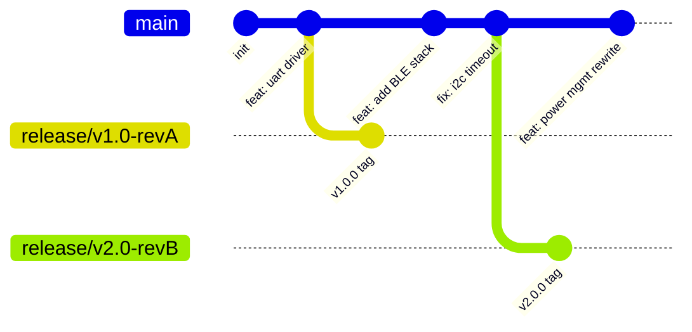
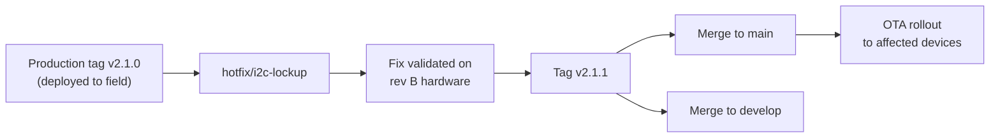
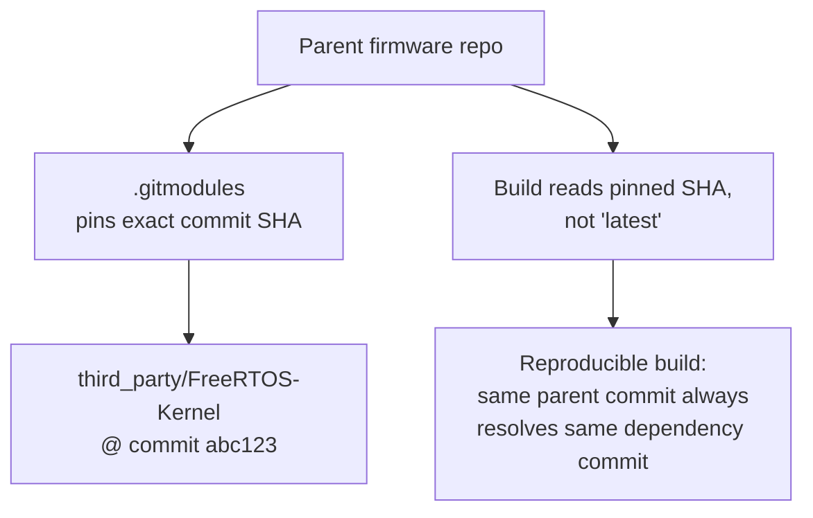
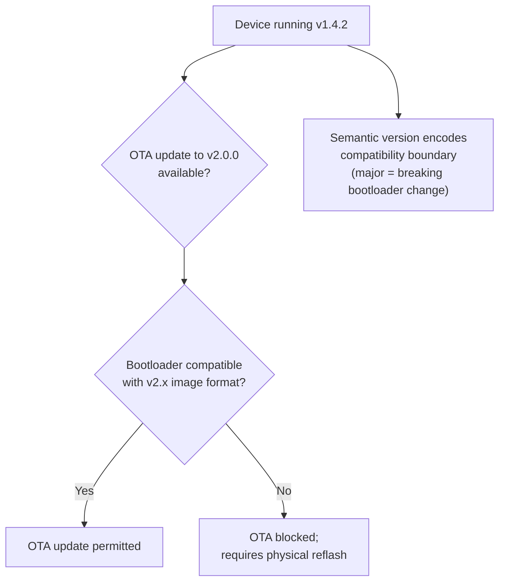

## Version Control Workflows for Firmware


### Overview

Firmware version control extends standard software version control practices with embedded-specific concerns: binary artifact tracking, hardware/firmware compatibility matrices, reproducible builds tied to specific toolchain versions, and traceability requirements often mandated by safety and regulatory standards. While Git remains the dominant VCS for firmware source, the workflows built around it differ meaningfully from typical web or application development due to the physical, often irreversible consequences of deploying the wrong firmware to hardware in the field.

### Why Firmware Version Control Differs from General Software

**Key Points**

- Firmware is frequently deployed to devices that are physically inaccessible after shipment, making rollback far more consequential than in server software
- Hardware revisions (rev A/B/C boards) must map deterministically to compatible firmware versions, requiring version control to track hardware/firmware compatibility, not just software history alone
- Regulatory contexts (medical devices, automotive, aerospace) often require full build reproducibility and traceability from a fielded binary back to the exact source commit, toolchain version, and build configuration that produced it
- Binary blobs (bootloaders, pre-compiled vendor libraries, calibration data) mix poorly with text-based diffing tools central to Git's workflow
- Long product lifecycles (years to decades) mean branches and tags must remain meaningful and buildable long after active development has moved on

### Branching Strategies

#### Trunk-Based Development with Release Branches

A common embedded pattern keeps a single active development trunk (`main`/`develop`), cutting a dedicated release branch at each hardware/product milestone:



Release branches allow field-critical bug fixes to be backported to a shipped product line (e.g., `release/v1.0-revA`) without dragging in unrelated feature work from `main`, which is essential when a device is already deployed and only a narrowly scoped, well-tested patch is acceptable.

#### Git Flow Adapted for Firmware

Classic Git Flow (`main`, `develop`, `feature/*`, `release/*`, `hotfix/*`) maps reasonably well to firmware, with `hotfix/*` branches being particularly important: a field-critical bug (e.g., a bricking bootloader defect) may require an emergency patch cut directly from a tagged production release, bypassing `develop` entirely, then merged back to both `main` and `develop` afterward.



#### Per-Board / Per-Variant Branching (Generally Discouraged)

Maintaining long-lived branches per hardware variant (`board-revA`, `board-revB`) is a common but fragile anti-pattern: it causes divergence and duplicated bug fixes across branches. The generally preferred alternative is a single branch with **conditional compilation** (build-time board selection via `BOARD_REV` flags) rather than branch-level hardware forking, keeping one buildable source of truth. [Inference] This preference is a widely-cited best practice in embedded engineering communities rather than a universal rule; some product lines with deeply divergent hardware may still justify separate long-lived branches, and the tradeoff depends on how much logic is actually shared.

### Tagging and Release Immutability

Tags mark exact, reproducible points corresponding to a binary that may already be running on physical hardware:

```bash
git tag -a v2.1.0 -m "Release 2.1.0 - Rev B hardware, BLE stack v3"
git push origin v2.1.0
```

**Key Points**

- Tags should be treated as immutable once a corresponding binary has been built and distributed — retagging after the fact breaks the source-to-binary traceability chain
- Annotated tags (`-a`) are preferred over lightweight tags because they carry a message, tagger identity, and timestamp, all valuable for audit trails
- Signed tags (`git tag -s`) add cryptographic verification, relevant when firmware provenance must be verifiable (e.g., preventing tampering claims in a supply chain)
- A common convention embeds the tag or short commit hash directly into the firmware binary itself (via a linker-placed version string or a generated header), so a device's running version can be queried at runtime and matched back to source history

```c
// version.h - generated by build system from `git describe`
#define FW_VERSION_STRING "v2.1.0-3-gabc1234"
#define FW_GIT_HASH       0xABC1234
```

```cmake
execute_process(
    COMMAND git describe --tags --always --dirty
    OUTPUT_VARIABLE GIT_VERSION
    OUTPUT_STRIP_TRAILING_WHITESPACE
    WORKING_DIRECTORY ${CMAKE_SOURCE_DIR}
)
configure_file(version.h.in version.h @ONLY)
```

The `-dirty` suffix from `git describe --dirty` flags builds made from an uncommitted working tree — critical for catching accidental releases built from unclean source, which would otherwise be untraceable to any specific commit.

### Handling Binary and Generated Artifacts

Git is a text-diffing tool at heart; firmware projects routinely include binary content that doesn't diff meaningfully:

| Artifact type | Recommended handling |
| --- | --- |
| Vendor pre-compiled libraries (`.a`, `.lib`) | Git LFS, or reference by package manager/submodule rather than committing raw binary |
| Calibration data blobs | Git LFS or external artifact storage, versioned separately from source |
| Compiled output (`.elf`, `.bin`, `.hex`) | Generally excluded via `.gitignore`; archived instead in a build artifact repository (Artifactory, S3, CI-attached release assets) tied to the triggering commit |
| Bootloader binaries (fixed, rarely rebuilt) | Sometimes committed directly if small and rarely changing, since they represent a known-good, audited artifact |

**Git LFS (Large File Storage)** is commonly adopted specifically to keep repository clone size manageable when binary vendor blobs or calibration tables must be version-controlled alongside source:

```bash
git lfs track "*.a"
git lfs track "vendor/**/*.bin"
git add .gitattributes
```

### Submodules and Vendor SDK Management

Firmware projects frequently depend on vendor SDKs (STM32Cube, NXP MCUXpresso SDK) or third-party libraries (FreeRTOS, mbedTLS) that are themselves independently versioned. Git submodules pin an exact commit of the dependency within the parent repository:

```bash
git submodule add https://github.com/FreeRTOS/FreeRTOS-Kernel third_party/FreeRTOS-Kernel
git submodule update --init --recursive
```



This pinning is what enables build reproducibility: cloning the parent repository at any historical commit and running `git submodule update` deterministically reconstructs the exact dependency versions used at that point, rather than resolving to whatever the dependency's upstream default branch currently contains.

**Key Points**

- Submodules are pinned to a specific commit, not a branch — updating requires an explicit `git submodule update --remote` plus a commit in the parent repo recording the new pinned SHA
- Forgetting `--recursive` on clone/checkout leaves nested submodules (submodules of submodules) uninitialized, a frequent source of "missing file" build failures for new contributors
- Alternatives such as a dedicated package manager (Conan, vcpkg, West manifest in Zephyr) address similar dependency-pinning needs with more structured dependency graphs and version constraint resolution than raw submodules provide

### Commit Practices for Traceability

Especially in regulated or safety-relevant firmware, commit history itself becomes part of the audit trail:



```
feat(uart): add DMA-based receive for high-throughput sensor stream

Replaces polling-based UART RX with circular DMA buffer to support
2kHz sensor sample rate without CPU-bound polling overhead.

Tested on rev B hardware, bench validated against reference scope
capture over 4 hours continuous operation.

Refs: JIRA-4821
```

Conventions commonly enforced:

- **Conventional commit prefixes** (`feat`, `fix`, `refactor`, `test`) enabling automated changelog generation
- **Issue/requirement traceability** — linking commits to a ticket or requirement ID, sometimes enforced via commit-msg hooks, supporting requirements-to-code traceability audits
- **No force-pushing to shared/release branches** — rewriting history on a branch that may already correspond to a built and flashed binary destroys the ability to reconstruct what was actually deployed
- **Signed commits** (`git commit -S`) in supply-chain-conscious organizations, verifying commit authorship cryptographically

### CI Integration and Build Reproducibility

Firmware CI pipelines typically go further than typical software CI by pinning not just source but the entire toolchain:

```yaml
# Example CI concept
build:
  image: embedded-toolchain:arm-gcc-12.2.1  # pinned toolchain container
  script:
    - cmake --preset stm32-release
    - cmake --build --preset stm32-release
    - arm-none-eabi-size build/firmware.elf
  artifacts:
    - build/firmware.bin
    - build/firmware.elf
    - build/firmware.map
```

Pinning the exact compiler version (not just "GCC") matters because compiler code generation, and particularly optimizer behavior, can differ between versions in ways that affect timing-sensitive embedded code — a build reproduced with a different compiler minor version is not guaranteed to be bit-identical or behaviorally identical. [Inference] The degree of behavioral difference across compiler versions is toolchain- and codebase-specific; some projects observe no practical difference across minor versions while others (particularly those relying on precise timing loops or specific undefined-behavior-adjacent patterns) are more sensitive.

### OTA Update Versioning Considerations

Version control history also underpins over-the-air (OTA) update safety: firmware version numbers must encode enough information for a device to determine valid update paths, since not all version jumps may be safe (e.g., a bootloader-incompatible jump requiring a factory reflash rather than OTA).



Semantic versioning (`MAJOR.MINOR.PATCH`), when tied consistently to Git tags, gives both the release engineering process and the device's own update-acceptance logic a shared, unambiguous compatibility contract.

### Common Pitfalls

**Key Points**

- Treating firmware version control identically to typical application version control, without accounting for the fact that a "bad rollback" may mean physically visiting deployed hardware rather than redeploying a server
- Rewriting or force-pushing history on branches/tags that already correspond to fielded binaries, breaking the audit trail from device to source
- Committing large or frequently-changing binary blobs directly into Git without LFS, causing repository bloat and slow clones that compound over a multi-year product lifecycle
- Using floating dependency references (branch tracking instead of pinned commits/tags) for vendor SDKs or RTOS kernels, undermining build reproducibility
- Neglecting to embed a build/version identifier into the firmware image itself, making it impossible to determine after the fact exactly which source state produced a given binary running in the field
- Allowing hardware-variant branches to diverge for extended periods, causing the same bug to require independent fixes on multiple branches

### Related Topics

- Toolchains and Build Systems — CMake for embedded builds
- Toolchains and Build Systems — Build configuration and conditional compilation
- Deployment — Over-the-air (OTA) update mechanisms and rollback safety
- Deployment — Bootloader design and firmware image validation
- Quality Assurance — Requirements traceability in regulated firmware development
- CI/CD — Continuous integration pipelines for embedded targets
- Toolchains and Build Systems — Dependency management with package managers (Conan, vcpkg, West)