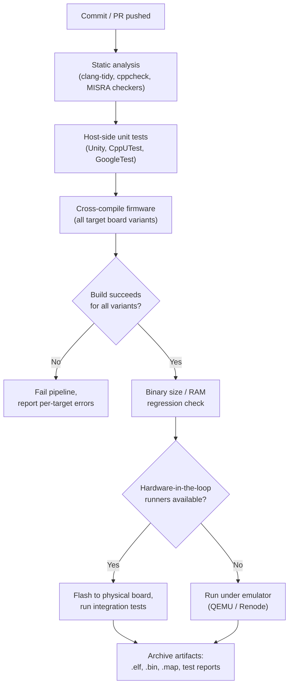
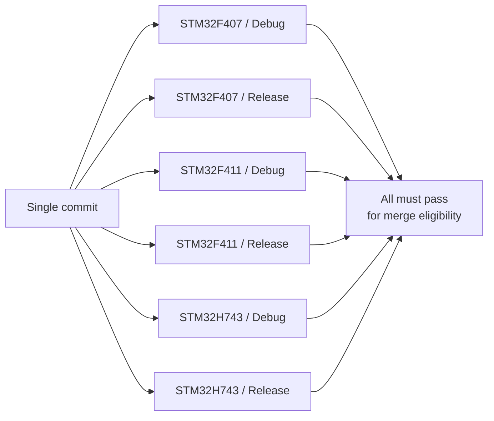
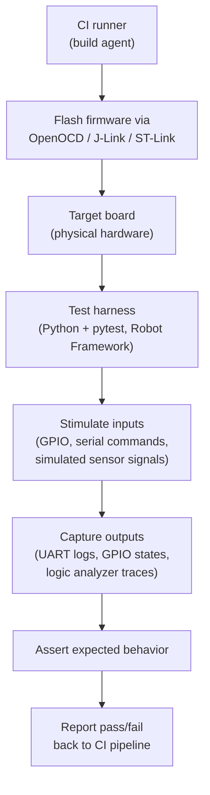

## Continuous Integration for Embedded Projects


### Overview

Continuous integration (CI) for embedded projects extends general software CI practices to accommodate cross-compilation, hardware-dependent testing, and the reality that the ultimate target of the build — physical silicon — cannot always be present in a CI runner. Embedded CI pipelines typically combine host-side build verification, static analysis, and unit testing with hardware-in-the-loop (HIL) stages that flash and exercise real or emulated target boards, closing the gap between "compiles cleanly" and "actually works on hardware."

### Why Embedded CI Differs from General Software CI

**Key Points**

- The build output is not directly executable on the CI runner (an x86_64 server cannot run ARM Cortex-M machine code natively without emulation)
- True end-to-end validation requires either physical hardware connected to the CI infrastructure or a sufficiently accurate emulator/simulator
- Toolchain and SDK versions matter more precisely than in most software domains, since compiler code generation differences can affect timing-critical or size-constrained firmware
- Test execution against real hardware introduces flakiness sources absent from software CI: flaky USB/JTAG connections, board power-cycling reliability, thermal variation, and physical wear on test fixtures
- Build artifacts (`.elf`, `.bin`, `.hex`, `.map`) are meaningful CI outputs in their own right, often archived and size-tracked across builds

### CI Pipeline Stages for Embedded Projects



### Host-Side Unit Testing

The first and cheapest validation layer compiles application logic with a *native* (host) compiler rather than the cross-compiler, isolating hardware-independent logic (parsers, state machines, algorithms) for fast execution directly on the CI runner without any target hardware.

```cmake
if(BUILD_UNIT_TESTS)
    enable_testing()
    add_executable(test_crc
        tests/test_crc.c
        src/crc.c
    )
    target_link_libraries(test_crc PRIVATE unity)
    add_test(NAME crc_tests COMMAND test_crc)
endif()
```

```bash
cmake --preset host-tests
cmake --build --preset host-tests
ctest --test-dir build/host --output-on-failure
```

This pattern requires structuring firmware code with a clean separation between hardware-dependent code (drivers, register access) and hardware-independent logic, often via the hardware abstraction layer discussed in conditional compilation practices — logic behind a mockable interface can be exercised on the host, while the concrete hardware implementation is excluded from the host test build entirely.

**Key Points**

- Host-side tests run in seconds to minutes, versus potentially much longer cycles for hardware flashing and test execution
- Mocking hardware interfaces (fake I2C/SPI transaction results, simulated ADC readings) allows testing error-handling paths that are difficult or risky to trigger on real hardware (e.g., simulated sensor failure, bus timeout)
- Common host-side unit test frameworks include Unity, CppUTest, GoogleTest/GoogleMock (for C++), and Ceedling (which wraps Unity with a build/mocking harness)

### Static Analysis in CI

Static analysis catches classes of defects — undefined behavior, buffer overruns, uninitialized reads — before any test execution, and is comparatively cheap to run on every commit.

```yaml
static-analysis:
  script:
    - cppcheck --enable=all --inconclusive --error-exitcode=1 src/
    - clang-tidy src/*.c -- -Iinclude -DSTM32F407xx
```

For safety-critical or automotive-adjacent firmware, MISRA C compliance checking (via commercial tools like PC-lint, Polyspace, or Parasoft, or open-source approximations) is frequently a required CI gate rather than an optional check, since MISRA violations often correspond to genuinely undefined or implementation-defined behavior that behaves unpredictably across compiler versions.

### Cross-Compilation Matrix Builds

Because firmware often targets multiple board revisions or MCU variants from one source tree, CI typically builds the full matrix on every commit rather than a single configuration, catching regressions specific to a variant that a developer may not have locally.

```yaml
build-matrix:
  strategy:
    matrix:
      target: [STM32F407, STM32F411, STM32H743]
      build_type: [Debug, Release]
  script:
    - cmake --preset ${target}-${build_type}
    - cmake --build --preset ${target}-${build_type}
```



### Binary Size and Memory Regression Tracking

Because flash and RAM are hard, fixed constraints, embedded CI commonly tracks binary size across commits and fails or warns when size growth exceeds a threshold — a check with no direct analogue in most server-side software CI.

```bash
arm-none-eabi-size build/firmware.elf
```



```
   text    data     bss     dec     hex filename
  48216     412   12568   61196    ef4c firmware.elf
```

```yaml
size-check:
  script:
    - SIZE=$(arm-none-eabi-size -A build/firmware.elf | grep '^\.text' | awk '{print $2}')
    - echo "Flash text size: $SIZE bytes"
    - if [ "$SIZE" -gt "$FLASH_BUDGET" ]; then echo "Flash budget exceeded"; exit 1; fi
```

Tracking size trends over time (rather than only a hard pass/fail threshold) helps catch gradual creep — a series of individually small increases that eventually exhaust available flash — which a single-commit-diff review would not surface.

### Hardware-in-the-Loop (HIL) Testing

The highest-fidelity validation stage flashes real firmware onto physical, CI-connected hardware and runs automated test sequences against it.



A typical HIL rig includes: a programmer/debugger (ST-Link, J-Link, Black Magic Probe) for flashing, a means of power-cycling the board remotely (a controllable relay or USB power switch), and instrumentation to observe behavior — commonly UART capture, GPIO monitoring, or a logic analyzer — feeding into a host-side test framework (pytest with hardware-control libraries is a common combination).

**Key Points**

- HIL infrastructure is comparatively expensive to build and maintain relative to pure software CI, requiring physical lab space, dedicated hardware, and ongoing fixture maintenance
- HIL runners are typically self-hosted rather than using cloud CI vendor-provided runners, since cloud runners have no physical hardware attached
- Flakiness in HIL stages often stems from the physical layer (loose connections, power supply noise, thermal effects) rather than the firmware logic itself, requiring careful test design (retries, health checks on the rig itself) to avoid false failures blocking merges
- Some organizations run a lightweight HIL smoke test on every commit and a fuller hardware regression suite only on nightly builds or pre-release candidates, balancing thoroughness against rig availability and cycle time

### Emulation as a HIL Alternative

Where physical HIL infrastructure is unavailable or as a faster complementary layer, emulators can execute the actual cross-compiled binary without physical hardware:

- **QEMU** supports a growing set of embedded targets (various ARM Cortex-M/A boards), allowing the real `.elf` to run under emulation with simulated peripherals
- **Renode** is purpose-built for embedded/IoT emulation, supporting multi-node scenarios (simulating a whole sensor network) and deterministic, reproducible test execution — valuable specifically because CI runs benefit from determinism that physical hardware timing cannot always guarantee

```bash
qemu-system-arm -M netduinoplus2 -kernel build/firmware.elf -serial stdio -nographic
```

[Inference] Emulator fidelity varies significantly by target and peripheral set; MCUs or peripherals without mature QEMU/Renode support may require physical HIL for meaningful validation, and emulated timing behavior does not always match real silicon precisely enough for timing-critical test cases.

### Toolchain Reproducibility in CI

CI environments should pin exact toolchain versions (compiler, SDK, CMake) rather than resolving to "latest," since compiler version drift can silently change generated code behavior between builds of the same source:

```dockerfile
FROM ubuntu:22.04
RUN apt-get update && apt-get install -y \
    gcc-arm-none-eabi=15:12.2.rel1-1 \
    cmake=3.26.* \
    ninja-build
```

Containerizing the toolchain (Docker/OCI images pinned by tag or digest) is the most common approach, ensuring every CI run — and ideally every developer's local build — uses an identical compiler version, addressing the reproducibility concerns discussed in firmware version control practices.

### Artifact Archival and Traceability

CI pipelines typically archive build outputs tagged with the triggering commit, linking a specific binary back to exact source state:

```yaml
artifacts:
  paths:
    - build/firmware.elf
    - build/firmware.bin
    - build/firmware.map
    - build/test-results.xml
  expire_in: 1 year
```

Retaining `.map` files alongside binaries is particularly valuable for embedded projects: if a size regression or memory-related field issue surfaces later, the map file allows post-hoc analysis of exactly which symbols occupied which addresses in a specific historical build, without needing to reproduce the build environment from scratch.

### Common Pitfalls

**Key Points**

- Treating a successful cross-compile as sufficient validation, without any host-side test or hardware-level execution, allows logic errors to reach hardware undetected since compilation success says nothing about runtime correctness
- Under-investing in HIL rig reliability, leading to frequent flaky failures that teams learn to ignore — eroding the pipeline's ability to catch genuine regressions ("alert fatigue" applied to hardware test infrastructure)
- Not pinning toolchain versions in CI, allowing a routine base-image update to silently change compiler behavior and introduce untraceable regressions
- Skipping binary size tracking until flash is nearly exhausted, at which point diagnosing which historical change caused the creep requires reconstructing a long history of individually small size increases
- Running the full hardware regression suite on every single commit when rig capacity cannot support it, creating a bottleneck that pressures teams to bypass CI gates under deadline pressure
- Assuming emulator-passing tests guarantee real-hardware correctness for timing-sensitive or peripheral-heavy code paths where emulation fidelity is limited

### Related Topics

- Toolchains and Build Systems — CMake for embedded builds
- Toolchains and Build Systems — Version control workflows for firmware
- Toolchains and Build Systems — Build configuration and conditional compilation
- Testing — Hardware-in-the-loop test harness design
- Testing — Unit testing embedded C with host-side frameworks
- Deployment — Over-the-air update pipelines and staged rollout gating
- Static Analysis — MISRA C compliance checking in automated pipelines
- Emulation — QEMU and Renode for embedded target simulation