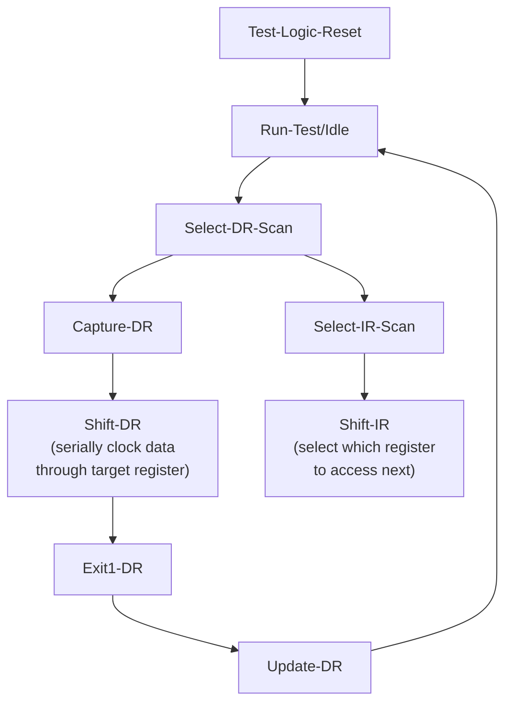
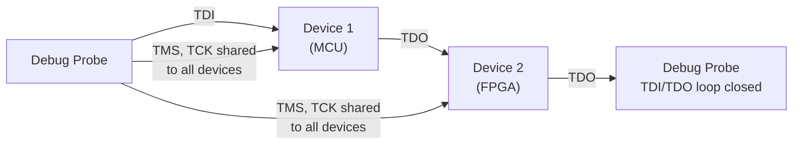
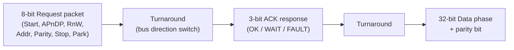
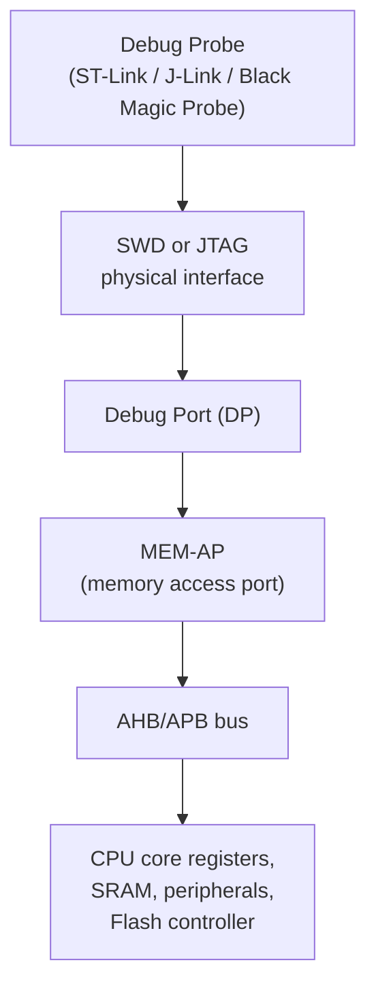

## JTAG and SWD Debugging Interfaces

### Overview

JTAG (Joint Test Action Group) and SWD (Serial Wire Debug) are the two dominant hardware debug interfaces used to program, halt, single-step, inspect, and trace embedded processors at the silicon level. Both provide a physical, low-level channel between a debug probe (host-side hardware) and an on-chip debug module, enabling operations impossible through software alone: halting execution at an arbitrary instruction, reading/writing memory and registers while the CPU is stopped, setting hardware breakpoints, and flashing firmware without a bootloader.

### JTAG Fundamentals

JTAG originated as IEEE 1149.1, a standard for boundary-scan testing of PCB interconnects, later repurposed as the dominant debug access mechanism for many processor architectures.

**Signal lines:**

| Signal | Purpose |
| --- | --- |
| TCK | Test Clock — synchronizes all JTAG operations |
| TMS | Test Mode Select — controls the state machine governing JTAG operation mode |
| TDI | Test Data In — serial data shifted into the target |
| TDO | Test Data Out — serial data shifted out of the target |
| TRST (optional) | Test Reset — asynchronous reset of the JTAG state machine |

JTAG operates via a **Test Access Port (TAP) state machine**, a 16-state finite state machine navigated by toggling TMS on each TCK rising edge. Data is shifted through instruction and data registers serially, one bit per clock cycle, meaning JTAG throughput scales directly with TCK frequency and register width — a defining characteristic that shapes both its capabilities and its comparative slowness against alternatives.



**Multi-device chaining** is a distinguishing JTAG capability: multiple JTAG-compliant devices on a board can be connected in a single **daisy chain**, with TDO of one device feeding TDI of the next, allowing a single probe to access several chips (e.g., an MCU and an FPGA) sequentially through one physical interface.



### SWD Fundamentals

SWD is an ARM-specific alternative defined as part of the ARM Debug Interface (ADI) specification, designed specifically to reduce pin count while preserving nearly all JTAG debug capability for ARM Cortex-M and Cortex-A cores.

**Signal lines:**

| Signal | Purpose |
| --- | --- |
| SWCLK | Serial Wire Clock |
| SWDIO | Serial Wire Data I/O — bidirectional, single wire for both directions |

SWD reduces the interface to just two signals (plus ground and, optionally, SWO for trace) versus JTAG's four-to-five, at the cost of losing multi-device daisy-chaining and needing a request/acknowledge protocol on the single bidirectional data line rather than separate TDI/TDO paths.

**Protocol structure**, each SWD transaction:



### JTAG vs. SWD Comparison

| Aspect | JTAG | SWD |
| --- | --- | --- |
| Pin count | 4-5 (TCK, TMS, TDI, TDO, optional TRST) | 2 (SWCLK, SWDIO) + optional SWO |
| Multi-device daisy-chaining | Yes, natively | No (single target per SWD connection) |
| Architecture scope | Broad (ARM, MIPS, RISC-V, FPGAs, many others) | ARM Cortex-M/A specific |
| Boundary-scan PCB testing | Yes (original purpose) | No |
| Typical use case | Multi-chip boards, FPGA bitstream loading, non-ARM targets | Space-constrained ARM Cortex-M designs (most common on small MCU boards) |
| Real-time trace output | Via dedicated trace pins (TRACE0-3, TRACECLK) if present | Via SWO (Serial Wire Output), a separate single trace pin |

On many modern ARM Cortex-M MCUs, the same physical pins are shared and configurable between JTAG and SWD modes (JTAG-DP and SW-DP both connect to the same underlying Debug Access Port), so a design decision at the board level — not a fundamentally different silicon debug core — determines which protocol is actually usable on a given board.

### The Debug Access Port and Memory Access

Both JTAG and SWD ultimately connect to an on-chip **Debug Port (DP)**, which in turn provides access to one or more **Access Ports (AP)** — most commonly a **MEM-AP**, which exposes the processor's memory and register space over the debug interface via standard bus protocols (AMBA AHB or APB on ARM designs).



This is the mechanism by which a debugger can halt the CPU, read/write arbitrary memory addresses, and program flash — all without any cooperation from running firmware, which is essential for bringing up entirely blank silicon or recovering a device whose firmware has bricked itself.

### Debug Probes and Toolchain Integration

Common hardware debug probes translate USB commands from a host debugger into JTAG/SWD signal sequences on the target:

- **ST-Link** (ST Microelectronics) — commonly integrated on-board on STM32 Nucleo/Discovery boards, supports SWD primarily
- **J-Link** (SEGGER) — widely used commercial probe supporting both JTAG and SWD across many architectures, with strong software tooling
- **Black Magic Probe** — open-source probe that embeds a GDB server directly on the probe hardware, avoiding a separate host-side server process
- **CMSIS-DAP** — an ARM-defined standard USB HID-based debug probe firmware, allowing vendor-agnostic probes that any CMSIS-DAP-compatible tool can drive without vendor-specific drivers

**OpenOCD** (Open On-Chip Debugger) is the dominant open-source bridge software, translating GDB Remote Serial Protocol commands from a debugger frontend into JTAG/SWD transactions via a connected probe:


```bash
openocd -f interface/stlink.cfg -f target/stm32f4x.cfg
```



```
Open On-Chip Debugger
Info : STLINK V2J29S7 (API v2) VID:PID 0483:3748
Info : Target voltage: 3.246024
Info : clock speed 1800 kHz
Info : STM32F407VGTx.cpu: hardware has 6 breakpoints, 4 watchpoints
```

In a separate terminal, GDB connects to OpenOCD's exposed GDB server port:

```bash
arm-none-eabi-gdb build/firmware.elf
(gdb) target remote localhost:3333
(gdb) monitor reset halt
(gdb) load
(gdb) continue
```

`monitor reset halt` issues an OpenOCD-specific command (passed through GDB's `monitor` passthrough) resetting the target and immediately halting it at the reset vector, before `load` writes the `.elf` sections to flash via the debug interface — the actual programming mechanism most flashing tools ultimately use under the hood.

### Debug Capabilities Enabled

**Key Points**

- **Hardware breakpoints** — implemented via dedicated comparator registers in the CPU's debug logic (e.g., ARM's FPB/Flash Patch and Breakpoint unit on Cortex-M), allowing execution to halt at a specific address without modifying the actual code in flash, unlike software breakpoints which patch in a trap instruction
- **Watchpoints** — hardware comparators that halt execution when a specified memory address is read/written, essential for catching memory corruption bugs (e.g., a stray pointer write) that are otherwise extremely difficult to trace to their origin
- **Single-stepping** — executing exactly one instruction (or source line) at a time, with full register/memory inspection between steps
- **Live memory/register inspection while halted** — reading peripheral registers, RAM contents, and CPU state without the target's firmware needing any debug-support code compiled in
- **Flash programming** — writing firmware images directly into flash memory through the debug port, the mechanism underlying most "flash" or "program" operations in IDEs

### Trace Capabilities: SWO and ETM

Beyond basic halt/step/inspect, higher-end debug scenarios use dedicated trace hardware to observe program behavior *without* halting execution, essential for timing-sensitive or real-time code where stopping the CPU would itself alter the behavior being investigated.

- **SWO (Serial Wire Output)** — a single additional pin (used alongside SWD) carrying instrumentation trace (ITM — Instrumentation Trace Macrocell) output, commonly used for lightweight, low-overhead `printf`-style debug logging that doesn't require a UART peripheral
- **ETM (Embedded Trace Macrocell)** — a much higher-bandwidth trace mechanism (requiring dedicated parallel trace pins in JTAG-based configurations) capturing full instruction execution history, enabling reconstruction of the exact instruction-by-instruction path the CPU took, invaluable for diagnosing intermittent or timing-dependent faults

```c
// ITM-based trace output via SWO, using CMSIS ITM_SendChar
ITM_SendChar('H');
ITM_SendChar('i');
```

[Inference] ETM availability and trace pin count vary substantially by specific MCU part number and package; many low-cost Cortex-M0/M0+ parts omit ETM support entirely, while higher-end Cortex-M7/M33 or Cortex-A parts more commonly include it, though exact availability should always be confirmed against the specific part's reference manual rather than assumed from core family alone.

### Common Pitfalls

**Key Points**

- Confusing SWD's SWDIO pin sharing with a spare GPIO — reusing a debug pin for application I/O without providing a way to disable that function can permanently lock out debug access on a deployed board, since the debugger can no longer establish the required protocol
- Attempting daisy-chained multi-device debugging over SWD, which is not supported by the protocol — this requires JTAG or independent SWD connections per device
- Overlooking target power/voltage mismatches: many probes both sense and (optionally) supply target voltage, and connecting a 5V-tolerant probe configuration to a 1.8V target incorrectly can damage the target or simply fail to establish a reliable connection
- Setting TCK/SWCLK frequency too high for a given board's signal integrity (long ribbon cables, poor grounding), causing intermittent connection failures that are often misdiagnosed as firmware or hardware bugs rather than a debug-link signal integrity issue
- Forgetting that a target held in a low-power sleep/stop mode may not respond to debug connection attempts without probe/firmware support for "connect under reset" or similar, since some low-power states also gate the debug clock domain [Unverified: exact behavior is highly MCU-family-specific and depends on debug-in-low-power-mode configuration bits that vary across silicon vendors]
- Locking a device's debug access via a readout/debug protection fuse (common security feature) without retaining a documented recovery/mass-erase procedure, permanently losing debug access to that unit

### Related Topics

- Toolchains and Build Systems — CMake for embedded builds
- Debugging — GDB command reference for embedded targets
- Debugging — OpenOCD configuration for custom hardware
- Hardware — Debug connector pinouts (10-pin Cortex Debug, 20-pin JTAG)
- Security — Debug port lockout and readout protection mechanisms
- Real-Time Systems — Non-intrusive trace for RTOS scheduling analysis
- Toolchains and Build Systems — Continuous integration for embedded projects (HIL flashing via JTAG/SWD)