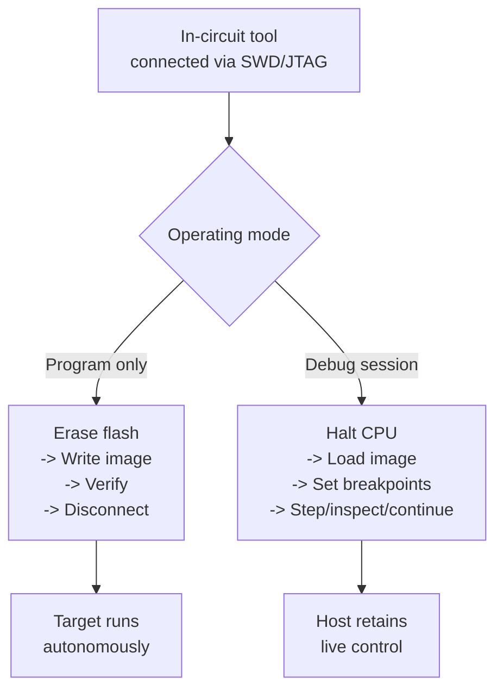
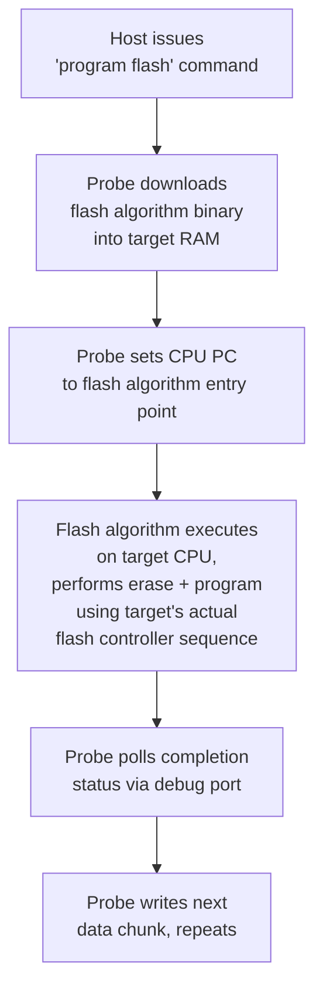
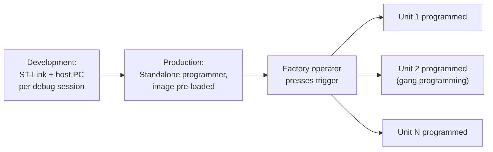

## In-Circuit Debuggers and Programmers

### Overview

In-circuit debuggers (ICDs) and in-circuit programmers are the hardware tools that connect a development host to a target embedded system for the purposes of loading firmware into non-volatile memory and, in the debugger case, controlling and inspecting program execution while the target remains installed on its actual circuit board — "in-circuit" as distinguished from removing the chip and programming it externally in a socket. This category encompasses vendor-specific probes (ST-Link, PICkit, J-Link), open hardware/firmware solutions (Black Magic Probe, CMSIS-DAP), and the standards (CMSIS-DAP, SEGGER's proprietary protocol) that govern how they communicate with target silicon.

### Programmer vs. Debugger: A Functional Distinction

**Key Points**

- A **programmer** performs one function: writing a firmware image into the target's non-volatile memory (internal flash, external SPI flash, EEPROM), then typically disconnecting
- A **debugger** additionally provides real-time control: halting execution, single-stepping, setting breakpoints/watchpoints, and live memory/register inspection while connected
- Most modern in-circuit tools (ST-Link, J-Link, PICkit, CMSIS-DAP probes) combine both functions in one physical device, with the distinction being which mode a given software session invokes
- Pure production programmers (used on a manufacturing line) often deliberately omit debug functionality, prioritizing speed, simplicity, and sometimes offline/standalone operation without a host PC per unit



### Common In-Circuit Debugger/Programmer Families

#### ST-Link

ST-Link is STMicroelectronics' probe for STM32 (and STM8) devices, ubiquitous because it is integrated on-board on virtually every Nucleo and Discovery evaluation board, giving developers a debug/program interface with zero additional hardware purchase.

- Communicates over SWD (primarily) or SWIM (for STM8, a different single-wire protocol)
- Exposed to host software via ST-Link's own driver stack, consumed by STM32CubeProgrammer, OpenOCD, and PyOCD
- On-board variants can typically be "cut away" from the eval board (via a jumper/solder bridge) to debug an external target instead

```bash
STM32_Programmer_CLI -c port=SWD -w firmware.bin 0x08000000 -v -rst
```

#### SEGGER J-Link

J-Link is a widely used commercial probe line supporting a broad range of architectures (ARM Cortex-M/A/R, RISC-V with appropriate licensing) beyond a single vendor's silicon, differentiating itself primarily through connection speed and software tooling maturity.

- Uses a proprietary host-to-probe protocol rather than an open standard, requiring SEGGER's own driver/software stack (J-Link software pack) or middleware built atop it
- J-Link's RTT (Real-Time Transfer) feature provides a high-throughput, non-blocking logging channel over the existing debug connection, an alternative to SWO/ITM trace that many developers find easier to integrate for `printf`-style debug output
- Available across a hardware tier range: J-Link EDU (educational/hobbyist licensing), J-Link Base, J-Link Ultra+/Pro (added trace, faster clocking, additional target voltage ranges)

```c
// SEGGER RTT usage example
SEGGER_RTT_printf(0, "Sensor value: %d\n", sensor_reading);
```

#### Microchip PICkit / ICD

Microchip's PIC and AVR device families use their own in-circuit serial programming protocols (ICSP for PIC, UPDI/debugWIRE for many AVR parts) rather than JTAG/SWD, reflecting the pre-ARM-Cortex architectural lineage of these product lines.

- **PICkit** (PICkit 3, 4, 5) — combined programmer/debugger for PIC microcontrollers, integrated into MPLAB X IDE
- **ICD (In-Circuit Debugger)** — Microchip's higher-end debug probe line (ICD 3, 4) with faster programming and additional debug features versus the PICkit line
- **UPDI (Unified Program and Debug Interface)** — single-wire interface used on newer AVR parts (e.g., AVR-Dx, megaAVR-0 series), functionally analogous in role to SWD but AVR-specific and electrically distinct

#### CMSIS-DAP

CMSIS-DAP is an ARM-published open standard defining a USB HID-class debug probe firmware interface, allowing any compliant probe hardware to be driven by any compliant host tool without vendor-specific drivers — addressing the driver fragmentation that proprietary probe ecosystems otherwise create.


Because CMSIS-DAP firmware can run on inexpensive microcontrollers (some official Cortex-M dev boards ship a secondary on-board MCU running CMSIS-DAP firmware purely to serve as the debug probe for the primary target chip), it has become a common low-cost, driver-friendly baseline particularly in open-source and educational tooling contexts.

#### Black Magic Probe

Black Magic Probe (BMP) is an open-source hardware and firmware probe distinguished by embedding a GDB server directly on the probe itself, rather than requiring a separate host-side bridge process (OpenOCD or similar).

```bash
arm-none-eabi-gdb build/firmware.elf
(gdb) target extended-remote /dev/ttyACM0
(gdb) monitor swdp_scan
(gdb) attach 1
(gdb) load
```

This architecture removes one moving part from the toolchain (no separate OpenOCD process/configuration needed), at the cost of being tied to BMP-specific firmware and hardware rather than the broader multi-vendor probe ecosystem OpenOCD supports.

### Software Bridges: OpenOCD, PyOCD, and Vendor Suites

**Key Points**

- **OpenOCD** — the dominant open-source bridge, translating GDB Remote Serial Protocol into JTAG/SWD transactions; supports a very wide range of both probe hardware and target chip configuration scripts, at the cost of sometimes lagging support for brand-new silicon
- **PyOCD** — an ARM-backed, Python-based alternative to OpenOCD, focused specifically on CMSIS-DAP-class probes and Cortex-M targets, often favored for its scriptability within Python-based test/automation harnesses
- **Vendor IDE-integrated stacks** (STM32CubeProgrammer, MPLAB X, MCUXpresso) — bundle probe communication, flash algorithms, and often a simplified GUI flashing workflow, generally easiest for beginners but least portable across vendors

### Flash Algorithms

A subtlety often overlooked: writing to flash memory is not a generic operation the debug probe performs directly. Flash controllers vary significantly across MCU families (page sizes, erase granularity, timing requirements, sometimes requiring code to execute *from RAM* to avoid the chicken-and-egg problem of erasing the flash the CPU is currently executing from). Debug/programming tools therefore use a **flash algorithm** — a small target-specific program (itself compiled machine code) that the probe downloads into target RAM and executes to perform the actual erase/write sequence, orchestrated over the debug interface.



This is why adding support for a new, unsupported MCU to OpenOCD or similar tools requires a target-specific flash algorithm/configuration file, not just generic SWD/JTAG connectivity — the debug protocol alone only provides memory read/write and execution control, not flash-specific timing and sequencing knowledge.

### Standalone / Production Programmers

Development-focused probes (ST-Link, J-Link EDU) are typically tethered to a host PC running debug/flash software for every operation. Production environments frequently instead use **standalone programmers** that can be pre-loaded with a firmware image and then operate independently on a factory line without a PC per station:

- **Key Points**
  - Store the firmware image (and often a calibration/serialization sequence) internally, triggered by a simple physical button or automated fixture signal
  - Frequently support **gang programming** — flashing multiple units simultaneously via a multiplexed connection to several targets, increasing production line throughput
  - Often integrate secure provisioning capabilities (injecting unique device keys, certificates, or serial numbers per unit during programming) for products requiring per-device cryptographic identity
  - Examples include SEGGER's Flasher series and various vendor-specific production programming solutions



### Selecting a Debug/Programming Tool

| Consideration | Favors |
| --- | --- |
| Single-vendor MCU family, cost-sensitive | Vendor on-board probe (ST-Link, PICkit) |
| Multi-vendor target support, fastest flashing speed | J-Link |
| Driver-agnostic, open standard, embedded in dev boards | CMSIS-DAP compliant probe |
| Fully open-source toolchain preference, simplified stack | Black Magic Probe |
| Scriptable test automation / CI integration | PyOCD or OpenOCD via Python bindings |
| High-volume manufacturing | Standalone/gang programmer |
| Need for secure key/certificate provisioning at production | Standalone programmer with secure provisioning support |

### Common Pitfalls

**Key Points**

- Assuming any SWD/JTAG probe works with any target without checking flash algorithm/target support — connectivity at the protocol level does not guarantee the tool knows how to program that specific chip's flash controller
- Using a development-tier probe (tethered to a host PC per unit) in a production context expecting standalone/gang programming capability it was never designed for
- Overlooking target voltage compatibility — some probes assume or require a specific target voltage range, and connecting to a target outside that range can fail silently or, in some configurations, cause damage
- Underestimating how much probe choice affects programming/debug cycle speed at scale: the difference between a slow and fast probe becomes significant during iterative development (frequent reflash cycles) or high-volume production, where per-unit programming time directly affects line throughput [Inference] Actual throughput differences are probe- and target-specific and should be benchmarked for a given setup rather than assumed from marketing figures alone
- Neglecting to secure or restrict production programming tools/images, since a standalone programmer pre-loaded with a firmware image and any embedded secrets represents a potential security and IP exposure point if not physically and procedurally controlled
- Relying on a single probe/programmer as a production bottleneck without a spare, given that probe hardware itself can fail or wear out (connectors particularly) under sustained factory-floor use

### Related Topics

- Toolchains and Build Systems — JTAG and SWD debugging interfaces
- Toolchains and Build Systems — Continuous integration for embedded projects (HIL flashing infrastructure)
- Manufacturing — Production test and provisioning workflows
- Security — Secure key and certificate provisioning during manufacturing
- Debugging — GDB and OpenOCD workflow reference
- Hardware — Debug connector standards and pinouts