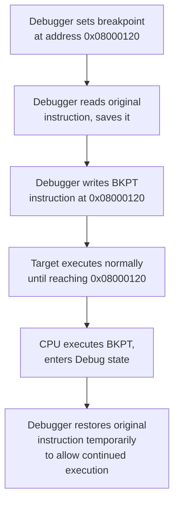
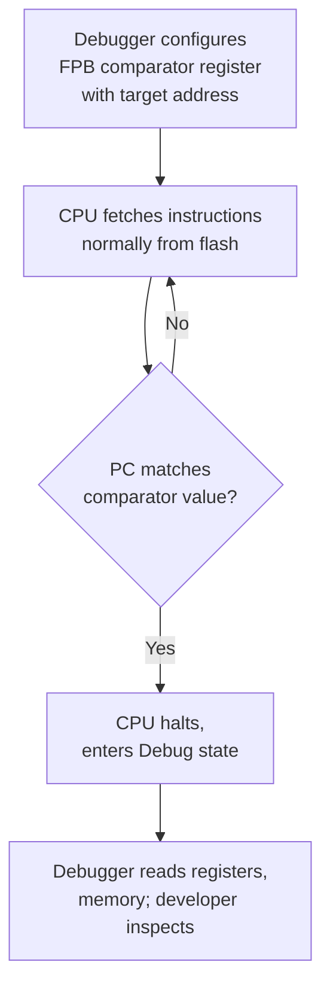
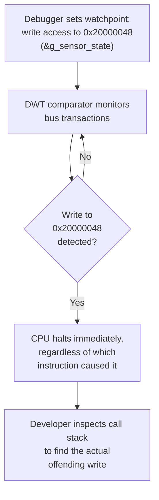
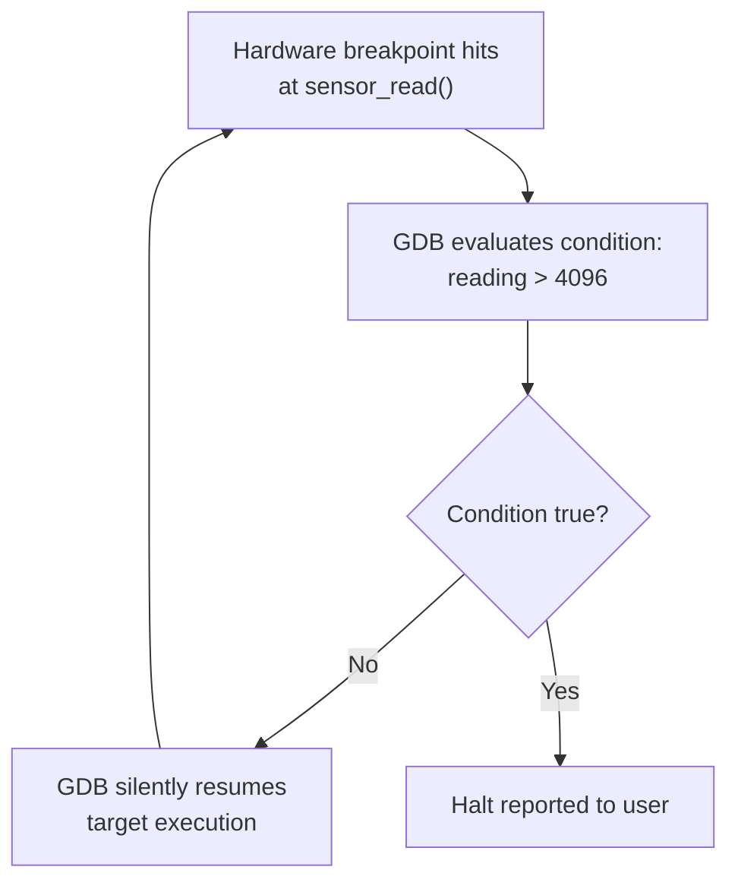
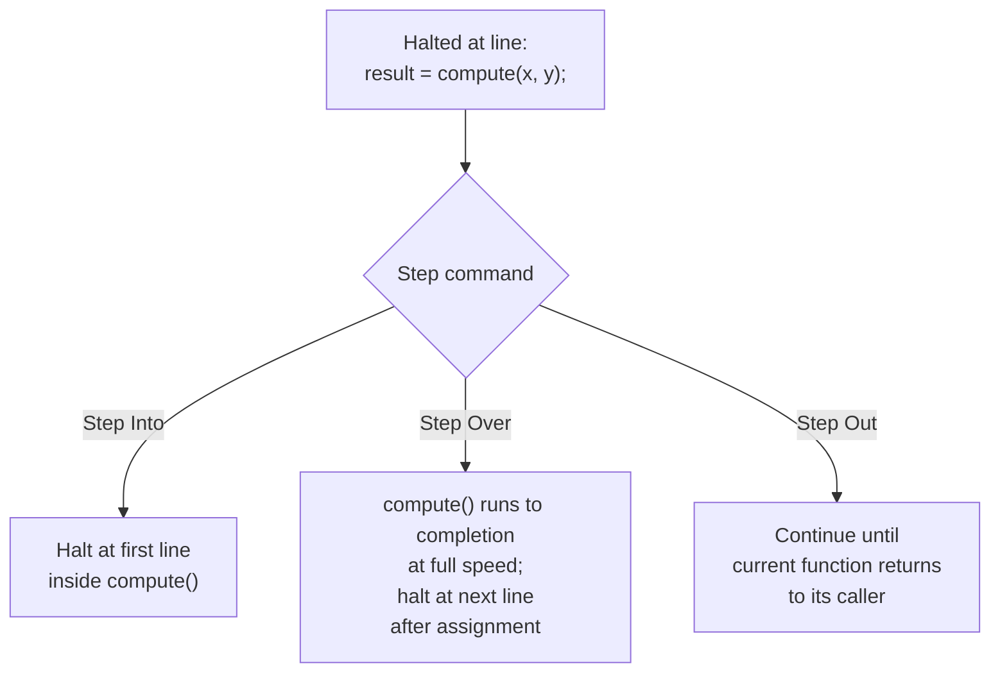
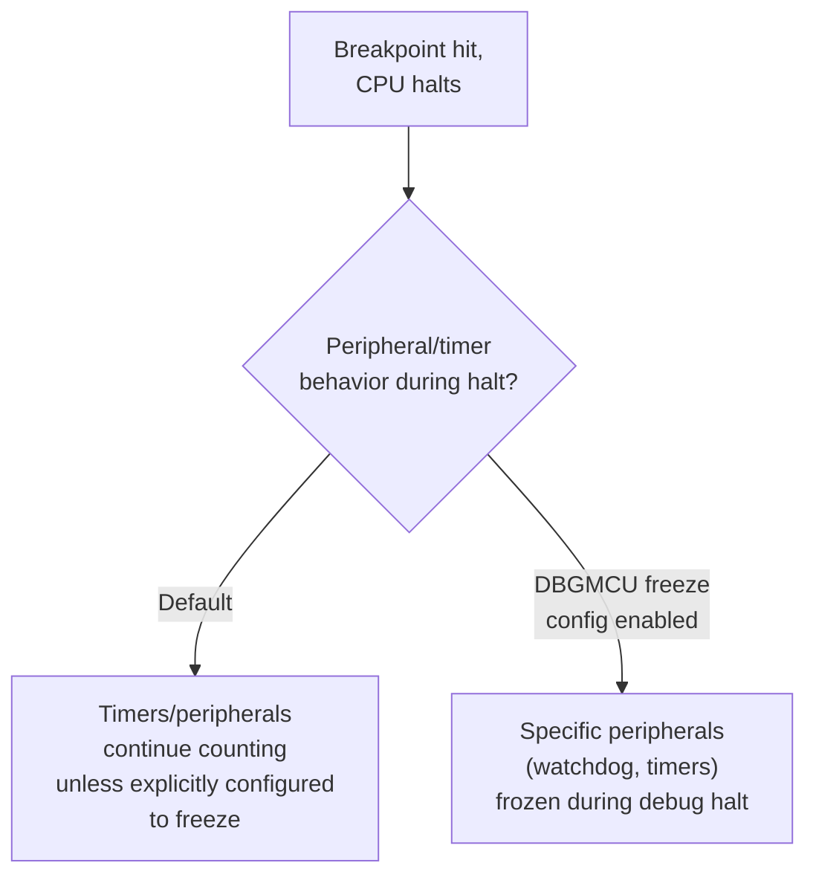

## Breakpoints, Watchpoints, and Step Execution

### Overview

Breakpoints, watchpoints, and step execution are the fundamental control primitives that let a developer pause, inspect, and incrementally advance a running target's execution during a debug session. In embedded contexts, these primitives are implemented partly in dedicated on-chip debug hardware (comparator registers reachable via the debug port covered in JTAG/SWD debugging) and partly through software mechanisms, and understanding which implementation is active in a given situation directly affects debugging strategy, resource limits, and behavior around timing-sensitive code.

### Software Breakpoints

A software breakpoint works by temporarily overwriting the instruction at a target address with a trap/illegal instruction (on ARM, typically `BKPT`), causing the CPU to enter debug state when execution reaches that point.



**Key Points**

- Requires writable memory at the breakpoint location — cannot be placed directly in flash memory without an erase/reprogram cycle, since flash cannot typically be modified byte-by-byte at arbitrary addresses
- Effectively unlimited in count, since it consumes no dedicated hardware comparator resource, only requiring the debugger to track and restore original instructions
- Commonly used for breakpoints set in RAM-resident code, or in interpreted/JIT contexts (less common in traditional embedded firmware, more relevant in scripting runtimes embedded in larger systems)
- On typical bare-metal Cortex-M firmware executing directly from flash, most breakpoint requests are transparently redirected by the debugger to use hardware breakpoint comparators instead, since the flash itself cannot be patched this way without a full reflash

### Hardware Breakpoints

Hardware breakpoints use dedicated comparator logic built into the CPU's debug unit — on ARM Cortex-M cores, the **FPB (Flash Patch and Breakpoint) unit** — comparing the program counter against a small set of configured addresses on every instruction fetch, without modifying any code in memory.



**Key Points**

- Does not require modifying target memory, making it the only practical option for breakpoints inside flash-resident code
- Limited in count by available silicon comparators — typical Cortex-M0/M0+ parts provide as few as 2-4 hardware breakpoints, while higher-end Cortex-M parts may offer 6 or more; the exact number is fixed in silicon and reported by the debug tool at connection time
- Once the hardware comparator budget is exhausted, additional breakpoint requests either fail outright or (on some tools/cores) transparently fall back to software breakpoint patching in RAM-shadowed code regions if supported
- The `monitor` command output shown when connecting via OpenOCD (e.g., "hardware has 6 breakpoints, 4 watchpoints") reports this silicon-fixed limit directly

### Watchpoints (Data Breakpoints)

A watchpoint halts execution not based on the program counter reaching an address, but when a specified memory address is accessed with a matching read, write, or read/write condition — implemented via a separate hardware unit, the **DWT (Data Watchpoint and Trace) unit** on Cortex-M cores.

```c
volatile uint32_t g_sensor_state = 0;

void corrupt_bug(void) {
    uint32_t *bad_ptr = (uint32_t *)0x20001000;  // stray pointer, wrong target
    *bad_ptr = 0xDEADBEEF;  // if this happens to alias g_sensor_state's address,
                              // a watchpoint on g_sensor_state catches it here
}
```



This makes watchpoints the primary tool for diagnosing **memory corruption bugs** — cases where a global variable's value changes unexpectedly, but the actual faulty write could originate from any of hundreds of call sites (a wild pointer, buffer overrun, or stack corruption). Without a watchpoint, developers might otherwise resort to manually inserting `printf` checks throughout the codebase, which is both slow and can itself mask timing-dependent bugs.

**Key Points**

- Also hardware-comparator-limited (DWT typically shares or has a separate small budget from FPB breakpoints, commonly 4 watchpoints on many Cortex-M parts) [Inference] exact DWT comparator counts and whether they support address range or only exact-address matching varies by specific core revision and should be confirmed against the relevant architecture reference manual
- Can typically be configured for read-only, write-only, or read/write triggering, and on some cores, for a specific data value match in addition to the address
- GDB syntax distinguishes watchpoint types: `watch` (write), `rwatch` (read), `awatch` (read or write)



```
(gdb) watch g_sensor_state
Hardware watchpoint 2: g_sensor_state
(gdb) continue
Hardware watchpoint 2: g_sensor_state
Old value = 0
New value = 3735928559
corrupt_bug () at main.c:14
14          *bad_ptr = 0xDEADBEEF;
```

### Conditional Breakpoints

Both software and hardware breakpoints can be augmented with a **condition**, evaluated by the debugger each time the breakpoint address is hit; execution resumes automatically unless the condition is true. This is implemented at the debugger/host level (GDB itself re-reads memory and evaluates the expression), not in dedicated silicon, so it works uniformly regardless of underlying breakpoint type.



```
(gdb) break sensor_read if reading > 4096
```



**Key Points**

- Because each hit requires a full halt/evaluate/resume round-trip over the debug interface, conditional breakpoints on frequently-executed code (e.g., inside a tight ISR or high-rate loop) can introduce significant timing disruption, sometimes altering the very behavior being debugged — a manifestation of the observer effect in embedded debugging
- For high-frequency conditions, a software-inserted check with a manually placed unconditional breakpoint only inside the `if` branch is often faster than a debugger-evaluated condition, since it avoids the round-trip on every non-matching hit

### Step Execution Modes

| Mode | Behavior |
| --- | --- |
| **Step Into** | Executes one source line (or one instruction, in instruction-step mode); if the line is a function call, debugger follows into the called function |
| **Step Over** | Executes one source line; if it's a function call, the call executes to completion at full speed and control returns after it, without stepping through the callee |
| **Step Out (Finish)** | Runs until the current function returns to its caller, then halts |
| **Instruction Step** | Steps exactly one machine instruction, useful when source-line correlation is unreliable (optimized builds, hand-written assembly) |



**Mechanism**: single-instruction stepping is typically implemented by the debug hardware setting the CPU to execute exactly one instruction (via a dedicated step control bit in the debug control register) then automatically re-entering halt state — distinct from setting a temporary breakpoint at the next instruction, though "step over" of a function call is commonly implemented as exactly that: a temporary hardware breakpoint placed at the return address, then a resume, since single-instruction-stepping through an entire called function (which might contain loops or delays) would be impractically slow.

### Stepping Through Optimized Code

**Key Points**

- Compiler optimization (`-O2`, `-O3`, or even `-O1`) can reorder, inline, or eliminate instructions such that a single source line no longer maps cleanly to a contiguous instruction range, causing step commands to behave unpredictably — jumping apparently backward, skipping lines, or halting mid-expression
- Variables may be held entirely in registers rather than memory for their whole lifetime, or have their lifetime end earlier than the source suggests, making "print variable" report stale, optimized-away, or `<optimized out>` values at points where the source still appears to reference them
- Debugging is commonly done on a `-Og` (GCC's "optimize for debugging") or `-O0` build specifically to preserve a closer source-to-instruction correspondence, deferring full optimization-level testing to a separate build/test cycle, given the size/timing tradeoffs of unoptimized code discussed in build configuration practices
- [Inference] The specific debugging fidelity of `-Og` versus `-O0` varies by compiler and version; GCC and Clang do not guarantee identical debug-info accuracy at a given optimization level, so behavior should be verified empirically for a given toolchain rather than assumed

### Interaction with Interrupts and Real-Time Behavior

Halting the CPU via a breakpoint stops **all** execution, including interrupt service routines, timers, and any RTOS scheduling activity — unlike some debug architectures that support "halt CPU but let peripherals/timers continue," Cortex-M's default debug halt behavior stops the core entirely.



**Key Points**

- Many MCU families (STM32's DBGMCU registers are a common example) provide configuration to freeze specific peripherals — most importantly the independent watchdog — during a debug halt, preventing a watchdog reset from firing simply because execution was paused at a breakpoint for longer than the watchdog timeout
- Without such freeze configuration enabled, a debug session can trigger spurious watchdog resets purely as an artifact of debugging, not a real firmware fault — a common source of confusion for developers new to a given MCU's debug-freeze configuration options
- Communication protocols with strict timing requirements (e.g., a device expecting a periodic heartbeat) may drop connection or enter an error state during any halt, since from the peer's perspective the device has simply stopped responding
- [Unverified] The exact set of peripherals subject to debug-freeze configuration, and whether freeze is enabled by default or requires explicit configuration, is MCU-family- and even part-specific, and should be checked against the specific device's reference manual rather than assumed to generalize across vendors

### Common Pitfalls

**Key Points**

- Exceeding the hardware breakpoint/watchpoint comparator budget without realizing it, leading to a debugger error ("Cannot set breakpoint: no hardware resources") that is easily mistaken for a tooling malfunction rather than a silicon resource limit
- Setting a breakpoint or watchpoint inside a tight, high-frequency loop or ISR and being surprised by severe performance degradation or altered timing behavior, when a conditional/scoped approach or a different diagnostic technique (trace, RTT/SWO logging) would be less invasive
- Debugging an optimized release build and misinterpreting `<optimized out>` variable values or erratic step behavior as an actual firmware bug rather than a debug-info fidelity limitation
- Leaving a debug session halted for extended periods without watchdog-freeze configuration enabled, causing unrelated resets that obscure the actual issue under investigation
- Forgetting that halting via breakpoint stops all interrupt-driven activity, potentially causing external peers or the RTOS's own time-keeping to desynchronize from wall-clock time in ways not accounted for when execution resumes
- Relying exclusively on step-through debugging for timing-sensitive or communication-protocol bugs where the act of halting itself changes or masks the very behavior under investigation — non-intrusive trace (SWO/ITM, ETM) is generally more appropriate for these cases

### Related Topics

- Toolchains and Build Systems — JTAG and SWD debugging interfaces
- Toolchains and Build Systems — In-circuit debuggers and programmers
- Toolchains and Build Systems — Build configuration and conditional compilation
- Debugging — SWO/ITM real-time trace and RTT logging
- Debugging — GDB command reference for embedded targets
- Real-Time Systems — Watchdog timer configuration and debug-freeze behavior
- Real-Time Systems — RTOS-aware debugging (task-level breakpoints, scheduler visibility)