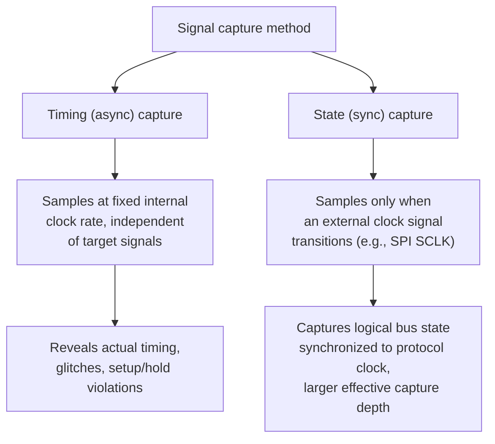
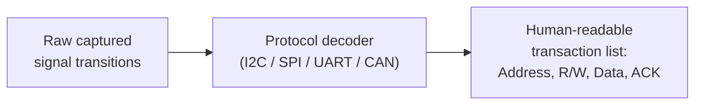
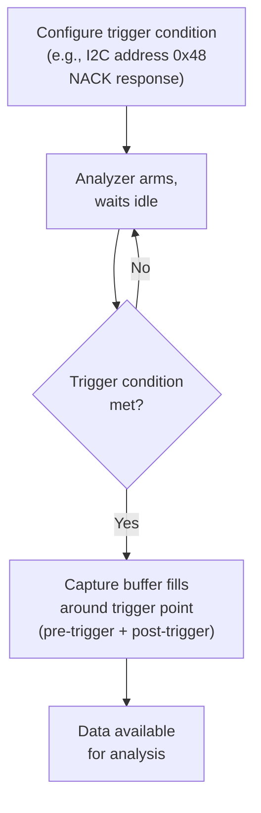
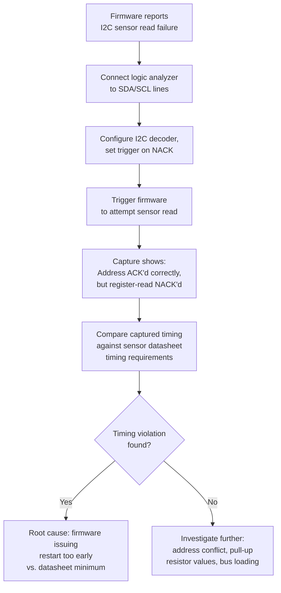

## Logic Analyzers for Hardware Debugging

### Overview

A logic analyzer captures and displays the digital state (high/low) of multiple electrical signals over time, allowing an embedded developer to observe bus transactions, protocol timing, and signal relationships that are invisible to a source-level debugger. Where JTAG/SWD debugging inspects the CPU's internal state by halting execution, a logic analyzer observes the physical signals a device produces or consumes *without* interrupting execution at all — making it the primary tool for diagnosing hardware-level, timing-sensitive, and protocol-level issues that software debugging cannot reach.

### Why Logic Analyzers Are Necessary

**Key Points**

- Source-level debuggers (via JTAG/SWD) show CPU/memory state but nothing about what is actually happening on external pins and buses at the electrical level
- Communication protocol bugs (incorrect I2C address, SPI clock polarity mismatch, malformed UART framing) are often only diagnosable by observing the actual bit-level waveform, not by inspecting the CPU's peripheral registers alone
- Many bugs are timing-dependent (a peripheral's setup/hold time violated, a race between two signals) and halting execution to inspect state, as a breakpoint does, destroys the very timing relationship under investigation
- Logic analyzers are essential for verifying protocol compliance against a datasheet's timing diagrams during initial hardware bring-up, before firmware-level abstractions can even be trusted to be correct

### Logic Analyzer vs. Oscilloscope

| Aspect | Logic Analyzer | Oscilloscope |
| --- | --- | --- |
| What it measures | Digital state (0/1) across many channels | Actual analog voltage waveform |
| Channel count | Typically 8-32+ | Typically 2-4 |
| Primary use | Protocol decoding, multi-signal timing relationships | Signal integrity, analog characteristics, single/dual-signal precision timing |
| Signal integrity detail | Limited (thresholded to binary) | Full waveform, including noise, ringing, rise/fall time |
| Typical embedded use | Decoding I2C/SPI/UART/CAN traffic, bus timing | Verifying clock signal quality, power rail noise, ADC input accuracy |

**Mixed-signal oscilloscopes (MSOs)** combine both capabilities in one instrument — a smaller number of true analog channels alongside many digital channels — useful when a bug requires correlating a digital protocol event with an analog signal anomaly (e.g., a glitch on a supply rail coinciding with a specific SPI transaction).

### Sampling Methods



- **Timing (asynchronous) capture** samples all channels at a fixed internal sample rate regardless of what the target signals are doing — necessary for observing actual signal timing, glitches, or setup/hold violations relative to a clock edge
- **State (synchronous) capture** samples channels only on a transition of a designated external clock signal — appropriate when only the logical bus state matters (e.g., decoding SPI data), and considerably more memory-efficient since no samples are wasted between clock edges

### Sample Rate and Nyquist Considerations

To reliably capture a signal's transitions, the sample rate must substantially exceed the signal's fastest transition rate — analogous to, but stricter in practice than, the Nyquist criterion for analog signals, since digital logic analysis needs enough samples per bit period to accurately locate edges, not just avoid aliasing.

$$f_{sample} \geq k \times f_{signal}$$

Where $k$ is commonly recommended in the range of 4-10× the signal's bit rate for reliable protocol decoding, though exact requirements depend on the analyzer's edge-detection algorithm and how tightly timing margins need to be verified. [Inference] The specific multiplier needed for a given confidence level is analyzer- and protocol-dependent rather than a fixed universal constant; consulting the specific instrument's documentation for a target protocol's typical bit rate is the more reliable approach than applying a blanket rule.

For example, decoding I2C Fast Mode (400 kHz) comfortably with a $k=10$ margin suggests a sample rate around 4 MSa/s, well within the range of inexpensive USB logic analyzers, whereas decoding a high-speed SPI bus running at tens of MHz requires proportionally higher sample rates that may exceed budget hardware capability.

### Common Protocol Decoding

A central logic analyzer feature is automated **protocol decoding** — software that interprets raw captured transitions into human-readable transaction data, rather than requiring manual bit-counting from a waveform.



**I2C decode example (conceptual output):**



```
START | Addr: 0x48 (W) | ACK
Data: 0x03            | ACK
RESTART
Addr: 0x48 (R)         | ACK
Data: 0x7F             | NACK
STOP
```

Decoders exist for most common embedded protocols: I2C, SPI, UART/RS-232, CAN, 1-Wire, USB (low/full speed), and increasingly application-layer protocols built atop them (Modbus over UART/RS-485, for instance). Correctly configuring the decoder (bit order, clock polarity/phase for SPI, baud rate for UART) is a prerequisite for correct decoding — a common early troubleshooting step when a decode looks like garbage is checking these configuration parameters before assuming the actual hardware is at fault.

### Trigger Configuration

Because captures are typically bounded by available memory depth, **triggers** allow the capture to be centered around the specific event of interest rather than requiring the analyzer to already be running (and hoping the fault occurs within the visible window).



**Key Points**

- Simple triggers (rising/falling edge on a single channel, pattern match across multiple channels) are supported on nearly all analyzers
- Protocol-aware triggers (trigger specifically on an I2C NACK, a specific SPI byte value, a UART framing error) are available on more capable analyzers and dramatically reduce the effort of catching an intermittent fault
- Pre-trigger capture (retaining samples *before* the trigger event, not just after) is essential for understanding what led up to a fault, not just what happened at the moment of failure

### Common Logic Analyzer Types for Embedded Work

| Type | Characteristics |
| --- | --- |
| USB-based, PC-software-driven (e.g., Saleae Logic family) | Compact, streams to host software for decode/analysis, generally accessible pricing for hobbyist through professional use |
| Standalone benchtop analyzers | Independent display, often bundled with an oscilloscope (MSO), no host PC dependency during capture |
| FPGA/open-source based (e.g., sigrok-compatible devices) | Open-source decode/capture software (PulseView/sigrok), broad hardware compatibility across many low-cost analyzer devices |

[Inference] Specific bandwidth, channel count, and memory depth vary widely by model and price tier within each category; matching analyzer capability to the protocols and speeds actually being debugged is a purchasing decision that should reference the specific instrument's datasheet rather than the general category.

### Practical Workflow Example: Diagnosing an I2C NACK



This kind of diagnosis is generally impractical from source-level debugging alone: the CPU's I2C peripheral registers may simply report a generic error status, while the logic analyzer capture reveals the exact bit-level point of failure and its precise timing relationship to the datasheet's specified requirements.

### Correlating Logic Analyzer Captures with Firmware Execution

For more advanced diagnosis, some workflows correlate a logic analyzer capture with simultaneous SWO/RTT trace output or GPIO toggle markers inserted at key points in firmware, effectively creating a shared timeline between "what the CPU was doing" and "what appeared on the bus."

```c
// Toggle a spare GPIO immediately before/after a suspect operation,
// captured on an unused logic analyzer channel alongside the bus signals
GPIO_SetPin(DEBUG_MARKER_PIN);
i2c_read_register(SENSOR_ADDR, REG_STATUS, &status);
GPIO_ClearPin(DEBUG_MARKER_PIN);
```

This lightweight technique — sometimes called "GPIO bit-banging for trace" — requires no special tooling beyond a spare pin and gives a precise, hardware-timestamped marker of firmware execution correlated directly against the captured bus activity, useful when SWO/RTT bandwidth or setup complexity is undesirable for a quick diagnostic session.

### Common Pitfalls

**Key Points**

- Insufficient sample rate for the protocol/speed being examined, producing a decode that appears to work but silently misses fast glitches or marginal timing violations between samples
- Connecting analyzer probes with long leads or poor grounding on high-speed signals, introducing capacitive loading or noise that changes the very signal behavior being investigated — particularly relevant on fast SPI or high-speed digital buses
- Misconfiguring protocol decoder parameters (SPI clock polarity/phase, UART baud rate, bit order) and misinterpreting the resulting garbled decode as an actual hardware fault
- Insufficient trigger specificity when chasing an intermittent bug, resulting in captures that don't actually contain the fault event, wasting debugging cycles on irrelevant data
- Exceeding the analyzer's memory depth at a given sample rate, causing the capture window to be shorter than expected and missing the event of interest — memory depth and sample rate trade off directly against each other
- Treating a logic analyzer capture in isolation from the relevant protocol's datasheet timing diagram, missing violations that are only apparent when the captured waveform is directly compared against specified minimum/maximum timing parameters

### Related Topics

- Toolchains and Build Systems — JTAG and SWD debugging interfaces
- Toolchains and Build Systems — Breakpoints, watchpoints, and step execution
- Hardware — I2C, SPI, and UART protocol fundamentals
- Hardware — Signal integrity and PCB layout for high-speed buses
- Debugging — SWO/ITM real-time trace and RTT logging
- Hardware — Oscilloscope fundamentals for embedded engineers
- Manufacturing — Hardware bring-up and validation test procedures