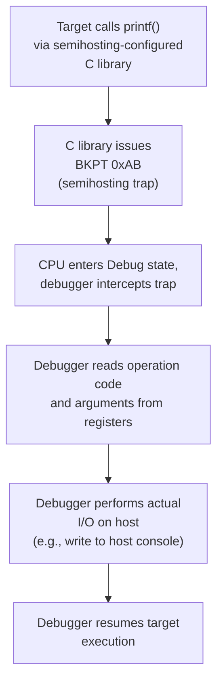
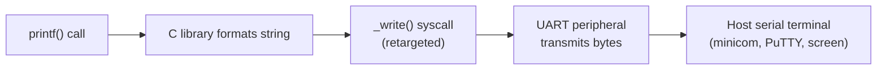
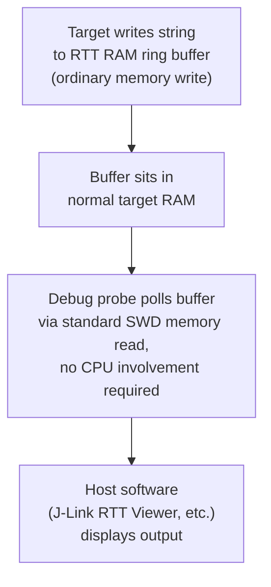
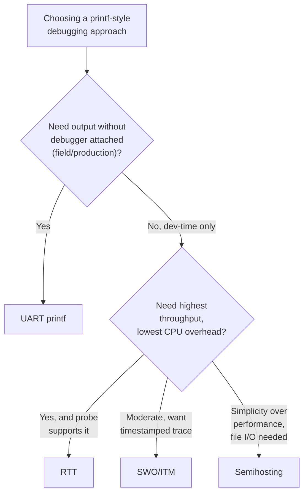

## Semihosting and Printf-Style Debugging

### Overview

Semihosting and printf-style debugging are software-based techniques for extracting diagnostic output from an embedded target during development, distinct from the hardware-level approaches covered under JTAG/SWD debugging and logic analyzers. Semihosting specifically routes I/O operations (like `printf` or file access) through the debug connection to be serviced by the host, while other printf-style approaches use UART, SWO/ITM, or RTT as the transport instead. Choosing among them involves real tradeoffs in intrusiveness, throughput, real-time impact, and required hardware.

### The Problem Printf Debugging Solves

**Key Points**

- Breakpoint-based debugging (covered separately) halts execution entirely, which is unsuitable for observing behavior over time, timing-sensitive code, or issues that only manifest under continuous real-time operation
- Embedded targets typically have no console, filesystem, or standard output device by default — `printf("value=%d\n", x)` has no defined destination until one is explicitly wired up
- Developers need a way to emit ad hoc trace/diagnostic text (variable values, state transitions, error conditions) without the overhead of setting up a full logging framework or breakpoint session for every investigation
- The specific mechanism chosen determines the performance cost, real-time impact, and whether the debug probe/connection needs to remain attached during normal operation

### Semihosting

Semihosting is an ARM-defined mechanism (though conceptually applicable to other architectures) where the target executes a special trap instruction (`BKPT` with a specific immediate value on ARM) to request the *debugger itself* perform an I/O operation — including console output, file read/write, and even querying command-line arguments — on the target's behalf, using the host's actual filesystem/console.



```c
// With semihosting-enabled C library (e.g., newlib + retarget)
#include <stdio.h>

int main(void) {
    printf("System initialized, clock = %lu Hz\n", SystemCoreClock);
    while (1) {
        // application loop
    }
}
```

**Toolchain configuration** (GCC/newlib example):



```
arm-none-eabi-gcc ... --specs=rdimon.specs -lc -lrdimon ...
```



```
(gdb) monitor arm semihosting enable
```

**Key Points**

- Every semihosting call is a full debug-trap round-trip — the CPU actually halts momentarily on each call, making it one of the slowest and most intrusive of the available techniques
- Requires an active, attached debugger session at all times; semihosting calls made with no debugger connected typically hang the target indefinitely waiting for a response that will never come, or in some implementations, fault
- Because of the halt-per-call overhead, semihosting is generally unsuitable for timing-sensitive code or high-frequency logging, and is more appropriate for early bring-up, one-off diagnostic prints, or test harnesses run under an emulator/debugger where determinism matters more than real-time throughput
- File I/O semihosting operations (opening/reading/writing actual files on the host) are particularly useful in automated test setups, allowing target-side test code to write structured results directly to a file the host-side test runner then parses

### UART-Based Printf Redirection

The most traditional approach retargets the C library's standard output to a UART peripheral, requiring no debug probe connection at all during normal operation — output is captured by any standard serial terminal.

```c
// Retargeting printf to UART (newlib example)
int _write(int fd, char *ptr, int len) {
    for (int i = 0; i < len; i++) {
        UART_SendByte(ptr[i]);  // blocking or buffered, hardware-specific
    }
    return len;
}
```



**Key Points**

- No debugger/probe required during operation — only a UART-to-USB adapter or the board's existing UART connection, making this viable for field debugging or production diagnostic logging in a way semihosting is not
- Throughput is bounded by UART baud rate (commonly 115200 bps and up, though many parts support significantly higher rates), generally much faster than semihosting but still capable of measurably perturbing timing if used heavily inside performance-critical code
- Consumes a physical UART peripheral and pins that may otherwise be needed for application use, a real resource tradeoff on pin-constrained packages
- If implemented as a blocking call (waiting for each byte to physically transmit before returning), heavy printf use inside interrupt handlers or tight loops can introduce substantial and variable latency; a buffered/DMA-backed UART transmit path significantly reduces this at the cost of implementation complexity

### SWO/ITM Trace-Based Printf

As introduced under JTAG/SWD debugging, the Instrumentation Trace Macrocell (ITM) provides a lightweight, purpose-built channel for exactly this use case, transmitted over the single SWO pin alongside an active SWD connection.

```c
// ITM-based output (CMSIS)
ITM_SendChar('H');
ITM_SendChar('i');
// Or, with a printf-retargeting wrapper built atop ITM_SendChar
```

**Key Points**

- Significantly lower overhead per character than semihosting's full debug-trap round trip, since ITM is a dedicated hardware trace path rather than a CPU-halting mechanism
- Still requires an attached debug probe capable of capturing SWO output (not all probes support SWO capture; capability varies by probe model and software)
- Bandwidth is higher than semihosting but generally more constrained than a dedicated high-baud-rate UART, and shares the same physical debug connection used for SWD control traffic
- Timestamped packets are supported in the ITM protocol, useful for correlating printf output against a precise time axis without needing separate timestamp-formatting code in the application itself

### RTT (Real-Time Transfer)

RTT, primarily associated with SEGGER's J-Link ecosystem (though implementations exist for other probes), uses a small RAM-based ring buffer that the debug probe polls and drains via ordinary memory reads over SWD/JTAG — notably, without requiring any dedicated trace pin or special CPU trap instruction.



```c
SEGGER_RTT_printf(0, "Sensor value: %d, state=%s\n", reading, state_name);
```

**Key Points**

- Writing to the RTT buffer is a simple, fast memory write from the target's perspective — no trap, no peripheral hardware involvement, making it one of the least intrusive options in terms of CPU-side overhead
- The probe polls and drains the buffer independently over the existing debug connection, meaning throughput is bounded largely by SWD/JTAG clock speed and polling frequency rather than a dedicated slow serial line
- Because it uses standard memory access rather than a proprietary trace protocol, RTT is comparatively straightforward to implement and widely supported, though the reference implementation and richest tooling remain SEGGER-specific
- Like SWO, requires an attached debug probe with RTT support to observe output in real time, though the buffer itself persists in target RAM and could in principle be inspected via any memory-reading tool

### Comparing the Approaches

| Method | Requires debugger attached? | Relative overhead | Requires dedicated pin/peripheral | Typical use case |
| --- | --- | --- | --- | --- |
| Semihosting | Yes, always | Highest (CPU halts per call) | No (uses existing debug connection) | Early bring-up, test harnesses under debugger control |
| UART printf | No | Moderate (depends on baud rate, blocking vs. buffered) | Yes (UART peripheral + pins) | Field-viewable logging, production diagnostics, no probe needed |
| SWO/ITM | Yes | Low-moderate | Yes (SWO pin) but shares debug connector | Development-time tracing with timestamp correlation |
| RTT | Yes | Low | No dedicated pin (uses existing SWD connection + RAM) | High-throughput development-time logging with minimal CPU cost |



### Impact on Timing-Sensitive Code

A recurring theme across all these techniques is that **the act of debugging can alter the behavior being debugged** — a manifestation of the observer effect already noted for breakpoint-based halting. Printf-style approaches vary in how severely they introduce this distortion:

- Semihosting's full CPU halt per call is the most disruptive, making it a poor choice for diagnosing race conditions or precise timing bugs, since the added latency can mask or alter the very race being investigated
- Even lower-overhead UART/RTT/SWO logging adds *some* non-zero latency and, particularly for `printf`-style formatted output (which is comparatively CPU-expensive due to variadic argument parsing and string formatting), can shift timing enough to matter in tightly-constrained real-time paths
- For genuinely timing-critical diagnosis, non-intrusive hardware trace (ETM, discussed under JTAG/SWD debugging) or external logic analyzer observation (via GPIO toggle markers, as covered in logic analyzer usage) generally provides a more faithful picture than any software-mediated printf approach
- [Inference] The specific magnitude of timing distortion from any given method depends heavily on call frequency, string complexity, and the specific hardware/toolchain combination in use; when timing sensitivity is a real concern, empirically measuring the overhead of the chosen logging call (e.g., via a GPIO toggle bracketing the printf call, observed on a logic analyzer) is more reliable than assuming a category's overhead in the abstract

### Common Pitfalls

**Key Points**

- Leaving semihosting calls in a release build with no debugger attached, causing the target to hang indefinitely on the first semihosting trap rather than failing gracefully — a frequent cause of "works when debugging, hangs standalone" confusion
- Using blocking UART transmission for printf inside interrupt service routines, introducing unpredictable and potentially severe latency into time-critical interrupt handling
- Assuming all debug probes support SWO or RTT capture without verifying — capability varies meaningfully by specific probe hardware and host software combination, and a probe that handles SWD control traffic fine may not support the trace/RTT feature at all
- Over-instrumenting a codebase with heavy printf-style logging in the exact code paths under investigation for a timing bug, inadvertently masking or altering the fault being chased
- Forgetting that semihosting file I/O operations execute on the *host's* filesystem, not the target's — a frequent point of confusion for developers expecting semihosted file access to interact with target-side storage (SD card, external flash) rather than the debugger host's disk
- Not accounting for the CPU cost of `printf`-style variadic formatting itself (parsing format strings, converting numeric arguments) as a separate overhead source from the transport mechanism, particularly relevant on cores without hardware floating-point when formatting floating-point values

### Related Topics

- Toolchains and Build Systems — JTAG and SWD debugging interfaces
- Toolchains and Build Systems — Breakpoints, watchpoints, and step execution
- Toolchains and Build Systems — Logic analyzers for hardware debugging
- C Standard Library — Retargeting newlib/picolibc for embedded systems
- Real-Time Systems — Observer effect and non-intrusive diagnostic techniques
- Debugging — ETM and non-intrusive hardware trace
- Testing — Automated test harnesses using semihosted file I/O