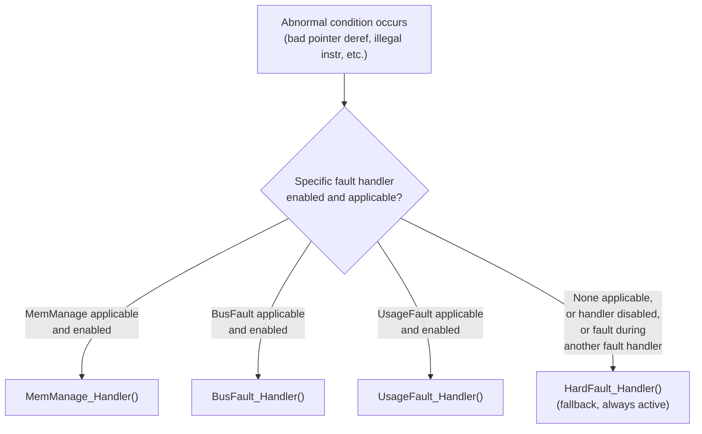
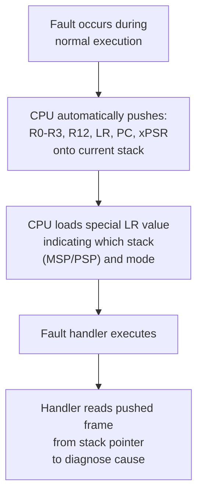
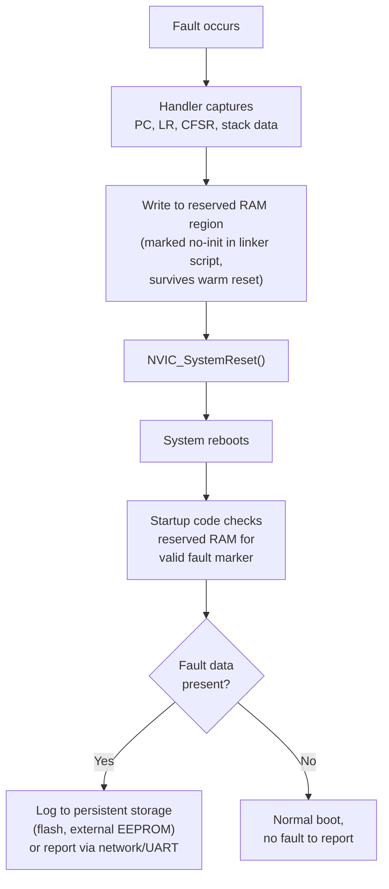
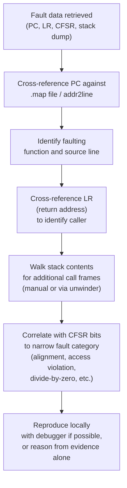

## Fault Handlers and Crash Dump Analysis

### Overview

Fault handlers are the CPU-level exception mechanisms that catch abnormal execution conditions — invalid memory access, illegal instructions, stack overflow, division by zero — and give firmware a controlled opportunity to respond before the system is left in an undefined state. Crash dump analysis is the practice of extracting and interpreting the CPU state captured at the moment of fault (registers, stack contents, fault status registers) to determine root cause after the fact, often essential for diagnosing failures that occurred in the field, long after any debugger was attached.

### Why Dedicated Fault Handling Matters in Embedded Systems

**Key Points**

- Unlike desktop operating systems, bare-metal or RTOS-based embedded firmware has no OS-level process isolation or automatic crash reporting — an unhandled fault can leave the system silently hung, endlessly rebooting, or behaving unpredictably with no diagnostic trail
- Many embedded devices operate unattended and inaccessible after deployment, making the ability to capture and later retrieve fault information (rather than requiring a debugger physically present at the moment of failure) critical for field diagnosis
- A well-designed fault handler is often the difference between a device that fails safely (logs the fault, resets cleanly, perhaps enters a safe mode) and one that fails destructively (corrupts persistent state, becomes permanently unresponsive, or in safety-critical contexts, causes physical harm)
- Fault conditions frequently stem from bugs that are otherwise extremely difficult to trace to their origin through normal testing — buffer overruns, uninitialized pointers, stack overflows — making the fault handler's diagnostic output often the *only* lead available

### ARM Cortex-M Fault Architecture

Cortex-M cores define a structured set of fault exceptions, each triggered by a specific category of abnormal condition, with configurable priority and dedicated status registers describing the cause.

| Fault Type | Common Trigger |
| --- | --- |
| **HardFault** | Fallback for any fault that cannot be handled by a more specific (and enabled) fault handler; always enabled |
| **MemManage Fault** | Memory Protection Unit (MPU) access violation |
| **BusFault** | Bus error on instruction fetch or data access (invalid address, alignment issue on some configurations) |
| **UsageFault** | Illegal instruction, invalid state transition, division by zero (if configured to trap), unaligned access (if configured to trap) |



By default on reset, the more specific fault handlers are typically disabled (routed to HardFault), and must be explicitly enabled via the System Control Block (`SCB->SHCSR`) if separate, more granular handling is desired — a common early-bring-up configuration step.

```c
// Enable separate MemManage, BusFault, and UsageFault handlers
SCB->SHCSR |= SCB_SHCSR_MEMFAULTENA_Msk |
              SCB_SHCSR_BUSFAULTENA_Msk |
              SCB_SHCSR_USGFAULTENA_Msk;
```

### The Exception Stack Frame

When any exception (including a fault) occurs, the Cortex-M core automatically pushes a defined set of registers onto the active stack before entering the handler — this **exception stack frame** is the foundation of most fault diagnosis.



The pushed **PC (Program Counter)** value is particularly critical: it indicates the exact instruction address executing at the moment of the fault, which — cross-referenced against the `.map` file or disassembly (as covered in static libraries and object files) — identifies the offending source line.

```c
// Typical HardFault handler pattern: capture stack pointer, call analysis function
__attribute__((naked)) void HardFault_Handler(void) {
    __asm volatile (
        "TST LR, #4        \n"
        "ITE EQ            \n"
        "MRSEQ R0, MSP     \n"
        "MRSNE R0, PSP     \n"
        "B HardFault_Analyze \n"
    );
}

void HardFault_Analyze(uint32_t *stack_frame) {
    uint32_t r0  = stack_frame[0];
    uint32_t pc  = stack_frame[6];
    uint32_t psr = stack_frame[7];
    // Log or store these values for later retrieval
    fault_log_write(pc, r0, psr);
    NVIC_SystemReset();
}
```

The `TST LR, #4` / `ITE EQ` sequence determines whether the Main Stack Pointer (MSP) or Process Stack Pointer (PSP) was active at the time of fault, since the special LR value's bit 2 encodes this — necessary because the correct stack pointer must be used to locate the actual pushed frame.

### Fault Status Registers

Beyond the stack frame, Cortex-M provides dedicated status registers describing *why* a fault occurred, accessible from within the fault handler:

| Register | Purpose |
| --- | --- |
| `CFSR` (Configurable Fault Status Register) | Combined MemManage/BusFault/UsageFault status bits |
| `HFSR` (HardFault Status Register) | Indicates whether the HardFault was escalated from another fault, or a genuine forced/bus-error condition |
| `MMFAR` (MemManage Fault Address Register) | Faulting address, valid only when the corresponding CFSR bit indicates it |
| `BFAR` (BusFault Address Register) | Faulting bus address, similarly conditionally valid |

```c
void HardFault_Analyze(uint32_t *stack_frame) {
    uint32_t cfsr = SCB->CFSR;

    if (cfsr & SCB_CFSR_PRECISERR_Msk) {
        // Precise bus fault: BFAR holds the exact faulting address
        fault_log_write("Precise BusFault", SCB->BFAR);
    }
    if (cfsr & SCB_CFSR_MMARVALID_Msk) {
        fault_log_write("MemManage fault addr", SCB->MMFAR);
    }
    NVIC_SystemReset();
}
```

**Key Points**

- `CFSR` bit fields distinguish specific fault subtypes (e.g., stacking error during exception entry, instruction access violation, unaligned access, divide-by-zero) — decoding these bits is often the fastest path from "system crashed" to a specific root cause category
- Address registers (`MMFAR`, `BFAR`) are only valid when a corresponding "valid" bit is also set in `CFSR`; reading them unconditionally can yield stale data from a previous, unrelated fault
- `HFSR`'s "forced" bit indicates the HardFault was escalated from a fault that occurred while its own more-specific handler was disabled or itself faulted, a common configuration-related cause of "everything just goes to HardFault" behavior during early bring-up

### Persisting Crash Information Across Reset

Because the most common recovery action after a fault is a system reset, fault diagnostic data must be preserved *through* that reset to be retrievable afterward — RAM contents are typically preserved across a warm reset (though not a power cycle) on most Cortex-M parts, a property fault handlers commonly exploit.



```c
// Linker script excerpt reserving a no-init RAM region
/*
.noinit (NOLOAD) :
{
    . = ALIGN(4);
    _snoinit = .;
    *(.noinit)
    *(.noinit.*)
    . = ALIGN(4);
    _enoinit = .;
} >RAM
*/

__attribute__((section(".noinit"))) fault_record_t g_last_fault;
```

This pattern — reserving a RAM region excluded from zero-initialization at startup (via a dedicated linker script section, connecting back to the section-placement concepts in static libraries and object files) — allows a fault handler to leave a "breadcrumb" that survives the reset it triggers, later inspected either by application code at boot or, in field-deployed devices, retrieved via a diagnostic command or automatically uploaded on next network connectivity.

### Stack Overflow as a Fault-Adjacent Condition

Stack overflow is a particularly common and insidious fault trigger: rather than a clean, immediately obvious fault, corrupted stack contents can cause seemingly unrelated failures (corrupted return addresses causing jumps to arbitrary code, corrupted local variables) that may not manifest as a fault until well after the actual overflow occurred.

**Key Points**

- MPU-based stack guard regions (marking a small guard region beyond the stack's valid range as inaccessible) can convert a silent overflow into an immediate, diagnosable MemManage fault at the moment of overflow, rather than allowing silent corruption to propagate
- RTOS implementations commonly provide stack high-water-mark checking (a canary/watermark pattern written to unused stack space at task creation, checked periodically or at task switch) as a complementary, MPU-independent detection mechanism
- Without either mechanism, stack overflow bugs are among the hardest fault categories to diagnose from a crash dump alone, since the fault may manifest at an execution point far removed from and seemingly unrelated to the actual overflow's origin

### Post-Mortem Analysis Workflow



```bash
arm-none-eabi-addr2line -e firmware.elf -f -C 0x080012a4
```



```
sensor_process_reading
src/sensor.c:142
```

`addr2line` (or equivalently, examining a saved `.map` file) translates a raw faulting PC address back into a source file and line number, provided the exact `.elf` corresponding to the fielded firmware version is retained — reinforcing the importance of the build artifact traceability practices covered under version control workflows and CI, since a crash dump is only as useful as the ability to match it back to the precise binary that produced it.

### RTOS-Level Fault Context

In RTOS environments, additional context beyond the raw CPU fault state is often valuable: which task was executing at fault time, that task's stack region and remaining headroom, and the state of the scheduler itself.

**Key Points**

- Many RTOS ports (FreeRTOS being a common example) expose the currently running task's control block and name from within a fault handler, allowing the crash log to record *which* task faulted, not just the raw PC
- A fault occurring inside an ISR versus inside task context often has different likely causes and available diagnostic context, and distinguishing the two (via the special LR value's mode/stack bits) is a standard early step in fault analysis
- Some fault handler implementations attempt to unwind and log the entire task list's state (not just the faulting task) on the theory that a fault in one task may be a symptom of corruption caused by an entirely different, still-running task — particularly relevant for shared-memory corruption bugs

### Common Pitfalls

**Key Points**

- Leaving all fault handlers routed to a default, minimal HardFault handler (often just an infinite loop, as some vendor startup templates provide by default) discards essentially all diagnostic information, turning every field fault into an unrecoverable mystery
- Reading `MMFAR`/`BFAR` without first checking the corresponding CFSR valid bit, leading to misdiagnosis based on stale address data from an unrelated prior fault
- Forgetting that a fault occurring *while already inside a fault handler* (a "fault within a fault") escalates differently and can itself corrupt the very diagnostic data the handler is trying to capture — fault handlers should generally be kept simple and avoid operations (like complex logging library calls) that could themselves trigger secondary faults
- Storing fault diagnostic data only in normally-initialized RAM (which gets zeroed by standard startup code), destroying the very data the handler was meant to preserve before it can be read back after reset
- Assuming a captured PC value alone is sufficient without also examining LR and stack contents — the immediate faulting instruction is often a symptom whose root cause lies several call frames upstream (a bad pointer passed in from a caller, for instance)
- Neglecting to retain the exact `.elf`/`.map` file corresponding to each fielded firmware version, making a collected crash PC address unresolvable to source once the build artifact is lost — directly dependent on the artifact archival practices established in CI and version control workflows

### Related Topics

- Toolchains and Build Systems — Static libraries and object files
- Toolchains and Build Systems — Version control workflows for firmware
- Toolchains and Build Systems — Continuous integration for embedded projects
- Toolchains and Build Systems — Breakpoints, watchpoints, and step execution
- Real-Time Systems — RTOS stack overflow detection and task diagnostics
- Memory Management — Memory Protection Unit (MPU) configuration
- Deployment — Field diagnostics and remote crash reporting mechanisms
- Safety and Certification — Fail-safe design patterns for fault recovery