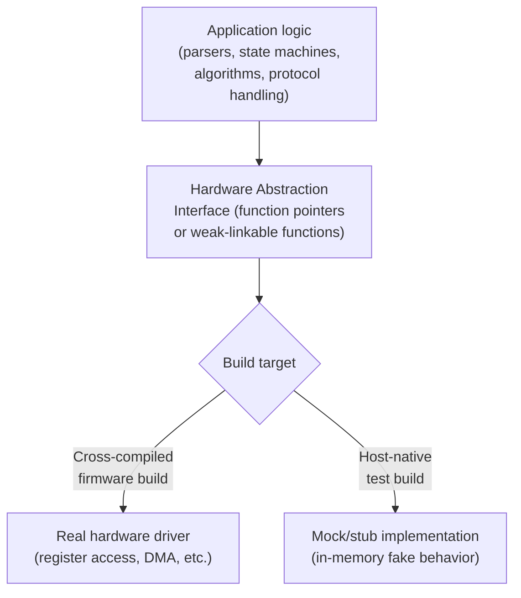

## Unit Testing Embedded Code


### Overview

Unit testing embedded code applies the general practice of isolated, automated verification of small code units to firmware, adapted for the reality that embedded code is tightly coupled to hardware registers, timing, and interrupts that a typical unit test environment cannot easily provide. The dominant strategy is to structure firmware so that hardware-independent logic can be compiled and tested with a native host compiler — as introduced under continuous integration for embedded projects — while hardware-dependent code is tested through other means (integration tests, hardware-in-the-loop, or not unit-tested at all in the traditional sense).

### Why Embedded Unit Testing Requires a Different Approach

**Key Points**

- Embedded code frequently reads and writes memory-mapped hardware registers directly, which don't exist (or behave differently) when compiled for and run on a host development machine
- Timing-dependent behavior (interrupt latency, peripheral busy-wait loops, DMA completion) cannot be meaningfully exercised in a host-native test without simulation or mocking
- Cross-compiled binaries generally cannot execute directly on the CI runner or developer's host machine, so "unit test" in an embedded context most commonly means compiling the *logic under test* with the host's native compiler rather than the cross-compiler, not running the actual target binary
- Some code (raw register manipulation, ISR entry/exit sequences, boot/startup assembly) is inherently difficult or impractical to unit test in isolation and is more appropriately validated through integration or hardware-in-the-loop testing instead

### Structuring Code for Testability

The prerequisite for effective embedded unit testing is architectural: hardware-dependent and hardware-independent code must be cleanly separated, typically behind an interface that can be swapped between a real hardware implementation and a test double.



```c
// hal_i2c.h - interface, shared by both real and mock implementations
typedef struct {
    int (*write)(uint8_t addr, const uint8_t *data, size_t len);
    int (*read)(uint8_t addr, uint8_t *data, size_t len);
} i2c_interface_t;

// sensor.c - application logic under test, depends only on the interface
int sensor_read_temperature(const i2c_interface_t *i2c, float *out_celsius) {
    uint8_t raw[2];
    if (i2c->read(SENSOR_ADDR, raw, sizeof(raw)) != 0) {
        return -1;
    }
    int16_t counts = (raw[0] << 8) | raw[1];
    *out_celsius = counts * 0.0625f;
    return 0;
}
```

Because `sensor_read_temperature` depends only on the `i2c_interface_t` abstraction rather than calling hardware register access functions directly, it compiles and runs identically under both the cross-compiler (linked against a real I2C driver) and the host-native test compiler (linked against a mock), directly enabling the separation shown in the diagram above.

### Test Frameworks Commonly Used

| Framework | Language | Characteristics |
| --- | --- | --- |
| **Unity** | C | Lightweight, minimal dependencies, widely used specifically for embedded C, often paired with CMock for mock generation |
| **CppUTest** | C/C++ | Designed with embedded constraints in mind (minimal dynamic allocation reliance), includes built-in mocking support |
| **GoogleTest / GoogleMock** | C++ | Full-featured, richer assertion/matcher library, common when firmware includes C++ components |
| **Ceedling** | C (wraps Unity) | Build/test automation layer combining Unity, CMock, and a Ruby-based build system, popular for reducing test project boilerplate |

```c
// Unity test example
#include "unity.h"
#include "sensor.h"

static int mock_i2c_read(uint8_t addr, uint8_t *data, size_t len) {
    data[0] = 0x01;
    data[1] = 0x90;  // raw counts = 0x0190 = 400
    return 0;
}

static i2c_interface_t mock_i2c = { .read = mock_i2c_read };

void test_sensor_read_converts_raw_counts_correctly(void) {
    float temp;
    int result = sensor_read_temperature(&mock_i2c, &temp);

    TEST_ASSERT_EQUAL_INT(0, result);
    TEST_ASSERT_FLOAT_WITHIN(0.01f, 25.0f, temp);
}

void test_sensor_read_propagates_i2c_failure(void) {
    // ... mock configured to return failure ...
}
```

### Mocking Strategies

**Key Points**

- **Manual mocks** — hand-written fake implementations of an interface (as shown above), straightforward for small interfaces but tedious to maintain as interface surface grows
- **Generated mocks** — tools like CMock (paired with Unity) or GoogleMock parse a header file and automatically generate a mock implementation with call-recording and expectation-setting support, reducing boilerplate at the cost of an added build-time code generation step
- **Function pointer indirection** (as in the `i2c_interface_t` example) versus **weak symbol overriding** (as introduced under build configuration and conditional compilation) are two structurally different approaches to achieving swappable implementations — function pointers allow runtime/per-test substitution within a single binary, while weak symbols are resolved at link time, meaning the test binary and production binary are genuinely separate builds
- Over-mocking (verifying implementation details like "was function X called exactly twice with these exact arguments" rather than behavior/outcomes) tends to produce brittle tests that break on harmless refactoring; favoring assertions on observable outcomes over call-sequence verification generally yields more maintainable test suites

### Testing State Machines and Protocol Parsers

State machines and byte-stream protocol parsers are particularly well-suited to unit testing, since they are typically pure logic operating on input data with no direct hardware dependency at all:

```c
void test_uart_frame_parser_rejects_bad_checksum(void) {
    frame_parser_t parser;
    frame_parser_init(&parser);

    uint8_t bad_frame[] = { 0xAA, 0x03, 0x01, 0x02, 0x03, 0xFF /* wrong checksum */ };

    parser_result_t result = frame_parser_feed(&parser, bad_frame, sizeof(bad_frame));

    TEST_ASSERT_EQUAL(PARSER_CHECKSUM_ERROR, result);
}

void test_uart_frame_parser_handles_byte_by_byte_input(void) {
    // Feeding one byte at a time verifies the parser correctly
    // maintains state across calls, exercising a realistic UART
    // ISR-driven byte-at-a-time delivery pattern without needing
    // actual UART hardware or interrupts.
    frame_parser_t parser;
    frame_parser_init(&parser);

    uint8_t good_frame[] = { 0xAA, 0x02, 0x10, 0x20, 0x32 };
    parser_result_t result = PARSER_INCOMPLETE;

    for (size_t i = 0; i < sizeof(good_frame) && result != PARSER_FRAME_COMPLETE; i++) {
        result = frame_parser_feed(&parser, &good_frame[i], 1);
    }

    TEST_ASSERT_EQUAL(PARSER_FRAME_COMPLETE, result);
}
```

Testing byte-by-byte delivery (as in the second example) is a deliberately chosen test case specifically because it exercises the same incremental-state-accumulation pattern the parser experiences in production when fed one byte at a time from a UART receive interrupt — a case that a naive "feed the whole buffer at once" test would not catch if the parser had a state-persistence bug.

### What Typically Remains Outside Unit Test Scope

**Key Points**

- Raw register-level driver code (the actual `i2c_interface_t` implementation talking to real hardware) is generally validated through integration testing or hardware-in-the-loop testing rather than host-native unit testing, since its correctness depends on real hardware behavior a mock cannot faithfully represent
- Startup/boot assembly, vector table setup, and linker-script-dependent memory placement are essentially untestable in a host-native unit test context and are instead validated by the firmware simply booting successfully on target
- Precise timing behavior (an ISR meeting a hard deadline, a DMA transfer completing within a bus cycle budget) cannot be meaningfully verified by host-native unit tests, since the host has no relationship to the target's actual clock speeds or bus timing — this is validated separately via hardware measurement (logic analyzer, oscilloscope) or hardware-in-the-loop timing tests
- [Inference] The appropriate boundary between "unit test this on host" and "validate this only on target" is a judgment call that varies by team and codebase; some organizations invest in cycle-accurate simulation or QEMU-based peripheral models to push this boundary further toward host-testability, while others deliberately keep the boundary narrow and rely more heavily on integration/HIL coverage

### Integrating Unit Tests into the Build System

Building on the CMake patterns introduced for cross-compilation, host-native unit tests are typically configured as a separate build target/preset using the host's native compiler rather than the cross-compiler toolchain file:

```cmake
if(BUILD_UNIT_TESTS)
    enable_testing()

    add_library(sensor_logic STATIC
        src/sensor.c
        src/frame_parser.c
    )
    target_include_directories(sensor_logic PUBLIC include/)

    add_executable(test_sensor
        tests/test_sensor.c
        tests/mocks/mock_i2c.c
    )
    target_link_libraries(test_sensor PRIVATE sensor_logic unity)
    add_test(NAME sensor_tests COMMAND test_sensor)

    add_executable(test_frame_parser tests/test_frame_parser.c)
    target_link_libraries(test_frame_parser PRIVATE sensor_logic unity)
    add_test(NAME parser_tests COMMAND test_frame_parser)
endif()
```

```bash
cmake --preset host-tests
cmake --build --preset host-tests
ctest --test-dir build/host --output-on-failure
```

This mirrors the host-tests preset pattern established under continuous integration for embedded projects, where such a target build runs early in the CI pipeline specifically because it executes in seconds without requiring any target hardware.

### Test Coverage Measurement

Host-native test builds can leverage standard coverage tooling (`gcov`/`lcov` with GCC, or LLVM's coverage tools with Clang) unavailable or impractical to gather from a cross-compiled target build:

```bash
cmake --preset host-tests -DCMAKE_C_FLAGS="--coverage"
cmake --build --preset host-tests
ctest --test-dir build/host
gcovr --root . --html --html-details -o coverage_report.html
```

**Key Points**

- Coverage percentage should be interpreted specifically as "coverage of the hardware-independent logic that was structured to be host-testable," not overall firmware coverage — a codebase with a large proportion of driver/register-access code will show a coverage figure that reflects only the tested subset, not the whole binary
- In safety-critical or certified contexts (DO-178C, IEC 62304, ISO 26262), coverage requirements are often formally specified (e.g., MC/DC coverage) and may require coverage measurement techniques beyond simple line/branch coverage, sometimes necessitating instrumentation compatible with the actual target build rather than only the host-native test build [Unverified: specific certification coverage requirements and accepted measurement methodologies vary by standard and certifying body, and should be confirmed against the applicable standard's current text rather than assumed]

### Common Pitfalls

**Key Points**

- Attempting to unit test code that directly manipulates hardware registers without an abstraction layer, leading either to tests that cannot compile for the host at all, or to tests that compile but don't actually verify meaningful behavior since register writes have no observable effect in a host environment
- Over-mocking to the point where tests verify implementation details (exact call counts and argument sequences) rather than observable behavior, producing a test suite that fails on every minor refactor despite the actual behavior remaining correct
- Treating host-native unit test pass rate as a proxy for "the firmware works on hardware," when timing, real register behavior, and physical signal integrity are entirely outside what host-native tests can verify — unit tests and hardware-in-the-loop tests are complementary, not substitutes for one another
- Neglecting byte-by-byte or partial-input test cases for parsers and state machines, missing state-persistence bugs that only manifest under the fragmented input delivery pattern real hardware interrupts actually produce
- Allowing the mock/test double implementations to drift out of sync with the real hardware interface's actual behavior (e.g., a mock that always succeeds, never modeling the error conditions real hardware exhibits), giving false confidence in error-handling code paths that are never actually exercised
- Skipping unit tests entirely under the assumption that "embedded code can't be unit tested," when in practice a substantial portion of most embedded codebases (parsers, algorithms, state machines, business logic) is fully amenable to standard host-native unit testing once properly decoupled from hardware access

### Related Topics

- Toolchains and Build Systems — Continuous integration for embedded projects
- Toolchains and Build Systems — CMake for embedded builds
- Toolchains and Build Systems — Build configuration and conditional compilation
- Software Architecture — Hardware Abstraction Layer (HAL) design patterns
- Testing — Hardware-in-the-loop test harness design
- Testing — Integration testing strategies for embedded systems
- Static Analysis — Code coverage measurement and MC/DC in certified contexts
- Emulation — QEMU and Renode for peripheral simulation in host-based testing