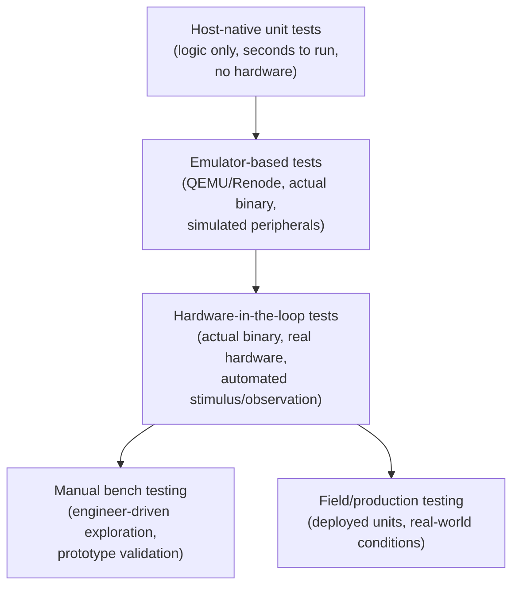
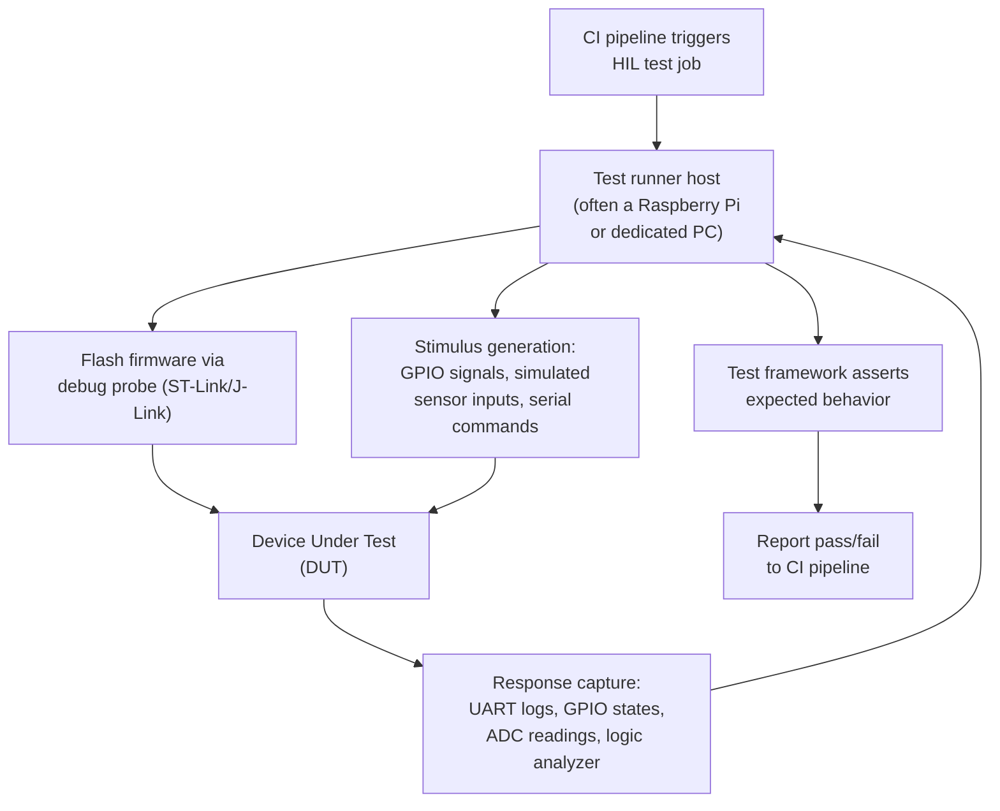
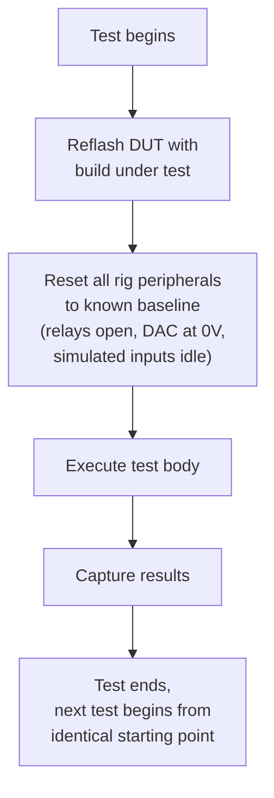
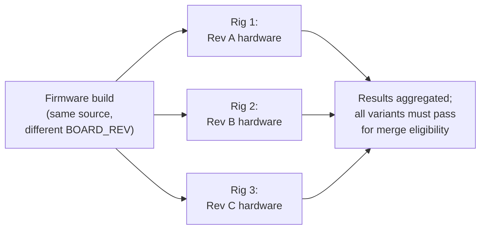

## Hardware-in-the-Loop Testing


### Overview

Hardware-in-the-loop (HIL) testing validates embedded firmware by running the actual compiled target binary on real (or closely emulated) hardware, with automated test infrastructure stimulating inputs and observing outputs to verify end-to-end behavior. Where unit testing (as covered separately) validates hardware-independent logic on a host machine, HIL testing closes the gap by exercising the genuine cross-compiled binary against real silicon, real timing, and real electrical behavior — catching classes of defects (driver bugs, timing violations, integration faults between subsystems) that host-native tests structurally cannot reach.

### Where HIL Fits in the Testing Hierarchy



**Key Points**

- Unit tests are fast and cheap but structurally cannot exercise the real cross-compiled binary, real timing, or real hardware peripheral behavior
- HIL tests are slower and more infrastructure-intensive but validate the actual artifact that will ship, including driver code, interrupt timing, and real electrical signal behavior that no mock or host simulation fully replicates
- HIL sits between fully automated host testing and manual bench work, aiming to automate the repeatable subset of what an engineer would otherwise verify by hand with a multimeter, oscilloscope, and patience
- Not every defect class is reachable even by HIL — physical stress conditions (extreme temperature, vibration, long-duration reliability) generally require separate environmental or reliability test programs beyond typical HIL scope

### Core HIL Architecture

A HIL test setup connects a CI-triggered test runner to physical hardware through a combination of programming/flashing access, stimulus generation, and response observation.



**Key Points**

- The **Device Under Test (DUT)** is the actual target hardware running the actual cross-compiled firmware image, connected via a debug probe for programming (as covered under in-circuit debuggers and programmers) and additional wiring for stimulus/observation
- A **test runner host** — commonly a small always-on machine (a Raspberry Pi is a frequent choice for cost and GPIO accessibility, though any host capable of driving the required interfaces works) — orchestrates the test sequence, independent of the primary CI server which may not have physical hardware access
- **Stimulus** ranges from simple GPIO toggling (simulating a button press) to more elaborate signal generation (simulated sensor waveforms via a DAC, injected CAN bus traffic, mocked UART commands from a "peer" device)
- **Observation** mirrors the techniques covered under logic analyzers for hardware debugging and printf-style debugging — UART capture, GPIO state monitoring, and sometimes a logic analyzer or oscilloscope integrated directly into the automated rig

### Example Test Harness Structure

Python, paired with libraries for serial communication and GPIO/instrument control, is a common choice for HIL test frameworks due to its accessibility and the maturity of hardware-interfacing libraries (pyserial, PyOCD, instrument-specific SCPI libraries).

```python
import serial
import pytest
from pyocd.core.helpers import ConnectHelper

@pytest.fixture
def flashed_target():
    session = ConnectHelper.session_with_chosen_probe(target_override="stm32f407vg")
    session.open()
    session.target.flash.flash_binary("build/firmware.bin", 0x08000000)
    session.target.reset_and_halt()
    session.target.resume()
    yield session
    session.close()

def test_uart_boot_message(flashed_target):
    with serial.Serial("/dev/ttyUSB0", 115200, timeout=2) as uart:
        line = uart.readline().decode()
        assert "System initialized" in line

def test_button_press_triggers_led(flashed_target, gpio_controller):
    gpio_controller.set_pin(BUTTON_SIM_PIN, high=True)
    import time; time.sleep(0.1)
    assert gpio_controller.read_pin(LED_PIN) == 1
```

The `flashed_target` fixture demonstrates the typical HIL test lifecycle: program the DUT with the build under test, reset it into a known state, execute the test body against real running firmware, and clean up — with each test ideally starting from an identical, reproducible hardware state to avoid test-order dependencies.

### Ensuring Reproducible Starting State

**Key Points**

- Tests that depend on prior test execution leaving the DUT in a particular state are fragile and order-dependent; a full reset-and-reflash (or at minimum, a hardware reset to a known firmware entry point) between tests is generally preferred despite the added time cost
- Persistent state (flash-stored configuration, EEPROM values, non-volatile counters) can leak between test runs if not explicitly reset, causing intermittent failures that appear only when tests run in a particular order or after a particular prior test
- Physical state (a relay left energized, a simulated sensor value left at a non-default level) from a previous test can equally contaminate a subsequent test's assumptions if the rig itself doesn't reset to a known baseline between runs



### Rig Infrastructure Components

| Component | Purpose |
| --- | --- |
| Debug probe (ST-Link, J-Link, CMSIS-DAP) | Automated flashing and, optionally, debug access during test failure diagnosis |
| Controllable power relay/USB switch | Automated power-cycling of the DUT, including simulating power-loss/brownout scenarios |
| USB-to-serial adapter | Capturing UART log/diagnostic output automatically |
| GPIO expander or dedicated stimulus board | Simulating button presses, digital sensor inputs, or interrupt triggers |
| Programmable DAC / signal generator | Simulating analog sensor inputs (temperature, pressure) at controlled values |
| Logic analyzer (rig-integrated) | Capturing and asserting on bus-level protocol behavior automatically |
| Environmental chamber (less common, higher-end rigs) | Automated temperature/humidity variation during test execution |

### Handling Rig Flakiness and Reliability

HIL infrastructure introduces failure modes entirely absent from software-only CI: connector wear, thermal drift affecting timing-sensitive tests, and occasional genuine hardware faults in the rig itself rather than the DUT.

**Key Points**

- Distinguishing a genuine firmware regression from rig-induced flakiness is an ongoing operational challenge; a common mitigation is a rig self-check/health-test run periodically (or before each test session) to verify the rig's own baseline functionality independent of any DUT firmware change
- Retry logic for individual test steps can mask genuine intermittent firmware bugs if applied too liberally, so retries are generally best scoped to known-flaky physical-layer operations (a probe connection attempt) rather than the actual behavioral assertions being tested
- Teams that allow HIL flakiness to persist unaddressed tend to experience "alert fatigue," where developers learn to ignore or automatically retry failures without investigation, eroding the pipeline's actual regression-catching value — echoing the same failure mode noted under continuous integration for embedded projects
- Physical rig maintenance (connector inspection/replacement, periodic recalibration of stimulus instruments) is an ongoing cost that scales with rig count and complexity, often underestimated when HIL infrastructure is first planned

### Scaling HIL Across a Test Matrix

Products supporting multiple hardware revisions or MCU variants (as discussed under build configuration and conditional compilation) ideally validate each variant on its own physical rig, since emulated or assumed equivalence between hardware revisions is precisely the kind of assumption HIL testing exists to catch.



**Key Points**

- Maintaining N physical rigs for N hardware variants is costly in both capital and ongoing maintenance, leading many teams to prioritize full HIL coverage for currently-shipping/actively-supported variants and rely on emulation or reduced coverage for legacy or pre-production variants
- Rig availability constraints often necessitate tiered testing: a fast, minimal smoke-test HIL suite on every commit, with a fuller regression suite reserved for nightly runs or pre-release gates, balancing thoroughness against physical rig throughput — the same tradeoff introduced under continuous integration practices generally

### HIL vs. Pure Emulation

| Aspect | HIL (real hardware) | Emulation (QEMU/Renode) |
| --- | --- | --- |
| Fidelity | Highest — actual silicon behavior | [Inference] Generally lower and peripheral/target dependent; varies significantly by how mature the specific target's emulator model is |
| Infrastructure cost | High (physical rigs, maintenance) | Lower (software-only, scales easily in CI) |
| Timing accuracy | Real, but variable/non-deterministic across runs | Often deterministic, but not necessarily matching real silicon timing precisely |
| Scalability | Limited by physical rig count | Easily parallelized across many CI runners |
| Novel/unsupported peripherals | Always testable if hardware exists | Limited to what the emulator models |

Many mature embedded CI pipelines use both in combination: emulation for fast, broad, parallelizable coverage on every commit, with HIL reserved for scenarios genuinely requiring real hardware fidelity (final validation before release, timing-critical paths, or peripherals with immature emulator support).

### Common Pitfalls

**Key Points**

- Under-investing in rig reliability engineering relative to firmware testing sophistication, resulting in a HIL suite that generates more noise than signal and gets bypassed under schedule pressure
- Designing tests with implicit dependencies on execution order or leftover state from prior tests, producing intermittent failures that are extremely difficult to reproduce and debug in isolation
- Treating HIL test pass/fail as binary without capturing sufficient diagnostic context (UART logs, fault dumps as covered under fault handlers, logic analyzer captures) on failure, forcing manual re-investigation on the physical bench for every failure rather than diagnosing from CI-captured artifacts alone
- Applying retry logic broadly enough that genuine intermittent firmware bugs are masked rather than caught, undermining the core purpose of the test suite
- Scaling HIL rig count linearly with hardware variant count without a plan for the ongoing physical maintenance burden, leading to gradual rig degradation and declining coverage reliability over a product's lifecycle
- Assuming emulator-passing behavior implies HIL-passing behavior (or vice versa) for timing-sensitive or peripheral-heavy code, when the two environments' fidelity characteristics genuinely differ and both may be necessary for full confidence

### Related Topics

- Toolchains and Build Systems — Continuous integration for embedded projects
- Toolchains and Build Systems — Unit testing embedded code
- Toolchains and Build Systems — In-circuit debuggers and programmers
- Toolchains and Build Systems — Logic analyzers for hardware debugging
- Toolchains and Build Systems — Fault handlers and crash dump analysis
- Emulation — QEMU and Renode for embedded target simulation
- Manufacturing — Production test and provisioning workflows
- Quality Assurance — Environmental and reliability test programs