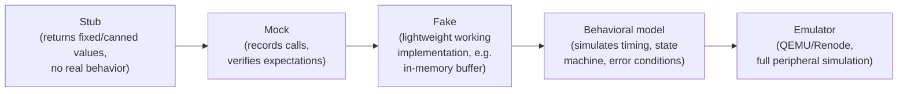
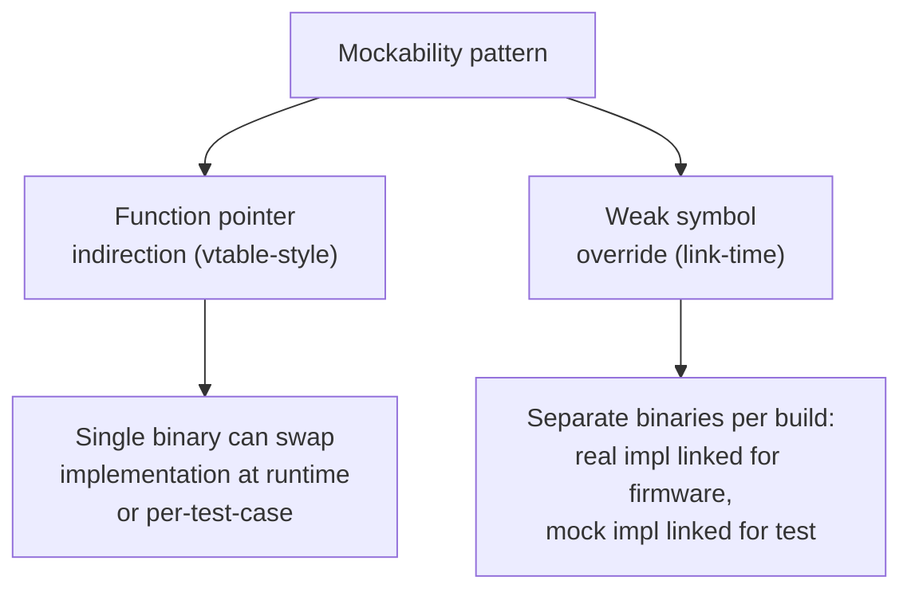

## Mocking Hardware for Host-Based Testing

### Overview

Mocking hardware for host-based testing is the practice of substituting real peripheral and register-level behavior with software fakes so that firmware logic can be compiled and exercised entirely on a development host, without target silicon. It is the enabling technique behind the host-native unit testing patterns introduced earlier, and spans a spectrum from simple hand-written stubs to full peripheral behavior simulation, each level of fidelity trading implementation effort against how much real hardware behavior — including its failure modes — the test can actually exercise.

### The Spectrum of Hardware Simulation Fidelity



**Key Points**

- Each step rightward in this spectrum increases implementation cost and maintenance burden but also increases the range of real hardware behavior — including edge cases and failure modes — that a test can actually exercise
- Most embedded unit testing lives comfortably in the stub/mock/fake range; full behavioral models or emulator-level fidelity are reserved for cases where timing or complex protocol state genuinely needs verification host-side
- There is no universally correct point on this spectrum — the appropriate fidelity level depends on what specific behavior a given test is trying to verify, and over-investing in fidelity for a test that doesn't need it wastes effort better spent elsewhere

### Terminology: Stub, Mock, and Fake

These terms are often used loosely, but the distinctions matter for choosing the right tool:

| Term | Behavior | Typical use |
| --- | --- | --- |
| **Stub** | Returns a predetermined, fixed value regardless of input; no logic | Satisfying a compile-time dependency when the specific return value doesn't matter to the test |
| **Mock** | Records what was called, with what arguments, how many times; test asserts on this call history | Verifying that application code invoked a hardware interface correctly (e.g., "did we call `i2c_write` with the right address?") |
| **Fake** | A lightweight but genuinely working implementation (e.g., an in-memory ring buffer standing in for a UART FIFO) | Testing code that depends on actual data flowing through the interface, not just that a call happened |

```c
// Stub: always succeeds, value doesn't matter to this particular test
static int stub_i2c_write(uint8_t addr, const uint8_t *data, size_t len) {
    return 0;
}

// Mock: records the call for later assertion
static struct { uint8_t addr; uint8_t data[32]; size_t len; int call_count; } mock_calls;

static int mock_i2c_write(uint8_t addr, const uint8_t *data, size_t len) {
    mock_calls.addr = addr;
    memcpy(mock_calls.data, data, len);
    mock_calls.len = len;
    mock_calls.call_count++;
    return 0;
}

// Fake: genuinely working in-memory UART, useful for testing
// code that reads back what it previously wrote
typedef struct { uint8_t buf[256]; size_t head, tail; } fake_uart_t;

static int fake_uart_write(fake_uart_t *u, const uint8_t *data, size_t len) {
    for (size_t i = 0; i < len; i++) u->buf[u->head++ % 256] = data[i];
    return (int)len;
}
static int fake_uart_read(fake_uart_t *u, uint8_t *data, size_t len) {
    size_t n = 0;
    while (n < len && u->tail != u->head) data[n++] = u->buf[u->tail++ % 256];
    return (int)n;
}
```

### Interface Design for Mockability

As introduced under unit testing embedded code, mockability depends on application logic depending on an abstraction rather than directly on register access. Two structurally different patterns are commonly used to achieve this swap between real and mock implementations:



**Function pointer indirection**, shown in the `i2c_interface_t` pattern from unit testing embedded code, allows a single test binary to substitute different mock behavior per test case simply by constructing a different struct instance — convenient when many tests need slightly different mock behavior from the same interface.

**Weak symbol override** (introduced under build configuration and conditional compilation) resolves the swap at link time instead:

```c
// hardware_i2c.c - real implementation, weak so tests can override
__attribute__((weak)) int i2c_write(uint8_t addr, const uint8_t *data, size_t len) {
    // real register-level implementation
}

// test_sensor.c - test build links this instead, overriding the weak symbol
int i2c_write(uint8_t addr, const uint8_t *data, size_t len) {
    // mock implementation
}
```

This pattern requires no interface struct threading through function signatures, keeping application code's call sites identical to the "real" case, but commits the entire test binary to one fixed mock behavior for the whole test executable rather than allowing per-test-case substitution without additional indirection.

### Generated Mocks with CMock

For interfaces with many functions, hand-writing mocks becomes tedious and error-prone to keep synchronized with the real interface as it evolves. CMock (commonly paired with the Unity framework introduced under unit testing embedded code) parses a C header file and generates a complete mock implementation, including call-count and argument verification, automatically.

```c
// i2c_interface.h - the header CMock parses
int i2c_write(uint8_t addr, const uint8_t *data, size_t len);
int i2c_read(uint8_t addr, uint8_t *data, size_t len);
```

```c
// Generated mock usage in a test (CMock-generated API)
void test_sensor_writes_correct_config_register(void) {
    uint8_t expected_config[] = { 0x01, 0x60 };

    i2c_write_ExpectWithArrayAndReturn(SENSOR_ADDR, expected_config, 2, 2, 0);

    int result = sensor_configure();

    TEST_ASSERT_EQUAL_INT(0, result);
    // CMock automatically verifies i2c_write was called with these
    // exact arguments during test teardown
}
```

**Key Points**

- Generated mocks automatically stay synchronized with the real interface's signature, since regenerating from the header catches signature mismatches at build time rather than allowing a hand-written mock to silently drift out of sync
- The expectation-based style (`_ExpectWithArrayAndReturn`) declares what calls are expected *before* the code under test runs, and the framework fails the test if the actual calls don't match — a stricter, more mock-oriented style than the simpler stub/fake patterns shown earlier
- The added code-generation build step is a real complexity and toolchain-dependency cost, generally justified once an interface grows large enough that hand-maintaining mocks becomes a genuine maintenance burden rather than from the outset of a project

### Modeling Failure Conditions

A key motivation for mocking beyond simple "happy path" stubbing is that error and edge-case conditions — bus timeouts, NACKs, malformed responses, intermittent failures — are often difficult or risky to reliably trigger on real hardware, but trivial to construct in a mock.

```c
void test_sensor_read_retries_on_transient_i2c_failure(void) {
    // First call fails, second succeeds - simulating a transient bus glitch
    i2c_read_ExpectAndReturn(SENSOR_ADDR, NULL, 2, -1);
    i2c_read_IgnoreArg_data();
    i2c_read_ExpectAndReturn(SENSOR_ADDR, NULL, 2, 0);
    i2c_read_IgnoreArg_data();

    float temp;
    int result = sensor_read_temperature_with_retry(&temp);

    TEST_ASSERT_EQUAL_INT(0, result);
}

void test_sensor_read_gives_up_after_max_retries(void) {
    // All attempts fail - verifying the retry limit is actually enforced
    for (int i = 0; i < MAX_RETRIES; i++) {
        i2c_read_ExpectAndReturn(SENSOR_ADDR, NULL, 2, -1);
        i2c_read_IgnoreArg_data();
    }

    float temp;
    int result = sensor_read_temperature_with_retry(&temp);

    TEST_ASSERT_EQUAL_INT(-1, result);
}
```

This kind of test — deliberately injecting a transient failure to verify retry logic actually retries, and a persistent failure to verify a retry limit is actually enforced and doesn't loop forever — is a direct example of testing error-handling paths that would otherwise require deliberately inducing bus glitches on real hardware, an approach that is both harder to do reliably and harder to make repeatable across test runs.

### Simulating Time and Timers

Firmware logic frequently depends on elapsed time (timeouts, debouncing, periodic scheduling) without any real hardware register access at all — but a host-native test still needs a way to control or fast-forward simulated time, since actually sleeping in a test suite for the real timeout duration is both slow and non-deterministic.

```c
// Time source abstracted behind an interface, just like I2C above
typedef struct {
    uint32_t (*get_ms)(void);
} time_source_t;

// Mock time source under full test control
static uint32_t mock_time_ms;
static uint32_t mock_get_ms(void) { return mock_time_ms; }
static time_source_t mock_time = { .get_ms = mock_get_ms };

void test_debounce_ignores_bounce_within_window(void) {
    debounce_t db;
    debounce_init(&db, &mock_time, 50 /* ms window */);

    mock_time_ms = 1000;
    debounce_signal(&db, true);
    mock_time_ms = 1010;  // 10ms later, within bounce window
    bool result = debounce_signal(&db, true);

    TEST_ASSERT_FALSE(result);  // should be suppressed as bounce
}
```

Because `mock_time_ms` is directly controlled by the test rather than tied to actual wall-clock time, tests covering timeout and debounce boundary conditions execute instantly and deterministically, rather than requiring the test suite to actually wait out real timer durations — a pattern that scales poorly once a codebase accumulates many timing-dependent tests.

### Peripheral Behavioral Models

Where a fake needs to represent more than a simple buffer — genuine state machine behavior matching a real peripheral's documented sequencing — a **behavioral model** implements that state machine in software, without any real hardware.

```c
// Simplified behavioral model of an I2C EEPROM's write-then-read sequencing,
// including the "busy during write cycle" behavior real EEPROMs exhibit
typedef struct {
    uint8_t memory[256];
    bool write_in_progress;
    uint32_t write_complete_at_ms;
} fake_eeprom_t;

int fake_eeprom_write(fake_eeprom_t *e, uint8_t reg, uint8_t val, uint32_t now_ms) {
    if (e->write_in_progress) return -1;  // NACK, matches real EEPROM busy behavior
    e->memory[reg] = val;
    e->write_in_progress = true;
    e->write_complete_at_ms = now_ms + 5;  // datasheet: 5ms write cycle
    return 0;
}
```

This level of fidelity is justified specifically when application logic needs to correctly handle the *timing* of a real peripheral's documented behavior (an EEPROM refusing further writes during its internal write cycle, for instance) — a case a simple always-succeeds stub would never exercise, potentially masking a real firmware bug that only manifests against genuine hardware timing.

### When to Reach for Full Emulation Instead

**Key Points**

- Hand-rolled behavioral models are appropriate for a small number of well-understood, documented peripheral behaviors central to the logic under test
- Once the needed fidelity approaches "accurately simulate this MCU's actual peripheral register map, interrupt behavior, and bus timing broadly," a purpose-built emulator (QEMU or Renode, introduced under continuous integration for embedded projects) is generally a better investment than continuing to hand-write increasingly elaborate mocks
- [Inference] The crossover point between "write a behavioral model" and "invest in emulator-based testing" depends on how much of the peripheral's behavior actually matters to the tests being written and how mature existing emulator support is for the specific target; there is no fixed rule, and teams commonly use both approaches for different subsystems within the same codebase

### Common Pitfalls

**Key Points**

- Building an overly permissive mock (one that always succeeds, never models a documented failure mode) that gives false confidence in error-handling code paths which are, in reality, never exercised by any test
- Letting hand-written mocks drift out of sync with the real interface's actual signature or behavior over time, especially without generated-mock tooling to catch mismatches at build time
- Over-mocking to the point of asserting on exact call sequences and argument values for every interaction, producing brittle tests that fail on harmless refactoring rather than genuine behavioral regressions — echoing the same caution raised under unit testing embedded code
- Using real wall-clock delays in tests that depend on timeouts or periodic behavior, rather than abstracting and mocking the time source, resulting in a slow and sometimes non-deterministic test suite
- Assuming a passing mock-based test guarantees correctness against real hardware, when the mock's fidelity may not capture a specific timing constraint, error condition, or sequencing requirement the real peripheral actually enforces — mocked tests and hardware-in-the-loop tests remain complementary, not substitutes
- Investing disproportionate effort in high-fidelity behavioral modeling for a peripheral interaction that a much simpler stub would have sufficiently exercised for the actual test's purpose

### Related Topics

- Toolchains and Build Systems — Unit testing embedded code
- Toolchains and Build Systems — Hardware-in-the-loop testing
- Toolchains and Build Systems — Continuous integration for embedded projects
- Toolchains and Build Systems — Build configuration and conditional compilation
- Software Architecture — Hardware Abstraction Layer (HAL) design patterns
- Emulation — QEMU and Renode for peripheral simulation
- Testing — Property-based and fuzz testing for embedded parsers