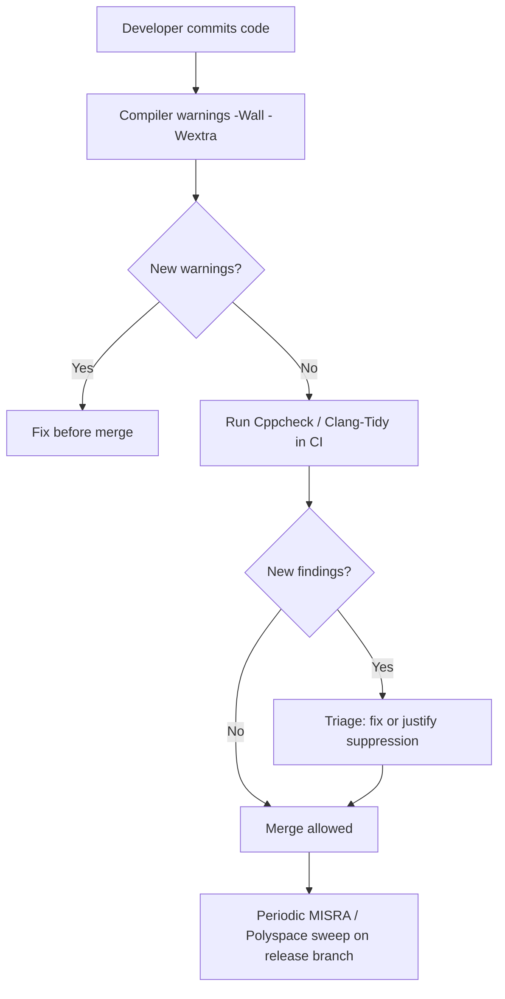

## Static Analysis Tools

### Overview

Static analysis examines source code without executing it, identifying defects, undefined behavior, security vulnerabilities, and standards violations before the code ever runs on hardware. In embedded systems, where runtime debugging is constrained by limited observability, hard real-time deadlines, and safety certification requirements, static analysis is one of the highest-leverage quality tools available. It catches entire classes of bugs — buffer overflows, null pointer dereferences, integer overflow, uninitialized variables, race conditions, and misuse of hardware registers — that are expensive or impossible to reproduce on target.

### Why Static Analysis Matters More for Embedded Systems

- **Limited runtime visibility**: no OS, no debugger attached in production, minimal logging space
- **Safety and certification requirements**: standards such as MISRA C, DO-178C, IEC 62304, and ISO 26262 mandate or strongly recommend static analysis as part of the verification process
- **Resource constraints**: bugs like stack overflows or heap fragmentation are hard to catch at runtime on a device with kilobytes of RAM
- **Long deployment lifetimes**: firmware may run for years without patching, so defects found pre-deployment are far cheaper than field failures
- **Undefined behavior in C/C++**: embedded firmware is overwhelmingly written in C/C++, languages that permit large amounts of undefined behavior a compiler is not required to diagnose

### Categories of Static Analysis Tools

#### 1. Compiler Warnings and Built-In Diagnostics

The first and cheapest layer of static analysis is the compiler itself.

- **GCC/Clang warning flags**: `-Wall -Wextra -Wpedantic -Wconversion -Wshadow -Wcast-align -Wcast-qual -Wnull-dereference -Wstrict-overflow`
- **-Werror**: promotes warnings to build-breaking errors, forcing resolution
- Compilers increasingly embed real static analysis passes (Clang's `-fanalyzer`-style checks, GCC's `-fanalyzer` flag) that perform interprocedural analysis, not just syntactic pattern matching

**Example (GCC with `-fanalyzer`):**

```c
#include <stdlib.h>

void example(void) {
    int *p = malloc(sizeof(int));
    *p = 42;      // potential leak if free is never called
}
```

Running `gcc -fanalyzer -Wall example.c` reports a `-Wanalyzer-malloc-leak` warning identifying the unfreed allocation, tracing the exact code path.

#### 2. Dedicated Static Analyzers (General Purpose)

These tools perform deeper data-flow, control-flow, and taint analysis than compiler warnings.

- **Clang Static Analyzer / Clang-Tidy**: path-sensitive analysis for null dereferences, memory leaks, dead stores, and API misuse; Clang-Tidy additionally enforces style and modernization checks and is extensible with custom checks
- **Cppcheck**: open-source, embedded-friendly, low false-positive rate, supports MISRA add-on rule checking, works without a full build system
- **PVS-Studio**: commercial, strong diagnostic depth for C/C++/C#, good at finding copy-paste errors and subtle logic bugs
- **PC-lint / PC-lint Plus**: long-standing tool in the embedded industry, deep MISRA support, configurable rule suppression, works well with cross-compilers
- **Coverity**: commercial, industry standard for large-scale interprocedural analysis, widely used in safety-critical and security-sensitive codebases
- **Polyspace**: MathWorks tool specialized for embedded C/C++, performs abstract interpretation to mathematically prove the absence of certain runtime errors (not just heuristically flag them)

**Example (Cppcheck usage):**

```bash
cppcheck --enable=all --inconclusive --std=c99 --platform=avr8 src/
```

The `--platform` flag matters for embedded targets: it tells Cppcheck the correct integer and pointer widths for the target architecture, which affects overflow and truncation analysis accuracy.

#### 3. MISRA and Coding Standard Checkers

MISRA C and MISRA C++ are the dominant coding standards in embedded and automotive software, designed to restrict the language to a safer, more predictable subset.

- Rules are categorized as **mandatory**, **required**, or **advisory**
- Checkers: PC-lint Plus, PRQA/Helix QAC, Cppcheck (partial support via addon), Coverity, Polyspace
- MISRA compliance does not guarantee correctness — it removes constructs that are statistically associated with defects (implicit type conversions, unstructured control flow, undefined evaluation order)

**Common MISRA violations caught by these tools:**

- Use of `goto`
- Implicit signed/unsigned conversions
- Functions with multiple exit points (in stricter rule sets)
- Uncommented fall-through in `switch` statements
- Use of dynamic memory allocation in safety-critical code paths

#### 4. Abstract Interpretation Tools

Unlike pattern-matching linters, abstract interpretation tools attempt to soundly model all possible program states.

- **Polyspace Code Prover**: color-codes every operation as proven safe (green), proven to always fail (red), unreachable (grey), or unproven (orange), giving a formally-grounded picture of runtime error risk
- **Astrée**: used in aerospace (e.g., Airbus flight control software) to prove the absence of runtime errors such as division by zero, array out-of-bounds, and arithmetic overflow, with zero false negatives by design (at the cost of some false positives)

[Inference] These tools are typically reserved for the highest safety-integrity-level code (e.g., DO-178C Level A, ISO 26262 ASIL D) because of their computational cost and the engineering effort needed to resolve orange/unproven results, rather than for general application code.

#### 5. Security-Focused Static Analysis

- **Semgrep**: pattern-based, fast, good for enforcing custom secure-coding rules across a codebase
- **CodeQL**: treats code as a queryable database, powerful for finding complex vulnerability patterns (e.g., tainted data reaching a memory copy without bounds checking)
- **Flawfinder / RATS**: lightweight, flag risky C function usage (`strcpy`, `sprintf`, `gets`)

**Example (Flawfinder flagging unsafe function use):**

```c
char buffer[16];
strcpy(buffer, user_input); // Flawfinder: HIGH risk - no bounds checking
```

Flawfinder would flag `strcpy` and suggest `strncpy` or bounds-checked alternatives, along with a risk-level score.

#### 6. Hardware/Register-Aware Analysis

Embedded-specific static analysis extends beyond generic C bugs into peripheral and memory-mapped I/O misuse.

- Detection of missing `volatile` qualifiers on memory-mapped registers or ISR-shared variables
- Detection of read-modify-write races on hardware registers
- Stack usage analysis: many toolchains (IAR, Keil, GCC with `-fstack-usage`) can statically compute worst-case stack depth per function, critical when RAM is measured in kilobytes

**Example (`-fstack-usage` with GCC):**

```bash
gcc -fstack-usage -c main.c
```

This produces a `.su` file listing each function's stack frame size, letting you sum worst-case call-chain depth without ever running the code — something a runtime stack-high-water-mark check can only approximate empirically.

### Static Analysis Workflow Diagram

<svg xmlns="http://www.w3.org/2000/svg" viewBox="0 0 800 320">
\<style\>
.box { fill: #f4f4f4; stroke: #333; stroke-width: 1.5; }
.box2 { fill: #e8f0fe; stroke: #333; stroke-width: 1.5; }
.label { font-family: sans-serif; font-size: 13px; fill: #111; }
.title { font-family: sans-serif; font-size: 14px; fill: #111; font-weight: bold; }
.arrow { stroke: #333; stroke-width: 1.5; marker-end: url(#arrow); }
\</style\>
<text x="20" y="24" class="title">Static Analysis Pipeline (svg_diagram)</text>
<rect x="20" y="50" width="140" height="50" rx="6" class="box" />
<text x="35" y="80" class="label">Source Code</text>
<line x1="160" y1="75" x2="210" y2="75" class="arrow" />
<rect x="210" y="50" width="150" height="50" rx="6" class="box2" />
<text x="222" y="72" class="label">Compiler Warnings</text>
<text x="222" y="88" class="label">(-Wall -Wextra)</text>
<line x1="360" y1="75" x2="410" y2="75" class="arrow" />
<rect x="410" y="50" width="150" height="50" rx="6" class="box2" />
<text x="425" y="72" class="label">Dedicated Analyzer</text>
<text x="425" y="88" class="label">(Cppcheck / Coverity)</text>
<line x1="560" y1="75" x2="610" y2="75" class="arrow" />
<rect x="610" y="50" width="150" height="50" rx="6" class="box2" />
<text x="625" y="72" class="label">MISRA / Standards</text>
<text x="625" y="88" class="label">Checker</text>
<line x1="685" y1="100" x2="685" y2="150" class="arrow" />
<rect x="450" y="150" width="270" height="55" rx="6" class="box" />
<text x="465" y="172" class="label">Findings Triage</text>
<text x="465" y="190" class="label">(true positive vs. false positive)</text>
<line x1="450" y1="177" x2="350" y2="177" class="arrow" />
<rect x="120" y="150" width="230" height="55" rx="6" class="box" />
<text x="135" y="172" class="label">Fix Code /</text>
<text x="135" y="190" class="label">Document Suppression</text>
<line x1="235" y1="150" x2="235" y2="115" class="arrow" />
<line x1="235" y1="115" x2="90" y2="115" class="arrow" />
<line x1="90" y1="115" x2="90" y2="100" class="arrow" />
<rect x="300" y="240" width="220" height="55" rx="6" class="box2" />
<text x="315" y="262" class="label">CI/CD Gate</text>
<text x="315" y="280" class="label">(build fails on new findings)</text>
<line x1="410" y1="205" x2="410" y2="240" class="arrow" />
</svg>

### Integrating Static Analysis into a Build Pipeline

1. Run compiler warnings as a baseline on every build (fast, near-zero cost)
2. Run a dedicated analyzer (Cppcheck, Clang-Tidy) on every commit or pull request in CI
3. Run MISRA/standards checks on release branches or as a gated pre-merge check for safety-critical modules
4. Reserve heavyweight abstract interpretation tools (Polyspace, Astrée) for periodic full-codebase sweeps or specific high-integrity modules, given their runtime and triage cost
5. Track suppressed/waived findings in a documented list with justification, since a suppressed true finding is a common source of certification audit failure



### Interpreting and Triaging Results

- **True positive**: a genuine defect; fix the code, do not suppress
- **False positive**: analyzer misidentifies safe code as risky, often due to lack of context (e.g., a value range guaranteed by an external constraint the tool cannot see); suppress with an inline comment explaining why
- **Inconclusive/orange (abstract interpretation tools)**: tool cannot prove safety or danger; requires manual review or added annotations/contracts to narrow the analysis

[Inference] Teams new to static analysis frequently underestimate the initial triage effort on a legacy codebase, since first-time runs on unaudited code can surface thousands of findings; a common mitigation is to baseline existing findings and only gate on *new* findings going forward.

### Limitations of Static Analysis

- Cannot catch all runtime-dependent bugs (e.g., timing-dependent race conditions in complex RTOS scheduling, unless the tool is specifically designed for concurrency analysis)
- False positives can create alert fatigue if not tuned to the codebase and target platform
- Does not replace dynamic testing, hardware-in-the-loop testing, or code review — it is complementary
- Deep interprocedural or abstract-interpretation analysis can be computationally expensive and slow on large codebases
- Tool accuracy depends heavily on correct target configuration (word size, endianness, register layout); misconfigured platform settings can produce misleading results

### Key Points

- Static analysis finds defects before code runs, which is disproportionately valuable in embedded systems given limited runtime observability
- Layer tools from cheapest to most rigorous: compiler warnings → linters/analyzers → standards checkers (MISRA) → abstract interpretation
- MISRA compliance reduces risk by restricting the language subset, but is not a correctness proof by itself
- Abstract interpretation tools (Polyspace, Astrée) can mathematically prove the absence of specific runtime error classes, at higher computational and triage cost
- Embedded-specific checks (volatile correctness, register race conditions, static stack usage) matter beyond generic C/C++ bug classes
- Integrate analysis into CI/CD with baselining to avoid triage overload on legacy code

### Related Topics

- Dynamic analysis and runtime sanitizers (ASan, UBSan) for embedded targets
- Fuzz testing embedded protocol parsers and firmware interfaces
- Hardware-in-the-loop (HIL) testing frameworks
- Unit testing embedded C with mocking frameworks (Ceedling, Unity, CppUTest)
- Code coverage analysis (MC/DC) for safety-critical certification
- Formal verification and model checking for embedded firmware
- Real-time race condition and deadlock detection tools