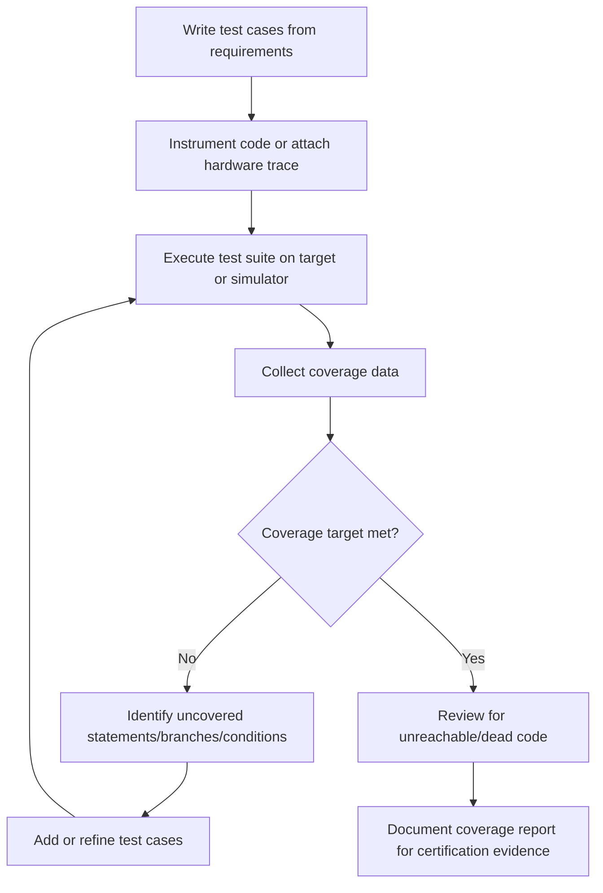

## Code Coverage in Embedded Contexts

### Overview

Code coverage measures how much of a program's source code is exercised during testing. In embedded systems, coverage analysis carries additional weight beyond general software quality: it is a mandated verification metric in safety-critical standards (DO-178C, ISO 26262, IEC 62304), it must account for resource-constrained targets where instrumentation itself can distort timing and memory behavior, and it often must be measured on the actual target hardware or a validated simulator rather than a host machine, since compiler and architecture differences can change which code paths are even reachable.

### Why Coverage Matters More for Embedded Systems

- **Certification requirements**: DO-178C mandates specific coverage levels tied to software criticality (Level A requires MC/DC)
- **Untested code is unverified code**: in safety-critical firmware, unexercised branches may hide defects that only manifest under rare fault conditions (sensor failure, power brownout, corrupted input)
- **Host/target divergence**: coverage measured on a host-compiled version of the code may not reflect real coverage on the cross-compiled target binary, since conditional compilation, optimization, and architecture-specific paths differ
- **Resource constraints**: instrumentation adds code size and execution overhead, which can be significant on devices with limited flash/RAM or hard real-time deadlines
- **Fault and error-handling paths**: much embedded coverage effort is spent specifically on hard-to-trigger paths (watchdog resets, ADC out-of-range handling, communication timeouts) rather than mainline logic

### Types of Code Coverage

#### 1. Statement (Line) Coverage

Measures whether each executable statement has run at least once.

```c
int classify(int x) {
    if (x > 0) {
        return 1;   // statement A
    }
    return -1;      // statement B
}
```

A single test with `x = 5` covers statement A but not B. Statement coverage is the weakest metric — it says nothing about which branch conditions were actually exercised in combination.

#### 2. Branch (Decision) Coverage

Requires that each branch (true and false outcome of every decision) be exercised at least once.

For the `classify()` example above, branch coverage requires at least two tests: one with `x > 0` true, one with `x > 0` false. Branch coverage is stronger than statement coverage but still does not examine compound conditions individually.

#### 3. Condition Coverage

Requires each individual boolean sub-condition within a compound expression to evaluate to both true and false at least once, independent of the overall decision outcome.

```c
if (sensor_ok && (temperature < MAX_TEMP)) {
    enable_heater();
}
```

Condition coverage requires `sensor_ok` to be both true and false across tests, and `temperature < MAX_TEMP` to be both true and false — but not necessarily in a way that changes the overall branch outcome.

#### 4. Modified Condition/Decision Coverage (MC/DC)

MC/DC is the standard required for the highest safety-integrity levels (DO-178C Level A, ISO 26262 ASIL D). It requires:

- Every condition in a decision has taken both true and false
- Every decision has taken both true and false
- Each condition has been shown to **independently** affect the decision's outcome (varying that one condition, while holding others fixed, changes the overall result)

**Example:**

```c
if (a || b) {
    do_something();
}
```

MC/DC requires test cases such as:

| Test | a | b | Result | Demonstrates |
| --- | --- | --- | --- | --- |
| 1 | F | F | F | baseline |
| 2 | T | F | T | `a` independently changes result |
| 3 | F | T | T | `b` independently changes result |

This is a minimal MC/DC-satisfying set for a simple OR expression; the number of required test cases grows roughly linearly (not exponentially, unlike full condition/decision combination testing) with the number of conditions, which is part of why MC/DC is favored in certification over exhaustive multiple-condition coverage.

#### 5. Function and Call Coverage

Tracks whether each function has been invoked at least once — a coarse but useful sanity check, often used early in test development to catch entirely untested modules.

#### 6. Path Coverage

Requires every possible execution path through a function (every combination of branches) to be exercised. [Inference] This is rarely pursued exhaustively in practice because the number of paths grows exponentially with the number of decisions, making it computationally and practically infeasible beyond small functions; it is typically approximated through MC/DC instead.

### Coverage Level Comparison Diagram

<svg xmlns="http://www.w3.org/2000/svg" viewBox="0 0 800 380">
\<style\>
.box { fill: #f4f4f4; stroke: #333; stroke-width: 1.5; }
.box2 { fill: #e8f0fe; stroke: #333; stroke-width: 1.5; }
.box3 { fill: #fdecea; stroke: #333; stroke-width: 1.5; }
.label { font-family: sans-serif; font-size: 12px; fill: #111; }
.title { font-family: sans-serif; font-size: 14px; fill: #111; font-weight: bold; }
.small { font-family: sans-serif; font-size: 11px; fill: #333; }
\</style\>
<text x="20" y="24" class="title">Coverage Strength Hierarchy (svg_diagram)</text>
<rect x="250" y="50" width="300" height="45" rx="6" class="box" />
<text x="270" y="78" class="label">Statement Coverage (weakest)</text>
<rect x="220" y="105" width="360" height="45" rx="6" class="box" />
<text x="240" y="133" class="label">Branch / Decision Coverage</text>
<rect x="190" y="160" width="420" height="45" rx="6" class="box2" />
<text x="210" y="188" class="label">Condition Coverage</text>
<rect x="150" y="215" width="500" height="45" rx="6" class="box2" />
<text x="170" y="243" class="label">Modified Condition/Decision Coverage (MC/DC)</text>
<rect x="100" y="270" width="600" height="45" rx="6" class="box3" />
<text x="120" y="298" class="label">Full Path Coverage (strongest, rarely feasible)</text>

<text x="20" y="345" class="small">Each level subsumes the guarantees of the levels above it</text>

<text x="20" y="362" class="small">DO-178C Level A requires MC/DC; lower levels require weaker coverage per criticality</text>

</svg>

### Coverage Requirements by DO-178C Software Level

| Level | Description | Required Coverage |
| --- | --- | --- |
| A | Catastrophic failure condition | Statement + Decision + MC/DC |
| B | Hazardous failure condition | Statement + Decision |
| C | Major failure condition | Statement |
| D | Minor failure condition | None formally required (traceability only) |
| E | No safety effect | None |

[Unverified] Exact wording and structure of these requirements should be checked against the current DO-178C/DO-330 text and applicable supplements for a specific certification project, since interpretation can vary by certification authority guidance and program-specific certification liaison agreements.

### Tools for Embedded Code Coverage

- **gcov / lcov**: GCC's built-in coverage instrumentation; widely used for host-based or simulator-based testing; lcov generates HTML reports from gcov data
- **LDRA Tool Suite**: certified for DO-178C/ISO 26262 use, supports statement/decision/MC/DC on target hardware
- **VectorCAST**: strong embedded and automotive focus, supports on-target coverage collection with minimal instrumentation overhead, integrates with HIL test rigs
- **Bullseye Coverage**: condition/decision coverage tool, commonly used in embedded C/C++ projects
- **Squish Coco**: instrumentation-based coverage supporting MC/DC, works across many embedded toolchains
- **Tessy**: classification-tree based unit testing with integrated coverage measurement, common in automotive ECU testing

**Example (gcov basic workflow):**

```bash
gcc -fprofile-arcs -ftest-coverage -o test_app main.c
./test_app
gcov main.c
```

This produces a `main.c.gcov` annotated source file showing execution counts per line, and summary branch coverage statistics.

### On-Target vs. Host-Based Coverage Measurement

- **Host-based**: code compiled and instrumented for the development machine (x86/x64), executed there with a test harness; fast and cheap, but may not reflect target-specific compiler behavior, endianness, or hardware-dependent code paths
- **On-target**: code cross-compiled and instrumented for the actual embedded processor, executed on real hardware or a cycle-accurate simulator; required for certification credit in most safety standards, but instrumentation overhead can be problematic under tight real-time constraints
- **Instrumentation overhead concern**: coverage instrumentation adds code size and execution time; on deeply resource-constrained microcontrollers, this can be significant enough to require careful placement or use of hardware trace (e.g., ARM ETM/ITM trace ports) instead of software instrumentation to avoid probe effect

[Inference] Hardware trace-based coverage (using debug trace ports rather than inserted instrumentation code) is generally preferred for timing-sensitive certification testing specifically because it avoids altering the timing and code size of the binary under test, though it requires trace-capable silicon and tooling support.

### Structural Coverage Analysis Workflow



### Handling Unreachable and Dead Code

Certification-grade coverage analysis requires explicit justification for any code that cannot be covered by testing:

- **Defensive code**: error-handling branches for conditions that should be logically impossible given upstream checks (e.g., a `default` case in a `switch` covering all enum values) — must be justified with rationale, not just ignored
- **Deactivated code**: code compiled in for other configurations/variants but not active in this build — must be identified and excluded from the applicable coverage target with documented justification
- **Dead code**: code that can never execute under any input — generally must be removed, since its presence is itself a certification finding in most standards

### Practical Embedded Testing Considerations

- Coverage should be driven from requirements-based test cases, not written retroactively just to hit numbers — coverage percentage alone is not evidence of correctness, only of exercise
- 100% MC/DC on a poorly specified requirement still leaves specification gaps uncovered; coverage measures test thoroughness against existing tests, not requirement completeness
- Interrupt service routines (ISRs) and hardware fault handlers are notoriously under-covered in practice because they are difficult to trigger deterministically in a test harness; fault injection techniques (simulated register faults, mocked peripheral failures) are commonly used to reach them
- Coverage of the "unhappy paths" (timeout handling, retry logic, watchdog recovery) is often the primary gap between statement and MC/DC coverage in mature embedded codebases

### Key Points

- Coverage strength increases from statement → branch → condition → MC/DC → path, each subsuming the guarantees below it
- MC/DC is the required standard for the highest DO-178C criticality level (Level A) and is broadly used across safety-critical embedded domains
- On-target coverage collection is often required for certification credit; hardware trace avoids the probe effect that software instrumentation introduces
- High coverage percentage is a measure of test exercise, not correctness — it must be paired with requirements-based test design
- Defensive, deactivated, and dead code each require distinct handling and justification in a certification context

### Related Topics

- Requirements-based test case design for embedded systems
- MC/DC test case derivation techniques and tooling
- Fault injection testing for interrupt and error-handling paths
- Hardware trace (ARM ETM/ITM) for low-overhead runtime analysis
- Unit testing frameworks for embedded C (Unity, Ceedling, CppUTest)
- DO-178C and ISO 26262 verification process overviews
- Hardware-in-the-loop (HIL) test rig design