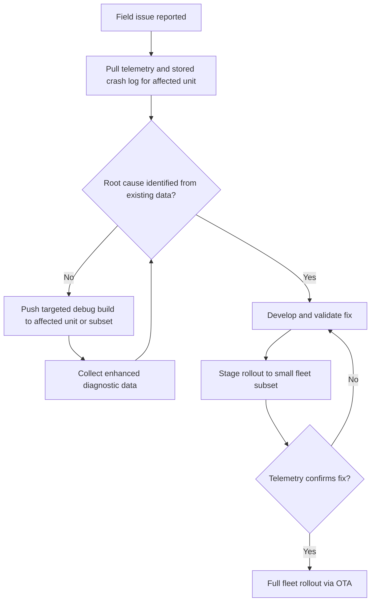

## Field Debugging and Remote Diagnostics

### Overview

Field debugging addresses a problem fundamentally different from lab debugging: a device is deployed at a customer site, in a vehicle, on a factory floor, or in an inaccessible location, and it is misbehaving in ways that cannot be reproduced on a bench. There is typically no JTAG probe, no serial console, and no way to attach a debugger without a truck roll. Remote diagnostics is the discipline of building enough observability, logging, and remote-access infrastructure into a product *before* deployment so that field issues can be triaged and often resolved without physical access to the unit.

### Why Field Debugging Is Fundamentally Different

- **No physical access**: the device may be embedded in a wall, buried, submerged, mounted on rotating machinery, or simply too far away
- **Reproducibility is rare**: field failures are frequently triggered by environmental conditions (temperature extremes, EMI, power quality, humidity, mechanical vibration) that a lab bench cannot easily replicate
- **Fleet scale**: a single bug report from one unit in a fleet of 100,000 is a needle in a haystack; you need aggregated telemetry to see patterns
- **Limited bandwidth and connectivity**: field devices often communicate over constrained links (LoRa, NB-IoT, satellite) making verbose logging or live debugging impractical
- **Safety and liability**: for regulated or safety-critical devices (medical, automotive, industrial), remote diagnostic capability itself must be validated and secured, since it introduces a new attack surface

### Building Observability Before Deployment

Because you cannot retrofit debug capability into hardware already in the field, the design of the diagnostics subsystem must happen during development.

#### 1. Persistent Logging

- **Circular/ring buffers in non-volatile memory** (flash, FRAM, or a reserved EEPROM region) that survive resets and power loss, so the last N events leading up to a crash or fault are preserved
- **Log levels** (ERROR, WARN, INFO, DEBUG) configurable at runtime so field units can normally run quiet but be turned up remotely when investigating an issue
- **Structured logging** (fixed-format binary records rather than free-text strings) to minimize flash wear and bandwidth, decoded off-device by a host tool

**Example (minimal ring buffer log record in C):**

```c
typedef struct {
    uint32_t timestamp;
    uint16_t event_id;
    uint16_t severity;
    uint32_t data[2];
} log_entry_t;

#define LOG_CAPACITY 128
static log_entry_t log_buffer[LOG_CAPACITY];
static uint16_t log_head = 0;

void log_event(uint16_t event_id, uint16_t severity, uint32_t d0, uint32_t d1) {
    log_entry_t *e = &log_buffer[log_head];
    e->timestamp = get_uptime_ms();
    e->event_id  = event_id;
    e->severity  = severity;
    e->data[0]   = d0;
    e->data[1]   = d1;
    log_head = (log_head + 1) % LOG_CAPACITY;
}
```

Storing this buffer in a memory region excluded from normal firmware update erasure means the log survives an OTA update and can be retrieved after the fact.

#### 2. Crash and Fault Capture

- **Fault handlers** (e.g., ARM Cortex-M HardFault/BusFault/UsageFault handlers) that capture the program counter, link register, and stack contents at the moment of failure before reset
- **Persistent crash record**: written to a reserved flash/FRAM region, read back and reported on the next boot or next connectivity window
- **Watchdog reset reason tracking**: distinguishing a watchdog-triggered reset from a normal power cycle or brown-out reset, using the MCU's reset cause register

**Example (Cortex-M HardFault handler capturing register state):**

```c
void HardFault_Handler(void) {
    __asm volatile (
        "TST LR, #4              \n"
        "ITE EQ                  \n"
        "MRSEQ R0, MSP           \n"
        "MRSNE R0, PSP           \n"
        "B fault_handler_c       \n"
    );
}

void fault_handler_c(uint32_t *stack_frame) {
    crash_record_t rec;
    rec.pc = stack_frame[6];
    rec.lr = stack_frame[5];
    rec.psr = stack_frame[7];
    save_crash_record_to_flash(&rec);
    NVIC_SystemReset();
}
```

This determines whether the Main Stack Pointer or Process Stack Pointer was active, retrieves the correct stack frame, and persists the fault context before forcing a clean reset.

#### 3. Telemetry and Health Reporting

- Periodic heartbeat messages reporting key health indicators: uptime, reset count and reason, memory/heap usage, error counters, signal quality, battery/power status
- Threshold-based alerting rather than raw data dumps, to conserve bandwidth on constrained links
- Versioned telemetry schemas so backend systems can parse data from devices running different firmware versions across a fleet

### Remote Diagnostic Architecture

<svg xmlns="http://www.w3.org/2000/svg" viewBox="0 0 800 380">
\<style\>
.box { fill: #f4f4f4; stroke: #333; stroke-width: 1.5; }
.box2 { fill: #e8f0fe; stroke: #333; stroke-width: 1.5; }
.box3 { fill: #fdecea; stroke: #333; stroke-width: 1.5; }
.label { font-family: sans-serif; font-size: 12px; fill: #111; }
.title { font-family: sans-serif; font-size: 14px; fill: #111; font-weight: bold; }
.arrow { stroke: #333; stroke-width: 1.5; marker-end: url(#arrow2); }
\</style\>
<text x="20" y="24" class="title">Remote Diagnostics Architecture (svg_diagram)</text>
<rect x="20" y="60" width="160" height="55" rx="6" class="box" />
<text x="35" y="82" class="label">Field Device</text>
<text x="35" y="100" class="label">(logs, crash data)</text>
<line x1="180" y1="87" x2="230" y2="87" class="arrow" />
<rect x="230" y="60" width="160" height="55" rx="6" class="box2" />
<text x="245" y="82" class="label">Connectivity Layer</text>
<text x="245" y="100" class="label">(LoRa/NB-IoT/Cellular)</text>
<line x1="390" y1="87" x2="440" y2="87" class="arrow" />
<rect x="440" y="60" width="160" height="55" rx="6" class="box2" />
<text x="455" y="82" class="label">Cloud Ingestion</text>
<text x="455" y="100" class="label">(telemetry pipeline)</text>
<line x1="600" y1="87" x2="650" y2="87" class="arrow" />
<rect x="650" y="60" width="130" height="55" rx="6" class="box" />
<text x="662" y="82" class="label">Fleet Dashboard</text>
<text x="662" y="100" class="label">/ Alerting</text>
<rect x="230" y="160" width="160" height="55" rx="6" class="box3" />
<text x="245" y="182" class="label">Remote Shell /</text>
<text x="245" y="200" class="label">Diagnostic Command</text>
<line x1="310" y1="160" x2="310" y2="115" class="arrow" />
<rect x="440" y="160" width="160" height="55" rx="6" class="box3" />
<text x="455" y="182" class="label">Engineer Requests</text>
<text x="455" y="200" class="label">Targeted Debug Data</text>
<line x1="520" y1="160" x2="520" y2="115" class="arrow" />
<rect x="330" y="260" width="180" height="55" rx="6" class="box" />
<text x="345" y="282" class="label">Root Cause Analysis</text>
<text x="345" y="300" class="label">from log/crash data</text>
<line x1="420" y1="260" x2="420" y2="215" class="arrow" />
<rect x="330" y="340" width="180" height="30" rx="6" class="box2" />
<text x="345" y="360" class="label">OTA Fix / Config Update</text>
<line x1="420" y1="340" x2="420" y2="315" class="arrow" />
</svg>

### Remote Access and Command Interfaces

- **Remote shell/console over secure tunnel**: SSH-like access for engineers to run diagnostic commands on a specific unit, gated by strong authentication and typically requiring per-session authorization from the backend
- **On-demand debug levels**: ability to remotely raise a specific unit's log verbosity temporarily without a full firmware update
- **Remote memory/register dump**: commands to retrieve specific memory regions, peripheral register states, or task/thread status snapshots (for RTOS-based systems) without a physical debug probe
- **Configuration and feature-flag toggling**: enabling/disabling specific subsystems remotely to isolate whether a fault is hardware- or software-triggered

[Inference] These remote command interfaces are usually designed with strict scoping (specific allow-listed diagnostic commands rather than arbitrary code execution) because an unrestricted remote shell on a fielded device is both a safety risk and a significant attack surface if the channel is ever compromised.

### Secure Remote Diagnostics Considerations

- All remote diagnostic channels must be authenticated and encrypted (mutual TLS, signed command payloads) — an insecure diagnostic backdoor is a well-known class of real-world embedded security vulnerability
- Commands should be rate-limited and audit-logged, both for security and for regulatory traceability in safety-critical deployments
- Firmware should validate that diagnostic commands cannot place the device into an unsafe state (e.g., disabling a safety interlock "for debugging" must not be permitted remotely on a live unit in operation)
- Diagnostic access should degrade gracefully or be disabled entirely when connectivity cannot be authenticated, rather than failing open

### Remote Firmware Update as a Debugging Tool

Over-the-air (OTA) update capability is not purely a feature-delivery mechanism — it is often the actual fix mechanism once a field issue is diagnosed.

- **A/B (dual-bank) firmware partitions**: allow a new build to be tested with automatic rollback to the last-known-good image if the new firmware fails to boot or fails a health check
- **Staged rollout**: deploying a diagnostic or fix build to a small subset of the fleet first, monitoring telemetry, then expanding
- **Debug builds with enhanced logging**: pushed selectively to specific units exhibiting a reported issue, rather than to the whole fleet, to gather targeted data without paying the log-volume cost fleet-wide



### Common Field Debugging Techniques

- **Correlating environmental telemetry with faults**: cross-referencing temperature, supply voltage, or signal strength logs against the timestamp of a reported fault to identify environmental triggers
- **Statistical fleet analysis**: looking for clustering of a fault by hardware revision, firmware version, geographic region, or installation date to narrow the causal factor
- **Black-box style flight recorders**: some embedded systems (automotive, aerospace, industrial controllers) implement dedicated non-volatile "black box" recorders specifically for post-incident analysis, often with stricter tamper-resistance and retention requirements than general logging
- **Remote signal/waveform capture**: for devices with ADC front-ends, capturing a snapshot of raw sensor waveforms around the time of a fault, rather than only derived/processed values, to distinguish a sensor issue from a firmware logic issue

### Constraints Specific to Low-Power and Low-Bandwidth Devices

- Logging must be extremely economical: every byte transmitted over LPWAN (LoRa, Sigfox, NB-IoT) has real energy and cost implications
- Devices may only connect intermittently (e.g., once per hour or per day), requiring diagnostics to be designed around store-and-forward rather than live interactive debugging
- Battery-powered field devices may need diagnostics to explicitly avoid interfering with sleep/wake power budgets — an always-on debug UART, for instance, may not be viable in the deployed configuration at all

[Speculation] For extremely constrained deployments (multi-year coin-cell battery life targets), teams sometimes maintain a debug-enabled hardware variant used only for the initial field trial units, with the full production run omitting or physically disabling debug interfaces to save power and cost — though the specifics vary considerably by product and are not a universal practice.

### Key Points

- Field debugging requires observability infrastructure designed in *before* deployment, since physical access is typically not an option afterward
- Persistent, reset-surviving logs and crash records are the foundation of post-mortem field analysis
- Fleet-scale telemetry enables statistical pattern-finding that single-unit debugging cannot achieve
- Remote diagnostic and command interfaces must be tightly scoped, authenticated, and unable to place the device in an unsafe state
- OTA update infrastructure with rollback capability is often the actual resolution mechanism, not just a deployment convenience
- Bandwidth, power, and connectivity constraints shape what diagnostic data can practically be captured and transmitted from constrained field devices

### Related Topics

- Over-the-air (OTA) firmware update architectures and rollback strategies
- Non-volatile crash/fault logging design (flash wear leveling considerations)
- Secure remote access design for embedded systems
- Fleet telemetry pipeline and dashboard design
- Environmental and reliability testing (temperature, EMI, vibration)
- RTOS task/thread diagnostic snapshot techniques
- Low-power wide-area network (LPWAN) protocol selection for IoT diagnostics