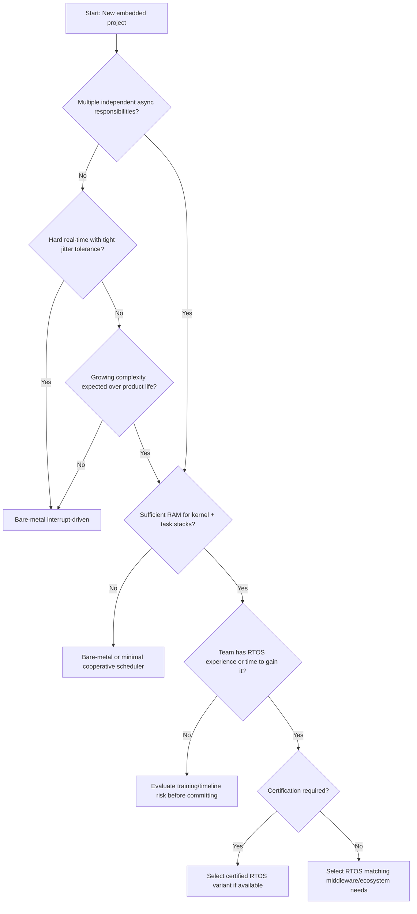

## RTOS vs Bare-Metal Decision Criteria

### Overview

Choosing between an RTOS (Real-Time Operating System) and a bare-metal (superloop or interrupt-driven) architecture is one of the earliest and most consequential decisions in embedded firmware design. It affects code organization, timing predictability, memory footprint, development velocity, and long-term maintainability. Neither approach is universally superior — the right choice depends on system complexity, timing requirements, team experience, and hardware constraints. This topic lays out the concrete criteria that should drive that decision.

### What "Bare-Metal" Means in Practice

Bare-metal does not mean the absence of structure — it typically refers to one of two patterns:

- **Superloop (main loop) architecture**: an infinite `while(1)` loop that polls flags, calls handler functions in sequence, and relies on interrupts to set flags or perform time-critical work
- **Interrupt-driven bare-metal**: most logic lives in interrupt service routines (ISRs) and lightweight deferred processing, with the main loop mostly idle or handling only non-time-critical background tasks

**Example (typical superloop structure):**

```c
int main(void) {
    system_init();
    while (1) {
        if (uart_rx_flag) {
            process_uart_data();
            uart_rx_flag = 0;
        }
        if (adc_ready_flag) {
            process_sensor_reading();
            adc_ready_flag = 0;
        }
        update_state_machine();
        enter_low_power_wait();
    }
}
```

### What an RTOS Provides

- **Preemptive multitasking**: multiple tasks with independent stacks, scheduled by priority, with a scheduler that can preempt a lower-priority task when a higher-priority one becomes ready
- **Inter-task communication primitives**: queues, semaphores, mutexes, event flags, message boxes
- **Timing services**: software timers, precise delays, tick-based scheduling
- **Priority-based scheduling with defined latency guarantees**: (in properly configured systems) bounded worst-case response time for high-priority tasks
- Common embedded RTOS examples: FreeRTOS, Zephyr, ThreadX, VxWorks, QNX, RTX, embOS

### Core Decision Criteria

#### 1. Number and Concurrency of Independent Functional Threads

- Few functions with simple, sequential relationships → bare-metal superloop is often sufficient and simpler to reason about
- Many independent, asynchronous responsibilities (e.g., simultaneously handling a communication stack, a sensor sampling loop, a UI, and a motor control loop, each with different timing needs) → an RTOS's task model maps much more naturally onto this than manually interleaved polling logic

#### 2. Timing Requirements and Determinism

- **Hard real-time deadlines with tight tolerances** (motor control commutation, safety interlocks): a well-tuned bare-metal interrupt-driven design can offer the most predictable, lowest-jitter response, because there is no scheduler overhead or priority inversion risk to manage
- **Multiple competing timing requirements at different priorities**: an RTOS's preemptive priority scheduling can guarantee that a high-priority task always preempts lower-priority work, which is difficult to replicate cleanly in a hand-rolled superloop as complexity grows
- [Inference] Whether an RTOS or bare-metal achieves better worst-case latency in a specific system depends heavily on implementation quality in both cases; a poorly configured RTOS (unbounded priority inversion, excessive critical sections) can perform worse than a carefully written bare-metal loop, and the reverse is equally possible

#### 3. Code Complexity and Maintainability

- As the number of independent behaviors grows, a superloop tends toward a large, intertwined dispatch structure that becomes harder to reason about and modify safely — this is often called "superloop sprawl"
- An RTOS's task decomposition tends to keep unrelated functionality more clearly separated, since each task has its own stack, state, and scheduling behavior, at the cost of needing careful design around shared-resource synchronization

#### 4. Memory Footprint

- RTOS kernels themselves consume flash for kernel code and RAM for kernel data structures and per-task stacks (each task needs its own stack, often the single largest RAM cost of adopting an RTOS)
- On very small microcontrollers (a few KB of RAM, e.g., 8-bit or entry-level Cortex-M0 parts), the combined stack overhead of multiple tasks may not be affordable, favoring bare-metal
- Lightweight RTOS options (FreeRTOS with a minimal configuration, or "RTOS-like" cooperative schedulers) can sometimes bridge this gap on moderately constrained parts

#### 5. Power Management Requirements

- Bare-metal designs can be tightly hand-tuned around a specific sleep/wake sequence for ultra-low-power targets, since the developer has full control over exactly when the CPU sleeps and wakes
- RTOS tickless idle modes exist specifically to address this (avoiding periodic tick interrupts waking the CPU unnecessarily), but add design and validation complexity
- [Inference] For extremely aggressive power targets (multi-year coin-cell battery life), teams often lean bare-metal or a very minimal scheduler specifically because it is easier to audit and guarantee an exact sleep-current profile, though a well-configured tickless RTOS can also achieve strong power efficiency

#### 6. Certification and Safety Requirements

- Safety-certified RTOS options exist (SafeRTOS, ThreadX with safety certification packages, various certified builds of Zephyr/VxWorks) that come with pre-existing certification evidence for standards like IEC 61508, ISO 26262, or DO-178C
- Using a certified RTOS can significantly reduce certification effort versus certifying an entirely custom bare-metal scheduler from scratch — but only if a certified variant of the RTOS is actually available and licensed for the target
- For the simplest safety-critical designs, a minimal, fully-audited bare-metal design can sometimes be easier to formally verify in its entirety, precisely because there is less code and no dynamic scheduling behavior to reason about

#### 7. Team Experience and Existing Codebase

- Teams experienced with RTOS concepts (priority inversion, deadlock avoidance, ISR-to-task deferred processing patterns) can move faster with an RTOS on a moderately complex project
- Teams without RTOS experience face a real learning curve around subtle bugs (priority inversion, stack overflow from underestimated per-task stack sizing, race conditions in shared resource access) that can be harder to diagnose than bare-metal bugs
- Migrating an existing large bare-metal codebase to an RTOS is a substantial undertaking and is not usually justified by marginal complexity growth alone

#### 8. Third-Party Stack and Middleware Requirements

- Many communication stacks, filesystems, and middleware packages (TCP/IP stacks, Bluetooth stacks, USB stacks) are distributed with an assumed RTOS integration layer, sometimes making RTOS adoption the path of least resistance even if the application logic itself doesn't strictly need multitasking
- Some middleware ships bare-metal-compatible ports as well, so this is not universally a forcing function, but it is common enough to be a practical decision driver

### Decision Flow



### Comparison Table

| Factor | Bare-Metal Favored | RTOS Favored |
| --- | --- | --- |
| Number of concurrent responsibilities | Few, simple | Many, independent |
| RAM budget | Very constrained (KBs) | Moderate to ample |
| Timing predictability need | Single tight deadline, hand-tunable | Multiple competing priorities |
| Power budget | Ultra-aggressive, fully custom sleep | Standard, tickless idle acceptable |
| Team RTOS experience | Low, no time to ramp up | Present or budgeted for |
| Certification | Small, fully auditable custom code | Certified RTOS variant available |
| Middleware dependencies | Bare-metal ports available | RTOS-integrated stacks required |
| Codebase growth expectation | Low, stable scope | Expected to grow substantially |

### Hybrid and Middle-Ground Approaches

- **Cooperative (non-preemptive) schedulers**: lighter-weight than a full preemptive RTOS, avoid most synchronization hazards since tasks voluntarily yield, but cannot guarantee preemption of long-running tasks by urgent ones
- **Super-loop with a lightweight state machine framework**: retains bare-metal simplicity while imposing more structure than an ad hoc dispatch loop, often a reasonable middle ground for moderately complex but not deeply concurrent systems
- **Mixed architecture**: time-critical control loop handled entirely in a high-priority ISR with minimal RTOS involvement, while an RTOS manages lower-priority background tasks (communication, logging, UI) — common in motor control and industrial applications where the control loop's determinism cannot be compromised

### Common Migration Triggers (Bare-Metal to RTOS)

- Superloop dispatch logic becomes difficult to modify without introducing regressions elsewhere
- A new feature requires timing behavior that's awkward to express as flags and polling (e.g., a task that must run at a precise period regardless of other loop work)
- Integration of a third-party stack that assumes an RTOS abstraction layer
- Team growth requires clearer module boundaries so multiple engineers can work on independent subsystems without constant merge conflicts in a single dispatch loop

### Key Points

- The decision hinges on concurrency complexity, timing determinism needs, memory budget, power constraints, certification requirements, team experience, and middleware dependencies — not a single factor in isolation
- Bare-metal favors simplicity, minimal footprint, and hand-tunable determinism for a small number of well-understood responsibilities
- RTOS favors maintainability and scalability as concurrent responsibilities grow, at the cost of memory footprint and a real learning curve
- Hybrid architectures (ISR-driven control loop plus RTOS-managed background tasks) are common in practice and avoid treating this as a strictly binary choice
- Certification availability for a specific RTOS variant can materially change the calculus for safety-critical projects

### Related Topics

- Priority inversion and priority inheritance in RTOS scheduling
- Stack sizing and stack overflow detection for RTOS tasks
- Interrupt service routine (ISR) design best practices
- Tickless idle and low-power RTOS configuration
- Safety-certified RTOS options (SafeRTOS, certified Zephyr/ThreadX builds)
- State machine design patterns for bare-metal firmware
- Middleware and communication stack integration (TCP/IP, BLE, USB) in embedded systems