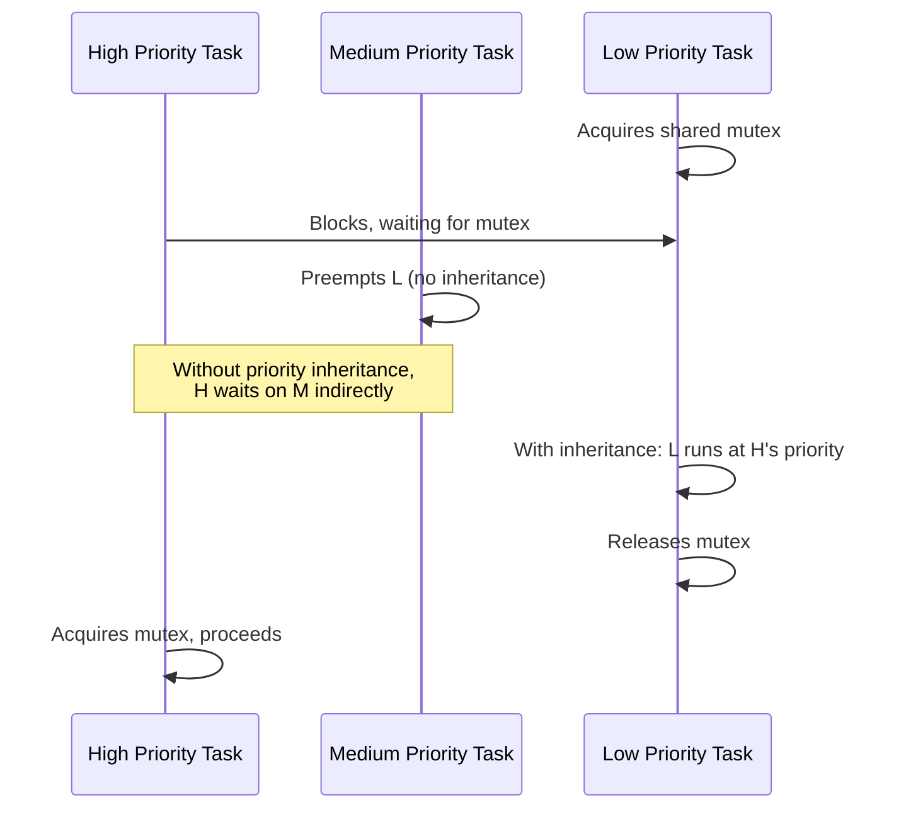

## Task Scheduling Algorithms

### Overview

Task scheduling determines which piece of work runs on the CPU at any given moment when multiple tasks compete for a single processor. In embedded RTOS environments, scheduling algorithms must provide predictable, analyzable timing behavior — not just reasonable average performance — because a missed deadline in a control loop, safety interlock, or communication protocol can have consequences far more serious than a sluggish desktop application. This topic covers the major scheduling algorithm families used in embedded real-time systems, their guarantees, and their trade-offs.

### Scheduling Classification

Embedded scheduling algorithms are generally classified along two axes:

- **Preemptive vs. non-preemptive (cooperative)**: whether a running task can be interrupted mid-execution by a higher-priority task, or whether it must voluntarily yield
- **Static (fixed) priority vs. dynamic priority**: whether task priorities are assigned once at design time and never change, or whether they are recalculated at runtime based on current conditions (such as deadline proximity)

### Fixed-Priority Preemptive Scheduling (FPPS)

The most common scheduling model in embedded RTOS kernels (FreeRTOS, ThreadX, most implementations of the POSIX real-time scheduling classes).

- Each task is assigned a static priority
- The scheduler always runs the highest-priority task that is ready to run
- A running task is immediately preempted if a higher-priority task becomes ready
- Tasks of equal priority are typically time-sliced (round-robin) within that priority level

**Example (FreeRTOS task creation with fixed priority):**

```c
xTaskCreate(vSensorTask, "Sensor", STACK_SIZE, NULL, PRIORITY_HIGH, NULL);
xTaskCreate(vLoggingTask, "Logger", STACK_SIZE, NULL, PRIORITY_LOW, NULL);
```

Here, `vSensorTask` will always preempt `vLoggingTask` whenever both are ready, regardless of how long `vLoggingTask` has been waiting.

### Rate Monotonic Scheduling (RMS)

A specific, well-studied static-priority assignment policy for periodic tasks.

- **Rule**: tasks with shorter periods (higher frequency) are assigned higher priority; tasks with longer periods get lower priority
- Proven optimal among fixed-priority policies for a set of independent, periodic tasks under certain assumptions (deadlines equal to periods, no resource sharing, negligible context-switch overhead)

**Rate Monotonic schedulability test (Liu & Layland bound):**

For $n$ tasks, a commonly cited sufficient (not strictly necessary) condition for schedulability is:

$$\sum_{i=1}^{n} \frac{C_i}{T_i} \leq n(2^{1/n} - 1)$$

where $C_i$ is the worst-case execution time of task $i$ and $T_i$ is its period. As $n \to \infty$, this bound approaches $\ln(2) \approx 0.693$, meaning up to roughly 69% CPU utilization is guaranteed schedulable under this sufficient condition.

[Inference] This bound is conservative — many task sets exceed it and are still schedulable under RMS, but the exact bound must be checked via a more precise method (such as response-time analysis) for task sets near or above it, since the Liu-Layland bound is sufficient but not tight.

### Earliest Deadline First (EDF)

A dynamic-priority scheduling algorithm.

- At every scheduling decision, the task with the nearest absolute deadline is given the highest priority
- Priorities change dynamically as deadlines approach and pass
- **Optimality**: EDF can achieve up to 100% CPU utilization on a single processor for periodic tasks with deadlines equal to periods — strictly better utilization bound than RMS in the theoretical worst case

**EDF schedulability condition (deadline = period case):**

$$\sum_{i=1}^{n} \frac{C_i}{T_i} \leq 1$$

[Inference] Despite its theoretically superior utilization bound, EDF is less commonly used than fixed-priority scheduling in many commercial embedded RTOS kernels, likely because dynamic priority recalculation adds runtime overhead and analytical complexity (e.g., more complex handling of overload conditions and priority inversion analysis) compared to a static-priority scheme; adoption varies significantly by domain and specific RTOS.

### Round-Robin Scheduling

- Each ready task at a given priority level is given a fixed time slice (quantum) before the scheduler moves to the next task in a circular queue
- Ensures fairness among equal-priority tasks but does not, by itself, provide deadline guarantees
- Commonly used as the tie-breaking mechanism *within* a priority level in an otherwise fixed-priority scheduler, rather than as the sole scheduling policy for real-time systems

### Cooperative (Non-Preemptive) Scheduling

- A running task runs to completion or until it voluntarily yields control back to the scheduler
- Eliminates most race conditions on shared data since context switches only occur at well-defined yield points
- Risk: a single task that fails to yield (due to a bug or an unexpectedly long computation) blocks the entire system indefinitely
- Common in very small embedded systems or cooperative multitasking libraries where the simplicity and reduced synchronization burden outweighs the loss of preemptive responsiveness

### Priority Inversion and Its Mitigations

Priority inversion occurs when a high-priority task is blocked waiting for a resource held by a low-priority task, while a medium-priority task (which doesn't need that resource) preempts the low-priority task and runs instead — effectively causing the high-priority task to wait on the medium-priority task indirectly.

**Priority Inheritance Protocol**: when a high-priority task blocks on a mutex held by a lower-priority task, the low-priority task temporarily inherits the high-priority task's priority until it releases the resource, preventing medium-priority tasks from preempting it in the meantime.

**Priority Ceiling Protocol**: each mutex is assigned a priority ceiling equal to the highest priority of any task that may lock it; a task locking the mutex immediately runs at that ceiling priority, preventing inversion and also preventing deadlock in certain configurations.



[Unverified] The exact inheritance/ceiling implementation details (e.g., whether nested inheritance chains are fully supported) vary by RTOS kernel; specific kernel documentation should be checked for a given target RTOS before relying on its behavior in a safety-critical design.

### Scheduling Algorithm Comparison

| Algorithm | Priority Type | Preemptive | Utilization Bound | Common Use Case |
| --- | --- | --- | --- | --- |
| FPPS (general) | Static | Yes | Depends on assignment policy | General-purpose embedded RTOS default |
| Rate Monotonic | Static | Yes | ~69% (sufficient bound, n→∞) | Periodic tasks, well-understood analysis |
| Earliest Deadline First | Dynamic | Yes | 100% (theoretical) | Systems needing maximum utilization |
| Round-Robin | Equal/static | Yes (time-sliced) | N/A (fairness, not deadlines) | Tie-breaking within priority level |
| Cooperative | Static or none | No | N/A | Very simple systems, low sync overhead |

### Deadline Monotonic Scheduling (DMS)

A variant of RMS for the more general case where a task's deadline is not necessarily equal to its period.

- **Rule**: tasks are assigned priority in order of increasing relative deadline (shortest deadline gets highest priority), rather than increasing period
- Reduces to RMS when deadline equals period for every task
- Useful when tasks must complete well before their next release, a common real-world constraint that pure RMS does not address

### Practical Considerations in Choosing/Configuring a Scheduler

- **Context-switch overhead**: every scheduling decision costs CPU cycles; algorithms requiring frequent re-evaluation (dynamic priority schemes like EDF) can have higher overhead on constrained MCUs than a static-priority table lookup
- **Analyzability requirements for certification**: fixed-priority schemes with well-established schedulability analysis (RMS, response-time analysis) are often preferred in certified systems because the analysis techniques and tooling are mature and widely accepted by certification authorities
- **Blocking time and resource sharing**: any scheduling analysis must account for worst-case blocking time from shared resources (mutexes, critical sections), not just raw execution time and period — this is where priority inheritance/ceiling protocols become essential to bound worst-case latency
- **Interrupt handling interaction**: ISRs typically run at a priority above all tasks regardless of the task-level scheduling algorithm chosen; excessive or long-running ISRs can undermine the guarantees of any task-level scheduling scheme by consuming CPU time the analysis didn't account for

### Response-Time Analysis (RTA)

A more precise (and more broadly applicable) schedulability analysis technique than simple utilization bounds, used to compute the actual worst-case response time of each task under fixed-priority scheduling, including blocking time from lower-priority tasks and interference from higher-priority ones.

$$R_i = C_i + B_i + \sum_{j \in hp(i)} \left\lceil \frac{R_i}{T_j} \right\rceil C_j$$

where $R_i$ is the worst-case response time of task $i$, $B_i$ is its worst-case blocking time, and the summation accounts for interference from all higher-priority tasks $hp(i)$. This equation is solved iteratively (starting with $R_i = C_i$ and recomputing until convergence) since $R_i$ appears on both sides.

[Inference] Response-time analysis is generally considered a more accurate schedulability determination method than the Liu-Layland utilization bound specifically because it accounts for blocking time and exact interference patterns rather than relying on a bulk utilization sum, though it requires more detailed knowledge of each task's worst-case execution time and resource usage to apply correctly.

### Key Points

- Fixed-priority preemptive scheduling (often with Rate Monotonic or Deadline Monotonic priority assignment) is the dominant model in embedded RTOS due to its analyzability and mature certification track record
- EDF offers a theoretically superior utilization bound (100% vs. ~69%) but sees less adoption in commercial embedded RTOS kernels due to dynamic-priority overhead and analytical complexity
- Priority inversion is a critical hazard in any priority-based scheduler sharing resources across priority levels, mitigated by priority inheritance or priority ceiling protocols
- Response-time analysis provides a tighter, more broadly applicable schedulability guarantee than simple utilization-bound tests, accounting for blocking and interference explicitly
- ISR priority and execution time must be included in any task-level scheduling analysis, since ISRs effectively preempt all task-level scheduling

### Related Topics

- Priority inversion case studies (e.g., the Mars Pathfinder priority inversion incident)
- Worst-case execution time (WCET) analysis techniques
- RTOS mutex, semaphore, and queue implementation internals
- Interrupt latency and ISR design best practices
- Mixed-criticality scheduling for systems with tasks of differing safety integrity levels
- Schedulability analysis tooling for certified real-time systems